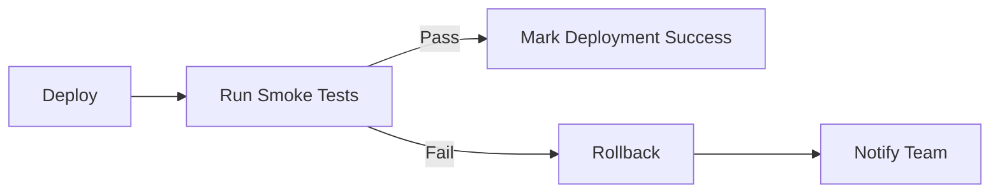

# Smoke Tests

**Purpose:** Quick validation tests that run after deployment to verify the application is working correctly.

## Overview

Smoke tests are a subset of tests that verify critical functionality after deployment. They should:

- **Run Fast:** Complete in under 60 seconds
- **Test Critical Paths:** Focus on essential features only
- **Catch Major Issues:** Detect deployment problems early
- **Fail Fast:** Stop immediately on critical failures

## Test Coverage

### 1. Health Check (`health-check.test.ts`)

Tests the `/api/health` endpoint to verify:
- Application is running
- Database connectivity
- Redis connectivity
- Messaging service availability
- Search service availability
- Response time performance

### 2. API Endpoints (`api-endpoints.test.ts`)

Tests critical API endpoints:
- Authentication endpoints (login, logout, CSRF)
- Employee management endpoints
- Leave management endpoints
- Attendance endpoints
- Payroll endpoints
- Error handling
- Response performance

## Running Smoke Tests

### Locally

```bash
# Run all smoke tests
pnpm test:smoke

# Run specific smoke test file
pnpm test:smoke health-check

# Run with verbose output
pnpm test:smoke --reporter=verbose
```

### In CI/CD Pipeline

Smoke tests are automatically run after deployment:

```yaml
# .github/workflows/cd.yml
- name: Run Smoke Tests
  run: pnpm --filter web test:smoke
```

## When to Run

### Required
- ✅ After every deployment to staging
- ✅ After every deployment to production
- ✅ Before marking deployment as successful

### Optional
- After database migrations
- After configuration changes
- After infrastructure updates

## What to Test

### ✅ Do Test
- Application is running and accessible
- Critical API endpoints respond
- Database connections work
- Cache (Redis) connections work
- Authentication flows respond (even if auth fails)
- Health checks pass

### ❌ Don't Test
- Business logic details (covered by unit tests)
- Complex user workflows (covered by E2E tests)
- Edge cases (covered by integration tests)
- Performance under load (covered by load tests)

## Test Structure

```typescript
describe('Smoke Test: Feature Name', () => {
  it('should verify critical functionality', async () => {
    // 1. Make minimal request
    const response = await fetch('/api/endpoint');

    // 2. Verify response (not details)
    expect(response.status).toBe(200);

    // 3. Verify basic structure
    const data = await response.json();
    expect(data).toHaveProperty('status');
  });
});
```

## Success Criteria

All smoke tests must pass for deployment to be considered successful:

| Test Suite | Expected Result | Max Duration |
|------------|----------------|--------------|
| Health Check | All services healthy | 10s |
| API Endpoints | All endpoints respond | 30s |
| **Total** | **100% pass rate** | **60s** |

## Failure Handling

### If Smoke Tests Fail

1. **Staging:** Notify team, investigate, fix
2. **Production:** Immediate rollback, investigate, revert

### Common Failures

| Error | Cause | Fix |
|-------|-------|-----|
| Health check timeout | Service not responding | Check logs, restart service |
| Database error | Connection issue | Verify DATABASE_URL, check DB |
| Redis error | Cache unavailable | Check Redis connection |
| 500 errors | Server crash | Review error logs, rollback |

## Adding New Smoke Tests

When adding critical features, add corresponding smoke tests:

```typescript
// Example: New payment processing feature
describe('Smoke Test: Payment Processing', () => {
  it('should respond to payment endpoint', async () => {
    const response = await fetch('/api/payments');
    expect([200, 401]).toContain(response.status);
  });
});
```

**Guidelines:**
1. Keep tests simple and fast
2. Test availability, not correctness
3. Use realistic but minimal data
4. Avoid complex setup/teardown
5. Each test should be independent

## Environment Variables

Smoke tests use these environment variables:

```bash
# API base URL (defaults to localhost)
NEXT_PUBLIC_API_URL=http://localhost:3006

# Test timeout
VITEST_TIMEOUT=30000
```

## Monitoring

Track smoke test results in CI/CD:

- **Success Rate:** Should be 100%
- **Duration:** Should be < 60 seconds
- **Failures:** Alert team immediately

## Integration with Deployment



## Best Practices

1. **Keep It Simple:** One assertion per test when possible
2. **Test Availability:** Don't test business logic
3. **Fail Fast:** Stop on first critical failure
4. **Clear Errors:** Provide actionable error messages
5. **Independent Tests:** No dependencies between tests
6. **Idempotent:** Can run multiple times safely
7. **Environment Agnostic:** Work in all environments

## Troubleshooting

### Tests Pass Locally But Fail in CI

Check:
- Environment variables
- Database connectivity
- Network timeouts
- Service dependencies

### Tests Are Too Slow

- Reduce test scope
- Remove unnecessary assertions
- Check network latency
- Optimize health check endpoints

### Intermittent Failures

- Add retry logic for flaky tests
- Increase timeouts
- Check service warm-up time
- Review load balancer health checks

---

**Last Updated:** January 22, 2026
**Maintainer:** QA Engineering Team
**Status:** Production Ready
