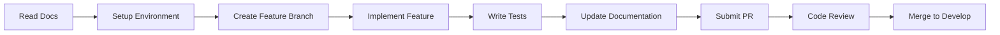

# 🌟 AURA - Intelligent Human Capital Platform

<div align="center">
  
  
  
  
</div>

<div align="center">
  <h3>✨ The Intelligence Around Your Workforce ✨</h3>
  <p><strong>394 Features | 43 Modules | AI-Powered | Fully Configurable</strong></p>
</div>

---

## 🚨 **MANDATORY DOCUMENTATION**

**⚠️ STOP! Before writing ANY code or making ANY decisions, you MUST read these four documents in order:**

### 📚 **Required Reading (IN THIS ORDER)**

#### 1️⃣ **[aura-master-instructions.md](./docs/aura-master-instructions.md)** 🎯
**The Law of the Land - START HERE**
- Product identity and naming conventions
- Technology stack specifications
- Coding standards and patterns
- File structure and organization
- What to NEVER do and what to ALWAYS do
- **Every file you create MUST reference this document**

```typescript
// Every file must include:
/**
 * @reference docs/aura-master-instructions.md
 */
```

#### 2️⃣ **[aura-architecture.md](./docs/aura-architecture.md)** 🏗️
**The Blueprint - How Everything Works**
- Zero-hardcoding configuration architecture
- Multi-tenant, multi-language, multi-currency design
- Database schemas and patterns
- API architecture and standards
- Internationalization (i18n) implementation
- Security and compliance framework
- **Nothing is hardcoded, everything is configurable**

#### 3️⃣ **[aura-instructions.md](./docs/aura-instructions.md)** 📋
**The Complete Feature Bible - All 394 Features**
- All 43 major modules detailed
- Every sub-module and feature documented
- Implementation roadmap (5 phases)
- Quality assurance checklist
- **Not a single feature should be missed**

#### 4️⃣ **[aura-uiux-design.md](./docs/aura-uiux-design.md)** 🎨
**The Aurora Design Language**
- Unique Aurora Professional color palette
- Glass morphism and crystal effects
- Component design patterns
- Accessibility guidelines (WCAG AAA)
- Dark mode specifications
- **Beautiful, unique, and consistent UI**

---

## 🎯 **What is AURA?**

AURA is a next-generation, AI-powered Human Capital Management (HCM) platform that revolutionizes how organizations manage their workforce. Built with intelligence at its core, AURA provides:

- 🤖 **AI-First Architecture** - Intelligence woven into every feature
- 🌍 **Global Ready** - Multi-language (RTL/LTR), multi-currency, multi-timezone
- 🎨 **Aurora Themed UI** - Stunning gradients and glass morphism effects
- 📱 **Mobile First** - Full-featured mobile apps with offline support
- 🔧 **100% Configurable** - Nothing hardcoded, everything customizable
- 🏢 **Enterprise Scale** - Handles 50,000+ concurrent users
- 🔒 **Security First** - GDPR, HIPAA compliant with field-level encryption

---

## 🚀 **Quick Start**

### Prerequisites
```bash
# Required versions
Node.js >= 20.0.0 LTS
pnpm >= 8.0.0
PostgreSQL >= 16.0
Redis >= 7.0
Docker >= 24.0
```

### Installation
```bash
# Clone the repository
git clone https://github.com/kreupai/kreupai-hcm.git aura
cd aura

# Install dependencies
pnpm install

# Setup environment
cp .env.example .env.local

# Run database migrations
pnpm prisma migrate dev

# Start development servers
pnpm dev
```

### Project Structure
```
kreupai-hcm/                   # Repository name (internal)
├── docs/                       # 📚 START HERE - READ ALL DOCS
│   ├── aura-master-instructions.md
│   ├── aura-architecture.md
│   ├── aura-instructions.md
│   └── aura-uiux-design.md
├── apps/                       # Applications
│   ├── web/                   # Next.js main application
│   ├── mobile/                # React Native app
│   └── admin/                 # Admin dashboard
├── services/                   # Microservices
├── packages/                   # Shared packages
└── infrastructure/            # IaC and DevOps
```

---

## ⚠️ **CRITICAL RULES**

### ❌ **NEVER**
- Hardcode any values
- Use enums in code
- Skip reading the documentation
- Make assumptions about implementation
- Write code without TypeScript
- Commit without tests
- Ignore configuration service

### ✅ **ALWAYS**
- Read ALL four documents before starting
- Reference `aura-master-instructions.md` in every file
- Use configuration service for all values
- Follow the Aurora design system
- Write strongly-typed TypeScript
- Include comprehensive tests
- Use internationalization keys

---

## 📊 **Platform Overview**

| Aspect | Details |
|--------|---------|
| **Product Name** | AURA |
| **Total Features** | 394 |
| **Major Modules** | 43 |
| **Architecture** | Microservices |
| **Frontend** | Next.js 14, React 18, TypeScript |
| **Backend** | NestJS, Node.js 20, PostgreSQL |
| **Mobile** | React Native + Expo |
| **AI/ML** | GPT-4, TensorFlow.js |
| **Design Theme** | Aurora Professional |
| **Primary Colors** | Celestial Indigo, Quantum Rose, Neural Mint |

---

## 🏗️ **Development Workflow**



---

## 🧪 **Testing Requirements**

- **Unit Tests**: Minimum 80% coverage
- **Integration Tests**: All API endpoints
- **E2E Tests**: Critical user journeys
- **Performance Tests**: Load testing for 50,000 users

```bash
# Run all tests
pnpm test

# Run with coverage
pnpm test:coverage

# Run E2E tests
pnpm test:e2e
```

---

## 📝 **Documentation Standards**

Every piece of code must be documented:

```typescript
/**
 * @module EmployeeService
 * @description Handles all employee-related operations
 * @project AURA HCM Platform
 * @reference docs/aura-master-instructions.md
 * @aiFeatures Attrition prediction, skill matching
 * @configuration EMPLOYEE_TYPES, EMPLOYEE_STATUS
 */
```

---

## 🌍 **Internationalization**

AURA supports unlimited languages with RTL/LTR:

```typescript
// Never hardcode strings
const message = "Welcome"; // ❌ FORBIDDEN

// Always use translation keys
const message = t('common.welcome'); // ✅ REQUIRED
```

---

## 🔧 **Configuration First**

Everything is configuration-driven:

```typescript
// Never use enums
enum Status { ACTIVE, INACTIVE } // ❌ FORBIDDEN

// Always use configuration service
const statuses = await configService.getListItems('EMPLOYEE_STATUS'); // ✅ REQUIRED
```

---

## 🚢 **Deployment**

```bash
# Build for production
pnpm build

# Run production build
pnpm start

# Deploy with Docker
docker-compose up -d

# Deploy to Kubernetes
kubectl apply -f infrastructure/kubernetes/
```

---

## 📈 **Performance Targets**

| Metric | Target |
|--------|--------|
| API Response Time | < 100ms (p50) |
| Page Load Time | < 3 seconds |
| Concurrent Users | 50,000+ |
| Uptime | 99.9% |
| Test Coverage | > 80% |

---

## 🤝 **Contributing**

1. **READ ALL FOUR DOCUMENTS** (seriously, this is mandatory)
2. Fork the repository
3. Create feature branch (`feature/amazing-feature`)
4. Follow ALL standards in `aura-master-instructions.md`
5. Write tests (minimum 80% coverage)
6. Update documentation
7. Submit PR with complete description
8. Ensure all checks pass

### PR Checklist
- [ ] Read all four documentation files
- [ ] File headers reference master instructions
- [ ] No hardcoded values
- [ ] Uses configuration service
- [ ] Includes tests
- [ ] Updates documentation
- [ ] Follows Aurora design system
- [ ] TypeScript strict mode

---

## 🐛 **Issue Reporting**

Found a bug? Please check:
1. You've read the documentation
2. It's not a configuration issue
3. Search existing issues

Then create an issue with:
- Clear description
- Steps to reproduce
- Expected behavior
- Actual behavior
- Screenshots if applicable

---

## 📜 **License**

Copyright © 2024 KreupAI. All rights reserved.

This is proprietary software. Unauthorized copying, modification, or distribution is strictly prohibited.

---

## 🆘 **Support**

- 📧 Email: support@aura.hr
- 📚 Documentation: [/docs](./docs)
- 💬 Slack: [AURA Workspace](https://aura-hcm.slack.com)
- 🌐 Website: [https://aura.hr](https://aura.hr)

---

## 👥 **Team**

Built with ❤️ by the KreupAI Team

**Project Lead**: [Your Name]  
**Tech Stack**: Next.js, NestJS, PostgreSQL, Redis, React Native  
**Design System**: Aurora Professional Theme

---

## 🎯 **Remember**

> **"Configuration is Code, Code is Configuration"**
> 
> Every decision you make should be configurable. Every value should come from configuration. Every feature should be toggleable. This is the way.

---

<div align="center">
  <h2>⚡ Now go read those four documents and let's build something amazing! ⚡</h2>
  <br/>
  <strong>AURA - Where Intelligence Meets Excellence</strong>
  <br/><br/>
  <code>Repository: kreupai-hcm | Product: AURA | Version: 1.0.0</code>
</div>