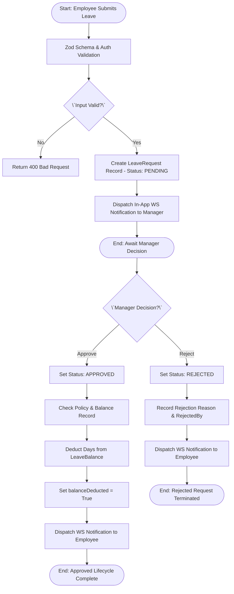
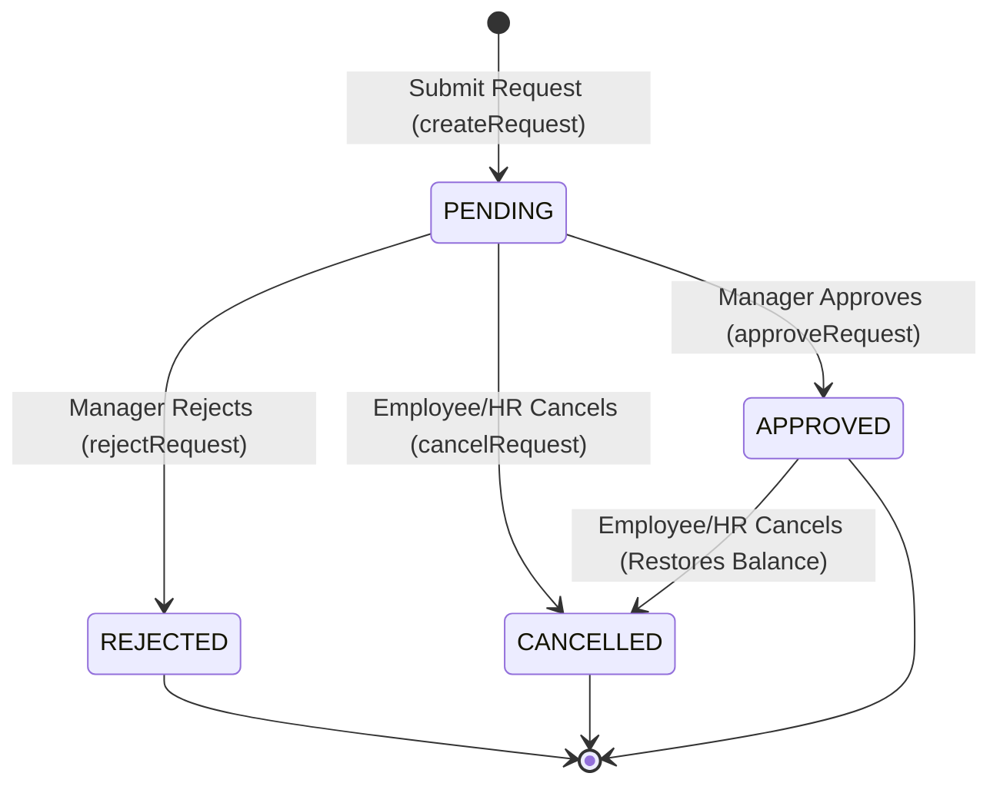

# Workflow 01 — Leave Request Approval Enterprise Specification

> **Document Code:** `SPEC-WF-01`  
> **System:** AuraOS Enterprise ERP / HCM Platform  
> **Version:** 1.0.0  
> **Date:** 2026-07-29  
> **Status:** Official Functional Specification  
> **Primary Code Location:** `apps/web/src/lib/services/leave.service.ts`  
> **Primary API Route:** `POST /api/v1/leave-requests`  
> **Primary Database Entity:** `LeaveRequest` (`packages/@aura/database/prisma/schema.prisma#L2960-L3004`)

---

## Metadata Header

| Attribute                     | Value / Reference                                                           |
| ----------------------------- | --------------------------------------------------------------------------- |
| **Workflow ID & Name**        | `01` — `Leave Request Approval`                                             |
| **Business Module**           | `Leave & Time Management`                                                   |
| **Submodule / Domain**        | `Absence Management & Leave Balances`                                       |
| **Business Process Owner**    | `HR Operations Director`                                                    |
| **Technical System Owner**    | `Lead Core HR Software Architect`                                           |
| **Implementation Status**     | `Partially Implemented`                                                     |
| **Specification Version**     | `1.0.0`                                                                     |
| **Date Created / Updated**    | `2026-07-29`                                                                |
| **Technical Author**          | `Enterprise Solution Architect (AI Agent)`                                  |
| **Technical Reviewer**        | `Senior Software Architect`                                                 |
| **QA Verifier**               | `QA Lead`                                                                   |
| **Final Approver**            | `Chief Product Officer`                                                     |
| **Primary Code Location**     | `apps/web/src/lib/services/leave.service.ts`                                |
| **Primary API Route**         | `POST /api/v1/leave-requests`                                               |
| **Primary Database Entity**   | `LeaveRequest` (`packages/@aura/database/prisma/schema.prisma#L2960-L3004`) |
| **Related Architecture Docs** | `docs/architecture/WORKFLOW_AUDIT_FINDINGS.md#finding-1`                    |

---

## Table of Contents

- [1. Executive Summary](#1-executive-summary)
- [2. Business Context](#2-business-context)
- [3. Business Objectives](#3-business-objectives)
- [4. Business Scope](#4-business-scope)
- [5. Workflow Overview](#5-workflow-overview)
- [6. Business Process Description](#6-business-process-description)
- [7. Mermaid Business Workflow Diagram](#7-mermaid-business-workflow-diagram)
- [8. Business Actors](#8-business-actors)
- [9. RACI Matrix](#9-raci-matrix)
- [10. Entry Points](#10-entry-points)
- [11. Trigger Events](#11-trigger-events)
- [12. Workflow Stages](#12-workflow-stages)
- [13. Workflow State Machine](#13-workflow-state-machine)
- [14. Approval Process](#14-approval-process)
- [15. Approval Matrix](#15-approval-matrix)
- [16. Decision Matrix](#16-decision-matrix)
- [17. Business Rules](#17-business-rules)
- [18. Compliance Rules](#18-compliance-rules)
- [19. Country-Specific Rules](#19-country-specific-rules)
- [20. Exception Handling](#20-exception-handling)
- [21. Notifications](#21-notifications)
- [22. Escalation Rules](#22-escalation-rules)
- [23. SLA Rules](#23-sla-rules)
- [24. RBAC Matrix](#24-rbac-matrix)
- [25. Audit Trail](#25-audit-trail)
- [26. UI Screens](#26-ui-screens)
- [27. Frontend Architecture](#27-frontend-architecture)
- [28. API Specification](#28-api-specification)
- [29. Backend Architecture](#29-backend-architecture)
- [30. Database Design](#30-database-design)
- [31. Integration Points](#31-integration-points)
- [32. Reports](#32-reports)
- [33. Dashboard KPIs](#33-dashboard-kpis)
- [34. Analytics](#34-analytics)
- [35. CURRENT IMPLEMENTATION](#35-current-implementation)
- [36. IMPLEMENTATION GAPS](#36-implementation-gaps)
- [37. PROPOSED ENTERPRISE IMPLEMENTATION](#37-proposed-enterprise-implementation)
- [38. Migration Strategy](#38-migration-strategy)
- [39. Testing Strategy](#39-testing-strategy)
- [40. Acceptance Criteria](#40-acceptance-criteria)
- [41. Implementation Checklist](#41-implementation-checklist)
- [42. Known Risks](#42-known-risks)
- [43. Related Architecture Findings](#43-related-architecture-findings)
- [44. Repository References](#44-repository-references)

---

## 1. Executive Summary

The **Leave Request Approval Workflow** governs the end-to-end lifecycle of employee absence applications within AuraOS. It processes leave requests (Annual Leave, Sick Leave, Unpaid Leave, Maternity Leave, etc.), enforces company leave policy rules, routes submissions to Line Managers for approval, and automatically adjusts employee leave balances upon approval or cancellation.

The current codebase implements a functional single-level approval state machine (`PENDING` $\to$ `APPROVED` / `REJECTED` / `CANCELLED`) with automatic balance deduction (`LeaveBalance`). However, the implementation is classified as **Partially Implemented** due to dual API endpoint routes (`/api/v1/leave-requests` vs `/api/v1/leave/requests`), missing multi-level approval chains, and lack of email notification transport integration.

---

## 2. Business Context

In enterprise Human Capital Management (HCM), leave management is a critical compliance and operational function. Organizations must balance workforce availability against employee statutory leave entitlements (such as annual leave under UAE Labor Law or US FMLA rules). Automated leave workflows prevent unauthorized absences, eliminate manual balance tracking errors, ensure transparent manager approvals, and provide accurate payroll inputs for leave encashments or unearned leave deductions.

---

## 3. Business Objectives

- **Automate Leave Entitlements:** Validate policy eligibility, minimum service requirements, and advance notice rules at submission.
- **Ensure Operational Continuity:** Provide line managers with visibility into team absence schedules prior to approving requests.
- **Maintain Real-Time Balances:** Automatically deduct leave balances upon approval and restore balances if a leave request is cancelled.
- **Provide Statutory Audit Trails:** Record immutably who applied, approved, or rejected every leave request along with exact timestamps.

---

## 4. Business Scope

### 4.1 In-Scope

- Submission of full-day and half-day leave requests via Employee Self-Service (ESS).
- Validation against Zod schema constraints and policy parameters.
- Manager approval and rejection workflows.
- Automatic deduction and restoration of `LeaveBalance` entity records.
- In-app WebSocket notification dispatches upon status transitions.

### 4.2 Out-of-Scope

- Cash encashment of unused leave (governed separately by `02 Leave Encashment Workflow`).
- Statutory FMLA medical certification management (governed by `26 FMLA Leave Workflow`).

---

## 5. Workflow Overview

The leave request lifecycle progresses from initial creation to final balance deduction or cancellation:

```
┌──────────┐     ┌───────────┐     ┌───────────┐     ┌──────────┐     ┌───────────┐
│ Employee │ ──> │ Zod Input │ ──> │ PENDING   │ ──> │ Manager  │ ──> │ APPROVED  │
│ Applies  │     │ Validation│     │ Status    │     │ Approves │     │ + Deduct  │
└──────────┘     └───────────┘     └───────────┘     └──────────┘     └───────────┘
```

---

## 6. Business Process Description

1. **Submission:** An employee selects a leave type, start date, end date, total days, and optional half-day flags or work delegation instructions.
2. **Validation:** The API gateway validates the input against `createLeaveRequestSchema` (`apps/web/src/lib/services/leave.service.ts#L13-L28`).
3. **Persistence & Notification:** A new record is created in `LeaveRequest` with default status `PENDING`. A WebSocket notification (`notifyLeaveRequestSubmitted`) is sent to the Line Manager.
4. **Manager Evaluation:** The manager reviews the request. If approved, `LeaveService.approveRequest()` sets status to `APPROVED`, calculates updated taken/current balance numbers, and sets `balanceDeducted=true`. If rejected, status is set to `REJECTED` with a mandatory rejection reason.
5. **Cancellation:** The employee or manager can cancel a `PENDING` or `APPROVED` request. If `balanceDeducted=true`, `LeaveService.cancelRequest()` automatically restores the deducted days back to `LeaveBalance`.

---

## 7. Mermaid Business Workflow Diagram



---

## 8. Business Actors

| Actor Role              | Actor Type | System Persona        | Operational Responsibilities                                                    |
| ----------------------- | ---------- | --------------------- | ------------------------------------------------------------------------------- |
| **Leave Requestor**     | Human      | `EMPLOYEE`            | Submits leave request details, dates, reason, and work delegation               |
| **Line Manager**        | Human      | `LINE_MANAGER`        | Reviews team availability and approves or rejects the leave request             |
| **HR Administrator**    | Human      | `HR_ADMIN`            | Configures leave policies, overrides approvals, and manages balance adjustments |
| **Leave Service**       | System     | `LeaveService`        | Executes Zod validations, Prisma DB mutations, and balance calculations         |
| **Notification Engine** | System     | `NotificationService` | Dispatches real-time WebSocket notifications to managers and employees          |

---

## 9. RACI Matrix

| Workflow Activity        | Employee  | Line Manager | HR Admin | LeaveService | Notification Engine |
| ------------------------ | :-------: | :----------: | :------: | :----------: | :-----------------: |
| Submit Request           | **R / A** |      I       |    I     |      C       |          I          |
| Input Validation         |     I     |      I       |    I     |  **R / A**   |          I          |
| Manager Decision         |     I     |  **R / A**   |    C     |      I       |          I          |
| Balance Deduction        |     I     |      I       |    I     |  **R / A**   |          I          |
| Send Status Notification |     I     |      I       |    I     |      C       |      **R / A**      |
| Cancel Request           |   **R**   |      C       |  **A**   |      C       |          I          |

---

## 10. Entry Points

- **Primary User Interface:** `apps/web/src/app/dashboard/leave/page.tsx`
- **Primary REST API Endpoint:** `POST /api/v1/leave-requests` (`apps/web/src/app/api/v1/leave-requests/route.ts#L48`)
- **Alternative REST API Endpoint:** `POST /api/v1/leave/apply` (`apps/web/src/app/api/v1/leave/apply/route.ts`)

---

## 11. Trigger Events

| Trigger Event Name        | Trigger Type      | Source System / Action                     | Payload Attributes                                                           |
| ------------------------- | ----------------- | ------------------------------------------ | ---------------------------------------------------------------------------- |
| `LEAVE_REQUEST_SUBMITTED` | User UI Action    | `POST /api/v1/leave-requests`              | `tenantId`, `employeeId`, `leaveTypeId`, `startDate`, `endDate`, `totalDays` |
| `LEAVE_REQUEST_APPROVED`  | Manager UI Action | `POST /api/v1/leave-requests/[id]/approve` | `id`, `approvedBy`, `tenantId`                                               |
| `LEAVE_REQUEST_REJECTED`  | Manager UI Action | `POST /api/v1/leave-requests/[id]/reject`  | `id`, `rejectedBy`, `rejectionReason`                                        |

---

## 12. Workflow Stages

### 12.1 Stage 1: Request Submission (`SUBMISSION`)

- **Stage Identifier:** `SUBMISSION`
- **Stage Owner Role:** `EMPLOYEE`
- **SLA Window:** Immediate
- **Entry Criteria:** Employee accesses leave submission modal.
- **Exit Criteria:** Zod schema validation passes; `LeaveRequest` record saved with status `PENDING`.
- **Validation Guard:** `createLeaveRequestSchema.parse(data)` (`apps/web/src/lib/services/leave.service.ts#L13-L28`).
- **Status Value:** `PENDING`
- **Repository Implementation:** `apps/web/src/lib/services/leave.service.ts#L158-L167`

### 12.2 Stage 2: Manager Review (`REVIEW`)

- **Stage Identifier:** `REVIEW`
- **Stage Owner Role:** `LINE_MANAGER`
- **SLA Window:** 48 Hours
- **Escalation Target:** `HR_MANAGER`
- **Entry Criteria:** `LeaveRequest` status is `PENDING`.
- **Exit Criteria:** Manager executes approve or reject action.
- **Validation Guard:** Check `request.status === 'PENDING'` (`apps/web/src/lib/services/leave.service.ts#L198`).
- **Status Value:** `PENDING`
- **Repository Implementation:** `apps/web/src/app/api/v1/leave-requests/[id]/approve/route.ts`

### 12.3 Stage 3: Approval & Balance Settlement (`SETTLEMENT`)

- **Stage Identifier:** `SETTLEMENT`
- **Stage Owner Role:** `LeaveService` (System)
- **SLA Window:** Immediate (Automated)
- **Entry Criteria:** Request approved by Line Manager.
- **Exit Criteria:** Status set to `APPROVED`, `LeaveBalance` updated (`taken += totalDays`, `currentBalance -= totalDays`), and `balanceDeducted=true`.
- **Status Value:** `APPROVED`
- **Repository Implementation:** `apps/web/src/lib/services/leave.service.ts#L201-L243`

---

## 13. Workflow State Machine



| From State | To State    | Trigger / Method   | Prerequisites / Guards                      | Side Effects                                                           |
| ---------- | ----------- | ------------------ | ------------------------------------------- | ---------------------------------------------------------------------- |
| `[*]`      | `PENDING`   | `createRequest()`  | Zod schema valid (`reason >= 10 chars`)     | Persists record; dispatches `LEAVE_SUBMITTED` WS alert                 |
| `PENDING`  | `APPROVED`  | `approveRequest()` | User has `leave-requests:create` permission | Sets `approvedAt`; deducts `LeaveBalance`; sets `balanceDeducted=true` |
| `PENDING`  | `REJECTED`  | `rejectRequest()`  | `rejectionReason` provided                  | Sets `rejectedAt` & `rejectionReason`; dispatches WS alert             |
| `PENDING`  | `CANCELLED` | `cancelRequest()`  | Status is `PENDING` or `APPROVED`           | Sets `cancelledAt`; restores `LeaveBalance` if deducted                |
| `APPROVED` | `CANCELLED` | `cancelRequest()`  | Status is `APPROVED`                        | Restores `LeaveBalance` (`currentBalance += totalDays`)                |

---

## 14. Approval Process

The current approval process operates as a **single-level approval** pattern. When a request is submitted, it enters `PENDING` status. Any user holding the required permission (`leave-requests:create` or `leave:approve`) can invoke the approve endpoint. Upon approval, `LeaveService.approveRequest()` checks if a matching `LeavePolicy` and `LeaveBalance` exist for that employee and tenant. If present, it executes a two-step database update:

1. Updates `LeaveRequest.status = 'APPROVED'` and records `approvedBy` and `approvedAt`.
2. Updates `LeaveBalance.taken` and `LeaveBalance.currentBalance`, setting `LeaveRequest.balanceDeducted = true`.

---

## 15. Approval Matrix

| Approval Level     | Approver Role | Condition / Limit                      | SLA Target | Escalation Role |
| ------------------ | ------------- | -------------------------------------- | ---------- | --------------- |
| Level 1            | Line Manager  | Standard Leave Request ($\le 14$ Days) | 48 Hours   | HR Manager      |
| Level 2 [PROPOSED] | HR Director   | Extended Leave Request ($> 14$ Days)   | 72 Hours   | CPO             |

---

## 16. Decision Matrix

| Leave Balance Available?              | Reason Valid ($\ge 10$ chars)? | Decision Outcome      | Target Status | System Response              |
| ------------------------------------- | ------------------------------ | --------------------- | ------------- | ---------------------------- |
| Yes                                   | Yes                            | Create Request        | `PENDING`     | Returns 201 Created          |
| No (and Policy `allowNegative=false`) | Yes                            | Reject Submission     | `REJECTED`    | Returns 400 Bad Request      |
| Irrelevant                            | No (< 10 chars)                | Reject Zod Validation | None          | Returns 400 Validation Error |

---

## 17. Business Rules

#### BR-HR-LEAVE-001: Minimum Reason Length

- **Category:** Validation / Input Safety
- **Severity:** BLOCKED (Form submission rejected)
- **Description:** Leave application reason must contain at least 10 characters to ensure valid operational justification.
- **Error Message:** `"reason must be at least 10 characters long"`
- **Repository Reference:** `apps/web/src/lib/services/leave.service.ts#L23`

#### BR-HR-LEAVE-002: Status Transition Pre-Condition

- **Category:** State Machine Integrity
- **Severity:** BLOCKED (Action rejected)
- **Description:** Approval or rejection can only be performed on requests in `PENDING` status.
- **Error Message:** `"Leave request already processed"`
- **Repository Reference:** `apps/web/src/lib/services/leave.service.ts#L198`

#### BR-HR-LEAVE-003: Automated Balance Restoration on Cancellation

- **Category:** Balance Integrity
- **Severity:** AUTOMATED
- **Description:** If a leave request with `balanceDeducted=true` is cancelled, the deducted `totalDays` must be added back to `LeaveBalance.currentBalance` and subtracted from `LeaveBalance.taken`.
- **Repository Reference:** `apps/web/src/lib/services/leave.service.ts#L286-L304`

---

## 18. Compliance Rules

- **Immutable Audit Trail:** Once a leave request reaches `APPROVED` or `REJECTED` status, the historical record cannot be updated directly; changes must occur via explicit cancellation routines.
- **Multi-Tenant Data Isolation:** Every query and mutation MUST strictly filter by `tenantId`.

---

## 19. Country-Specific Rules

| Country Code | Statutory Rule Name         | Statutory Mandate                              | System Behavior                                     |
| ------------ | --------------------------- | ---------------------------------------------- | --------------------------------------------------- |
| `UAE`        | Federal Law 33/2021 Art. 29 | Annual leave 30 days/yr after 6 months service | Enforced via `minServiceMonths: 6` in `LeavePolicy` |
| `USA`        | FMLA Protected Leave        | 12 weeks protected unpaid leave                | Managed via FMLA state machine (`26 FMLA Leave`)    |

---

## 20. Exception Handling

| Exception Message                                       | HTTP Status | Trigger Condition                           | System Recovery Action               |
| ------------------------------------------------------- | :---------: | ------------------------------------------- | ------------------------------------ |
| `"Forbidden: missing leave-requests:create permission"` |    `403`    | User lacks approval permission              | Aborts request; displays error toast |
| `"Leave request not found"`                             |    `404`    | Invalid request ID or tenant mismatch       | Aborts transaction                   |
| `"Leave request already processed"`                     |    `400`    | Attempting to approve a non-PENDING request | Aborts approval transaction          |

---

## 21. Notifications

| Event Trigger          | Transport Channel  | Recipient Role | Service Method                  |
| ---------------------- | ------------------ | -------------- | ------------------------------- |
| Leave Request Created  | In-App (WebSocket) | Line Manager   | `notifyLeaveRequestSubmitted()` |
| Leave Request Approved | In-App (WebSocket) | Employee       | `notifyLeaveRequestApproved()`  |
| Leave Request Rejected | In-App (WebSocket) | Employee       | `notifyLeaveRequestRejected()`  |

---

## 22. Escalation Rules

| Breach Condition   | SLA Limit | Escalation Action           | Target Role |
| ------------------ | --------- | --------------------------- | ----------- |
| Manager unreviewed | 48 Hours  | Mark `ESCALATED` [PROPOSED] | HR Manager  |

---

## 23. SLA Rules

| SLA Identifier | Target Operation      | Target SLA Window | SLA Breach Indicator               |
| -------------- | --------------------- | ----------------- | ---------------------------------- |
| `SLA-LEAVE-01` | Line Manager Approval | 48 Hours          | Highlighted yellow in UI dashboard |

---

## 24. RBAC Matrix

| Role           | `leave-requests:read` | `leave-requests:create` | Approval Permission | Admin Override |
| -------------- | :-------------------: | :---------------------: | :-----------------: | :------------: |
| `EMPLOYEE`     |       ✅ (Own)        |       ✅ (Submit)       |         ❌          |       ❌       |
| `LINE_MANAGER` |       ✅ (Team)       |           ✅            |         ✅          |       ❌       |
| `HR_ADMIN`     |       ✅ (All)        |           ✅            |         ✅          |       ✅       |
| `TENANT_ADMIN` |       ✅ (All)        |           ✅            |         ✅          |       ✅       |

---

## 25. Audit Trail & Logging

- **Audit Middleware:** `auditMiddleware.createLeaveRequest()` and `auditMiddleware.approveLeaveRequest()`.
- **Recorded Information:** Action type (`CREATE_LEAVE_REQUEST`, `APPROVE_LEAVE_REQUEST`), `userId`, `tenantId`, `timestamp`, and `ipAddress`.
- **Repository Reference:** `apps/web/src/app/api/v1/leave-requests/route.ts#L48`

---

## 26. UI Screens

| Screen Name                | Page Path          | Component Path                              | Main Actions                                 |
| -------------------------- | ------------------ | ------------------------------------------- | -------------------------------------------- |
| Leave Management Dashboard | `/dashboard/leave` | `apps/web/src/app/dashboard/leave/page.tsx` | View Balances, Apply Leave, Approve Requests |

---

## 27. Frontend Architecture

- **Page Route:** `apps/web/src/app/dashboard/leave/page.tsx`
- **Data Fetching:** Client-side React Hooks calling `GET /api/v1/leave-requests`
- **Form State:** Modal dialog managed via state, submitting payload to `POST /api/v1/leave-requests`.

---

## 28. API Specification

### POST /api/v1/leave-requests

- **HTTP Method:** `POST`
- **Route Path:** `/api/v1/leave-requests`
- **Authentication:** `Bearer JWT` (Session Context)
- **Required Permission:** `leave-requests:create`
- **Request Body (JSON):**
  ```json
  {
    "leaveTypeId": "clx111111",
    "startDate": "2026-08-01",
    "endDate": "2026-08-05",
    "totalDays": 5,
    "reason": "Annual family vacation trip to UAE"
  }
  ```
- **Success Response (201 Created):**
  ```json
  {
    "success": true,
    "data": {
      "id": "clx999999",
      "tenantId": "tenant123",
      "employeeId": "emp456",
      "status": "PENDING",
      "appliedAt": "2026-07-29T10:00:00.000Z"
    }
  }
  ```
- **Repository Reference:** `apps/web/src/app/api/v1/leave-requests/route.ts#L48-L80`

---

## 29. Backend Architecture

- **Service Class:** `LeaveService` (`apps/web/src/lib/services/leave.service.ts`)
- **Key Methods:** `createRequest()`, `approveRequest()`, `rejectRequest()`, `cancelRequest()`.
- **Database ORM:** Prisma Client (`prisma.leaveRequest`, `prisma.leaveBalance`).

---

## 30. Database Design

- **Prisma Entity Name:** `LeaveRequest`
- **Schema File Location:** `packages/@aura/database/prisma/schema.prisma#L2960-L3004`
- **Entity Attributes:**
  ```prisma
  model LeaveRequest {
    id                   String    @id @default(uuid())
    tenantId             String
    employeeId           String
    leaveTypeId          String
    policyId             String?
    startDate            DateTime
    endDate              DateTime
    totalDays            Decimal
    status               String    @default("PENDING")
    approvedBy           String?
    approvedAt           DateTime?
    balanceDeducted      Boolean   @default(false)
    balanceId            String?
    createdAt            DateTime  @default(now())
    updatedAt            DateTime  @updatedAt

    @@index([tenantId])
    @@index([employeeId])
    @@index([status])
    @@map("aura_leave_request")
  }
  ```

---

## 31. Integration Points

- **Internal Services:** `NotificationService`, `AuditMiddleware`, `LeaveBalance`.
- **External Integration:** WebSocket server for real-time manager alerts.

---

## 32. Reports

| Report Title                    | Frequency | Audience     | Key Data Points                                        |
| ------------------------------- | --------- | ------------ | ------------------------------------------------------ |
| Monthly Absence & Leave Summary | Monthly   | HR & Payroll | Employee ID, Leave Type, Total Days, Balance Remaining |

---

## 33. Dashboard KPIs

- **KPI 1:** Average Leave Approval Time (Hours).
- **KPI 2:** Pending Leave Requests Count.

---

## 34. Analytics

- Departmental absence distribution and seasonal peak analysis.

---

## 35. CURRENT IMPLEMENTATION

> [!NOTE]
> **CURRENT PRODUCTION IMPLEMENTATION STATUS:**
> The following section describes ONLY functionality verified by existing codebase artifacts.

### 35.1 Verified Codebase Capabilities

- Single-level request, approval, rejection, and cancellation lifecycle is operational in `LeaveService` (`apps/web/src/lib/services/leave.service.ts`).
- Automatic `LeaveBalance` deduction upon approval and restoration upon cancellation is implemented.
- WebSocket in-app notification dispatches exist for submit/approve/reject events.

### 35.2 Verified Technical Limitations & Gaps

> [!WARNING]
> **Duplicate API Routes Identified:**
> Codebase contains competing endpoints: `/api/v1/leave-requests/` and `/api/v1/leave/requests/`. Both execute approval logic against `LeaveService`.
> Detailed in `docs/architecture/WORKFLOW_AUDIT_FINDINGS.md#finding-1`.

---

## 36. IMPLEMENTATION GAPS

| Functional Area            | Current Codebase State                                    | Target Enterprise Target                                | Priority / Impact        |
| -------------------------- | --------------------------------------------------------- | ------------------------------------------------------- | ------------------------ |
| **API Endpoints**          | Duplicate routes (`/leave-requests` vs `/leave/requests`) | Single canonical REST route (`/api/v1/leave-requests`)  | Critical / Architecture  |
| **Approval Chain**         | Single-level approval only                                | Multi-level sequential approval chain by leave duration | High / Operational       |
| **Notification Transport** | In-app WebSocket notification only                        | Multi-channel (In-App + Email) with delivery retry      | Medium / User Experience |

---

## 37. PROPOSED ENTERPRISE IMPLEMENTATION

> [!IMPORTANT]
> **PROPOSED ENTERPRISE IMPLEMENTATION DISCLAIMER:**
> The features outlined below represent target enterprise architecture specifications and are NOT currently present in the production codebase.

### 37.1 Dynamic Multi-Level Approval Chains [PROPOSED]

If requested leave exceeds 14 days, the request will automatically route to the HR Director for Level 2 approval after Line Manager approval.

### 37.2 Email Transport & Escalation Cron [PROPOSED]

Integrate `email.service.ts` to dispatch email notifications for leave requests and wire `@aura/scheduler` cron to auto-escalate requests unreviewed after 48 hours.

---

## 38. Migration Strategy

- Consolidate legacy `/api/v1/leave/requests` invocations to `/api/v1/leave-requests` via HTTP 301 redirects during the next minor release.

---

## 39. Testing Strategy

### 39.1 Functional Tests

- Verify `createRequest()` creates a `LeaveRequest` record with `PENDING` status.
- Verify `approveRequest()` updates status to `APPROVED` and deducts `totalDays` from `LeaveBalance`.

### 39.2 Boundary & Security Tests

- Verify `createRequest()` with `reason < 10 chars` fails Zod validation with 400 Bad Request.
- Verify user without `leave-requests:create` permission receives 403 Forbidden.

---

## 40. Acceptance Criteria

```gherkin
Scenario: Successful Leave Request Approval
  GIVEN an employee has a valid LeaveBalance of 20 days
  WHEN the employee submits a leave request for 5 days via POST /api/v1/leave-requests
  AND the Line Manager invokes POST /api/v1/leave-requests/[id]/approve
  THEN the LeaveRequest status MUST update to APPROVED
  AND the LeaveBalance currentBalance MUST be updated to 15 days
  AND balanceDeducted MUST be set to true
```

---

## 41. Implementation Checklist

- [x] Zod validation schema for leave creation implemented
- [x] Single-level approve/reject/cancel service methods verified
- [x] Balance deduction & restoration routines verified
- [ ] Deprecate duplicate `/api/v1/leave/requests` API route
- [ ] Connect `email.service.ts` to leave lifecycle dispatches

---

## 42. Known Risks

- **Risk 1:** Invoking approval through duplicate API routes may lead to race conditions if dual calls occur simultaneously.

---

## 43. Related Architecture Findings

- **Finding 1 (Duplicate API Routes):** Detailed in `docs/architecture/WORKFLOW_AUDIT_FINDINGS.md#finding-1`.

---

## 44. Repository References

### 44.1 Frontend Files

- `apps/web/src/app/dashboard/leave/page.tsx`

### 44.2 API Routes

- `apps/web/src/app/api/v1/leave-requests/route.ts`
- `apps/web/src/app/api/v1/leave-requests/[id]/approve/route.ts`
- `apps/web/src/app/api/v1/leave-requests/[id]/reject/route.ts`
- `apps/web/src/app/api/v1/leave/apply/route.ts`

### 44.3 Backend Service Classes

- `apps/web/src/lib/services/leave.service.ts`
- `apps/web/src/lib/services/notification.service.ts`

### 44.4 Database Schema Models

- `packages/@aura/database/prisma/schema.prisma#L2960-L3004`

---

_End of Workflow 01 — Leave Request Approval Enterprise Specification._
