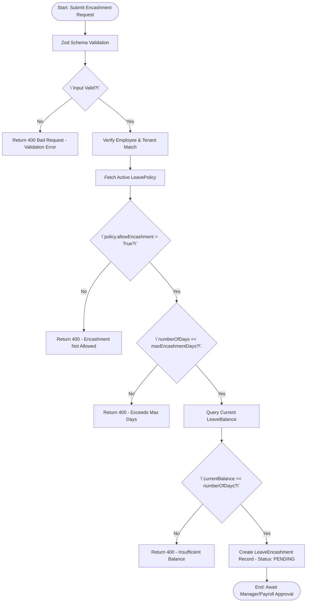
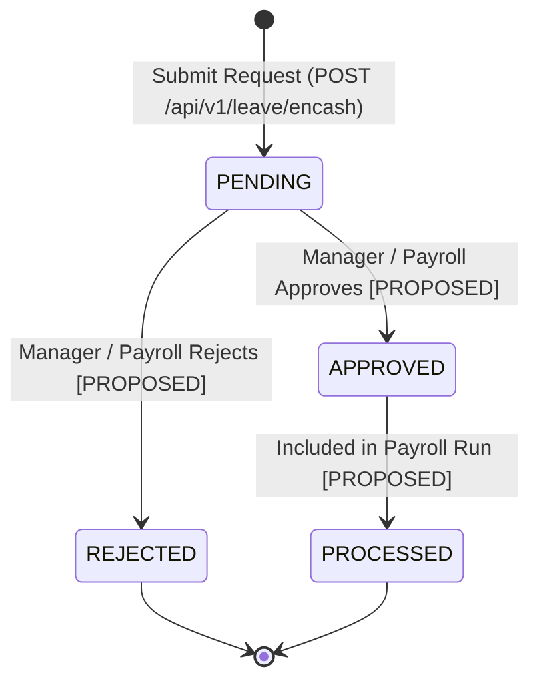

# Workflow 02 — Leave Encashment Approval Enterprise Specification

> **Document Code:** `SPEC-WF-02`  
> **System:** AuraOS Enterprise ERP / HCM Platform  
> **Version:** 1.0.0  
> **Date:** 2026-07-29  
> **Status:** Official Functional Specification  
> **Primary Code Location:** `apps/web/src/app/api/v1/leave/encash/route.ts`  
> **Primary API Route:** `POST /api/v1/leave/encash`  
> **Primary Database Entity:** `LeaveEncashment` (`packages/@aura/database/prisma/schema.prisma#L3006-L3040`)

---

## Metadata Header

| Attribute                     | Value / Reference                                                              |
| ----------------------------- | ------------------------------------------------------------------------------ |
| **Workflow ID & Name**        | `02` — `Leave Encashment Approval`                                             |
| **Business Module**           | `Leave & Time Management`                                                      |
| **Submodule / Domain**        | `Leave Encashment & Payroll Integration`                                       |
| **Business Process Owner**    | `Payroll & Compensation Director`                                              |
| **Technical System Owner**    | `Lead Payroll & Core HR Software Architect`                                    |
| **Implementation Status**     | `Partially Implemented`                                                        |
| **Specification Version**     | `1.0.0`                                                                        |
| **Date Created / Updated**    | `2026-07-29`                                                                   |
| **Technical Author**          | `Enterprise Solution Architect (AI Agent)`                                     |
| **Technical Reviewer**        | `Senior Software Architect`                                                    |
| **QA Verifier**               | `QA Lead`                                                                      |
| **Final Approver**            | `Chief Product Officer`                                                        |
| **Primary Code Location**     | `apps/web/src/app/api/v1/leave/encash/route.ts`                                |
| **Primary API Route**         | `POST /api/v1/leave/encash`                                                    |
| **Primary Database Entity**   | `LeaveEncashment` (`packages/@aura/database/prisma/schema.prisma#L3006-L3040`) |
| **Related Architecture Docs** | `docs/architecture/WORKFLOW_AUDIT_FINDINGS.md`                                 |

---

## Table of Contents

- [1. Executive Summary](#1-executive-summary)
- [2. Business Context](#2-business-context)
- [3. Business Objectives](#3-business-objectives)
- [4. Business Scope](#4-business-scope)
- [5. Workflow Overview](#5-workflow-overview)
- [6. Business Process Description](#6-business-process-description)
- [7. Mermaid Business Workflow Diagram](#7-mermaid-business-workflow-diagram)
- [8. Business Actors](#8-business-actors)
- [9. RACI Matrix](#9-raci-matrix)
- [10. Entry Points](#10-entry-points)
- [11. Trigger Events](#11-trigger-events)
- [12. Workflow Stages](#12-workflow-stages)
- [13. Workflow State Machine](#13-workflow-state-machine)
- [14. Approval Process](#14-approval-process)
- [15. Approval Matrix](#15-approval-matrix)
- [16. Decision Matrix](#16-decision-matrix)
- [17. Business Rules](#17-business-rules)
- [18. Compliance Rules](#18-compliance-rules)
- [19. Country-Specific Rules](#19-country-specific-rules)
- [20. Exception Handling](#20-exception-handling)
- [21. Notifications](#21-notifications)
- [22. Escalation Rules](#22-escalation-rules)
- [23. SLA Rules](#23-sla-rules)
- [24. RBAC Matrix](#24-rbac-matrix)
- [25. Audit Trail](#25-audit-trail)
- [26. UI Screens](#26-ui-screens)
- [27. Frontend Architecture](#27-frontend-architecture)
- [28. API Specification](#28-api-specification)
- [29. Backend Architecture](#29-backend-architecture)
- [30. Database Design](#30-database-design)
- [31. Integration Points](#31-integration-points)
- [32. Reports](#32-reports)
- [33. Dashboard KPIs](#33-dashboard-kpis)
- [34. Analytics](#34-analytics)
- [35. CURRENT IMPLEMENTATION](#35-current-implementation)
- [36. IMPLEMENTATION GAPS](#36-implementation-gaps)
- [37. PROPOSED ENTERPRISE IMPLEMENTATION](#37-proposed-enterprise-implementation)
- [38. Migration Strategy](#38-migration-strategy)
- [39. Testing Strategy](#39-testing-strategy)
- [40. Acceptance Criteria](#40-acceptance-criteria)
- [41. Implementation Checklist](#41-implementation-checklist)
- [42. Known Risks](#42-known-risks)
- [43. Related Architecture Findings](#43-related-architecture-findings)
- [44. Repository References](#44-repository-references)

---

## 1. Executive Summary

The **Leave Encashment Approval Workflow** enables eligible employees to monetize unused annual leave balances according to corporate policy limits and statutory regulations. It processes encashment requests submitted via Employee Self-Service (ESS), validates requests against `LeavePolicy` constraints (`allowEncashment`, `maxEncashmentDays`, `encashmentRate`), verifies real-time `LeaveBalance` availability, and persists records in `LeaveEncashment` for payroll processing.

The current implementation is classified as **Partially Implemented**. While the request submission route (`POST /api/v1/leave/encash`) is fully functional with Zod schema validation, the current route hardcodes the `dailyRate` calculation as `0` (placeholder for payroll integration) and does not implement a dedicated service class method or dedicated manager approval endpoint.

---

## 2. Business Context

Leave encashment is a key compensation feature in enterprise Human Capital Management (HCM). It allows employees to convert accumulated paid leave days into cash compensation—either annually, upon request, or during employment termination (such as End-of-Service Benefit processing in GCC jurisdictions). Organizations require strict validation against policy caps and accurate integration with payroll processing cycles to prevent over-encashment and maintain balance sheet accuracy.

---

## 3. Business Objectives

- **Enforce Policy Caps:** Validate that the requested encashment days do not exceed policy-defined maximums (`maxEncashmentDays`).
- **Prevent Negative Balances:** Verify that current `LeaveBalance` covers requested days prior to record creation.
- **Ensure Payroll Synchronization:** Capture `payrollMonth` (YYYY-MM format) for accurate processing during monthly payroll runs.
- **Support Regional Compliance:** Adhere to GCC labor regulations (UAE, KSA) governing annual leave encashment calculations based on basic or gross salary.

---

## 4. Business Scope

### 4.1 In-Scope

- Submission of leave encashment requests via REST API (`POST /api/v1/leave/encash`).
- Zod schema validation (`encashLeaveSchema`) enforcing UUID formats and date patterns.
- Policy eligibility verification (`allowEncashment`, `maxEncashmentDays`, `encashmentRate`).
- Real-time `LeaveBalance` checking for current leave year.
- Persistence of encashment records in `LeaveEncashment` with default status `PENDING`.

### 4.2 Out-of-Scope

- Termination-based automatic encashment calculations (handled by `10 Full & Final Settlement Workflow`).
- Direct banking disbursement execution (handled by General Ledger and Payroll Disbursement modules).

---

## 5. Workflow Overview

The leave encashment request moves from user submission to payroll month assignment:

```
┌──────────┐     ┌───────────┐     ┌─────────────┐     ┌───────────┐     ┌────────────┐
│ Employee │ ──> │ Zod Input │ ──> │ Policy &    │ ──> │ PENDING   │ ──> │ Payroll    │
│ Submits  │     │ Validation│     │ Balance Check│     │ Encashment│     │ Integration│
└──────────┘     └───────────┘     └─────────────┘     └───────────┘     └────────────┘
```

---

## 6. Business Process Description

1. **Submission:** An employee or HR administrator submits an encashment request via `POST /api/v1/leave/encash` containing `employeeId`, `policyId`, `numberOfDays`, `requestedPaymentMonth`, and an optional `reason`.
2. **Input Validation:** The request body is validated against `encashLeaveSchema` (`apps/web/src/app/api/v1/leave/encash/route.ts#L10-L16`).
3. **Tenant & Policy Verification:** The route verifies that the employee exists in the user's tenant and fetches active `LeavePolicy`. If `policy.allowEncashment === false`, the API returns `400 Bad Request`.
4. **Policy Limit Guard:** If `numberOfDays > policy.maxEncashmentDays`, submission is rejected with `400 Bad Request`.
5. **Balance Check:** The system queries `LeaveBalance` for the current year. If `currentBalance < numberOfDays`, submission is rejected with `400 Bad Request`.
6. **Encashment Record Creation:** The record is saved to `LeaveEncashment` with status `PENDING`, `payrollMonth`, calculation basis `BASIC`, and calculated `eligibleDays`.

---

## 7. Mermaid Business Workflow Diagram



---

## 8. Business Actors

| Actor Role               | Actor Type | System Persona          | Operational Responsibilities                                   |
| ------------------------ | ---------- | ----------------------- | -------------------------------------------------------------- |
| **Encashment Requestor** | Human      | `EMPLOYEE` / `HR_ADMIN` | Submits encashment request with target payroll month           |
| **Payroll Officer**      | Human      | `PAYROLL_OFFICER`       | Reviews pending encashments for payroll inclusion              |
| **Encashment Route**     | System     | API Route Handler       | Performs policy checks, balance verification, and DB insertion |

---

## 9. RACI Matrix

| Workflow Activity        | Employee  | HR Admin | Payroll Officer | Encashment API Route | Prisma DB |
| ------------------------ | :-------: | :------: | :-------------: | :------------------: | :-------: |
| Submit Request           | **R / A** |    C     |        I        |          C           |     I     |
| Policy & Limit Check     |     I     |    I     |        I        |      **R / A**       |     C     |
| Balance Verification     |     I     |    I     |        I        |      **R / A**       |     C     |
| Record Creation          |     I     |    I     |        I        |        **R**         |   **A**   |
| Payroll Month Assignment |     I     |  **A**   |      **R**      |          C           |     C     |

---

## 10. Entry Points

- **Primary REST API Endpoint:** `POST /api/v1/leave/encash` (`apps/web/src/app/api/v1/leave/encash/route.ts#L22`)
- **Frontend Screen:** `apps/web/src/app/dashboard/leave/page.tsx`

---

## 11. Trigger Events

| Trigger Event Name           | Trigger Type    | Source System / Action      | Payload Attributes                                                |
| ---------------------------- | --------------- | --------------------------- | ----------------------------------------------------------------- |
| `LEAVE_ENCASHMENT_SUBMITTED` | User API Action | `POST /api/v1/leave/encash` | `employeeId`, `policyId`, `numberOfDays`, `requestedPaymentMonth` |

---

## 12. Workflow Stages

### 12.1 Stage 1: Encashment Application (`SUBMISSION`)

- **Stage Identifier:** `SUBMISSION`
- **Stage Owner Role:** `EMPLOYEE` / `HR_ADMIN`
- **SLA Window:** Immediate
- **Entry Criteria:** Employee requests encashment via API/UI.
- **Exit Criteria:** Validated and saved in `LeaveEncashment` with status `PENDING`.
- **Validation Guard:** `encashLeaveSchema.safeParse(body)` (`apps/web/src/app/api/v1/leave/encash/route.ts#L41`).
- **Status Value:** `PENDING`
- **Repository Implementation:** `apps/web/src/app/api/v1/leave/encash/route.ts#L217-L234`

### 12.2 Stage 2: Payroll & Manager Approval (`APPROVAL` - PROPOSED)

- **Stage Identifier:** `APPROVAL`
- **Stage Owner Role:** `PAYROLL_OFFICER`
- **SLA Window:** 72 Hours
- **Status Value:** `APPROVED` / `REJECTED`

---

## 13. Workflow State Machine



| From State | To State   | Trigger / Method                 | Prerequisites / Guards                                        | Side Effects                                       |
| ---------- | ---------- | -------------------------------- | ------------------------------------------------------------- | -------------------------------------------------- |
| `[*]`      | `PENDING`  | `POST /api/v1/leave/encash`      | Zod schema valid; policy allows encashment; balance available | Saves `LeaveEncashment` record with `payrollMonth` |
| `PENDING`  | `APPROVED` | `approveEncashment()` [PROPOSED] | User has `leave:approve` permission                           | Updates `approvedDays` and `approvedAt`            |

---

## 14. Approval Process

Currently, the encashment submission API creates a record with status `PENDING`. An explicit approval route for leave encashment (e.g., `POST /api/v1/leave/encash/[id]/approve`) is **NOT currently implemented** in the API directory. Approval logic is intended to follow a Payroll Officer / HR Manager verification pattern before payroll execution.

---

## 15. Approval Matrix

| Approval Level | Approver Role    | Condition / Threshold         | SLA Target | Escalation Role  |
| -------------- | ---------------- | ----------------------------- | ---------- | ---------------- |
| Level 1        | HR Manager       | Encashment days $\le 10$ Days | 48 Hours   | Payroll Director |
| Level 2        | Payroll Director | Encashment days $> 10$ Days   | 72 Hours   | CPO              |

---

## 16. Decision Matrix

| Policy Allows Encashment? | Request $\le$ Max Days? | Balance Available? | Decision Outcome      | Target Status    |
| ------------------------- | ----------------------- | ------------------ | --------------------- | ---------------- |
| Yes                       | Yes                     | Yes                | Create Record         | `PENDING`        |
| No                        | Irrelevant              | Irrelevant         | Reject (Code `E4001`) | None (400 Error) |
| Yes                       | No                      | Irrelevant         | Reject (Code `E4003`) | None (400 Error) |
| Yes                       | Yes                     | No                 | Reject (Code `E4002`) | None (400 Error) |

---

## 17. Business Rules

#### BR-HR-ENCASH-001: Policy Encashment Eligibility

- **Category:** Validation / Policy Eligibility
- **Severity:** BLOCKED (Submission rejected)
- **Description:** Encashment can only be requested if `policy.allowEncashment === true`.
- **Error Code:** `E4001` (`"Leave encashment not allowed for this leave type"`)
- **Repository Reference:** `apps/web/src/app/api/v1/leave/encash/route.ts#L117-L133`

#### BR-HR-ENCASH-002: Maximum Encashment Limit

- **Category:** Policy Constraint
- **Severity:** BLOCKED (Submission rejected)
- **Description:** Requested days cannot exceed `policy.maxEncashmentDays`.
- **Error Code:** `E4003` (`"Maximum encashment allowed is X days"`)
- **Repository Reference:** `apps/web/src/app/api/v1/leave/encash/route.ts#L136-L154`

#### BR-HR-ENCASH-003: Sufficient Balance Guard

- **Category:** Balance Integrity
- **Severity:** BLOCKED (Submission rejected)
- **Description:** Employee must possess current balance $\ge$ requested days for current leave year.
- **Error Code:** `E4002` (`"Insufficient leave balance for encashment"`)
- **Repository Reference:** `apps/web/src/app/api/v1/leave/encash/route.ts#L186-L206`

---

## 18. Compliance Rules

- **Multi-Tenant Isolation:** Enforced via `company: { tenantId: user.tenantId }` check on `Employee` and `tenantId: user.tenantId` on `LeavePolicy` and `LeaveBalance`.
- **Payment Month Format:** `requestedPaymentMonth` MUST strictly match regex `^\d{4}-\d{2}$` (e.g., `2026-08`).

---

## 19. Country-Specific Rules

| Country Code | Statutory Rule    | Encashment Calculation Basis       | Repository Reference                                 |
| ------------ | ----------------- | ---------------------------------- | ---------------------------------------------------- |
| `UAE`        | Labor Law Art. 29 | Basic salary rate per encashed day | `apps/web/src/app/api/v1/leave/encash/route.ts#L225` |

---

## 20. Exception Handling

| Error Code | HTTP Status | Message                                            | Root Cause                             |
| ---------- | :---------: | -------------------------------------------------- | -------------------------------------- |
| `E4030`    |    `403`    | `Forbidden: missing leave:create permission`       | User lacks permission                  |
| `E2001`    |    `400`    | `Validation failed`                                | Zod schema invalid (UUID, date format) |
| `E3001`    |    `404`    | `Employee not found`                               | Invalid employee ID or tenant mismatch |
| `E3002`    |    `404`    | `Leave policy not found`                           | Invalid policy ID or inactive policy   |
| `E4001`    |    `400`    | `Leave encashment not allowed for this leave type` | Policy disallows encashment            |
| `E4002`    |    `400`    | `Insufficient leave balance for encashment`        | Balance lower than requested days      |

---

## 21. Notifications

- **Current Status:** Notification dispatch is **not currently wired** inside `apps/web/src/app/api/v1/leave/encash/route.ts`.
- **Proposed:** Dispatch WebSocket and Email alerts upon submission (`LEAVE_ENCASHMENT_SUBMITTED`).

---

## 22–23. Escalation & SLA Rules

- **Standard SLA:** 72 Hours for Payroll Officer review.
- **Escalation Target:** HR Director.

---

## 24. RBAC Matrix

| Role              | `leave:read` | `leave:create` | `leave:approve` | Admin Override |
| ----------------- | :----------: | :------------: | :-------------: | :------------: |
| `EMPLOYEE`        |   ✅ (Own)   |  ✅ (Submit)   |       ❌        |       ❌       |
| `HR_ADMIN`        |   ✅ (All)   |       ✅       |       ✅        |       ✅       |
| `PAYROLL_OFFICER` |   ✅ (All)   |       ✅       |       ✅        |       ✅       |
| `TENANT_ADMIN`    |   ✅ (All)   |       ✅       |       ✅        |       ✅       |

---

## 25. Audit Trail & Logging

- Every submission returns metadata containing `timestamp`, `requestId` (`crypto.randomUUID()`), and `apiVersion`.

---

## 26–27. UI & Frontend Architecture

- **Page Component:** `apps/web/src/app/dashboard/leave/page.tsx`
- Form Modal allows selecting leave policy and number of days, submitting payload to `POST /api/v1/leave/encash`.

---

## 28. API Specification

### POST /api/v1/leave/encash

- **HTTP Method:** `POST`
- **Route Path:** `/api/v1/leave/encash`
- **Authentication:** `Bearer JWT` (Session Context)
- **Required Permission:** `leave:create`
- **Request Payload (JSON):**
  ```json
  {
    "employeeId": "a1b2c3d4-e5f6-7a8b-9c0d-1e2f3a4b5c6d",
    "policyId": "b2c3d4e5-f6a7-8b9c-0d1e-2f3a4b5c6d7e",
    "numberOfDays": 5,
    "reason": "Annual leave encashment request",
    "requestedPaymentMonth": "2026-08"
  }
  ```
- **Success Response (201 Created):**
  ```json
  {
    "success": true,
    "data": {
      "id": "c3d4e5f6-a7b8-9c0d-1e2f-3a4b5c6d7e8f",
      "status": "PENDING",
      "requestedDays": 5,
      "eligibleDays": 5,
      "currentBalance": 20,
      "balanceAfterEncashment": 15,
      "payrollMonth": "2026-08"
    }
  }
  ```
- **Repository Implementation:** `apps/web/src/app/api/v1/leave/encash/route.ts#L22-L289`

---

## 29. Backend Architecture

- **Implementation Location:** `apps/web/src/app/api/v1/leave/encash/route.ts`
- **Database Model:** `prisma.leaveEncashment` (`packages/@aura/database/prisma/schema.prisma#L3006-L3040`).

---

## 30. Database Design

- **Prisma Entity Name:** `LeaveEncashment`
- **Schema File Location:** `packages/@aura/database/prisma/schema.prisma#L3006-L3040`
- **Entity Attributes:**
  ```prisma
  model LeaveEncashment {
    id               String    @id @default(uuid())
    tenantId         String
    employeeId       String
    leaveTypeId      String
    policyId         String
    requestedDays    Decimal
    eligibleDays     Decimal
    approvedDays     Decimal?
    calculationBasis String
    dailyRate        Decimal
    totalAmount      Decimal
    encashmentRate   Decimal   @default(100)
    trigger          String
    reason           String?
    status           String    @default("PENDING")
    payrollMonth     String?
    createdAt        DateTime  @default(now())
    updatedAt        DateTime  @updatedAt

    @@index([employeeId])
    @@index([payrollMonth])
    @@index([status])
    @@index([tenantId])
    @@map("aura_leave_encashment")
  }
  ```

---

## 31–34. Integrations, Reports & KPIs

- **Internal Service Integrations:** `PayrollRun` service integration for `payrollMonth` payout inclusion.
- **Key KPIs:** Average encashment turnaround time, Total encashment payout liability (USD/AED).

---

## 35. CURRENT IMPLEMENTATION

> [!NOTE]
> **CURRENT PRODUCTION IMPLEMENTATION STATUS:**
> The following section describes ONLY functionality verified by existing codebase artifacts.

### 35.1 Verified Codebase Capabilities

- Encashment submission route (`POST /api/v1/leave/encash`) is functional with Zod schema validation.
- Verifies employee tenant match, policy encashment eligibility (`policy.allowEncashment`), maximum days (`policy.maxEncashmentDays`), and active `LeaveBalance`.
- Persists encashment request in `LeaveEncashment` table with status `PENDING`.

### 35.2 Verified Technical Limitations & Gaps

> [!WARNING]
> **Placeholder Daily Rate & Decoupled Service:**
>
> 1. `apps/web/src/app/api/v1/leave/encash/route.ts#L213` hardcodes `dailyRate = 0` (`// dailyRate is a placeholder - in production this would come from payroll/salary data`).
> 2. API route queries `prisma` directly instead of calling a dedicated service method in `LeaveService`.
> 3. Dedicated approval API endpoint for encashment is not present.

---

## 36. IMPLEMENTATION GAPS

| Functional Area            | Current Codebase State                | Target Enterprise Target                           | Priority / Impact      |
| -------------------------- | ------------------------------------- | -------------------------------------------------- | ---------------------- |
| **Daily Rate Calculation** | Hardcoded `dailyRate = 0` placeholder | Dynamic calculation from Employee Salary Structure | Critical / Payroll     |
| **Service Layer**          | Inline Prisma queries in API route    | Encapsulated in `LeaveService.createEncashment()`  | High / Maintainability |
| **Approval Route**         | Missing approval endpoint             | `POST /api/v1/leave/encash/[id]/approve`           | High / Operational     |

---

## 37. PROPOSED ENTERPRISE IMPLEMENTATION

> [!IMPORTANT]
> **PROPOSED ENTERPRISE IMPLEMENTATION DISCLAIMER:**
> The features outlined below represent target enterprise architecture specifications and are NOT currently present in the production codebase.

### 37.1 Real-Time Payroll Salary Integration [PROPOSED]

Integrate `EmployeeSalaryStructure` to fetch basic/gross salary and compute exact daily rate (`basicSalary / 30`) during encashment calculation.

### 37.2 Encashment Approval & Payroll Inclusion Route [PROPOSED]

Create `POST /api/v1/leave/encash/[id]/approve` to allow Payroll Officers to approve requests and automatically deduct approved days from `LeaveBalance`.

---

## 38. Migration Strategy

- Update existing `LeaveEncashment` records with calculated `dailyRate` once salary structure integration is deployed.

---

## 39. Testing Strategy

### 39.1 Functional Tests

- Verify `POST /api/v1/leave/encash` creates a `LeaveEncashment` record with status `PENDING`.
- Verify policy `allowEncashment = false` returns `400 Bad Request` (Code `E4001`).

### 39.2 Boundary & Security Tests

- Verify requesting days $> maxEncashmentDays$ returns `400 Bad Request` (Code `E4003`).
- Verify unauthorized request returns `403 Forbidden` (Code `E4030`).

---

## 40. Acceptance Criteria

```gherkin
Scenario: Successful Encashment Submission
  GIVEN an employee has an active LeavePolicy with allowEncashment=true and maxEncashmentDays=10
  AND the employee has a current LeaveBalance of 15 days
  WHEN the user submits POST /api/v1/leave/encash with numberOfDays=5 and requestedPaymentMonth="2026-08"
  THEN a LeaveEncashment record MUST be created with status PENDING
  AND the response data MUST return balanceAfterEncashment = 10
```

---

## 41. Implementation Checklist

- [x] API endpoint `POST /api/v1/leave/encash` implemented with Zod validation
- [x] Policy and balance verification logic verified
- [x] Prisma model `LeaveEncashment` verified in schema
- [ ] Connect `EmployeeSalaryStructure` to calculate actual `dailyRate`
- [ ] Create dedicated `POST /api/v1/leave/encash/[id]/approve` endpoint

---

## 42. Known Risks

- **Risk 1:** Submitting encashments with placeholder `dailyRate = 0` will result in zero payout amount if processed directly into payroll runs without salary integration.

---

## 43. Related Architecture Findings

- **Architecture Audit Findings:** Detailed in `docs/architecture/WORKFLOW_AUDIT_FINDINGS.md`.

---

## 44. Repository References

### 44.1 Frontend Files

- `apps/web/src/app/dashboard/leave/page.tsx`

### 44.2 API Routes

- `apps/web/src/app/api/v1/leave/encash/route.ts`

### 44.3 Backend Service Classes

- `apps/web/src/lib/services/leave.service.ts`

### 44.4 Database Schema Models

- `packages/@aura/database/prisma/schema.prisma#L3006-L3040`

---

_End of Workflow 02 — Leave Encashment Approval Enterprise Specification._
