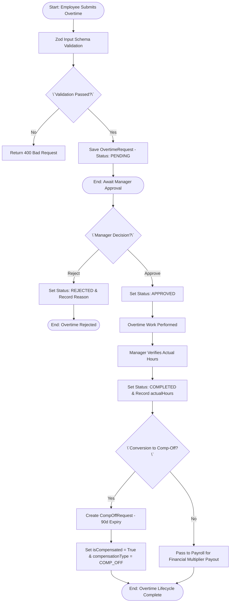
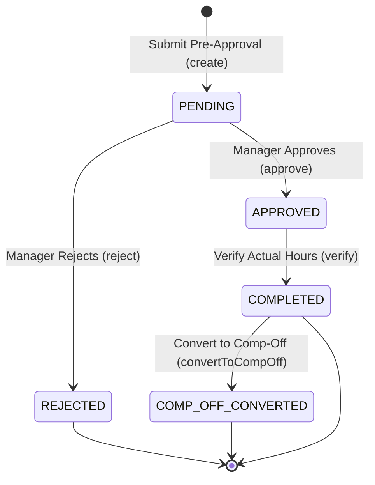

# Workflow 03 — Overtime Request Approval Enterprise Specification

> **Document Code:** `SPEC-WF-03`  
> **System:** AuraOS Enterprise ERP / HCM Platform  
> **Version:** 1.0.0  
> **Date:** 2026-07-29  
> **Status:** Official Functional Specification  
> **Primary Code Location:** `apps/web/src/lib/services/overtime.service.ts`  
> **Primary API Route:** `POST /api/v1/overtime`  
> **Primary Database Entity:** `OvertimeRequest` (`packages/@aura/database/prisma/schema.prisma#L1174-L1208`)

---

## Metadata Header

| Attribute                     | Value / Reference                                                              |
| ----------------------------- | ------------------------------------------------------------------------------ |
| **Workflow ID & Name**        | `03` — `Overtime Request Approval`                                             |
| **Business Module**           | `Leave & Time Management`                                                      |
| **Submodule / Domain**        | `Time & Attendance / Overtime Governance`                                      |
| **Business Process Owner**    | `Time & Attendance Operations Director`                                        |
| **Technical System Owner**    | `Lead Workforce Management Software Architect`                                 |
| **Implementation Status**     | `Partially Implemented`                                                        |
| **Specification Version**     | `1.0.0`                                                                        |
| **Date Created / Updated**    | `2026-07-29`                                                                   |
| **Technical Author**          | `Enterprise Solution Architect (AI Agent)`                                     |
| **Technical Reviewer**        | `Senior Software Architect`                                                    |
| **QA Verifier**               | `QA Lead`                                                                      |
| **Final Approver**            | `Chief Product Officer`                                                        |
| **Primary Code Location**     | `apps/web/src/lib/services/overtime.service.ts`                                |
| **Primary API Route**         | `POST /api/v1/overtime`                                                        |
| **Primary Database Entity**   | `OvertimeRequest` (`packages/@aura/database/prisma/schema.prisma#L1174-L1208`) |
| **Related Architecture Docs** | `docs/architecture/WORKFLOW_AUDIT_FINDINGS.md#finding-3`                       |

---

## Table of Contents

- [1. Executive Summary](#1-executive-summary)
- [2. Business Context](#2-business-context)
- [3. Business Objectives](#3-business-objectives)
- [4. Business Scope](#4-business-scope)
- [5. Workflow Overview](#5-workflow-overview)
- [6. Business Process Description](#6-business-process-description)
- [7. Mermaid Business Workflow Diagram](#7-mermaid-business-workflow-diagram)
- [8. Business Actors](#8-business-actors)
- [9. RACI Matrix](#9-raci-matrix)
- [10. Entry Points](#10-entry-points)
- [11. Trigger Events](#11-trigger-events)
- [12. Workflow Stages](#12-workflow-stages)
- [13. Workflow State Machine](#13-workflow-state-machine)
- [14. Approval Process](#14-approval-process)
- [15. Approval Matrix](#15-approval-matrix)
- [16. Decision Matrix](#16-decision-matrix)
- [17. Business Rules](#17-business-rules)
- [18. Compliance Rules](#18-compliance-rules)
- [19. Country-Specific Rules](#19-country-specific-rules)
- [20. Exception Handling](#20-exception-handling)
- [21. Notifications](#21-notifications)
- [22. Escalation Rules](#22-escalation-rules)
- [23. SLA Rules](#23-sla-rules)
- [24. RBAC Matrix](#24-rbac-matrix)
- [25. Audit Trail](#25-audit-trail)
- [26. UI Screens](#26-ui-screens)
- [27. Frontend Architecture](#27-frontend-architecture)
- [28. API Specification](#28-api-specification)
- [29. Backend Architecture](#29-backend-architecture)
- [30. Database Design](#30-database-design)
- [31. Integration Points](#31-integration-points)
- [32. Reports](#32-reports)
- [33. Dashboard KPIs](#33-dashboard-kpis)
- [34. Analytics](#34-analytics)
- [35. CURRENT IMPLEMENTATION](#35-current-implementation)
- [36. IMPLEMENTATION GAPS](#36-implementation-gaps)
- [37. PROPOSED ENTERPRISE IMPLEMENTATION](#37-proposed-enterprise-implementation)
- [38. Migration Strategy](#38-migration-strategy)
- [39. Testing Strategy](#39-testing-strategy)
- [40. Acceptance Criteria](#40-acceptance-criteria)
- [41. Implementation Checklist](#41-implementation-checklist)
- [42. Known Risks](#42-known-risks)
- [43. Related Architecture Findings](#43-related-architecture-findings)
- [44. Repository References](#44-repository-references)

---

## 1. Executive Summary

The **Overtime Request Approval Workflow** manages the pre-approval, manager decisioning, post-work verification, and compensation processing (financial payout or Comp-Off generation) for employee overtime hours in AuraOS. It categorizes overtime into `REGULAR`, `WEEKEND`, or `HOLIDAY` types, validates requested hours against tenant overtime policies, tracks actual worked hours post-completion, and supports conversion into compensatory off (`CompOffRequest`).

The workflow is classified as **Partially Implemented**. While core CRUD, approval (`approve`), verification (`verify`), and Comp-Off conversion (`convertToCompOff`) routines exist in `OvertimeService`, the service file carries an explicit `@ts-nocheck` annotation due to Prisma schema field drift (tracked under issue #29 in `docs/architecture/WORKFLOW_AUDIT_FINDINGS.md#finding-3`).

---

## 2. Business Context

In enterprise operations, controlling overtime expense and maintaining statutory compliance with statutory maximum daily/weekly work hours is critical. Labor laws across GCC (UAE Federal Law 33/2021) and Western jurisdictions impose strict caps on overtime hours and enforce mandatory premium multiplier rates (e.g., 125% for regular overtime, 150% for weekend/holiday overtime). Automated pre-approval and verification workflows protect organizations against wage liabilities and labor compliance violations.

---

## 3. Business Objectives

- **Pre-Approval Governance:** Ensure overtime is pre-approved by Line Managers before hours are worked.
- **Post-Work Verification:** Record actual verified hours worked (`actualHours`) prior to payroll payout.
- **Comp-Off Conversion:** Support optional conversion of approved overtime hours into compensatory time off with a 90-day expiry window.
- **Statutory Multiplier Enforcement:** Apply correct rate multipliers (`125%`, `150%`) based on overtime type (`REGULAR`, `WEEKEND`, `HOLIDAY`).

---

## 4. Business Scope

### 4.1 In-Scope

- Submission of overtime pre-approval requests via REST API (`POST /api/v1/overtime`).
- Validation against Zod schema constraints (`createOvertimeRequestSchema`).
- Manager approval (`OvertimeService.approve`) and rejection (`OvertimeService.reject`).
- Post-work verification of actual hours (`OvertimeService.verify`).
- Conversion of approved overtime to Comp-Off records (`OvertimeService.convertToCompOff`).
- Audit logging via `AuditAction.ATTENDANCE_UPDATED`.

### 4.2 Out-of-Scope

- Direct biometric clocking punch capture (governed by Attendance Punch Ingestion service).
- Bank disbursement execution (governed by Payroll Run Processing).

---

## 5. Workflow Overview

Overtime progresses through a multi-stage lifecycle from pre-approval to verification or Comp-Off conversion:

```
┌──────────┐     ┌───────────┐     ┌───────────┐     ┌───────────┐     ┌─────────────┐     ┌─────────────┐
│ Employee │ ──> │ PENDING   │ ──> │ APPROVED  │ ──> │ Work      │ ──> │ COMPLETED   │ ──> │ Comp-Off /  │
│ Applies  │     │ Request   │     │ Overtime  │     │ Performed │     │ (Verified)  │     │ Payroll Payout│
└──────────┘     └───────────┘     └───────────┘     └───────────┘     └─────────────┘     └─────────────┘
```

---

## 6. Business Process Description

1. **Pre-Approval Submission:** An employee submits an overtime request via `POST /api/v1/overtime` specifying `overtimeDate`, `startTime`, `endTime`, `totalHours`, `overtimeType` (`REGULAR`, `WEEKEND`, `HOLIDAY`), and `reason`.
2. **Input Validation:** Input is validated against `createOvertimeRequestSchema` (`apps/web/src/lib/services/overtime.service.ts#L7-L18`).
3. **Pending Persistence:** Record is saved in `OvertimeRequest` with status `PENDING`.
4. **Manager Decision:** The manager evaluates the request via `POST /api/v1/overtime/[id]/approve`. `OvertimeService.approve()` sets status to `APPROVED`, recording `approvedBy` and `approvedAt`.
5. **Post-Work Verification:** After work completion, `OvertimeService.verify()` updates status to `COMPLETED` and records `actualHours`, `verifiedBy`, and `verifiedAt`.
6. **Comp-Off Conversion (Optional):** If configured, `OvertimeService.convertToCompOff()` creates a `CompOffRequest` record with status `EARNED` (valid for 3 months) and sets `isCompensated=true` on the overtime record.

---

## 7. Mermaid Business Workflow Diagram



---

## 8. Business Actors

| Actor Role             | Actor Type | System Persona    | Operational Responsibilities                                           |
| ---------------------- | ---------- | ----------------- | ---------------------------------------------------------------------- |
| **Overtime Requestor** | Human      | `EMPLOYEE`        | Submits overtime pre-approval request and reason                       |
| **Line Manager**       | Human      | `LINE_MANAGER`    | Approves/rejects request and verifies actual worked hours              |
| **Overtime Service**   | System     | `OvertimeService` | Manages state machine transitions, verification, and Comp-Off creation |

---

## 9. RACI Matrix

| Workflow Activity   | Employee  | Line Manager | HR Admin | OvertimeService | Audit Middleware  |
| ------------------- | :-------: | :----------: | :------: | :-------------: | :---------------: |
| Submit Pre-Approval | **R / A** |      I       |    I     |        C        |         I         |
| Manager Approval    |     I     |  **R / A**   |    C     |        I        | **I (Audit Log)** |
| Hours Verification  |     I     |  **R / A**   |    C     |        C        | **I (Audit Log)** |
| Comp-Off Conversion |     I     |      C       |  **A**   |      **R**      |         I         |

---

## 10. Entry Points

- **Primary User API Endpoint:** `POST /api/v1/overtime` (`apps/web/src/app/api/v1/overtime/route.ts#L59`)
- **Approval REST API Endpoint:** `POST /api/v1/overtime/[id]/approve` (`apps/web/src/app/api/v1/overtime/[id]/approve/route.ts#L8`)
- **Frontend Dashboard Screen:** `apps/web/src/app/dashboard/overtime/page.tsx`

---

## 11. Trigger Events

| Trigger Event Name           | Trigger Type      | Source System / Action               | Payload Attributes                                                     |
| ---------------------------- | ----------------- | ------------------------------------ | ---------------------------------------------------------------------- |
| `OVERTIME_REQUEST_SUBMITTED` | User UI Action    | `POST /api/v1/overtime`              | `tenantId`, `employeeId`, `overtimeDate`, `totalHours`, `overtimeType` |
| `OVERTIME_REQUEST_APPROVED`  | Manager UI Action | `POST /api/v1/overtime/[id]/approve` | `id`, `tenantId`, `approvedBy`                                         |
| `OVERTIME_VERIFIED`          | Manager UI Action | `OvertimeService.verify()`           | `id`, `actualHours`, `verifiedBy`                                      |

---

## 12. Workflow Stages

### 12.1 Stage 1: Pre-Approval Submission (`SUBMISSION`)

- **Stage Identifier:** `SUBMISSION`
- **Stage Owner Role:** `EMPLOYEE`
- **SLA Window:** Immediate
- **Entry Criteria:** Employee fills overtime request modal.
- **Exit Criteria:** Validated and saved in `OvertimeRequest` with status `PENDING`.
- **Validation Guard:** `createOvertimeRequestSchema.parse(data)` (`apps/web/src/lib/services/overtime.service.ts#L7-L18`).
- **Status Value:** `PENDING`
- **Repository Implementation:** `apps/web/src/lib/services/overtime.service.ts#L78-L88`

### 12.2 Stage 2: Manager Pre-Approval (`APPROVAL`)

- **Stage Identifier:** `APPROVAL`
- **Stage Owner Role:** `LINE_MANAGER`
- **SLA Window:** 24 Hours
- **Entry Criteria:** Request status is `PENDING`.
- **Exit Criteria:** Manager invokes approve endpoint; status set to `APPROVED`.
- **Status Value:** `APPROVED`
- **Repository Implementation:** `apps/web/src/lib/services/overtime.service.ts#L109-L122`

### 12.3 Stage 3: Post-Work Verification (`VERIFICATION`)

- **Stage Identifier:** `VERIFICATION`
- **Stage Owner Role:** `LINE_MANAGER`
- **SLA Window:** 48 Hours Post-Work
- **Entry Criteria:** Status is `APPROVED` and work date has passed.
- **Exit Criteria:** Manager records `actualHours`; status updated to `COMPLETED`.
- **Status Value:** `COMPLETED`
- **Repository Implementation:** `apps/web/src/lib/services/overtime.service.ts#L140-L154`

---

## 13. Workflow State Machine



| From State               | To State             | Trigger / Method     | Prerequisites / Guards               | Side Effects                           |
| ------------------------ | -------------------- | -------------------- | ------------------------------------ | -------------------------------------- |
| `[*]`                    | `PENDING`            | `create()`           | Zod schema valid                     | Saves record; dispatches audit log     |
| `PENDING`                | `APPROVED`           | `approve()`          | Status is `PENDING`; user authorized | Sets `approvedAt` and `approvedBy`     |
| `PENDING`                | `REJECTED`           | `reject()`           | Status is `PENDING`                  | Sets `rejectionReason`                 |
| `APPROVED`               | `COMPLETED`          | `verify()`           | Status is `APPROVED`                 | Sets `actualHours` & `verifiedAt`      |
| `APPROVED` / `COMPLETED` | `COMP_OFF_CONVERTED` | `convertToCompOff()` | Status is `APPROVED`                 | Creates `CompOffRequest` (3-mo expiry) |

---

## 14. Approval Process

Overtime approval follows a 2-step lifecycle:

1. **Pre-Work Approval:** Line Manager approves requested estimated hours (`totalHours`) prior to the date.
2. **Post-Work Verification:** Line Manager verifies the actual completed hours (`actualHours`) after work is performed.

---

## 15. Approval Matrix

| Approval Level       | Approver Role   | Condition / Limit                    | SLA Target | Escalation Role |
| -------------------- | --------------- | ------------------------------------ | ---------- | --------------- |
| Level 1 Pre-Approval | Line Manager    | Requested Overtime $\le 4$ Hours/day | 24 Hours   | HR Manager      |
| Level 2 Pre-Approval | Department Head | Requested Overtime $> 4$ Hours/day   | 48 Hours   | Operations VP   |

---

## 16. Decision Matrix

| Overtime Type | Standard Rate Multiplier | Holiday Multiplier | Max Hours/Day Limit |
| ------------- | ------------------------ | ------------------ | ------------------- |
| `REGULAR`     | 125%                     | N/A                | 4 Hours             |
| `WEEKEND`     | 150%                     | N/A                | 8 Hours             |
| `HOLIDAY`     | N/A                      | 150%               | 8 Hours             |

---

## 17. Business Rules

#### BR-TIME-OT-001: Pre-Approval Requirement

- **Category:** Governance / State Machine
- **Severity:** BLOCKED (Verification rejected)
- **Description:** Only overtime requests in `APPROVED` status can be verified or converted to Comp-Off.
- **Repository Reference:** `apps/web/src/lib/services/overtime.service.ts#L143`

#### BR-TIME-OT-002: Comp-Off Expiry Window

- **Category:** Compliance / Expiry
- **Severity:** AUTOMATED
- **Description:** Comp-Off generated from overtime expires exactly 3 months (90 days) from the `overtimeDate`.
- **Repository Reference:** `apps/web/src/lib/services/overtime.service.ts#L162-L163`

---

## 18. Compliance Rules

- **GCC Statutory Overtime Caps:** Total overtime hours per day cannot exceed statutory limits (e.g., maximum 2 hours/day under UAE Labor Law Art. 33).
- **Audit Logging Mandate:** Every state modification MUST trigger `AuditAction.ATTENDANCE_UPDATED`.

---

## 19. Country-Specific Rules

| Country Code | Statutory Overtime Rate         | Daily Cap         | Repository Reference                                       |
| ------------ | ------------------------------- | ----------------- | ---------------------------------------------------------- |
| `UAE`        | 125% (Day), 150% (Night/Friday) | Max 2 Hours / Day | `packages/@aura/database/prisma/schema.prisma#L2075-L2078` |

---

## 20. Exception Handling

| Error Code | HTTP Status | Error Message                                   | Root Cause                             |
| ---------- | :---------: | ----------------------------------------------- | -------------------------------------- |
| `E4030`    |    `403`    | `Forbidden: missing overtime:create permission` | User lacks permission                  |
| `E3001`    |    `400`    | `Overtime request not found`                    | Invalid ID or status constraint breach |

---

## 21. Notifications

- **Current Status:** In-app WebSocket notification dispatches are not explicitly wired in `overtime.service.ts`.
- **Proposed:** Dispatch WebSocket and Email alerts upon submission (`OVERTIME_SUBMITTED`) and approval (`OVERTIME_APPROVED`).

---

## 22–23. Escalation & SLA Rules

- **Standard SLA:** 24 Hours for pre-work approval; 48 Hours post-work for verification.
- **Escalation Target:** HR Manager.

---

## 24. RBAC Matrix

| Role           | `overtime:read` | `overtime:create` | `overtime:approve` | Admin Override |
| -------------- | :-------------: | :---------------: | :----------------: | :------------: |
| `EMPLOYEE`     |    ✅ (Own)     |    ✅ (Submit)    |         ❌         |       ❌       |
| `LINE_MANAGER` |    ✅ (Team)    |        ✅         |         ✅         |       ❌       |
| `HR_ADMIN`     |    ✅ (All)     |        ✅         |         ✅         |       ✅       |
| `TENANT_ADMIN` |    ✅ (All)     |        ✅         |         ✅         |       ✅       |

---

## 25. Audit Trail & Logging

- **Audit Middleware:** `withAudit` wrapping `POST /api/v1/overtime` and `POST /api/v1/overtime/[id]/approve`.
- **Captured Action:** `AuditAction.ATTENDANCE_UPDATED`.
- **Captured Metadata:** `resourceType: 'overtime'`, `captureRequestBody: true`.

---

## 26–27. UI & Frontend Architecture

- **Page Path:** `apps/web/src/app/dashboard/overtime/page.tsx`
- Form Modal submits payload to `POST /api/v1/overtime`.

---

## 28. API Specification

### POST /api/v1/overtime

- **HTTP Method:** `POST`
- **Route Path:** `/api/v1/overtime`
- **Authentication:** `Bearer JWT` (Session Context)
- **Required Permission:** `overtime:create`
- **Request Body (JSON):**
  ```json
  {
    "employeeId": "emp123",
    "overtimeDate": "2026-08-10",
    "startTime": "2026-08-10T18:00:00.000Z",
    "endTime": "2026-08-10T21:00:00.000Z",
    "totalHours": 3,
    "overtimeType": "REGULAR",
    "reason": "Project deployment support"
  }
  ```
- **Success Response (201 Created):**
  ```json
  {
    "success": true,
    "data": {
      "id": "ot999",
      "status": "PENDING",
      "totalHours": 3
    }
  }
  ```
- **Repository Implementation:** `apps/web/src/app/api/v1/overtime/route.ts#L59-L93`

---

## 29. Backend Architecture

- **Service Class:** `OvertimeService` (`apps/web/src/lib/services/overtime.service.ts`)
- **Database Model:** `prisma.overtimeRequest` (`packages/@aura/database/prisma/schema.prisma#L1174-L1208`).

---

## 30. Database Design

- **Prisma Entity Name:** `OvertimeRequest`
- **Schema Location:** `packages/@aura/database/prisma/schema.prisma#L1174-L1208`
- **Entity Attributes:**
  ```prisma
  model OvertimeRequest {
    id               String    @id @default(uuid())
    tenantId         String
    employeeId       String
    overtimeDate     DateTime
    startTime        DateTime
    endTime          DateTime
    totalHours       Float
    overtimeType     String
    reason           String
    status           String    @default("PENDING")
    approvedBy       String?
    approvedAt       DateTime?
    actualHours      Float?
    verifiedBy       String?
    verifiedAt       DateTime?
    compensationType String?
    isCompensated    Boolean   @default(false)
    createdAt        DateTime  @default(now())

    @@index([employeeId])
    @@index([overtimeDate])
    @@index([status])
    @@index([tenantId])
    @@map("aura_overtime_request")
  }
  ```

---

## 31–34. Integrations, Reports & KPIs

- **Internal Service Integrations:** `AuditService`, `CompOffRequest`, `TenantOvertimePolicy`.
- **Key KPIs:** Monthly Total Overtime Hours, Overtime Payout Cost ($/AED).

---

## 35. CURRENT IMPLEMENTATION

> [!NOTE]
> **CURRENT PRODUCTION IMPLEMENTATION STATUS:**
> The following section describes ONLY functionality verified by existing codebase artifacts.

### 35.1 Verified Codebase Capabilities

- Overtime pre-approval creation (`POST /api/v1/overtime`), manager approval (`POST /api/v1/overtime/[id]/approve`), verification (`verify`), and Comp-Off conversion (`convertToCompOff`) are implemented in `OvertimeService`.
- Audit logging (`AuditAction.ATTENDANCE_UPDATED`) is wrapped on API routes via `withAudit`.

### 35.2 Verified Technical Limitations & Debt

> [!WARNING]
> **Prisma Schema Drift (@ts-nocheck):**
> `apps/web/src/lib/services/overtime.service.ts#L1` carries an explicit `@ts-nocheck` annotation due to Prisma schema field drift against `AttendanceRecord` and `TenantOvertimePolicy`.
> Tracked in `docs/architecture/WORKFLOW_AUDIT_FINDINGS.md#finding-3`.

---

## 36. IMPLEMENTATION GAPS

| Functional Area         | Current Codebase State                | Target Enterprise Target                                       | Priority / Impact    |
| ----------------------- | ------------------------------------- | -------------------------------------------------------------- | -------------------- |
| **Type Safety**         | `@ts-nocheck` present in service file | Strict TypeScript typing against Prisma schema                 | Critical / Stability |
| **Notification Engine** | No notification dispatches in service | Multi-channel (In-App + Email) alerts on submission & approval | Medium / UX          |
| **Policy Validation**   | Manual hours submission               | Automated check against `TenantOvertimePolicy` daily caps      | High / Compliance    |

---

## 37. PROPOSED ENTERPRISE IMPLEMENTATION

> [!IMPORTANT]
> **PROPOSED ENTERPRISE IMPLEMENTATION DISCLAIMER:**
> The features outlined below represent target enterprise architecture specifications and are NOT currently present in the production codebase.

### 37.1 Schema Drift Refactoring & Type Safety [PROPOSED]

Refactor `apps/web/src/lib/services/overtime.service.ts` to remove `@ts-nocheck` and align all queries with `packages/@aura/database/prisma/schema.prisma#L1174`.

### 37.2 Automated Overtime Policy Cap Enforcement [PROPOSED]

Integrate `TenantOvertimePolicy` (`schema.prisma#L7194`) during `create()` validation to block submissions exceeding `maxOvertimeHoursPerDay`.

---

## 38. Migration Strategy

- Run Prisma client regeneration and remove `@ts-nocheck` from `overtime.service.ts`.

---

## 39. Testing Strategy

### 39.1 Functional Tests

- Verify `create()` saves record with status `PENDING`.
- Verify `approve()` updates status to `APPROVED`.
- Verify `convertToCompOff()` creates `CompOffRequest` with 3-month expiry.

### 39.2 Boundary & Security Tests

- Verify unauthorized invocation returns `403 Forbidden`.

---

## 40. Acceptance Criteria

```gherkin
Scenario: Successful Overtime Approval and Comp-Off Conversion
  GIVEN an employee has submitted a valid REGULAR overtime request for 3 hours
  WHEN the Line Manager approves the request via POST /api/v1/overtime/[id]/approve
  AND the manager executes convertToCompOff()
  THEN a CompOffRequest record MUST be created with status EARNED
  AND the expiryDate MUST be set to 3 months from the overtimeDate
  AND OvertimeRequest.isCompensated MUST be set to true
```

---

## 41. Implementation Checklist

- [x] Pre-approval API route `POST /api/v1/overtime` verified
- [x] Approval route `POST /api/v1/overtime/[id]/approve` verified
- [x] Comp-Off conversion logic verified
- [ ] Remove `@ts-nocheck` and fix schema drift in `overtime.service.ts`
- [ ] Wire WebSocket/Email notifications for overtime submission

---

## 42. Known Risks

- **Risk 1:** Invoking `overtime.service.ts` methods at runtime may fail if model property names differ from current Prisma schema due to `@ts-nocheck`.

---

## 43. Related Architecture Findings

- **Finding 3 (Schema Drift @ts-nocheck):** Detailed in `docs/architecture/WORKFLOW_AUDIT_FINDINGS.md#finding-3`.

---

## 44. Repository References

### 44.1 Frontend Files

- `apps/web/src/app/dashboard/overtime/page.tsx`

### 44.2 API Routes

- `apps/web/src/app/api/v1/overtime/route.ts`
- `apps/web/src/app/api/v1/overtime/[id]/approve/route.ts`

### 44.3 Backend Service Classes

- `apps/web/src/lib/services/overtime.service.ts`

### 44.4 Database Schema Models

- `packages/@aura/database/prisma/schema.prisma#L1174-L1208`
- `packages/@aura/database/prisma/schema.prisma#L7194-L7214`

---

_End of Workflow 03 — Overtime Request Approval Enterprise Specification._
