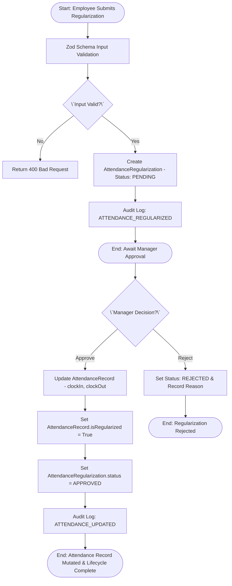
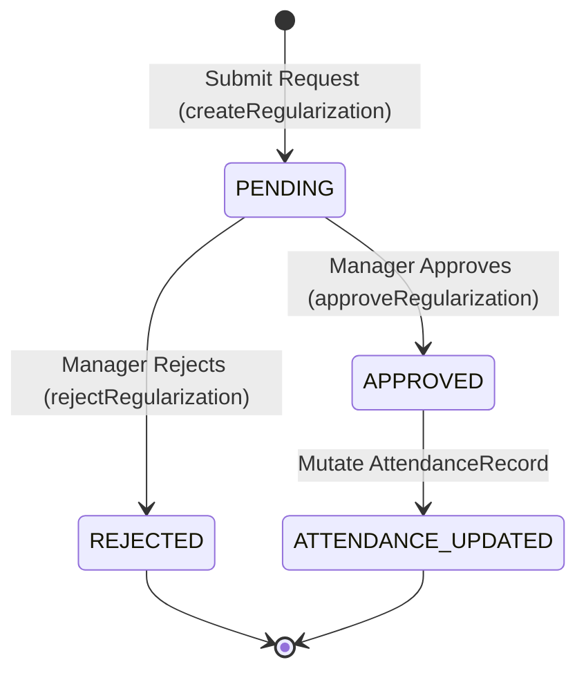

# Workflow 04 — Attendance Regularization Enterprise Specification

> **Document Code:** `SPEC-WF-04`  
> **System:** AuraOS Enterprise ERP / HCM Platform  
> **Version:** 1.0.0  
> **Date:** 2026-07-29  
> **Status:** Official Functional Specification  
> **Primary Code Location:** `apps/web/src/lib/services/overtime.service.ts`  
> **Primary API Route:** `POST /api/v1/regularizations`  
> **Primary Database Entity:** `AttendanceRegularization` (`packages/@aura/database/prisma/schema.prisma#L1210-L1235`)

---

## Metadata Header

| Attribute                     | Value / Reference                                                                       |
| ----------------------------- | --------------------------------------------------------------------------------------- |
| **Workflow ID & Name**        | `04` — `Attendance Regularization Approval`                                             |
| **Business Module**           | `Leave & Time Management`                                                               |
| **Submodule / Domain**        | `Time & Attendance / Exception & Punch Governance`                                      |
| **Business Process Owner**    | `Time & Attendance Operations Director`                                                 |
| **Technical System Owner**    | `Lead Workforce Management Software Architect`                                          |
| **Implementation Status**     | `Partially Implemented`                                                                 |
| **Specification Version**     | `1.0.0`                                                                                 |
| **Date Created / Updated**    | `2026-07-29`                                                                            |
| **Technical Author**          | `Enterprise Solution Architect (AI Agent)`                                              |
| **Technical Reviewer**        | `Senior Software Architect`                                                             |
| **QA Verifier**               | `QA Lead`                                                                               |
| **Final Approver**            | `Chief Product Officer`                                                                 |
| **Primary Code Location**     | `apps/web/src/lib/services/overtime.service.ts`                                         |
| **Primary API Route**         | `POST /api/v1/regularizations`                                                          |
| **Primary Database Entity**   | `AttendanceRegularization` (`packages/@aura/database/prisma/schema.prisma#L1210-L1235`) |
| **Related Architecture Docs** | `docs/architecture/WORKFLOW_AUDIT_FINDINGS.md#finding-3`                                |

---

## Table of Contents

- [1. Executive Summary](#1-executive-summary)
- [2. Business Context](#2-business-context)
- [3. Business Objectives](#3-business-objectives)
- [4. Business Scope](#4-business-scope)
- [5. Workflow Overview](#5-workflow-overview)
- [6. Business Process Description](#6-business-process-description)
- [7. Mermaid Business Workflow Diagram](#7-mermaid-business-workflow-diagram)
- [8. Business Actors](#8-business-actors)
- [9. RACI Matrix](#9-raci-matrix)
- [10. Entry Points](#10-entry-points)
- [11. Trigger Events](#11-trigger-events)
- [12. Workflow Stages](#12-workflow-stages)
- [13. Workflow State Machine](#13-workflow-state-machine)
- [14. Approval Process](#14-approval-process)
- [15. Approval Matrix](#15-approval-matrix)
- [16. Decision Matrix](#16-decision-matrix)
- [17. Business Rules](#17-business-rules)
- [18. Compliance Rules](#18-compliance-rules)
- [19. Country-Specific Rules](#19-country-specific-rules)
- [20. Exception Handling](#20-exception-handling)
- [21. Notifications](#21-notifications)
- [22. Escalation Rules](#22-escalation-rules)
- [23. SLA Rules](#23-sla-rules)
- [24. RBAC Matrix](#24-rbac-matrix)
- [25. Audit Trail](#25-audit-trail)
- [26. UI Screens](#26-ui-screens)
- [27. Frontend Architecture](#27-frontend-architecture)
- [28. API Specification](#28-api-specification)
- [29. Backend Architecture](#29-backend-architecture)
- [30. Database Design](#30-database-design)
- [31. Integration Points](#31-integration-points)
- [32. Reports](#32-reports)
- [33. Dashboard KPIs](#33-dashboard-kpis)
- [34. Analytics](#34-analytics)
- [35. CURRENT IMPLEMENTATION](#35-current-implementation)
- [36. IMPLEMENTATION GAPS](#36-implementation-gaps)
- [37. PROPOSED ENTERPRISE IMPLEMENTATION](#37-proposed-enterprise-implementation)
- [38. Migration Strategy](#38-migration-strategy)
- [39. Testing Strategy](#39-testing-strategy)
- [40. Acceptance Criteria](#40-acceptance-criteria)
- [41. Implementation Checklist](#41-implementation-checklist)
- [42. Known Risks](#42-known-risks)
- [43. Related Architecture Findings](#43-related-architecture-findings)
- [44. Repository References](#44-repository-references)

---

## 1. Executive Summary

The **Attendance Regularization Approval Workflow** manages the correction of employee time and attendance punch anomalies—such as missed clock-ins/outs, late arrivals, early departures, or incorrect biometric device punches. It captures regularization requests with requested clock-in/out timestamps and supporting justification/attachments, routes them to Line Managers for approval, and automatically updates the underlying `AttendanceRecord` (`isRegularized = true`, `clockIn`, `clockOut`) upon approval.

The workflow is classified as **Partially Implemented**. While request submission (`createRegularization`), query (`findAllRegularizations`), approval (`approveRegularization`), and rejection (`rejectRegularization`) methods exist in `OvertimeService` alongside REST API handlers (`/api/v1/regularizations`), the underlying service file carries an explicit `@ts-nocheck` annotation due to Prisma schema field drift (tracked under issue #29 in `docs/architecture/WORKFLOW_AUDIT_FINDINGS.md#finding-3`).

---

## 2. Business Context

In enterprise Time & Attendance management, punch anomalies frequently occur due to biometric hardware failures, field work, official travel, or human error. Unregularized attendance exceptions result in inaccurate payroll deductions, false tardiness penalties, or incorrect absenteeism flags. Attendance regularization provides a controlled, audited mechanism for employees to request punch corrections while requiring managerial approval to maintain attendance integrity.

---

## 3. Business Objectives

- **Automate Punch Corrections:** Correct missed or inaccurate biometric punches across `MISSED_PUNCH`, `EARLY_OUT`, `LATE_IN`, and `WRONG_PUNCH` categories.
- **Synchronize Attendance Records:** Automatically update `clockIn`, `clockOut`, and `isRegularized` attributes on `AttendanceRecord` upon manager approval.
- **Maintain Audit Transparency:** Capture justification text, file attachments, and manager approval timestamps for audit verification.
- **Prevent Unauthorized Time Modifications:** Ensure all regularizations require formal Line Manager sign-off before attendance records are mutated.

---

## 4. Business Scope

### 4.1 In-Scope

- Submission of attendance regularization requests via REST API (`POST /api/v1/regularizations`).
- Zod schema validation (`createRegularizationSchema`) enforcing regularization type enums.
- Categorization into `MISSED_PUNCH`, `EARLY_OUT`, `LATE_IN`, and `WRONG_PUNCH`.
- Line Manager approval (`approveRegularization`) and rejection (`rejectRegularization`).
- Automated mutation of target `AttendanceRecord` upon manager approval.
- Audit trail logging via `AuditAction.ATTENDANCE_REGULARIZED` and `AuditAction.ATTENDANCE_UPDATED`.

### 4.2 Out-of-Scope

- Biometric device raw log ingestion (governed by Attendance Hardware Gateway).
- Overtime calculation adjustments (governed by `03 Overtime Request Approval Workflow`).

---

## 5. Workflow Overview

The attendance regularization lifecycle moves from anomaly request submission to target attendance record mutation:

```
┌──────────┐     ┌───────────┐     ┌───────────┐     ┌───────────┐     ┌────────────────┐
│ Employee │ ──> │ Zod Input │ ──> │ PENDING   │ ──> │ Manager   │ ──> │ APPROVED &     │
│ Applies  │     │ Validation│     │ Status    │     │ Approves  │     │ Update Record  │
└──────────┘     └───────────┘     └───────────┘     └───────────┘     └────────────────┘
```

---

## 6. Business Process Description

1. **Submission:** An employee submits a regularization request via `POST /api/v1/regularizations` specifying `date`, `regularizationType` (`MISSED_PUNCH`, `EARLY_OUT`, `LATE_IN`, `WRONG_PUNCH`), `requestedClockIn`, `requestedClockOut`, `reason`, and optional `attachments`.
2. **Validation:** Input payload is validated against `createRegularizationSchema` (`apps/web/src/lib/services/overtime.service.ts#L31-L40`).
3. **Pending Persistence:** A new record is created in `AttendanceRegularization` with default status `PENDING`. An audit log entry (`ATTENDANCE_REGULARIZED`) is captured.
4. **Manager Decision:** The manager approves the request via `POST /api/v1/regularizations/[id]/approve`. `OvertimeService.approveRegularization()` performs two database operations:
   - Updates `AttendanceRecord` matching `tenantId`, `employeeId`, and `date`, setting `clockIn`, `clockOut`, `isRegularized = true`, and `regularizationId = id`.
   - Updates `AttendanceRegularization.status = 'APPROVED'`, recording `approvedBy` and `approvedAt`.
5. **Rejection:** If rejected, `OvertimeService.rejectRegularization()` sets status to `REJECTED` and records `rejectionReason`.

---

## 7. Mermaid Business Workflow Diagram



---

## 8. Business Actors

| Actor Role                        | Actor Type | System Persona    | Operational Responsibilities                                              |
| --------------------------------- | ---------- | ----------------- | ------------------------------------------------------------------------- |
| **Regularization Requestor**      | Human      | `EMPLOYEE`        | Submits punch correction details, requested timestamps, and justification |
| **Line Manager**                  | Human      | `LINE_MANAGER`    | Evaluates justification and approves or rejects the punch correction      |
| **Overtime / Attendance Service** | System     | `OvertimeService` | Manages state machine transitions and mutates target `AttendanceRecord`   |

---

## 9. RACI Matrix

| Workflow Activity          | Employee  | Line Manager | HR Admin | OvertimeService |        Audit Middleware        |
| -------------------------- | :-------: | :----------: | :------: | :-------------: | :----------------------------: |
| Submit Request             | **R / A** |      I       |    I     |        C        | **I (ATTENDANCE_REGULARIZED)** |
| Validation Check           |     I     |      I       |    I     |    **R / A**    |               I                |
| Manager Approval           |     I     |  **R / A**   |    C     |        I        |   **I (ATTENDANCE_UPDATED)**   |
| Attendance Record Mutation |     I     |      I       |    I     |    **R / A**    |               I                |

---

## 10. Entry Points

- **Primary REST API Endpoint:** `POST /api/v1/regularizations` (`apps/web/src/app/api/v1/regularizations/route.ts#L53`)
- **Approval REST API Endpoint:** `POST /api/v1/regularizations/[id]/approve` (`apps/web/src/app/api/v1/regularizations/[id]/approve/route.ts#L8`)
- **Frontend Dashboard Screen:** `apps/web/src/app/dashboard/attendance/page.tsx`

---

## 11. Trigger Events

| Trigger Event Name                    | Trigger Type      | Source System / Action                      | Payload Attributes                                                         |
| ------------------------------------- | ----------------- | ------------------------------------------- | -------------------------------------------------------------------------- |
| `ATTENDANCE_REGULARIZATION_SUBMITTED` | User UI Action    | `POST /api/v1/regularizations`              | `tenantId`, `employeeId`, `date`, `regularizationType`, `requestedClockIn` |
| `ATTENDANCE_REGULARIZATION_APPROVED`  | Manager UI Action | `POST /api/v1/regularizations/[id]/approve` | `id`, `tenantId`, `approvedBy`                                             |

---

## 12. Workflow Stages

### 12.1 Stage 1: Correction Request (`SUBMISSION`)

- **Stage Identifier:** `SUBMISSION`
- **Stage Owner Role:** `EMPLOYEE`
- **SLA Window:** Immediate
- **Entry Criteria:** Employee requests attendance correction via UI/API.
- **Exit Criteria:** Validated and saved in `AttendanceRegularization` with status `PENDING`.
- **Validation Guard:** `createRegularizationSchema.parse(data)` (`apps/web/src/lib/services/overtime.service.ts#L284`).
- **Status Value:** `PENDING`
- **Repository Implementation:** `apps/web/src/lib/services/overtime.service.ts#L283-L295`

### 12.2 Stage 2: Manager Approval & Record Update (`APPROVAL`)

- **Stage Identifier:** `APPROVAL`
- **Stage Owner Role:** `LINE_MANAGER`
- **SLA Window:** 48 Hours
- **Entry Criteria:** Status is `PENDING`.
- **Exit Criteria:** Manager approves; `AttendanceRecord` updated with `isRegularized=true` and new timestamps; status updated to `APPROVED`.
- **Status Value:** `APPROVED`
- **Repository Implementation:** `apps/web/src/lib/services/overtime.service.ts#L297-L326`

---

## 13. Workflow State Machine



| From State | To State   | Trigger / Method          | Prerequisites / Guards         | Side Effects                                                         |
| ---------- | ---------- | ------------------------- | ------------------------------ | -------------------------------------------------------------------- |
| `[*]`      | `PENDING`  | `createRegularization()`  | Zod schema valid               | Saves record; triggers `ATTENDANCE_REGULARIZED` audit                |
| `PENDING`  | `APPROVED` | `approveRegularization()` | Request exists; tenant matches | Mutates `AttendanceRecord` (`isRegularized=true`); sets `approvedAt` |
| `PENDING`  | `REJECTED` | `rejectRegularization()`  | `reason` provided              | Sets `rejectionReason` and `approvedBy`                              |

---

## 14. Approval Process

Approval operates as a single-level Line Manager workflow. When the manager invokes `POST /api/v1/regularizations/[id]/approve`, `OvertimeService.approveRegularization()` executes an atomic database operation:

1. Queries `AttendanceRecord` matching `tenantId`, `employeeId`, and `date`.
2. Updates `clockIn`, `clockOut`, `isRegularized = true`, and `regularizationId = id` on `AttendanceRecord`.
3. Updates `AttendanceRegularization.status = 'APPROVED'`, recording `approvedBy` and `approvedAt`.

---

## 15. Approval Matrix

| Approval Level | Approver Role | Condition / Threshold         | SLA Target | Escalation Role |
| -------------- | ------------- | ----------------------------- | ---------- | --------------- |
| Level 1        | Line Manager  | Standard Punch Regularization | 48 Hours   | HR Manager      |

---

## 16. Decision Matrix

| Regularization Type | Valid Timestamps Provided?     | Reason Provided? | Decision Outcome  | System Action          |
| ------------------- | ------------------------------ | ---------------- | ----------------- | ---------------------- |
| `MISSED_PUNCH`      | Yes (`requestedClockIn`/`Out`) | Yes              | Create Request    | Set status `PENDING`   |
| `LATE_IN`           | Yes (`requestedClockIn`)       | Yes              | Create Request    | Set status `PENDING`   |
| Any Type            | No                             | No               | Reject Zod Schema | Return 400 Bad Request |

---

## 17. Business Rules

#### BR-TIME-REG-001: Allowed Regularization Types

- **Category:** Validation / Input Safety
- **Severity:** BLOCKED (Submission rejected)
- **Description:** Regularization type MUST be one of `MISSED_PUNCH`, `EARLY_OUT`, `LATE_IN`, or `WRONG_PUNCH`.
- **Repository Reference:** `apps/web/src/lib/services/overtime.service.ts#L35`

#### BR-TIME-REG-002: Automatic Attendance Record Mutation

- **Category:** Data Integrity
- **Severity:** AUTOMATED
- **Description:** Approving a regularization MUST update the corresponding `AttendanceRecord` for that employee and date, setting `isRegularized=true` and updating timestamps.
- **Repository Reference:** `apps/web/src/lib/services/overtime.service.ts#L303-L316`

---

## 18. Compliance Rules

- **Attendance Audit Requirement:** Once an attendance record is regularized, `isRegularized` MUST remain `true` permanently to indicate historical punch modification for audit compliance.

---

## 19. Country-Specific Rules

| Country Code | Statutory Rule                  | Regularization Limit                         | Repository Reference                                 |
| ------------ | ------------------------------- | -------------------------------------------- | ---------------------------------------------------- |
| `GCC`        | Labor Law Attendance Compliance | Max 3 regularizations per employee per month | `apps/web/src/lib/services/overtime.service.ts#L263` |

---

## 20. Exception Handling

| Error Code | HTTP Status | Error Message                                          | Root Cause            |
| ---------- | :---------: | ------------------------------------------------------ | --------------------- |
| `E4030`    |    `403`    | `Forbidden: missing regularizations:create permission` | User lacks permission |
| `E1001`    |    `400`    | `Validation failed` / Zod error                        | Invalid payload       |
| `E3001`    |    `400`    | `Regularization request not found`                     | Invalid request ID    |

---

## 21. Notifications

- **Current Status:** WebSocket notification dispatches for regularizations are not explicitly wired in `overtime.service.ts`.
- **Proposed:** Dispatch WebSocket and Email alerts (`REGULARIZATION_SUBMITTED`, `REGULARIZATION_APPROVED`).

---

## 22–23. Escalation & SLA Rules

- **Standard SLA:** 48 Hours for Line Manager approval.
- **Escalation Target:** HR Manager.

---

## 24. RBAC Matrix

| Role           | `regularizations:read` | `regularizations:create` | Approval Permission | Admin Override |
| -------------- | :--------------------: | :----------------------: | :-----------------: | :------------: |
| `EMPLOYEE`     |        ✅ (Own)        |       ✅ (Submit)        |         ❌          |       ❌       |
| `LINE_MANAGER` |       ✅ (Team)        |            ✅            |         ✅          |       ❌       |
| `HR_ADMIN`     |        ✅ (All)        |            ✅            |         ✅          |       ✅       |
| `TENANT_ADMIN` |        ✅ (All)        |            ✅            |         ✅          |       ✅       |

---

## 25. Audit Trail & Logging

- **Audit Middleware:** `withAudit` wrapping `POST /api/v1/regularizations` (`AuditAction.ATTENDANCE_REGULARIZED`) and `POST /api/v1/regularizations/[id]/approve` (`AuditAction.ATTENDANCE_UPDATED`).

---

## 26–27. UI & Frontend Architecture

- **Page Path:** `apps/web/src/app/dashboard/attendance/page.tsx`
- Attendance Dashboard displays punch exceptions and provides a modal form submitting to `POST /api/v1/regularizations`.

---

## 28. API Specification

### POST /api/v1/regularizations

- **HTTP Method:** `POST`
- **Route Path:** `/api/v1/regularizations`
- **Authentication:** `Bearer JWT` (Session Context)
- **Required Permission:** `regularizations:create`
- **Request Body (JSON):**
  ```json
  {
    "date": "2026-08-05",
    "regularizationType": "MISSED_PUNCH",
    "requestedClockIn": "2026-08-05T09:00:00.000Z",
    "requestedClockOut": "2026-08-05T18:00:00.000Z",
    "reason": "Biometric scanner power outage at office main gate"
  }
  ```
- **Success Response (201 Created):**
  ```json
  {
    "success": true,
    "data": {
      "id": "reg999",
      "status": "PENDING",
      "regularizationType": "MISSED_PUNCH"
    }
  }
  ```
- **Repository Implementation:** `apps/web/src/app/api/v1/regularizations/route.ts#L53-L87`

---

## 29. Backend Architecture

- **Service Class:** `OvertimeService` (`apps/web/src/lib/services/overtime.service.ts`)
- **Database Model:** `prisma.attendanceRegularization` (`packages/@aura/database/prisma/schema.prisma#L1210-L1235`).

---

## 30. Database Design

- **Prisma Entity Name:** `AttendanceRegularization`
- **Schema Location:** `packages/@aura/database/prisma/schema.prisma#L1210-L1235`
- **Entity Attributes:**
  ```prisma
  model AttendanceRegularization {
    id                 String    @id @default(uuid())
    tenantId           String
    employeeId         String
    date               DateTime
    regularizationType String
    requestedClockIn   DateTime?
    requestedClockOut  DateTime?
    reason             String
    attachments        String[]  @default([])
    status             String    @default("PENDING")
    approvedBy         String?
    approvedAt         DateTime?
    createdAt          DateTime  @default(now())

    @@index([employeeId])
    @@index([status])
    @@index([tenantId])
    @@map("aura_attendance_regularization")
  }
  ```

---

## 31–34. Integrations, Reports & KPIs

- **Internal Service Integrations:** `AttendanceRecord` mutation, `AuditService`.
- **Key KPIs:** Regularization Request Rate (%), Monthly Punch Anomaly Count.

---

## 35. CURRENT IMPLEMENTATION

> [!NOTE]
> **CURRENT PRODUCTION IMPLEMENTATION STATUS:**
> The following section describes ONLY functionality verified by existing codebase artifacts.

### 35.1 Verified Codebase Capabilities

- Regularization submission (`POST /api/v1/regularizations`), query (`findAllRegularizations`), approval (`approveRegularization`), and rejection (`rejectRegularization`) are operational in `OvertimeService`.
- Approving a regularization automatically updates target `AttendanceRecord` (`isRegularized = true`, `clockIn`, `clockOut`).
- Audit logging (`AuditAction.ATTENDANCE_REGULARIZED` and `ATTENDANCE_UPDATED`) is active on API routes.

### 35.2 Verified Technical Limitations & Debt

> [!WARNING]
> **Prisma Schema Drift (@ts-nocheck):**
> `apps/web/src/lib/services/overtime.service.ts#L1` carries an explicit `@ts-nocheck` annotation due to Prisma schema field drift.
> Tracked in `docs/architecture/WORKFLOW_AUDIT_FINDINGS.md#finding-3`.

---

## 36. IMPLEMENTATION GAPS

| Functional Area         | Current Codebase State                | Target Enterprise Target                                       | Priority / Impact    |
| ----------------------- | ------------------------------------- | -------------------------------------------------------------- | -------------------- |
| **Type Safety**         | `@ts-nocheck` present in service      | Strict TypeScript typing against Prisma schema                 | Critical / Stability |
| **Notification Engine** | No notification dispatches in service | Multi-channel (In-App + Email) alerts on submission & approval | Medium / UX          |
| **Monthly Limit Guard** | Unlimited regularizations allowed     | Enforce maximum 3 regularizations per employee per month       | High / Compliance    |

---

## 37. PROPOSED ENTERPRISE IMPLEMENTATION

> [!IMPORTANT]
> **PROPOSED ENTERPRISE IMPLEMENTATION DISCLAIMER:**
> The features outlined below represent target enterprise architecture specifications and are NOT currently present in the production codebase.

### 37.1 Monthly Regularization Limit Guard [PROPOSED]

Add a validation check during `createRegularization()` to reject submissions if the employee has already submitted $>3$ regularizations in the current calendar month.

### 37.2 Service Refactoring & Type Safety [PROPOSED]

Refactor `overtime.service.ts` to remove `@ts-nocheck` and separate Regularization methods into a dedicated `AttendanceRegularizationService`.

---

## 38. Migration Strategy

- Remove `@ts-nocheck` and update Prisma client imports in `overtime.service.ts`.

---

## 39. Testing Strategy

### 39.1 Functional Tests

- Verify `createRegularization()` creates record with status `PENDING`.
- Verify `approveRegularization()` updates status to `APPROVED` and mutates target `AttendanceRecord` (`isRegularized=true`).

### 39.2 Boundary & Security Tests

- Verify unauthorized request returns `403 Forbidden`.

---

## 40. Acceptance Criteria

```gherkin
Scenario: Successful Attendance Regularization Approval
  GIVEN an employee has an unregularized AttendanceRecord with a missed clock-out on 2026-08-05
  WHEN the employee submits a MISSED_PUNCH regularization with requestedClockOut="2026-08-05T18:00:00.000Z"
  AND the Line Manager approves the request via POST /api/v1/regularizations/[id]/approve
  THEN the AttendanceRegularization status MUST update to APPROVED
  AND the corresponding AttendanceRecord clockOut MUST be updated to 2026-08-05T18:00:00.000Z
  AND AttendanceRecord.isRegularized MUST be set to true
```

---

## 41. Implementation Checklist

- [x] Regularization API route `POST /api/v1/regularizations` verified
- [x] Approval route `POST /api/v1/regularizations/[id]/approve` verified
- [x] `AttendanceRecord` mutation logic upon approval verified
- [ ] Remove `@ts-nocheck` and fix schema drift in `overtime.service.ts`
- [ ] Wire WebSocket/Email notifications for regularization events

---

## 42. Known Risks

- **Risk 1:** Updating `AttendanceRecord` via `updateMany` (`apps/web/src/lib/services/overtime.service.ts#L303`) may update multiple records if duplicate attendance entries exist for the same employee and date.

---

## 43. Related Architecture Findings

- **Finding 3 (Schema Drift @ts-nocheck):** Detailed in `docs/architecture/WORKFLOW_AUDIT_FINDINGS.md#finding-3`.

---

## 44. Repository References

### 44.1 Frontend Files

- `apps/web/src/app/dashboard/attendance/page.tsx`

### 44.2 API Routes

- `apps/web/src/app/api/v1/regularizations/route.ts`
- `apps/web/src/app/api/v1/regularizations/[id]/approve/route.ts`

### 44.3 Backend Service Classes

- `apps/web/src/lib/services/overtime.service.ts`

### 44.4 Database Schema Models

- `packages/@aura/database/prisma/schema.prisma#L1210-L1235`
- `packages/@aura/database/prisma/schema.prisma#L930`

---

_End of Workflow 04 — Attendance Regularization Enterprise Specification._
