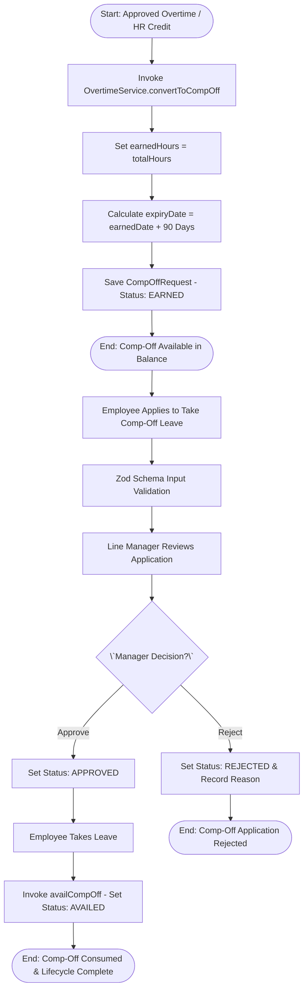
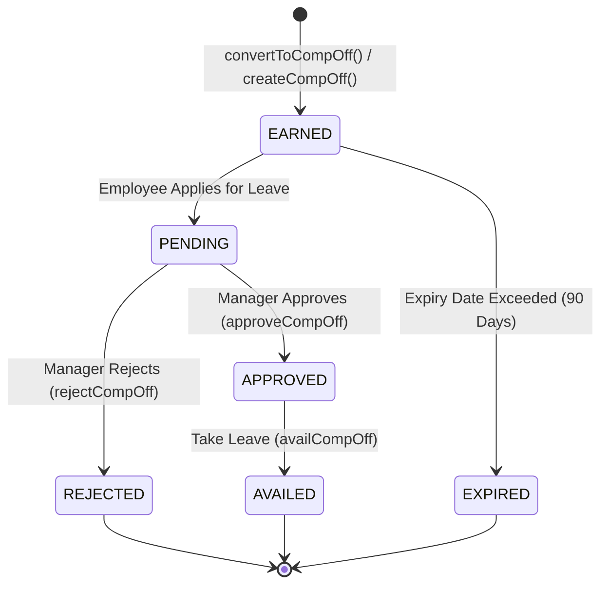

# Workflow 05 — Comp-Off Generation & Application Enterprise Specification

> **Document Code:** `SPEC-WF-05`  
> **System:** AuraOS Enterprise ERP / HCM Platform  
> **Version:** 1.0.0  
> **Date:** 2026-07-29  
> **Status:** Official Functional Specification  
> **Primary Code Location:** `apps/web/src/lib/services/overtime.service.ts`  
> **Primary API Route:** `POST /api/v1/comp-offs`  
> **Primary Database Entity:** `CompOffRequest` (`packages/@aura/database/prisma/schema.prisma#L1237-L1261`)

---

## Metadata Header

| Attribute                     | Value / Reference                                                             |
| ----------------------------- | ----------------------------------------------------------------------------- |
| **Workflow ID & Name**        | `05` — `Comp-Off Generation & Application Workflow`                           |
| **Business Module**           | `Leave & Time Management`                                                     |
| **Submodule / Domain**        | `Compensatory Time Off & Overtime Credit`                                     |
| **Business Process Owner**    | `Time & Attendance Operations Director`                                       |
| **Technical System Owner**    | `Lead Workforce Management Software Architect`                                |
| **Implementation Status**     | `Partially Implemented`                                                       |
| **Specification Version**     | `1.0.0`                                                                       |
| **Date Created / Updated**    | `2026-07-29`                                                                  |
| **Technical Author**          | `Enterprise Solution Architect (AI Agent)`                                    |
| **Technical Reviewer**        | `Senior Software Architect`                                                   |
| **QA Verifier**               | `QA Lead`                                                                     |
| **Final Approver**            | `Chief Product Officer`                                                       |
| **Primary Code Location**     | `apps/web/src/lib/services/overtime.service.ts`                               |
| **Primary API Route**         | `POST /api/v1/comp-offs`                                                      |
| **Primary Database Entity**   | `CompOffRequest` (`packages/@aura/database/prisma/schema.prisma#L1237-L1261`) |
| **Related Architecture Docs** | `docs/architecture/WORKFLOW_AUDIT_FINDINGS.md#finding-3`                      |

---

## Table of Contents

- [1. Executive Summary](#1-executive-summary)
- [2. Business Context](#2-business-context)
- [3. Business Objectives](#3-business-objectives)
- [4. Business Scope](#4-business-scope)
- [5. Workflow Overview](#5-workflow-overview)
- [6. Business Process Description](#6-business-process-description)
- [7. Mermaid Business Workflow Diagram](#7-mermaid-business-workflow-diagram)
- [8. Business Actors](#8-business-actors)
- [9. RACI Matrix](#9-raci-matrix)
- [10. Entry Points](#10-entry-points)
- [11. Trigger Events](#11-trigger-events)
- [12. Workflow Stages](#12-workflow-stages)
- [13. Workflow State Machine](#13-workflow-state-machine)
- [14. Approval Process](#14-approval-process)
- [15. Approval Matrix](#15-approval-matrix)
- [16. Decision Matrix](#16-decision-matrix)
- [17. Business Rules](#17-business-rules)
- [18. Compliance Rules](#18-compliance-rules)
- [19. Country-Specific Rules](#19-country-specific-rules)
- [20. Exception Handling](#20-exception-handling)
- [21. Notifications](#21-notifications)
- [22. Escalation Rules](#22-escalation-rules)
- [23. SLA Rules](#23-sla-rules)
- [24. RBAC Matrix](#24-rbac-matrix)
- [25. Audit Trail](#25-audit-trail)
- [26. UI Screens](#26-ui-screens)
- [27. Frontend Architecture](#27-frontend-architecture)
- [28. API Specification](#28-api-specification)
- [29. Backend Architecture](#29-backend-architecture)
- [30. Database Design](#30-database-design)
- [31. Integration Points](#31-integration-points)
- [32. Reports](#32-reports)
- [33. Dashboard KPIs](#33-dashboard-kpis)
- [34. Analytics](#34-analytics)
- [35. CURRENT IMPLEMENTATION](#35-current-implementation)
- [36. IMPLEMENTATION GAPS](#36-implementation-gaps)
- [37. PROPOSED ENTERPRISE IMPLEMENTATION](#37-proposed-enterprise-implementation)
- [38. Migration Strategy](#38-migration-strategy)
- [39. Testing Strategy](#39-testing-strategy)
- [40. Acceptance Criteria](#40-acceptance-criteria)
- [41. Implementation Checklist](#41-implementation-checklist)
- [42. Known Risks](#42-known-risks)
- [43. Related Architecture Findings](#43-related-architecture-findings)
- [44. Repository References](#44-repository-references)

---

## 1. Executive Summary

The **Comp-Off Generation & Application Workflow** governs the creation, approval, and availing of compensatory time off in AuraOS. Comp-Off allows employees to earn time-off credits in lieu of worked overtime hours or weekend shifts. The workflow manages two distinct business sub-processes:

1. **Comp-Off Credit Generation:** Automatically generated from approved overtime (`OvertimeService.convertToCompOff`) or manually credited by HR (`createCompOff`).
2. **Comp-Off Application & Availing:** Employees apply to take earned Comp-Off leave, which transitions through manager approval to final `AVAILED` status.

The workflow is classified as **Partially Implemented**. While core methods (`convertToCompOff`, `findAllCompOffs`, `createCompOff`, `approveCompOff`, `rejectCompOff`, `availCompOff`) exist in `OvertimeService`, the service file carries an explicit `@ts-nocheck` annotation due to Prisma schema field drift (tracked under issue #29 in `docs/architecture/WORKFLOW_AUDIT_FINDINGS.md#finding-3`).

---

## 2. Business Context

Compensatory off is an essential workforce management tool in enterprises operating shift schedules, weekend deployments, or peak-period overtime. Instead of disbursing direct cash overtime premiums, companies credit employees with earned paid time off. To protect against unearned leave accrual and liability accumulation, Comp-Off credits must carry strict 90-day expiry windows, require manager approval before usage, and automatically lapse upon expiration.

---

## 3. Business Objectives

- **Automate Credit Generation:** Convert approved overtime hours into earned Comp-Off credits (`status = 'EARNED'`).
- **Enforce 90-Day Validity:** Set `expiryDate` to exactly 3 months (90 days) from the earned date (`overtimeDate`).
- **Manage Usage Lifecycle:** Require Line Manager approval for taking Comp-Off leave and transition status to `AVAILED` upon consumption.
- **Prevent Expired Credit Usage:** Automatically lapse unavailed Comp-Off credits once `expiryDate` is breached.

---

## 4. Business Scope

### 4.1 In-Scope

- Automated creation of Comp-Off credits from approved overtime (`OvertimeService.convertToCompOff`).
- Manual HR credit creation via REST API (`POST /api/v1/comp-offs`).
- Zod schema validation (`createCompOffSchema`).
- Manager approval (`approveCompOff`) and rejection (`rejectCompOff`).
- Marking Comp-Off as consumed (`availCompOff`).

### 4.2 Out-of-Scope

- Cash encashment of unused Comp-Off credits (governed by `02 Leave Encashment Workflow`).
- Shift swap credit adjustments (governed by `06 Shift Swap Workflow`).

---

## 5. Workflow Overview

The Comp-Off lifecycle spans credit earning, approval, usage application, and final consumption or expiration:

```
┌───────────┐     ┌───────────┐     ┌───────────┐     ┌───────────┐     ┌───────────┐
│ Overtime  │ ──> │ Comp-Off  │ ──> │ Employee  │ ──> │ Manager   │ ──> │ Status:   │
│ Approved  │     │ EARNED    │     │ Applies   │     │ Approves  │     │ AVAILED   │
└───────────┘     └───────────┘     └───────────┘     └───────────┘     └───────────┘
```

---

## 6. Business Process Description

1. **Generation:** When an overtime request is approved, `OvertimeService.convertToCompOff()` creates a `CompOffRequest` with status `EARNED`, setting `earnedHours = overtime.totalHours` and `expiryDate = overtimeDate + 3 months` (`apps/web/src/lib/services/overtime.service.ts#L162-L175`). Alternatively, HR creates a credit via `POST /api/v1/comp-offs`.
2. **Application:** An employee applies to avail earned Comp-Off hours on a target date (`appliedDate`).
3. **Manager Approval:** Line Manager evaluates the application. `OvertimeService.approveCompOff()` sets status to `APPROVED`.
4. **Consumption (Availing):** Upon taking the leave, `OvertimeService.availCompOff()` sets status to `AVAILED`.
5. **Expiration:** If `expiryDate` passes without status reaching `AVAILED`, the credit automatically lapses (`status = 'EXPIRED'`).

---

## 7. Mermaid Business Workflow Diagram



---

## 8. Business Actors

| Actor Role             | Actor Type | System Persona    | Operational Responsibilities                                                  |
| ---------------------- | ---------- | ----------------- | ----------------------------------------------------------------------------- |
| **Comp-Off Requestor** | Human      | `EMPLOYEE`        | Earns Comp-Off from overtime; applies to take Comp-Off leave                  |
| **Line Manager**       | Human      | `LINE_MANAGER`    | Approves or rejects Comp-Off leave applications                               |
| **HR Administrator**   | Human      | `HR_ADMIN`        | Manually credits Comp-Off or overrides expired credits                        |
| **Overtime Service**   | System     | `OvertimeService` | Manages credit creation, 90-day expiry calculation, and `AVAILED` transitions |

---

## 9. RACI Matrix

| Workflow Activity          | Employee | Line Manager | HR Admin  | OvertimeService | Prisma DB |
| -------------------------- | :------: | :----------: | :-------: | :-------------: | :-------: |
| Overtime Credit Conversion |    I     |      I       |     C     |    **R / A**    |     C     |
| Manual Credit Creation     |    I     |      I       | **R / A** |        C        |     C     |
| Usage Approval             |    I     |  **R / A**   |     C     |        I        |     C     |
| Mark Availed               |  **R**   |      I       |     I     |      **A**      |     C     |

---

## 10. Entry Points

- **Primary REST API Endpoint:** `POST /api/v1/comp-offs` (`apps/web/src/app/api/v1/comp-offs/route.ts#L51`)
- **Frontend Dashboard Screen:** `apps/web/src/app/dashboard/overtime/page.tsx`

---

## 11. Trigger Events

| Trigger Event Name | Trigger Type        | Source System / Action               | Payload Attributes                                                  |
| ------------------ | ------------------- | ------------------------------------ | ------------------------------------------------------------------- |
| `COMP_OFF_EARNED`  | Overtime Conversion | `OvertimeService.convertToCompOff()` | `tenantId`, `employeeId`, `earnedDate`, `earnedHours`, `expiryDate` |
| `COMP_OFF_APPLIED` | User UI Action      | `POST /api/v1/comp-offs`             | `tenantId`, `employeeId`, `appliedDate`, `earnedHours`              |
| `COMP_OFF_AVAILED` | User Action         | `OvertimeService.availCompOff()`     | `id`, `tenantId`                                                    |

---

## 12. Workflow Stages

### 12.1 Stage 1: Credit Accrual (`EARNED`)

- **Stage Identifier:** `EARNED`
- **Stage Owner Role:** `OvertimeService` (System)
- **SLA Window:** Immediate
- **Entry Criteria:** Overtime request approved with `compensationType = COMP_OFF`.
- **Exit Criteria:** `CompOffRequest` saved with `status = 'EARNED'` and `expiryDate = earnedDate + 90 days`.
- **Status Value:** `EARNED`
- **Repository Implementation:** `apps/web/src/lib/services/overtime.service.ts#L165-L175`

### 12.2 Stage 2: Usage Application & Approval (`APPROVAL`)

- **Stage Identifier:** `APPROVAL`
- **Stage Owner Role:** `LINE_MANAGER`
- **SLA Window:** 48 Hours
- **Entry Criteria:** Employee applies to take earned Comp-Off.
- **Exit Criteria:** Manager approves; status updated to `APPROVED`.
- **Status Value:** `APPROVED`
- **Repository Implementation:** `apps/web/src/lib/services/overtime.service.ts#L219-L232`

### 12.3 Stage 3: Consumption (`AVAILED`)

- **Stage Identifier:** `AVAILED`
- **Stage Owner Role:** `EMPLOYEE` / `OvertimeService`
- **SLA Window:** On Leave Date
- **Entry Criteria:** Status is `APPROVED` and leave date is reached.
- **Exit Criteria:** `availCompOff()` sets status to `AVAILED`.
- **Status Value:** `AVAILED`
- **Repository Implementation:** `apps/web/src/lib/services/overtime.service.ts#L250-L259`

---

## 13. Workflow State Machine



| From State | To State   | Trigger / Method       | Prerequisites / Guards                 | Side Effects                              |
| ---------- | ---------- | ---------------------- | -------------------------------------- | ----------------------------------------- |
| `[*]`      | `EARNED`   | `convertToCompOff()`   | Overtime status is `APPROVED`          | Sets `expiryDate = earnedDate + 3 months` |
| `EARNED`   | `APPROVED` | `approveCompOff()`     | Credit exists; not expired             | Sets `approvedAt` and `approvedBy`        |
| `APPROVED` | `AVAILED`  | `availCompOff()`       | Status is `APPROVED`                   | Updates status to `AVAILED`               |
| `EARNED`   | `EXPIRED`  | Expiry Cron [PROPOSED] | `now > expiryDate` and status `EARNED` | Sets status to `EXPIRED`                  |

---

## 14. Approval Process

Approval operates as a single-level Line Manager process. When an employee applies to consume earned Comp-Off hours, the request enters `PENDING` status. Manager approval (`approveCompOff`) verifies credit validity and updates status to `APPROVED`. Upon taking the leave, `availCompOff` updates status to `AVAILED`.

---

## 15. Approval Matrix

| Approval Level | Approver Role | Condition / Limit                 | SLA Target | Escalation Role |
| -------------- | ------------- | --------------------------------- | ---------- | --------------- |
| Level 1        | Line Manager  | Comp-Off Application $\le 2$ Days | 48 Hours   | HR Manager      |

---

## 16. Decision Matrix

| Credit Status | Expiry Date Exceeded?     | Decision Outcome        | Target Status | System Response     |
| ------------- | ------------------------- | ----------------------- | ------------- | ------------------- |
| `EARNED`      | No (`now < expiryDate`)   | Allow Usage Application | `APPROVED`    | Proceed to approval |
| `EARNED`      | Yes (`now >= expiryDate`) | Expire Credit           | `EXPIRED`     | Reject application  |

---

## 17. Business Rules

#### BR-TIME-COMP-001: 90-Day Credit Validity Window

- **Category:** Expiry Constraint
- **Severity:** AUTOMATED
- **Description:** Comp-Off credits generated from overtime MUST set `expiryDate` to exactly 3 calendar months from `earnedDate`.
- **Repository Reference:** `apps/web/src/lib/services/overtime.service.ts#L162-L163`

#### BR-TIME-COMP-002: Availing Pre-Condition

- **Category:** State Machine Integrity
- **Severity:** BLOCKED (Action rejected)
- **Description:** Only Comp-Off requests in `APPROVED` status can be marked as `AVAILED`.
- **Error Message:** `"Only approved comp-offs can be availed"`
- **Repository Reference:** `apps/web/src/lib/services/overtime.service.ts#L253`

---

## 18. Compliance Rules

- **Non-Transferable Credits:** Comp-Off credits are strictly non-transferable between employees and non-cashable unless explicitly authorized by HR policy override.

---

## 19. Country-Specific Rules

| Country Code    | Statutory Rule   | Comp-Off Expiry Mandate                               | Repository Reference                                 |
| --------------- | ---------------- | ----------------------------------------------------- | ---------------------------------------------------- |
| `GCC` / `India` | Labor Compliance | Comp-Off must be availed within 60–90 days of earning | `apps/web/src/lib/services/overtime.service.ts#L163` |

---

## 20. Exception Handling

| Error Code | HTTP Status | Error Message                                    | Root Cause                                |
| ---------- | :---------: | ------------------------------------------------ | ----------------------------------------- |
| `E4030`    |    `403`    | `Forbidden: missing comp-offs:create permission` | User lacks permission                     |
| `E1001`    |    `400`    | `Validation failed`                              | Zod schema invalid                        |
| `E3001`    |    `400`    | `Only approved comp-offs can be availed`         | Attempting to avail non-APPROVED Comp-Off |

---

## 21. Notifications

- **Current Status:** Notification dispatch is not explicitly wired in `overtime.service.ts`.
- **Proposed:** Dispatch WebSocket and Email alerts upon credit earning (`COMP_OFF_EARNED`) and approval (`COMP_OFF_APPROVED`).

---

## 22–23. Escalation & SLA Rules

- **Standard SLA:** 48 Hours for manager usage approval.
- **Escalation Target:** HR Manager.

---

## 24. RBAC Matrix

| Role           | `comp-offs:read` | `comp-offs:create` | Approval Permission | Admin Override |
| -------------- | :--------------: | :----------------: | :-----------------: | :------------: |
| `EMPLOYEE`     |     ✅ (Own)     |     ✅ (Apply)     |         ❌          |       ❌       |
| `LINE_MANAGER` |    ✅ (Team)     |         ✅         |         ✅          |       ❌       |
| `HR_ADMIN`     |     ✅ (All)     |         ✅         |         ✅          |       ✅       |
| `TENANT_ADMIN` |     ✅ (All)     |         ✅         |         ✅          |       ✅       |

---

## 25. Audit Trail & Logging

- API route `POST /api/v1/comp-offs` returns metadata containing `timestamp`, `requestId`, and `apiVersion`.

---

## 26–27. UI & Frontend Architecture

- **Page Path:** `apps/web/src/app/dashboard/overtime/page.tsx`
- Dashboard displays available Comp-Off credits and expiry countdowns.

---

## 28. API Specification

### POST /api/v1/comp-offs

- **HTTP Method:** `POST`
- **Route Path:** `/api/v1/comp-offs`
- **Authentication:** `Bearer JWT` (Session Context)
- **Required Permission:** `comp-offs:create`
- **Request Body (JSON):**
  ```json
  {
    "employeeId": "emp123",
    "earnedDate": "2026-08-01",
    "earnedHours": 8,
    "expiryDate": "2026-11-01",
    "remarks": "Manual Comp-Off credit for weekend deployment"
  }
  ```
- **Success Response (201 Created):**
  ```json
  {
    "success": true,
    "data": {
      "id": "co999",
      "status": "EARNED",
      "earnedHours": 8
    }
  }
  ```
- **Repository Implementation:** `apps/web/src/app/api/v1/comp-offs/route.ts#L51-L78`

---

## 29. Backend Architecture

- **Service Class:** `OvertimeService` (`apps/web/src/lib/services/overtime.service.ts`)
- **Database Model:** `prisma.compOffRequest` (`packages/@aura/database/prisma/schema.prisma#L1237-L1261`).

---

## 30. Database Design

- **Prisma Entity Name:** `CompOffRequest`
- **Schema Location:** `packages/@aura/database/prisma/schema.prisma#L1237-L1261`
- **Entity Attributes:**
  ```prisma
  model CompOffRequest {
    id              String    @id @default(uuid())
    tenantId        String
    employeeId      String
    earnedDate      DateTime
    earnedHours     Float
    status          String    @default("EARNED")
    appliedDate     DateTime?
    expiryDate      DateTime
    approvedBy      String?
    approvedAt      DateTime?
    remarks         String?
    createdAt       DateTime  @default(now())

    @@index([employeeId])
    @@index([status])
    @@index([tenantId])
    @@map("aura_comp_off_request")
  }
  ```

---

## 31–34. Integrations, Reports & KPIs

- **Internal Service Integrations:** `OvertimeRequest` conversion, `LeaveBalance` integration.
- **Key KPIs:** Total Active Comp-Off Credit Hours, Expired Comp-Off Percentage (%).

---

## 35. CURRENT IMPLEMENTATION

> [!NOTE]
> **CURRENT PRODUCTION IMPLEMENTATION STATUS:**
> The following section describes ONLY functionality verified by existing codebase artifacts.

### 35.1 Verified Codebase Capabilities

- Overtime conversion (`convertToCompOff`), manual credit creation (`createCompOff`), query (`findAllCompOffs`), approval (`approveCompOff`), and availing (`availCompOff`) are implemented in `OvertimeService`.
- 90-day expiry calculation (`expiryDate.setMonth(expiryDate.getMonth() + 3)`) is functional.

### 35.2 Verified Technical Limitations & Debt

> [!WARNING]
> **Prisma Schema Drift (@ts-nocheck) & Missing Expiry Cron:**
>
> 1. `apps/web/src/lib/services/overtime.service.ts#L1` carries an explicit `@ts-nocheck` annotation due to Prisma schema field drift.
> 2. No automated background cron job exists in `packages/@aura/scheduler` to mark past-expiry Comp-Offs (`now > expiryDate`) as `EXPIRED`.
>    Tracked in `docs/architecture/WORKFLOW_AUDIT_FINDINGS.md#finding-3`.

---

## 36. IMPLEMENTATION GAPS

| Functional Area         | Current Codebase State           | Target Enterprise Target                                | Priority / Impact    |
| ----------------------- | -------------------------------- | ------------------------------------------------------- | -------------------- |
| **Type Safety**         | `@ts-nocheck` present in service | Strict TypeScript typing against Prisma schema          | Critical / Stability |
| **Automated Expiry**    | Manual status check only         | Nightly cron job in `@aura/scheduler` marking `EXPIRED` | High / Compliance    |
| **Notification Engine** | No notification dispatches       | Multi-channel alerts 14 days prior to Comp-Off expiry   | Medium / UX          |

---

## 37. PROPOSED ENTERPRISE IMPLEMENTATION

> [!IMPORTANT]
> **PROPOSED ENTERPRISE IMPLEMENTATION DISCLAIMER:**
> The features outlined below represent target enterprise architecture specifications and are NOT currently present in the production codebase.

### 37.1 Automated Nightly Comp-Off Expiry Cron [PROPOSED]

Configure a daily cron job in `@aura/scheduler` to query `CompOffRequest` where `status = 'EARNED'` and `expiryDate < now`, setting `status = 'EXPIRED'`.

### 37.2 Pre-Expiry Alert Notifications [PROPOSED]

Dispatch automated WebSocket and Email alerts to employees 14 days before Comp-Off credit expiry reminding them to apply for leave.

---

## 38. Migration Strategy

- Deploy the `@aura/scheduler` Comp-Off expiry job and run a data cleanup script for historical expired records.

---

## 39. Testing Strategy

### 39.1 Functional Tests

- Verify `convertToCompOff()` sets `expiryDate` to 3 months from `earnedDate`.
- Verify `availCompOff()` updates status from `APPROVED` to `AVAILED`.

### 39.2 Boundary Tests

- Verify `availCompOff()` on non-APPROVED Comp-Off throws error.

---

## 40. Acceptance Criteria

```gherkin
Scenario: Successful Comp-Off Credit Generation and Consumption
  GIVEN an employee has an approved OvertimeRequest of 8 hours on 2026-08-01
  WHEN convertToCompOff() is executed
  THEN a CompOffRequest MUST be created with status EARNED
  AND expiryDate MUST be set to 2026-11-01
  AND when availCompOff() is executed on an APPROVED application
  THEN the status MUST update to AVAILED
```

---

## 41. Implementation Checklist

- [x] Overtime conversion method `convertToCompOff()` verified
- [x] API endpoint `POST /api/v1/comp-offs` verified
- [x] Status transition to `AVAILED` verified in service
- [ ] Remove `@ts-nocheck` and fix schema drift in `overtime.service.ts`
- [ ] Configure nightly `@aura/scheduler` cron for Comp-Off expiry

---

## 42. Known Risks

- **Risk 1:** Unavailed Comp-Off credits may accumulate indefinitely on balance sheets if the automated expiry cron job is not deployed.

---

## 43. Related Architecture Findings

- **Finding 3 (Schema Drift @ts-nocheck):** Detailed in `docs/architecture/WORKFLOW_AUDIT_FINDINGS.md#finding-3`.

---

## 44. Repository References

### 44.1 Frontend Files

- `apps/web/src/app/dashboard/overtime/page.tsx`

### 44.2 API Routes

- `apps/web/src/app/api/v1/comp-offs/route.ts`

### 44.3 Backend Service Classes

- `apps/web/src/lib/services/overtime.service.ts`

### 44.4 Database Schema Models

- `packages/@aura/database/prisma/schema.prisma#L1237-L1261`

---

_End of Workflow 05 — Comp-Off Generation & Application Enterprise Specification._
