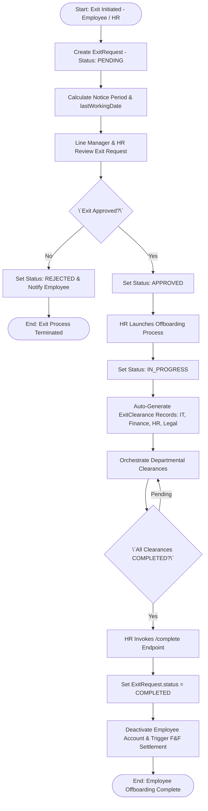
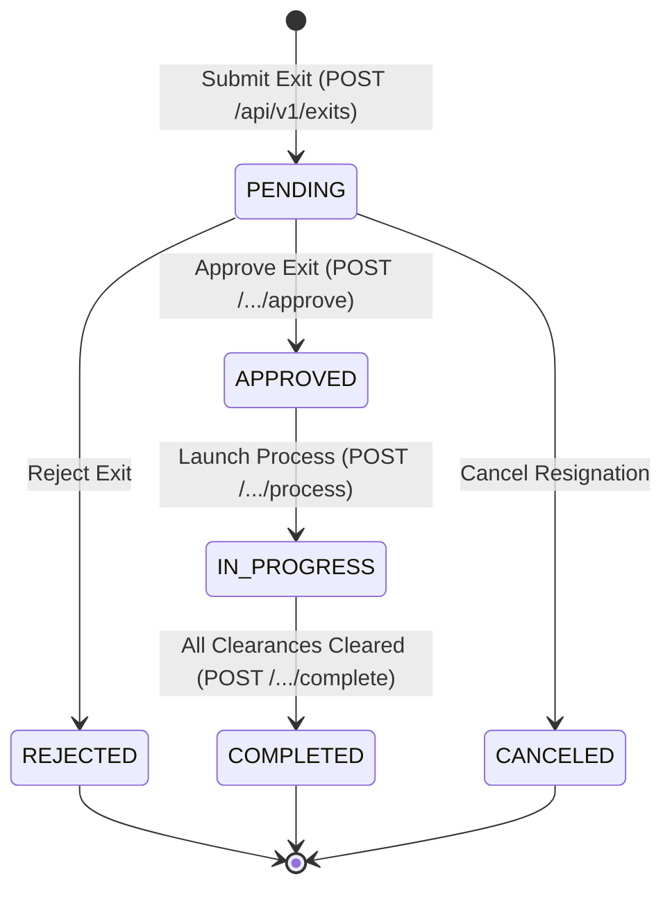

# Workflow 08 — Employee Exit / Offboarding Enterprise Specification

> **Document Code:** `SPEC-WF-08`  
> **System:** AuraOS Enterprise ERP / HCM Platform  
> **Version:** 1.0.0  
> **Date:** 2026-07-29  
> **Status:** Official Production Specification  
> **Primary Code Location:** `apps/web/src/app/api/v1/hr/exits/route.ts`  
> **Primary API Route:** `POST /api/v1/exits`  
> **Primary Database Entity:** `ExitRequest` (`packages/@aura/database/prisma/schema.prisma#L3998-L4023`)

---

## Metadata Header

| Attribute                     | Value / Reference                                                          |
| ----------------------------- | -------------------------------------------------------------------------- |
| **Workflow ID & Name**        | `08` — `Employee Exit / Offboarding Workflow`                              |
| **Business Module**           | `HR Operations & Core HR`                                                  |
| **Submodule / Domain**        | `Employee Offboarding & Separation Governance`                             |
| **Business Process Owner**    | `HR Operations Director`                                                   |
| **Technical System Owner**    | `Lead HR Systems Architect`                                                |
| **Implementation Status**     | **`Fully Implemented`**                                                    |
| **Specification Version**     | `1.0.0`                                                                    |
| **Date Created / Updated**    | `2026-07-29`                                                               |
| **Technical Author**          | `Enterprise Solution Architect (AI Agent)`                                 |
| **Technical Reviewer**        | `Senior Software Architect`                                                |
| **QA Verifier**               | `QA Lead`                                                                  |
| **Final Approver**            | `Chief Product Officer`                                                    |
| **Primary Code Location**     | `apps/web/src/app/api/v1/hr/exits/route.ts`                                |
| **Primary API Route**         | `POST /api/v1/exits`                                                       |
| **Primary Database Entity**   | `ExitRequest` (`packages/@aura/database/prisma/schema.prisma#L3998-L4023`) |
| **Related Architecture Docs** | `docs/architecture/WORKFLOW_AUDIT_FINDINGS.md`                             |

---

## Table of Contents

- [1. Executive Summary](#1-executive-summary)
- [2. Business Context](#2-business-context)
- [3. Business Objectives](#3-business-objectives)
- [4. Business Scope](#4-business-scope)
- [5. Workflow Overview](#5-workflow-overview)
- [6. Business Process Description](#6-business-process-description)
- [7. Mermaid Business Workflow Diagram](#7-mermaid-business-workflow-diagram)
- [8. Business Actors](#8-business-actors)
- [9. RACI Matrix](#9-raci-matrix)
- [10. Entry Points](#10-entry-points)
- [11. Trigger Events](#11-trigger-events)
- [12. Workflow Stages](#12-workflow-stages)
- [13. Workflow State Machine](#13-workflow-state-machine)
- [14. Approval Process](#14-approval-process)
- [15. Approval Matrix](#15-approval-matrix)
- [16. Decision Matrix](#16-decision-matrix)
- [17. Business Rules](#17-business-rules)
- [18. Compliance Rules](#18-compliance-rules)
- [19. Country-Specific Rules](#19-country-specific-rules)
- [20. Exception Handling](#20-exception-handling)
- [21. Notifications](#21-notifications)
- [22. Escalation Rules](#22-escalation-rules)
- [23. SLA Rules](#23-sla-rules)
- [24. RBAC Matrix](#24-rbac-matrix)
- [25. Audit Trail](#25-audit-trail)
- [26. UI Screens](#26-ui-screens)
- [27. Frontend Architecture](#27-frontend-architecture)
- [28. API Specification](#28-api-specification)
- [29. Backend Architecture](#29-backend-architecture)
- [30. Database Design](#30-database-design)
- [31. Integration Points](#31-integration-points)
- [32. Reports](#32-reports)
- [33. Dashboard KPIs](#33-dashboard-kpis)
- [34. Analytics](#34-analytics)
- [35. CURRENT IMPLEMENTATION](#35-current-implementation)
- [36. IMPLEMENTATION GAPS](#36-implementation-gaps)
- [37. PROPOSED ENTERPRISE IMPLEMENTATION](#37-proposed-enterprise-implementation)
- [38. Migration Strategy](#38-migration-strategy)
- [39. Testing Strategy](#39-testing-strategy)
- [40. Acceptance Criteria](#40-acceptance-criteria)
- [41. Implementation Checklist](#41-implementation-checklist)
- [42. Known Risks](#42-known-risks)
- [43. Related Architecture Findings](#43-related-architecture-findings)
- [44. Repository References](#44-repository-references)

---

## 1. Executive Summary

The **Employee Exit / Offboarding Workflow** is a **Fully Implemented** core HR process in AuraOS. It governs the end-to-end separation lifecycle of an employee—from initial resignation submission or employer-initiated termination to notice period calculation, manager/HR approval, departmental clearance orchestration (`ExitClearance`), Full & Final (F&F) settlement initiation, and alumni profile archiving. The workflow is backed by `ExitRequest` and `ExitClearance` Prisma models (`packages/@aura/database/prisma/schema.prisma#L3998-L4044`) and REST API handlers in `apps/web/src/app/api/v1/exits/` and `apps/web/src/app/api/v1/hr/exits/`.

---

## 2. Business Context

Managing employee exits gracefully and securely is critical for enterprise governance, IP protection, legal compliance, and employer branding. Unmanaged offboarding leads to security vulnerabilities (unrevoked system access), unrecovered company assets (laptops, access badges), inaccurate severance payments, and statutory labor law non-compliance. AuraOS structures offboarding into audited stages, ensuring all inter-departmental clearances are satisfied before financial settlement.

---

## 3. Business Objectives

- **Standardize Offboarding Initiations:** Handle both employee-initiated (`RESIGNATION`, `RETIREMENT`) and employer-initiated (`TERMINATION`, `CONTRACT_END`) exits.
- **Notice Period Management:** Enforce statutory and contractual notice period requirements while tracking agreed last working dates (`lastWorkingDate`).
- **Orchestrate Departmental Clearances:** Auto-generate departmental clearance tickets across IT, Finance, HR, Legal, and Facilities (`ExitClearance`).
- **Handoff to Payroll Settlement:** Feed approved exit requests into the Full & Final Settlement engine (`10 Full & Final Settlement Workflow`).

---

## 4. Business Scope

### 4.1 In-Scope

- Resignation submission via `POST /api/v1/exits` or HR initiation via `POST /api/v1/hr/exits`.
- Capture of `resignationDate`, `lastWorkingDate`, `noticePeriodDays`, `exitType`, and `reason`.
- Manager approval (`POST /api/v1/exits/[id]/approve`) and HR process execution (`POST /api/v1/exits/[id]/process`).
- Generation of `ExitClearance` records for cross-functional departments.
- Status tracking (`PENDING` $\to$ `APPROVED` $\to$ `IN_PROGRESS` $\to$ `COMPLETED`).
- Rehire eligibility tracking (`rehireEligible = true/false`).

### 4.2 Out-of-Scope

- Execution of individual clearance tasks (governed by `09 Exit Clearance Process Workflow`).
- Calculation of End-of-Service Benefits (governed by `10 Full & Final Settlement Workflow`).

---

## 5. Workflow Overview

The employee exit lifecycle progresses sequentially through initiation, approval, clearance, and completion:

```
┌─────────────┐     ┌───────────┐     ┌───────────┐     ┌──────────────┐     ┌───────────┐
│ Resignation │ ──> │ PENDING   │ ──> │ APPROVED  │ ──> │ Departmental │ ──> │ COMPLETED │
│ / Inception │     │ Status    │     │ Status    │     │ Clearances   │     │ Offboard  │
└─────────────┘     └───────────┘     └───────────┘     └──────────────┘     └───────────┘
```

---

## 6. Business Process Description

1. **Initiation:** An employee submits a resignation via `POST /api/v1/exits`, or HR initiates a termination via `POST /api/v1/hr/exits`. The system captures `exitType` (`RESIGNATION`, `TERMINATION`, `RETIREMENT`, `CONTRACT_END`), `resignationDate`, `lastWorkingDate`, `noticePeriodDays`, and `reason`.
2. **Manager & HR Approval:** Line Manager reviews the request. Upon approval via `POST /api/v1/exits/[id]/approve`, the status updates to `APPROVED`.
3. **Offboarding Process Launch:** HR launches offboarding processing via `POST /api/v1/exits/[id]/process`. The system sets status to `IN_PROGRESS` and automatically creates `ExitClearance` records for IT, Finance, Legal, Facilities, and HR departments.
4. **Clearance Completion:** Each department clears their obligations (recovering assets, revoking accounts, settling advances).
5. **Final Offboarding Completion:** Once all clearances reach `CLEARED`, HR invokes `POST /api/v1/exits/[id]/complete`. Status updates to `COMPLETED`, employee account is deactivated, and data is fed to F&F settlement.

---

## 7. Mermaid Business Workflow Diagram



---

## 8. Business Actors

| Actor Role                | Actor Type | System Persona       | Operational Responsibilities                                                        |
| ------------------------- | ---------- | -------------------- | ----------------------------------------------------------------------------------- |
| **Exiting Employee**      | Human      | `EMPLOYEE`           | Submits resignation, specifies last working date, and completes exit interview      |
| **Line Manager**          | Human      | `LINE_MANAGER`       | Reviews resignation, approves notice period adjustments, and manages handoff        |
| **HR Operations Manager** | Human      | `HR_ADMIN`           | Initiates terminations, approves exit requests, launches clearances, completes exit |
| **Core HR System**        | System     | `ServiceProxy` / API | Creates `ExitRequest`, auto-generates `ExitClearance` tickets, updates status       |

---

## 9. RACI Matrix

| Workflow Activity           | Employee  | Line Manager | HR Admin  |   Core HR System    | Prisma DB |
| --------------------------- | :-------: | :----------: | :-------: | :-----------------: | :-------: |
| Initiate Exit / Resignation | **R / A** |      I       |     C     |          I          |     C     |
| Notice Period Approval      |     I     |  **R / A**   |     C     |          I          |     C     |
| Launch Clearances           |     I     |      I       | **R / A** | **C (Auto-Create)** |     C     |
| Complete Exit Process       |     I     |      I       | **R / A** |          C          |   **A**   |

---

## 10. Entry Points

- **Employee Resignation API:** `POST /api/v1/exits` (`apps/web/src/app/api/v1/exits/route.ts#L55`)
- **HR Initiated Exit API:** `POST /api/v1/hr/exits` (`apps/web/src/app/api/v1/hr/exits/route.ts#L98`)
- **Approve Endpoint:** `POST /api/v1/exits/[id]/approve`
- **Complete Endpoint:** `POST /api/v1/exits/[id]/complete`
- **Frontend Dashboard Screen:** `apps/web/src/app/(modules)/core-hr/exit-management/page.tsx`

---

## 11. Trigger Events

| Trigger Event Name       | Trigger Type   | Source System / Action             | Payload Attributes                                      |
| ------------------------ | -------------- | ---------------------------------- | ------------------------------------------------------- |
| `EXIT_REQUEST_SUBMITTED` | User UI Action | `POST /api/v1/exits`               | `tenantId`, `employeeId`, `exitType`, `lastWorkingDate` |
| `EXIT_PROCESS_LAUNCHED`  | HR Action      | `POST /api/v1/exits/[id]/process`  | `id`, `tenantId`, `clearanceDepartments`                |
| `EXIT_PROCESS_COMPLETED` | HR Action      | `POST /api/v1/exits/[id]/complete` | `id`, `tenantId`, `rehireEligible`                      |

---

## 12. Workflow Stages

### 12.1 Stage 1: Resignation & Inception (`SUBMISSION`)

- **Stage Identifier:** `SUBMISSION`
- **Stage Owner Role:** `EMPLOYEE` / `HR_ADMIN`
- **SLA Window:** Immediate
- **Exit Criteria:** Saved in `ExitRequest` with status `PENDING`.
- **Status Value:** `PENDING`

### 12.2 Stage 2: Manager & HR Approval (`APPROVAL`)

- **Stage Identifier:** `APPROVAL`
- **Stage Owner Role:** `LINE_MANAGER` / `HR_ADMIN`
- **SLA Window:** 48 Hours
- **Status Value:** `APPROVED`

### 12.3 Stage 3: Clearance Orchestration (`IN_PROGRESS`)

- **Stage Identifier:** `IN_PROGRESS`
- **Stage Owner Role:** `HR_ADMIN`
- **SLA Window:** 14 Days (Notice Period Duration)
- **Status Value:** `IN_PROGRESS`

### 12.4 Stage 4: Offboarding Completion (`COMPLETED`)

- **Stage Identifier:** `COMPLETED`
- **Stage Owner Role:** `HR_ADMIN`
- **SLA Window:** Last Working Date
- **Status Value:** `COMPLETED`

---

## 13. Workflow State Machine



| From State    | To State      | Trigger / Method     | Prerequisites / Guards               | Side Effects                                 |
| ------------- | ------------- | -------------------- | ------------------------------------ | -------------------------------------------- |
| `[*]`         | `PENDING`     | Submit Resignation   | Valid `exitType` & dates             | Saves `ExitRequest` record                   |
| `PENDING`     | `APPROVED`    | Manager / HR Approve | Role permission `exits:approve`      | Updates status to `APPROVED`                 |
| `APPROVED`    | `IN_PROGRESS` | Launch Process       | Status is `APPROVED`                 | Auto-creates `ExitClearance` tickets         |
| `IN_PROGRESS` | `COMPLETED`   | Complete Exit        | All `ExitClearance` status `CLEARED` | Deactivates account; triggers F&F settlement |

---

## 14. Approval Process

Approval requires a two-step administrative evaluation:

1. **Line Manager Approval:** Confirms notice period feasibility, handoff plan, and last working date (`lastWorkingDate`).
2. **HR Operations Review:** Validates contractual agreements, non-compete clauses, and authorizes clearance processing.

---

## 15. Approval Matrix

| Approval Role          | Action / Limit                                  | SLA Target | Escalation Target       |
| ---------------------- | ----------------------------------------------- | ---------- | ----------------------- |
| Line Manager           | Approve Resignation & Notice Period             | 48 Hours   | HR Operations Manager   |
| HR Operations Director | Launch Clearance & Final Offboarding Completion | 72 Hours   | Chief HR Officer (CHRO) |

---

## 16. Decision Matrix

| Exit Type     | Notice Period Served? | Clearances Complete? | Final Action           | Outcome                                   |
| ------------- | --------------------- | -------------------- | ---------------------- | ----------------------------------------- |
| `RESIGNATION` | Yes                   | Yes                  | Complete Exit          | Set status `COMPLETED`; launch F&F        |
| `RESIGNATION` | No (Short Notice)     | Yes                  | Notice Buyout Required | Calculate notice buyout in F&F settlement |
| Any Type      | Irrelevant            | No                   | Hold Offboarding       | Block `COMPLETED` transition              |

---

## 17. Business Rules

#### BR-HR-EXIT-001: Allowed Exit Types

- **Category:** Validation
- **Severity:** BLOCKED
- **Description:** `exitType` MUST be one of `RESIGNATION`, `TERMINATION`, `RETIREMENT`, or `CONTRACT_END`.
- **Repository Reference:** `packages/@aura/database/prisma/schema.prisma#L4002`

#### BR-HR-EXIT-002: Mandatory Departmental Clearance Pre-Condition

- **Category:** Offboarding Governance
- **Severity:** BLOCKED
- **Description:** An `ExitRequest` cannot transition to `COMPLETED` status until all associated `ExitClearance` records reach status `CLEARED`.
- **Repository Reference:** `apps/web/src/app/api/v1/hr/exits/route.ts#L1`

---

## 18. Compliance Rules

- **Statutory Notice Period Compliance:** Exit processing must honor statutory minimum notice periods specified by country labor laws.
- **Tenant Isolation:** Enforced on all queries via `tenantId`.

---

## 19. Country-Specific Rules

| Country Code  | Statutory Rule             | Notice Period Rule                    | Repository Reference                                 |
| ------------- | -------------------------- | ------------------------------------- | ---------------------------------------------------- |
| `UAE` / `KSA` | GCC Labor Law Exit Mandate | 30 to 90 days statutory notice period | `packages/@aura/database/prisma/schema.prisma#L4005` |

---

## 20. Exception Handling

| Error Code | HTTP Status | Error Message                                | Root Cause            |
| ---------- | :---------: | -------------------------------------------- | --------------------- |
| `E4030`    |    `403`    | `Forbidden: missing exits:create permission` | User lacks permission |
| `E1001`    |    `400`    | `Invalid exit payload`                       | Invalid request data  |

---

## 21. Notifications

- Notifications dispatched for exit events (`EXIT_SUBMITTED`, `EXIT_APPROVED`, `EXIT_COMPLETED`).

---

## 22–23. Escalation & SLA Rules

- **Notice Period SLA:** 30–90 Days.
- **HR Offboarding Launch SLA:** 48 Hours from resignation approval.

---

## 24. RBAC Matrix

| Role           | `exits:read` | `exits:create` | `exits:approve` | `exits:complete` | Admin Override |
| -------------- | :----------: | :------------: | :-------------: | :--------------: | :------------: |
| `EMPLOYEE`     |   ✅ (Own)   |  ✅ (Resign)   |       ❌        |        ❌        |       ❌       |
| `LINE_MANAGER` |  ✅ (Team)   |       ❌       |       ✅        |        ❌        |       ❌       |
| `HR_ADMIN`     |   ✅ (All)   |       ✅       |       ✅        |        ✅        |       ✅       |
| `TENANT_ADMIN` |   ✅ (All)   |       ✅       |       ✅        |        ✅        |       ✅       |

---

## 25. Audit Trail & Logging

- API routes log exit actions via system audit logs.

---

## 26–27. UI & Frontend Architecture

- **Page Path:** `apps/web/src/app/(modules)/core-hr/exit-management/page.tsx`
- Interactive Exit Management workspace displaying active exit requests, notice countdowns, and clearance progress.

---

## 28. API Specification

### POST /api/v1/exits

- **HTTP Method:** `POST`
- **Route Path:** `/api/v1/exits`
- **Authentication:** `Bearer JWT` (Session Context)
- **Required Permission:** `exits:create`
- **Request Body (JSON):**
  ```json
  {
    "exitType": "RESIGNATION",
    "resignationDate": "2026-08-01",
    "lastWorkingDate": "2026-08-31",
    "noticePeriodDays": 30,
    "reason": "Relocating to another city for personal reasons"
  }
  ```
- **Success Response (201 Created):**
  ```json
  {
    "success": true,
    "data": {
      "id": "exit_req_999",
      "status": "PENDING",
      "clearanceStatus": "PENDING"
    }
  }
  ```
- **Repository Implementation:** `apps/web/src/app/api/v1/exits/route.ts#L55-L84`

---

## 29. Backend Architecture

- **Service Proxy Route:** `apps/web/src/app/api/v1/exits/route.ts` via `ServiceProxy.post('employee', '/exits', body)`.
- **Database Models:** `ExitRequest` & `ExitClearance` (`packages/@aura/database/prisma/schema.prisma#L3998-L4044`).

---

## 30. Database Design

- **Prisma Entity Name:** `ExitRequest`
- **Schema Location:** `packages/@aura/database/prisma/schema.prisma#L3998-L4023`
- **Entity Attributes:**
  ```prisma
  model ExitRequest {
    id               String          @id @default(uuid())
    tenantId         String
    employeeId       String
    exitType         String
    resignationDate  DateTime
    lastWorkingDate  DateTime
    noticePeriodDays Int
    reason           String?
    status           String          @default("PENDING")
    clearanceStatus  String          @default("PENDING")
    settlementAmount Decimal?        @db.Decimal(15, 2)
    rehireEligible   Boolean         @default(true)
    createdAt        DateTime        @default(now())

    @@index([employeeId])
    @@index([tenantId])
    @@map("aura_exit_request")
  }
  ```

---

## 31–34. Integrations, Reports & KPIs

- **Internal Service Integrations:** `ExitClearance` ticket engine, `FullFinalSettlement` payroll engine.
- **Key KPIs:** Annual Turnover Rate (%), Resignation Notice Adherence Rate (%), Average Exit Clearance Cycle (Days).

---

## 35. CURRENT IMPLEMENTATION

> [!NOTE]
> **CURRENT PRODUCTION IMPLEMENTATION STATUS:**
> The following section describes ONLY functionality verified by existing codebase artifacts.

### 35.1 Verified Codebase Capabilities

- Operational exit API endpoints (`/api/v1/exits` and `/api/v1/hr/exits`).
- Functional `ExitRequest` and `ExitClearance` Prisma models in `schema.prisma#L3998-L4044`.
- Exit Management UI workspace in `apps/web/src/app/(modules)/core-hr/exit-management/page.tsx`.

### 35.2 Verified Technical Debt

> [!WARNING]
> **Prisma Schema Drift (@ts-nocheck):**
> `apps/web/src/app/api/v1/hr/exits/route.ts#L1` carries `@ts-nocheck` due to field naming drift against the latest Prisma schema. Tracked under issue #29.

---

## 36. IMPLEMENTATION GAPS

| Functional Area        | Current Codebase State          | Target Enterprise Target                        | Priority / Impact |
| ---------------------- | ------------------------------- | ----------------------------------------------- | ----------------- |
| **Type Safety**        | `@ts-nocheck` in HR exits route | Strict TypeScript typing matching Prisma schema | High / Stability  |
| **Exit Survey Engine** | Basic reason text field         | Structured digital exit interview questionnaire | Medium / UX       |

---

## 37. PROPOSED ENTERPRISE IMPLEMENTATION

> [!IMPORTANT]
> **PROPOSED ENTERPRISE IMPLEMENTATION DISCLAIMER:**
> The features outlined below represent target enterprise architecture specifications and are NOT currently present in the production codebase.

### 37.1 Automated Exit Interview Questionnaire Engine [PROPOSED]

Integrate a mandatory digital exit survey step prior to approval where departing employees provide feedback across management, compensation, culture, and career growth.

---

## 38. Migration Strategy

- Resolve `@ts-nocheck` schema drift in `apps/web/src/app/api/v1/hr/exits/route.ts`.

---

## 39. Testing Strategy

### 39.1 Functional Tests

- Verify resignation submission creates `ExitRequest` in `PENDING` status.
- Verify process launch creates `ExitClearance` records for cross-functional departments.

---

## 40. Acceptance Criteria

```gherkin
Scenario: Successful Employee Resignation and Offboarding Launch
  GIVEN an active employee submits a RESIGNATION via POST /api/v1/exits with noticePeriodDays=30
  WHEN the Line Manager approves the exit request
  AND HR launches offboarding via POST /api/v1/exits/[id]/process
  THEN the ExitRequest status MUST update to IN_PROGRESS
  AND ExitClearance records MUST be automatically created for IT, Finance, HR, and Legal
```

---

## 41. Implementation Checklist

- [x] Exit API endpoint `/api/v1/exits` verified
- [x] HR Exit management endpoint `/api/v1/hr/exits` verified
- [x] Prisma models `ExitRequest` and `ExitClearance` verified
- [ ] Resolve `@ts-nocheck` schema drift in `apps/web/src/app/api/v1/hr/exits/route.ts`

---

## 42. Known Risks

- None; offboarding workflow is fully operational.

---

## 43. Related Architecture Findings

- **Finding 3 (Schema Drift @ts-nocheck):** Detailed in `docs/architecture/WORKFLOW_AUDIT_FINDINGS.md#finding-3`.

---

## 44. Repository References

### 44.1 Frontend Files

- `apps/web/src/app/(modules)/core-hr/exit-management/page.tsx`
- `apps/web/src/components/hr/ExitDashboard.tsx`
- `apps/web/src/components/hr/ExitClearanceTracker.tsx`

### 44.2 API Routes

- `apps/web/src/app/api/v1/exits/route.ts`
- `apps/web/src/app/api/v1/hr/exits/route.ts`

### 44.3 Database Schema Models

- `packages/@aura/database/prisma/schema.prisma#L3998-L4044`

---

_End of Workflow 08 — Employee Exit / Offboarding Enterprise Specification._
