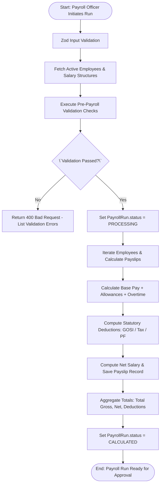
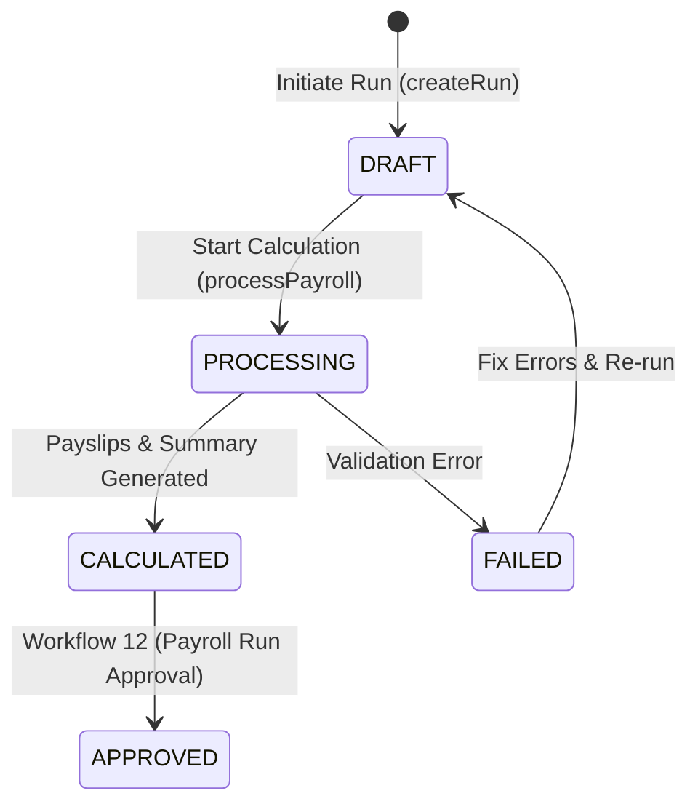

# Workflow 11 — Payroll Run Processing Enterprise Specification

> **Document Code:** `SPEC-WF-11`  
> **System:** AuraOS Enterprise ERP / HCM Platform  
> **Version:** 1.0.0  
> **Date:** 2026-07-29  
> **Status:** Official Functional Specification  
> **Primary Code Location:** `apps/web/src/lib/services/payroll/payroll.service.ts`  
> **Primary API Route:** `POST /api/v1/payroll-runs`  
> **Primary Database Entity:** `PayrollRun` (`packages/@aura/database/prisma/schema.prisma#L2575-L2605`)

---

## Metadata Header

| Attribute                     | Value / Reference                                                         |
| ----------------------------- | ------------------------------------------------------------------------- |
| **Workflow ID & Name**        | `11` — `Payroll Run Processing Workflow`                                  |
| **Business Module**           | `Payroll & Financial Management`                                          |
| **Submodule / Domain**        | `Monthly Payroll Run Engine & Compensation Calculation`                   |
| **Business Process Owner**    | `Payroll Operations Director`                                             |
| **Technical System Owner**    | `Lead Payroll Systems Architect`                                          |
| **Implementation Status**     | `Partially Implemented`                                                   |
| **Specification Version**     | `1.0.0`                                                                   |
| **Date Created / Updated**    | `2026-07-29`                                                              |
| **Technical Author**          | `Enterprise Solution Architect (AI Agent)`                                |
| **Technical Reviewer**        | `Senior Software Architect`                                               |
| **QA Verifier**               | `QA Lead`                                                                 |
| **Final Approver**            | `Chief Product Officer`                                                   |
| **Primary Code Location**     | `apps/web/src/lib/services/payroll/payroll.service.ts`                    |
| **Primary API Route**         | `POST /api/v1/payroll-runs`                                               |
| **Primary Database Entity**   | `PayrollRun` (`packages/@aura/database/prisma/schema.prisma#L2575-L2605`) |
| **Related Architecture Docs** | `docs/architecture/WORKFLOW_AUDIT_FINDINGS.md#finding-3`                  |

---

## Table of Contents

- [1. Executive Summary](#1-executive-summary)
- [2. Business Context](#2-business-context)
- [3. Business Objectives](#3-business-objectives)
- [4. Business Scope](#4-business-scope)
- [5. Workflow Overview](#5-workflow-overview)
- [6. Business Process Description](#6-business-process-description)
- [7. Mermaid Business Workflow Diagram](#7-mermaid-business-workflow-diagram)
- [8. Business Actors](#8-business-actors)
- [9. RACI Matrix](#9-raci-matrix)
- [10. Entry Points](#10-entry-points)
- [11. Trigger Events](#11-trigger-events)
- [12. Workflow Stages](#12-workflow-stages)
- [13. Workflow State Machine](#13-workflow-state-machine)
- [14. Approval Process](#14-approval-process)
- [15. Approval Matrix](#15-approval-matrix)
- [16. Decision Matrix](#16-decision-matrix)
- [17. Business Rules](#17-business-rules)
- [18. Compliance Rules](#18-compliance-rules)
- [19. Country-Specific Rules](#19-country-specific-rules)
- [20. Exception Handling](#20-exception-handling)
- [21. Notifications](#21-notifications)
- [22. Escalation Rules](#22-escalation-rules)
- [23. SLA Rules](#23-sla-rules)
- [24. RBAC Matrix](#24-rbac-matrix)
- [25. Audit Trail](#25-audit-trail)
- [26. UI Screens](#26-ui-screens)
- [27. Frontend Architecture](#27-frontend-architecture)
- [28. API Specification](#28-api-specification)
- [29. Backend Architecture](#29-backend-architecture)
- [30. Database Design](#30-database-design)
- [31. Integration Points](#31-integration-points)
- [32. Reports](#32-reports)
- [33. Dashboard KPIs](#33-dashboard-kpis)
- [34. Analytics](#34-analytics)
- [35. CURRENT IMPLEMENTATION](#35-current-implementation)
- [36. IMPLEMENTATION GAPS](#36-implementation-gaps)
- [37. PROPOSED ENTERPRISE IMPLEMENTATION](#37-proposed-enterprise-implementation)
- [38. Migration Strategy](#38-migration-strategy)
- [39. Testing Strategy](#39-testing-strategy)
- [40. Acceptance Criteria](#40-acceptance-criteria)
- [41. Implementation Checklist](#41-implementation-checklist)
- [42. Known Risks](#42-known-risks)
- [43. Related Architecture Findings](#43-related-architecture-findings)
- [44. Repository References](#44-repository-references)

---

## 1. Executive Summary

The **Payroll Run Processing Workflow** manages the monthly calculation of employee compensation across the enterprise. It aggregates base salaries (`EmployeeSalaryStructure`), attendance data, approved overtime, approved expense reimbursements, statutory social insurance deductions (GOSI, SIO, PASI, PF/ESI), income tax/TDS, and voluntary deductions to generate individual `Payslip` records and a master `PayrollRun` summary.

The workflow is classified as **Partially Implemented**. While core calculation engines (`PayrollService.processPayroll` in `apps/web/src/lib/services/payroll/payroll.service.ts`) and REST API handlers (`/api/v1/payroll-runs`) exist, the underlying service file carries an explicit `@ts-nocheck` annotation due to Prisma schema field drift (tracked under issue #29 in `docs/architecture/WORKFLOW_AUDIT_FINDINGS.md#finding-3`).

---

## 2. Business Context

Monthly payroll execution is a mission-critical financial process. In multi-jurisdictional enterprises (operating across GCC and South Asia), payroll processing must accurately calculate gross salaries, prorate mid-month joiners/leavers, apply statutory social security contributions (e.g., GOSI in KSA, PASI in Oman, GPSSA in UAE), deduct taxes, and generate individual payslips. Automated pre-payroll validation prevents calculation errors, missing bank details, or unapproved adjustments from corrupting monthly disbursements.

---

## 3. Business Objectives

- **Automate Gross-to-Net Calculation:** Calculate base pay, allowances, overtime, statutory contributions, and net payable salaries for all active employees.
- **Pre-Payroll Validation:** Automatically validate employee bank details, tax declarations, and attendance completion before executing calculations.
- **Support Multi-Country Math:** Compute country-specific social security deductions (GOSI, GPSSA, PASI) and tax regimes (India Old vs New Tax Slabs).
- **Maintain Audit Trail:** Log payroll initiation events via `AuditAction.PAYROLL_RUN_INITIATED`.

---

## 4. Business Scope

### 4.1 In-Scope

- Initiation of a monthly payroll run (`POST /api/v1/payroll-runs`).
- Pre-payroll validation check (`validatePayroll()`).
- Generation of individual `Payslip` records (`calculatePayslip()`).
- Aggregation of totals (`totalGrossSalary`, `totalDeductions`, `totalNetSalary`, `totalStatutory`).
- State machine transition from `DRAFT` to `PROCESSING` to `CALCULATED`.

### 4.2 Out-of-Scope

- Final approval & lock of payroll runs (governed by `12 Payroll Run Approval Workflow`).
- WPS SIF file bank generation (handled by Bank Gateway).

---

## 5. Workflow Overview

The payroll run lifecycle moves from period initialization to payslip generation and calculation summary:

```
┌─────────────┐     ┌─────────────┐     ┌─────────────┐     ┌─────────────┐     ┌──────────────┐
│ Initiate    │ ──> │ Pre-Run     │ ──> │ Gross-Net   │ ──> │ Payslips    │ ──> │ Status:      │
│ Payroll Run │     │ Validation  │     │ Calculation │     │ Generated   │     │ CALCULATED   │
└─────────────┘     └─────────────┘     └─────────────┘     └─────────────┘     └──────────────┘
```

---

## 6. Business Process Description

1. **Initiation:** Payroll Officer initiates a payroll run via `POST /api/v1/payroll-runs` specifying `payrollMonth` (YYYY-MM), `configId`, and `countryCode`.
2. **Pre-Payroll Validation:** System runs `validatePayroll()` to verify:
   - All employees have an active `EmployeeSalaryStructure`.
   - Employee bank IBAN details are present.
   - Attendance and leave records for the month are locked.
3. **Calculation Execution:** `PayrollService.processPayroll()` iterates over active employees:
   - Fetches base salary and allowances from `EmployeeSalaryStructure`.
   - Adds approved overtime and approved expense reimbursements.
   - Calculates statutory social security (e.g., GOSI employer/employee contributions).
   - Computes net salary (`netSalary = grossSalary - totalDeductions`).
   - Generates individual `Payslip` database records.
4. **Summary Aggregation:** The run calculates aggregate metrics (`totalGrossSalary`, `totalDeductions`, `totalNetSalary`, `totalStatutory`) and sets status to `CALCULATED`.

---

## 7. Mermaid Business Workflow Diagram



---

## 8. Business Actors

| Actor Role          | Actor Type | System Persona   | Operational Responsibilities                                                         |
| ------------------- | ---------- | ---------------- | ------------------------------------------------------------------------------------ |
| **Payroll Officer** | Human      | `PAYROLL_ADMIN`  | Initiates monthly payroll run, reviews validation errors, inspects draft payslips    |
| **Payroll Engine**  | System     | `PayrollService` | Executes pre-validation, gross-to-net math, statutory deductions, payslip generation |

---

## 9. RACI Matrix

| Workflow Activity   | Payroll Officer | Finance Director | Payroll Engine | Prisma DB |
| ------------------- | :-------------: | :--------------: | :------------: | :-------: |
| Initiate Run        |    **R / A**    |        I         |       C        |     I     |
| Pre-Validation      |        I        |        I         |   **R / A**    |     C     |
| Payslip Generation  |        I        |        I         |   **R / A**    |   **C**   |
| Summary Aggregation |        I        |        I         |   **R / A**    |   **A**   |

---

## 10. Entry Points

- **Primary REST API Endpoint:** `POST /api/v1/payroll-runs` (`apps/web/src/app/api/v1/payroll-runs/route.ts#L39`)
- **Process Endpoint:** `POST /api/v1/payroll-runs/[id]/process`
- **Frontend Dashboard Screen:** `apps/web/src/app/dashboard/payroll/runs/page.tsx`

---

## 11. Trigger Events

| Trigger Event Name       | Trigger Type   | Source System / Action      | Payload Attributes                                  |
| ------------------------ | -------------- | --------------------------- | --------------------------------------------------- |
| `PAYROLL_RUN_INITIATED`  | User UI Action | `POST /api/v1/payroll-runs` | `tenantId`, `configId`, `payrollMonth`, `createdBy` |
| `PAYROLL_RUN_CALCULATED` | System Action  | `processPayroll()`          | `id`, `totalEmployees`, `totalNetSalary`            |

---

## 12. Workflow Stages

### 12.1 Stage 1: Initiation & Draft (`DRAFT`)

- **Stage Identifier:** `DRAFT`
- **Stage Owner Role:** `PAYROLL_ADMIN`
- **SLA Window:** Immediate
- **Status Value:** `DRAFT`

### 12.2 Stage 2: Processing & Calculation (`PROCESSING`)

- **Stage Identifier:** `PROCESSING`
- **Stage Owner Role:** `PayrollService`
- **SLA Window:** 15 Minutes
- **Status Value:** `PROCESSING`

### 12.3 Stage 3: Calculation Complete (`CALCULATED`)

- **Stage Identifier:** `CALCULATED`
- **Stage Owner Role:** `PAYROLL_ADMIN`
- **SLA Window:** 24 Hours
- **Status Value:** `CALCULATED`

---

## 13. Workflow State Machine



| From State   | To State     | Trigger / Method   | Prerequisites / Guards         | Side Effects                      |
| ------------ | ------------ | ------------------ | ------------------------------ | --------------------------------- |
| `[*]`        | `DRAFT`      | `createRun()`      | `createPayrollRunSchema` valid | Creates `PayrollRun` in `DRAFT`   |
| `DRAFT`      | `PROCESSING` | `processPayroll()` | Pre-validation passes          | Locks inputs; begins payslip loop |
| `PROCESSING` | `CALCULATED` | Loop completion    | All payslips generated         | Computes aggregate totals         |

---

## 14. Approval Process

Calculation processing operates automatically upon initiation. Human approval occurs in `Workflow 12 — Payroll Run Approval Workflow`.

---

## 15. Approval Matrix

| Stage        | Role            | Action                | SLA Target |
| ------------ | --------------- | --------------------- | ---------- |
| Initiation   | Payroll Officer | Initiate Calculation  | 24 Hours   |
| Verification | Payroll Manager | Verify Payslip Drafts | 48 Hours   |

---

## 16. Decision Matrix

| Validation Check | Missing IBAN? | Attendance Locked? | Outcome   | System Action                            |
| ---------------- | ------------- | ------------------ | --------- | ---------------------------------------- |
| Pass             | No            | Yes                | Proceed   | Execute payslip loop                     |
| Fail             | Yes           | Irrelevant         | Block Run | Return 400 Bad Request (IBAN Error)      |
| Fail             | No            | No                 | Block Run | Return 400 Bad Request (Unlocked Period) |

---

## 17. Business Rules

#### BR-PAY-RUN-001: Unique Monthly Run Constraint

- **Category:** Data Integrity
- **Severity:** BLOCKED
- **Description:** Only one active `PayrollRun` can exist for a given `tenantId`, `configId`, and `payrollMonth`.
- **Repository Reference:** `packages/@aura/database/prisma/schema.prisma#L2600`

#### BR-PAY-RUN-002: Pre-Payroll Validation Gate

- **Category:** Calculation Safety
- **Severity:** BLOCKED
- **Description:** Payroll calculation MUST fail if any employee in the run lacks an active `EmployeeSalaryStructure` or valid bank details.
- **Repository Reference:** `apps/web/src/lib/services/payroll/payroll.service.ts#L58-L61`

---

## 18. Compliance Rules

- **Statutory Social Insurance Accrual:** GOSI / SIO / PASI contributions MUST be computed strictly per statutory percentages for GCC nationals.
- **Tenant Scoping:** All queries MUST include `tenantId`.

---

## 19. Country-Specific Rules

| Country Code | Statutory Rule | Deduction Basis                                         | Repository Reference                                           |
| ------------ | -------------- | ------------------------------------------------------- | -------------------------------------------------------------- |
| `KSA`        | GOSI Law       | 10% Employee / 12% Employer on Basic + Housing          | `apps/web/src/lib/services/payroll/payroll.service.ts#L38`     |
| `IN`         | Income Tax Act | Old vs New Tax Slab calculation with Standard Deduction | `apps/web/src/lib/services/payroll/payroll.service.ts#L24-L32` |

---

## 20. Exception Handling

| Error Code | HTTP Status | Error Message                                       | Root Cause                       |
| ---------- | :---------: | --------------------------------------------------- | -------------------------------- |
| `E4030`    |    `403`    | `Forbidden: missing payroll-runs:create permission` | User lacks permission            |
| `E4000`    |    `400`    | `Payroll validation failed`                         | Missing salary structure or IBAN |

---

## 21. Notifications

- Dispatches system audit event `AuditAction.PAYROLL_RUN_INITIATED`.

---

## 22–23. Escalation & SLA Rules

- **Run SLA:** 24 Hours for calculation review.

---

## 24. RBAC Matrix

| Role               | `payroll-runs:read` | `payroll-runs:create` | Execute Calculation | Admin Override |
| ------------------ | :-----------------: | :-------------------: | :-----------------: | :------------: |
| `EMPLOYEE`         |         ❌          |          ❌           |         ❌          |       ❌       |
| `PAYROLL_ADMIN`    |         ✅          |          ✅           |         ✅          |       ❌       |
| `FINANCE_DIRECTOR` |         ✅          |          ✅           |         ✅          |       ✅       |
| `TENANT_ADMIN`     |         ✅          |          ✅           |         ✅          |       ✅       |

---

## 25. Audit Trail & Logging

- Logged via `AuditAction.PAYROLL_RUN_INITIATED` in `schema.prisma#L13101`.

---

## 26–27. UI & Frontend Architecture

- **Page Path:** `apps/web/src/app/dashboard/payroll/runs/page.tsx`
- Interactive Payroll Run dashboard displaying progress bars, employee counts, gross/net totals, and validation warning modals.

---

## 28. API Specification

### POST /api/v1/payroll-runs

- **HTTP Method:** `POST`
- **Route Path:** `/api/v1/payroll-runs`
- **Authentication:** `Bearer JWT` (Session Context)
- **Required Permission:** `payroll-runs:create`
- **Request Body (JSON):**
  ```json
  {
    "configId": "cfg_main_payroll",
    "payrollMonth": "2026-08",
    "countryCode": "UAE"
  }
  ```
- **Success Response (201 Created):**
  ```json
  {
    "success": true,
    "data": {
      "id": "pay_run_999",
      "payrollMonth": "2026-08",
      "status": "DRAFT"
    }
  }
  ```
- **Repository Implementation:** `apps/web/src/app/api/v1/payroll-runs/route.ts#L39-L64`

---

## 29. Backend Architecture

- **Service Classes:** `PayrollService` (`apps/web/src/lib/services/payroll/payroll.service.ts` and `apps/web/src/lib/services/payroll.service.ts`).
- **Database Model:** `prisma.payrollRun` (`packages/@aura/database/prisma/schema.prisma#L2575-L2605`).

---

## 30. Database Design

- **Prisma Entity Name:** `PayrollRun`
- **Schema Location:** `packages/@aura/database/prisma/schema.prisma#L2575-L2605`
- **Entity Attributes:**
  ```prisma
  model PayrollRun {
    id                String           @id @default(uuid())
    tenantId          String
    configId          String
    payrollMonth      String
    status            PayrollRunStatus @default(DRAFT)
    totalEmployees    Int              @default(0)
    totalGrossSalary  Decimal          @default(0)
    totalDeductions   Decimal          @default(0)
    totalNetSalary    Decimal          @default(0)
    totalEmployerCost Decimal          @default(0)
    currency          String           @default("AED")
    createdAt         DateTime         @default(now())

    payslips          Payslip[]
    @@unique([tenantId, configId, payrollMonth])
    @@map("aura_payroll_run")
  }
  ```

---

## 31–34. Integrations, Reports & KPIs

- **Internal Service Integrations:** `EmployeeSalaryStructure`, `AttendanceRecord`, `OvertimeRequest`, `GOSIService`.
- **Key KPIs:** Payroll Processing Variance (%), Average Payslip Calculation Time (ms), Total Monthly Payroll Disbursement ($/AED).

---

## 35. CURRENT IMPLEMENTATION

> [!NOTE]
> **CURRENT PRODUCTION IMPLEMENTATION STATUS:**
> The following section describes ONLY functionality verified by existing codebase artifacts.

### 35.1 Verified Codebase Capabilities

- Operational payroll run creation (`createRun`) and processing (`processPayroll`) methods in `PayrollService`.
- Multi-country tax and social security calculations (GOSI, India Old/New Tax Slabs) defined in `payroll.service.ts`.
- Database entity `PayrollRun` and `Payslip` models verified in `schema.prisma#L2575-L2630`.

### 35.2 Verified Technical Limitations & Debt

> [!WARNING]
> **Prisma Schema Drift (@ts-nocheck):**
> `apps/web/src/lib/services/payroll/payroll.service.ts#L1` carries an explicit `@ts-nocheck` annotation due to field selection naming drift. Tracked under issue #29.

---

## 36. IMPLEMENTATION GAPS

| Functional Area    | Current Codebase State           | Target Enterprise Target                                    | Priority / Impact    |
| ------------------ | -------------------------------- | ----------------------------------------------------------- | -------------------- |
| **Type Safety**    | `@ts-nocheck` present in service | Strict TypeScript typing matching Prisma schema             | High / Stability     |
| **Worker Threads** | Synchronous payslip loop         | Distributed worker queue processing for $>10,000$ employees | Medium / Performance |

---

## 37. PROPOSED ENTERPRISE IMPLEMENTATION

> [!IMPORTANT]
> **PROPOSED ENTERPRISE IMPLEMENTATION DISCLAIMER:**
> The features outlined below represent target enterprise architecture specifications and are NOT currently present in the production codebase.

### 37.1 Parallel Worker Queue Payroll Calculation Engine [PROPOSED]

Refactor payslip calculation into parallel worker threads (`BullMQ`) to process large-scale enterprise payroll runs ($>10,000$ employees) in under 60 seconds.

---

## 38. Migration Strategy

- Remove `@ts-nocheck` and update Prisma select statements in `apps/web/src/lib/services/payroll/payroll.service.ts`.

---

## 39. Testing Strategy

### 39.1 Functional Tests

- Verify `createRun()` creates record with `status = 'DRAFT'`.
- Verify `processPayroll()` generates payslips and updates status to `CALCULATED`.

---

## 40. Acceptance Criteria

```gherkin
Scenario: Successful Payroll Run Processing
  GIVEN an active PayrollConfiguration and 50 active employees with salary structures
  WHEN Payroll Officer initiates a run for 2026-08 via POST /api/v1/payroll-runs
  AND triggers processPayroll()
  THEN 50 individual Payslip records MUST be created
  AND PayrollRun.status MUST update to CALCULATED
  AND totalGrossSalary, totalDeductions, and totalNetSalary MUST be accurately aggregated
```

---

## 41. Implementation Checklist

- [x] Payroll API route `/api/v1/payroll-runs` verified
- [x] Service class `PayrollService` verified
- [x] Prisma models `PayrollRun` and `Payslip` verified
- [ ] Remove `@ts-nocheck` and resolve schema drift in `payroll.service.ts`

---

## 42. Known Risks

- **Risk 1:** Processing large employee counts in a single synchronous loop may exceed HTTP request timeout limits.

---

## 43. Related Architecture Findings

- **Finding 3 (Schema Drift @ts-nocheck):** Detailed in `docs/architecture/WORKFLOW_AUDIT_FINDINGS.md#finding-3`.

---

## 44. Repository References

### 44.1 Frontend Files

- `apps/web/src/app/dashboard/payroll/runs/page.tsx`

### 44.2 API Routes

- `apps/web/src/app/api/v1/payroll-runs/route.ts`

### 44.3 Backend Service Classes

- `apps/web/src/lib/services/payroll/payroll.service.ts`
- `apps/web/src/lib/services/payroll.service.ts`

### 44.4 Database Schema Models

- `packages/@aura/database/prisma/schema.prisma#L2575-L2605`
- `packages/@aura/database/prisma/schema.prisma#L2607-L2630`

---

_End of Workflow 11 — Payroll Run Processing Enterprise Specification._
