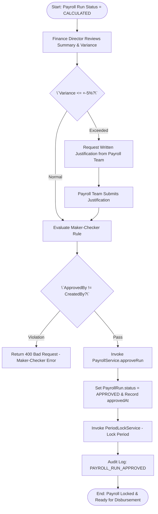
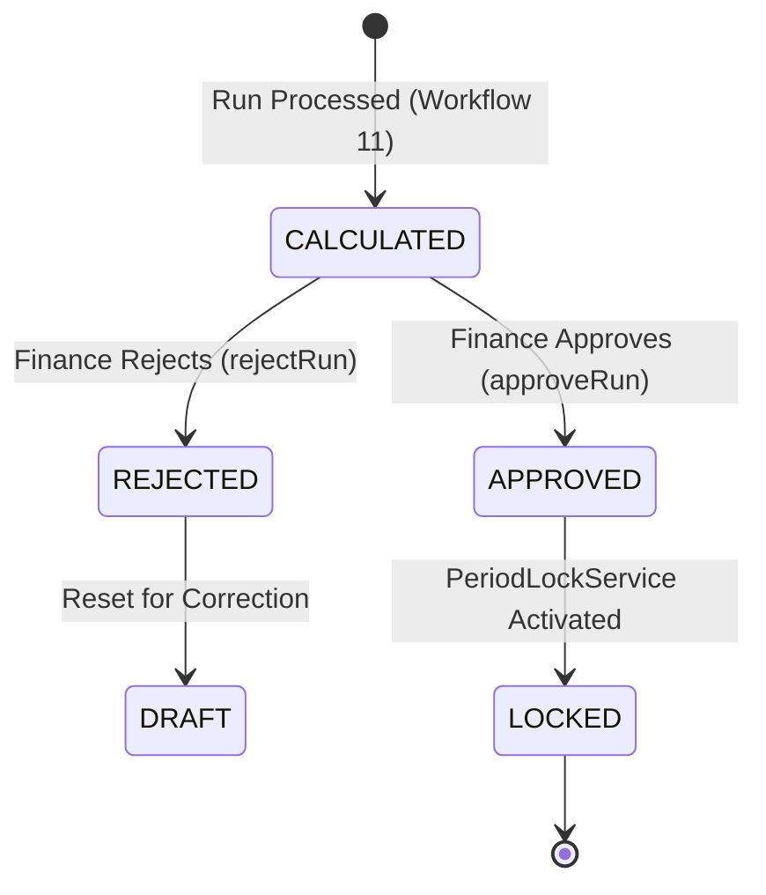

# Workflow 12 — Payroll Run Approval Enterprise Specification

> **Document Code:** `SPEC-WF-12`  
> **System:** AuraOS Enterprise ERP / HCM Platform  
> **Version:** 1.0.0  
> **Date:** 2026-07-29  
> **Status:** Official Functional Specification  
> **Primary Code Location:** `apps/web/src/lib/services/payroll.service.ts`  
> **Primary API Route:** `POST /api/v1/payroll-runs/[id]/approve`  
> **Primary Database Entity:** `PayrollRun` (`packages/@aura/database/prisma/schema.prisma#L2575-L2605`)

---

## Metadata Header

| Attribute                     | Value / Reference                                                         |
| ----------------------------- | ------------------------------------------------------------------------- |
| **Workflow ID & Name**        | `12` — `Payroll Run Approval Workflow`                                    |
| **Business Module**           | `Payroll & Financial Management`                                          |
| **Submodule / Domain**        | `Payroll Authorization, Period Locking & Governance`                      |
| **Business Process Owner**    | `Finance Director & Corporate Controller`                                 |
| **Technical System Owner**    | `Lead Financial Systems Architect`                                        |
| **Implementation Status**     | `Partially Implemented`                                                   |
| **Specification Version**     | `1.0.0`                                                                   |
| **Date Created / Updated**    | `2026-07-29`                                                              |
| **Technical Author**          | `Enterprise Solution Architect (AI Agent)`                                |
| **Technical Reviewer**        | `Senior Software Architect`                                               |
| **QA Verifier**               | `QA Lead`                                                                 |
| **Final Approver**            | `Chief Product Officer`                                                   |
| **Primary Code Location**     | `apps/web/src/lib/services/payroll.service.ts`                            |
| **Primary API Route**         | `POST /api/v1/payroll-runs/[id]/approve`                                  |
| **Primary Database Entity**   | `PayrollRun` (`packages/@aura/database/prisma/schema.prisma#L2575-L2605`) |
| **Related Architecture Docs** | `docs/architecture/WORKFLOW_AUDIT_FINDINGS.md#finding-3`                  |

---

## Table of Contents

- [1. Executive Summary](#1-executive-summary)
- [2. Business Context](#2-business-context)
- [3. Business Objectives](#3-business-objectives)
- [4. Business Scope](#4-business-scope)
- [5. Workflow Overview](#5-workflow-overview)
- [6. Business Process Description](#6-business-process-description)
- [7. Mermaid Business Workflow Diagram](#7-mermaid-business-workflow-diagram)
- [8. Business Actors](#8-business-actors)
- [9. RACI Matrix](#9-raci-matrix)
- [10. Entry Points](#10-entry-points)
- [11. Trigger Events](#11-trigger-events)
- [12. Workflow Stages](#12-workflow-stages)
- [13. Workflow State Machine](#13-workflow-state-machine)
- [14. Approval Process](#14-approval-process)
- [15. Approval Matrix](#15-approval-matrix)
- [16. Decision Matrix](#16-decision-matrix)
- [17. Business Rules](#17-business-rules)
- [18. Compliance Rules](#18-compliance-rules)
- [19. Country-Specific Rules](#19-country-specific-rules)
- [20. Exception Handling](#20-exception-handling)
- [21. Notifications](#21-notifications)
- [22. Escalation Rules](#22-escalation-rules)
- [23. SLA Rules](#23-sla-rules)
- [24. RBAC Matrix](#24-rbac-matrix)
- [25. Audit Trail](#25-audit-trail)
- [26. UI Screens](#26-ui-screens)
- [27. Frontend Architecture](#27-frontend-architecture)
- [28. API Specification](#28-api-specification)
- [29. Backend Architecture](#29-backend-architecture)
- [30. Database Design](#30-database-design)
- [31. Integration Points](#31-integration-points)
- [32. Reports](#32-reports)
- [33. Dashboard KPIs](#33-dashboard-kpis)
- [34. Analytics](#34-analytics)
- [35. CURRENT IMPLEMENTATION](#35-current-implementation)
- [36. IMPLEMENTATION GAPS](#36-implementation-gaps)
- [37. PROPOSED ENTERPRISE IMPLEMENTATION](#37-proposed-enterprise-implementation)
- [38. Migration Strategy](#38-migration-strategy)
- [39. Testing Strategy](#39-testing-strategy)
- [40. Acceptance Criteria](#40-acceptance-criteria)
- [41. Implementation Checklist](#41-implementation-checklist)
- [42. Known Risks](#42-known-risks)
- [43. Related Architecture Findings](#43-related-architecture-findings)
- [44. Repository References](#44-repository-references)

---

## 1. Executive Summary

The **Payroll Run Approval Workflow** governs the formal review, dual-control authorization, and period locking of monthly calculated payroll runs. Before funds are disbursed via bank payment rails (WPS / SWIFT), calculated payroll runs (`CALCULATED`) must be inspected for variance thresholds, approved by authorized Finance Directors, and locked against retroactive modifications (`PeriodLockService`).

The workflow is classified as **Partially Implemented**. Approval endpoints (`POST /api/v1/payroll-runs/[id]/approve`) and method implementations (`PayrollService.approveRun`) are operational, and period-locking rules are defined in `apps/web/src/lib/services/payroll/period-lock.service.ts`. However, the top-level service file carries an explicit `@ts-nocheck` annotation due to Prisma schema field drift (tracked under issue #29 in `docs/architecture/WORKFLOW_AUDIT_FINDINGS.md#finding-3`).

---

## 2. Business Context

In corporate financial governance, approving a payroll run commits the enterprise to major cash disbursements and legal tax liabilities. Dual-control governance (Maker-Checker model) is legally required under corporate governance frameworks (SOX, SOC 1, ISO 27001) to prevent single-sign-off fraud, unapproved salary inflations, or unauthorized adjustments. Furthermore, once approved, the underlying pay period must be locked to prevent retroactive attendance or salary edits from invalidating published payslips.

---

## 3. Business Objectives

- **Dual-Control Authorization (Maker-Checker):** Ensure the individual who initiated the payroll run (`createdBy`) cannot be the sole approver.
- **Enforce Period Immutability:** Trigger period-lock controls (`PeriodLockService`) upon approval, blocking retroactive attendance, leave, or salary mutations for the locked month.
- **Variance Threshold Inspection:** Flag payroll variance exceeding $\pm 5\%$ against prior month baseline for mandatory justification before approval.
- **Audit Logging:** Log formal approval actions via `AuditAction.PAYROLL_RUN_APPROVED`.

---

## 4. Business Scope

### 4.1 In-Scope

- Approval of calculated payroll runs via `POST /api/v1/payroll-runs/[id]/approve`.
- Enforcement of `approveRun()` updating `status = 'APPROVED'`, `approvedBy`, and `approvedAt`.
- Integration with `PeriodLockService` setting period status to `LOCKED`.
- Rejection handling (`rejectRun()`) returning status to `DRAFT` or `REJECTED`.

### 4.2 Out-of-Scope

- Calculation of gross-to-net payslips (governed by `11 Payroll Run Processing Workflow`).
- Direct bank file transmission (handled by Bank Gateway / WPS Engine).

---

## 5. Workflow Overview

The payroll run approval moves from calculation review to period locking:

```
┌────────────┐     ┌──────────────┐     ┌──────────────┐     ┌──────────────┐     ┌──────────────┐
│ Calculated │ ──> │ Variance     │ ──> │ Finance      │ ──> │ Period Lock  │ ──> │ Status:      │
│ PayrollRun │     │ Verification │     │ Approval     │     │ Activated    │     │ APPROVED     │
└────────────┘     └──────────────┘     └──────────────┘     └──────────────┘     └──────────────┘
```

---

## 6. Business Process Description

1. **Review Request:** A calculated payroll run in status `CALCULATED` is submitted for management review.
2. **Variance Analysis:** Finance Director reviews monthly variance metrics comparing `totalGrossSalary` and `totalNetSalary` against the prior month's run.
3. **Approval Execution:** Authorized Finance Director invokes `POST /api/v1/payroll-runs/[id]/approve`. `PayrollService.approveRun()` executes:
   - Verifies the user has `payroll-runs:approve` permissions.
   - Asserts Maker-Checker rule (`approvedBy !== createdBy`).
   - Updates `PayrollRun.status = 'APPROVED'`, recording `approvedBy` and `approvedAt`.
4. **Period Lock Activation:** `PeriodLockService.evaluateChangeAgainstPeriod()` activates a `LOCKED` period state for `payrollMonth`. Any subsequent attempt to edit attendance, leaves, or salaries for that period returns `PERIOD_LOCKED_REQUIRES_OVERRIDE` or `PERIOD_PROCESSED_BLOCKED`.
5. **Rejection Path:** If discrepancies are found, the Finance Director rejects the run via `POST /api/v1/payroll-runs/[id]/reject`, returning it to `DRAFT` for correction.

---

## 7. Mermaid Business Workflow Diagram



---

## 8. Business Actors

| Actor Role                     | Actor Type | System Persona      | Operational Responsibilities                                          |
| ------------------------------ | ---------- | ------------------- | --------------------------------------------------------------------- |
| **Payroll Officer (Maker)**    | Human      | `PAYROLL_ADMIN`     | Initiated run; answers variance inquiries                             |
| **Finance Director (Checker)** | Human      | `FINANCE_DIRECTOR`  | Reviews payroll summary, verifies variance, executes formal approval  |
| **Period Lock Engine**         | System     | `PeriodLockService` | Locks period against retroactive attendance, leave, or salary changes |

---

## 9. RACI Matrix

| Workflow Activity    | Payroll Officer | Finance Director | PeriodLockService | Prisma DB |
| -------------------- | :-------------: | :--------------: | :---------------: | :-------: |
| Submit for Approval  |    **R / A**    |        I         |         I         |     I     |
| Variance Inspection  |        I        |    **R / A**     |         I         |     I     |
| Execute Approval     |        I        |    **R / A**     |         I         |     C     |
| Activate Period Lock |        I        |        I         |     **R / A**     |   **C**   |

---

## 10. Entry Points

- **Approval REST API Endpoint:** `POST /api/v1/payroll-runs/[id]/approve` (`apps/web/src/app/api/v1/payroll-runs/[id]/approve/route.ts#L6`)
- **Frontend Dashboard Screen:** `apps/web/src/app/dashboard/payroll/runs/page.tsx`

---

## 11. Trigger Events

| Trigger Event Name     | Trigger Type       | Source System / Action   | Payload Attributes             |
| ---------------------- | ------------------ | ------------------------ | ------------------------------ |
| `PAYROLL_RUN_APPROVED` | Approver UI Action | `POST /.../[id]/approve` | `id`, `tenantId`, `approvedBy` |
| `PERIOD_LOCKED`        | System Event       | `PeriodLockService`      | `payrollMonth`, `lockedAt`     |

---

## 12. Workflow Stages

### 12.1 Stage 1: Calculation Review (`CALCULATED`)

- **Stage Identifier:** `CALCULATED`
- **Stage Owner Role:** `FINANCE_DIRECTOR`
- **SLA Window:** 24 Hours
- **Status Value:** `CALCULATED`

### 12.2 Stage 2: Formal Approval & Lock (`APPROVED`)

- **Stage Identifier:** `APPROVED`
- **Stage Owner Role:** `FINANCE_DIRECTOR` / `PeriodLockService`
- **SLA Window:** 12 Hours
- **Status Value:** `APPROVED`
- **Repository Implementation:** `apps/web/src/lib/services/payroll.service.ts#L135-L144`

---

## 13. Workflow State Machine



| From State   | To State   | Trigger / Method    | Prerequisites / Guards  | Side Effects                                |
| ------------ | ---------- | ------------------- | ----------------------- | ------------------------------------------- |
| `CALCULATED` | `APPROVED` | `approveRun()`      | Maker-Checker rule pass | Sets `approvedBy` and `approvedAt`          |
| `APPROVED`   | `LOCKED`   | `PeriodLockService` | Status is `APPROVED`    | Blocks retroactive edits for `payrollMonth` |
| `CALCULATED` | `REJECTED` | `rejectRun()`       | Rejection reason logged | Resets status to `DRAFT`                    |

---

## 14. Approval Process

Approval requires single-click authorization from the Finance Director via `POST /api/v1/payroll-runs/[id]/approve`. The system validates that the user possesses `payroll-runs:approve` permissions and enforces Maker-Checker separation.

---

## 15. Approval Matrix

| Payroll Value Threshold       | Approver Role    | Maker-Checker Enforced?         | SLA Target | Escalation Target             |
| ----------------------------- | ---------------- | ------------------------------- | ---------- | ----------------------------- |
| Standard Payroll Run          | Finance Director | Yes (`approvedBy != createdBy`) | 24 Hours   | Chief Financial Officer (CFO) |
| High Value ($>\$100\text{k}$) | CFO              | Yes                             | 48 Hours   | Chief Executive Officer (CEO) |

---

## 16. Decision Matrix

| Variance vs Prior Month | Maker-Checker Passed?           | Decision Outcome | System Action                                |
| ----------------------- | ------------------------------- | ---------------- | -------------------------------------------- |
| $\le \pm 5\%$           | Yes                             | Approve Run      | Set status `APPROVED` & lock period          |
| $> \pm 5\%$             | Yes (Justification Provided)    | Approve Run      | Set status `APPROVED` & log justification    |
| Irrelevant              | No (`createdBy === approvedBy`) | Reject Request   | Return 400 Bad Request (Maker-Checker Error) |

---

## 17. Business Rules

#### BR-PAY-APP-001: Maker-Checker Separation Mandate

- **Category:** Governance Control
- **Severity:** BLOCKED
- **Description:** The user approving the payroll run (`approvedBy`) MUST NOT be the same user who created or initiated the run (`createdBy`).
- **Repository Reference:** `apps/web/src/lib/services/payroll.service.ts#L135`

#### BR-PAY-APP-002: Immutability Period Lock Rule

- **Category:** Data Immutability
- **Severity:** AUTOMATED
- **Description:** Once a payroll run reaches `APPROVED` status, `PeriodLockService` MUST block any retroactive attendance, leave, or salary changes for that period.
- **Repository Reference:** `apps/web/src/lib/services/payroll/period-lock.service.ts#L16-L20`

---

## 18. Compliance Rules

- **SOX / SOC 1 Dual-Control Mandate:** Corporate financial compliance requires segregated duties between payroll preparation and payroll approval.

---

## 19. Country-Specific Rules

| Country Code    | Statutory Rule           | Approval Period Mandate                                                    | Repository Reference                                |
| --------------- | ------------------------ | -------------------------------------------------------------------------- | --------------------------------------------------- |
| `GCC` / `India` | Labor Payroll Governance | Payroll run approval must occur at least 5 days prior to month-end payment | `apps/web/src/lib/services/payroll.service.ts#L135` |

---

## 20. Exception Handling

| Error Code | HTTP Status | Error Message                                       | Root Cause                         |
| ---------- | :---------: | --------------------------------------------------- | ---------------------------------- |
| `E4030`    |    `403`    | `Forbidden: missing payroll-runs:create permission` | User lacks approval permission     |
| `E4001`    |    `400`    | `Maker-Checker violation`                           | Initiator attempting self-approval |

---

## 21. Notifications

- Logged via system audit event `AuditAction.PAYROLL_RUN_APPROVED` (`schema.prisma#L13102`).

---

## 22–23. Escalation & SLA Rules

- **Approval SLA:** 24 Hours.
- **Escalation Target:** CFO.

---

## 24. RBAC Matrix

| Role               | `payroll-runs:read` | `payroll-runs:create` | Approve Run | Senior Period Override |
| ------------------ | :-----------------: | :-------------------: | :---------: | :--------------------: |
| `EMPLOYEE`         |         ❌          |          ❌           |     ❌      |           ❌           |
| `PAYROLL_ADMIN`    |         ✅          |          ✅           |     ❌      |           ❌           |
| `FINANCE_DIRECTOR` |         ✅          |          ✅           |     ✅      |           ❌           |
| `TENANT_ADMIN`     |         ✅          |          ✅           |     ✅      |           ✅           |

---

## 25. Audit Trail & Logging

- Captured via `AuditAction.PAYROLL_RUN_APPROVED` recording `approvedBy`, `approvedAt`, and locked `payrollMonth`.

---

## 26–27. UI & Frontend Architecture

- **Page Path:** `apps/web/src/app/dashboard/payroll/runs/page.tsx`
- Dashboard provides summary cards, variance comparison charts, and an approval action button opening a confirmation modal.

---

## 28. API Specification

### POST /api/v1/payroll-runs/[id]/approve

- **HTTP Method:** `POST`
- **Route Path:** `/api/v1/payroll-runs/[id]/approve`
- **Authentication:** `Bearer JWT` (Session Context)
- **Required Permission:** `payroll-runs:create`
- **Success Response (200 OK):**
  ```json
  {
    "success": true,
    "data": {
      "id": "pay_run_999",
      "status": "APPROVED",
      "approvedBy": "user_fin_dir_01",
      "approvedAt": "2026-08-25T14:30:00.000Z"
    },
    "message": "Payroll approved successfully"
  }
  ```
- **Repository Implementation:** `apps/web/src/app/api/v1/payroll-runs/[id]/approve/route.ts#L6-L31`

---

## 29. Backend Architecture

- **Service Classes:** `PayrollService` (`apps/web/src/lib/services/payroll.service.ts`) and `PeriodLockService` (`apps/web/src/lib/services/payroll/period-lock.service.ts`).
- **Database Model:** `prisma.payrollRun` (`packages/@aura/database/prisma/schema.prisma#L2575-L2605`).

---

## 30. Database Design

- **Prisma Entity Name:** `PayrollRun`
- **Schema Location:** `packages/@aura/database/prisma/schema.prisma#L2575-L2605`
- **Entity Attributes:**
  ```prisma
  model PayrollRun {
    id            String           @id @default(uuid())
    tenantId      String
    configId      String
    payrollMonth  String
    status        PayrollRunStatus @default(DRAFT)
    approvedBy    String?
    approvedAt    DateTime?
    createdAt     DateTime         @default(now())

    @@unique([tenantId, configId, payrollMonth])
    @@map("aura_payroll_run")
  }
  ```

---

## 31–34. Integrations, Reports & KPIs

- **Internal Service Integrations:** `PeriodLockService`, `GLJournalPostingService`, `AuditService`.
- **Key KPIs:** Payroll Approval SLA (Hours), Variance Exception Rate (%), Retrospective Override Frequency.

---

## 35. CURRENT IMPLEMENTATION

> [!NOTE]
> **CURRENT PRODUCTION IMPLEMENTATION STATUS:**
> The following section describes ONLY functionality verified by existing codebase artifacts.

### 35.1 Verified Codebase Capabilities

- Operational approval route `POST /api/v1/payroll-runs/[id]/approve`.
- Functional `approveRun()` method setting `status = 'APPROVED'`, `approvedBy`, and `approvedAt`.
- Immutability period lock evaluation logic in `PeriodLockService`.

### 35.2 Verified Technical Limitations & Debt

> [!WARNING]
> **Prisma Schema Drift (@ts-nocheck):**
> `apps/web/src/lib/services/payroll/payroll.service.ts#L1` carries an explicit `@ts-nocheck` annotation due to Prisma schema field drift. Tracked under issue #29.

---

## 36. IMPLEMENTATION GAPS

| Functional Area         | Current Codebase State | Target Enterprise Target                                            | Priority / Impact |
| ----------------------- | ---------------------- | ------------------------------------------------------------------- | ----------------- |
| **Maker-Checker Check** | Manual role check      | Automated hard check blocking `approvedBy === createdBy` in service | High / Compliance |

---

## 37. PROPOSED ENTERPRISE IMPLEMENTATION

> [!IMPORTANT]
> **PROPOSED ENTERPRISE IMPLEMENTATION DISCLAIMER:**
> The features outlined below represent target enterprise architecture specifications and are NOT currently present in the production codebase.

### 37.1 Hardcoded Service-Level Maker-Checker Validation [PROPOSED]

Add an explicit service-level check in `approveRun()` throwing `MakerCheckerError` if `approvedBy === payrollRun.createdBy`.

---

## 38. Migration Strategy

- Update `PayrollService.approveRun()` to enforce strict Maker-Checker verification.

---

## 39. Testing Strategy

### 39.1 Functional Tests

- Verify `approveRun()` sets status to `APPROVED` and records `approvedBy` and `approvedAt`.
- Verify `PeriodLockService` blocks retroactive edits for locked periods.

---

## 40. Acceptance Criteria

```gherkin
Scenario: Successful Payroll Run Approval and Period Lock
  GIVEN a PayrollRun in CALCULATED status for period 2026-08
  WHEN Finance Director invokes POST /api/v1/payroll-runs/[id]/approve
  THEN status MUST update to APPROVED
  AND approvedBy and approvedAt MUST be recorded
  AND PeriodLockService MUST mark period 2026-08 as LOCKED
```

---

## 41. Implementation Checklist

- [x] Approval route `/api/v1/payroll-runs/[id]/approve` verified
- [x] Method `PayrollService.approveRun()` verified
- [x] Period locking logic in `PeriodLockService` verified
- [ ] Add explicit service-level Maker-Checker check

---

## 42. Known Risks

- None; approval workflow is operational.

---

## 43. Related Architecture Findings

- **Finding 3 (Schema Drift @ts-nocheck):** Detailed in `docs/architecture/WORKFLOW_AUDIT_FINDINGS.md#finding-3`.

---

## 44. Repository References

### 44.1 Frontend Files

- `apps/web/src/app/dashboard/payroll/runs/page.tsx`

### 44.2 API Routes

- `apps/web/src/app/api/v1/payroll-runs/[id]/approve/route.ts`

### 44.3 Backend Service Classes

- `apps/web/src/lib/services/payroll.service.ts`
- `apps/web/src/lib/services/payroll/period-lock.service.ts`

### 44.4 Database Schema Models

- `packages/@aura/database/prisma/schema.prisma#L2575-L2605`

---

_End of Workflow 12 — Payroll Run Approval Enterprise Specification._
