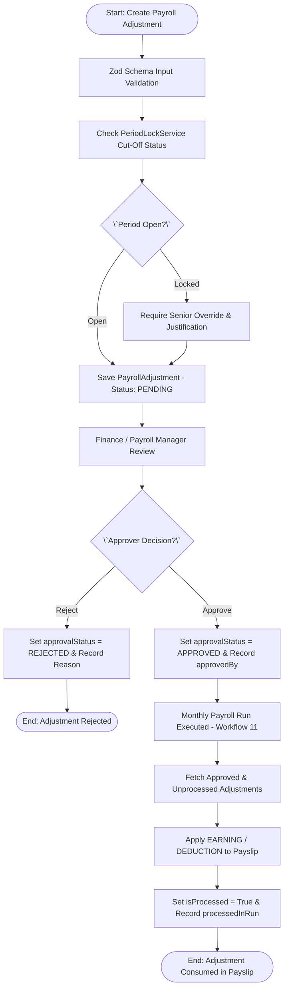
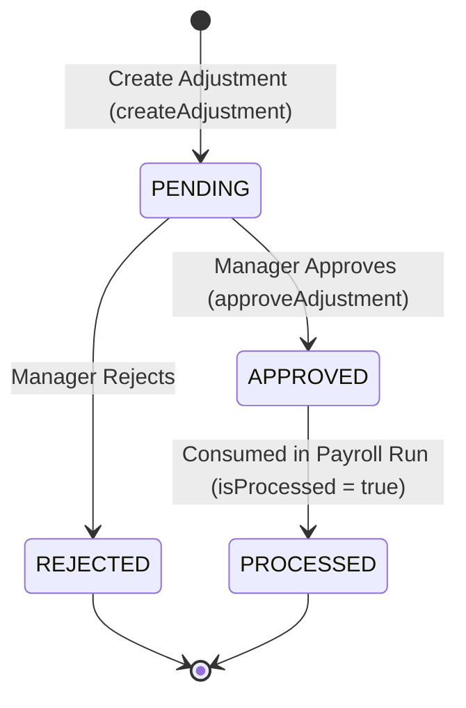

# Workflow 13 — Payroll Adjustment Approval Enterprise Specification

> **Document Code:** `SPEC-WF-13`  
> **System:** AuraOS Enterprise ERP / HCM Platform  
> **Version:** 1.0.0  
> **Date:** 2026-07-29  
> **Status:** Official Functional Specification  
> **Primary Code Location:** `apps/web/src/lib/services/payroll.service.ts`  
> **Primary API Route:** `POST /api/v1/payroll/adjustments`  
> **Primary Database Entity:** `PayrollAdjustment` (`packages/@aura/database/prisma/schema.prisma#L2817-L2848`)

---

## Metadata Header

| Attribute                     | Value / Reference                                                                |
| ----------------------------- | -------------------------------------------------------------------------------- |
| **Workflow ID & Name**        | `13` — `Payroll Adjustment Approval Workflow`                                    |
| **Business Module**           | `Payroll & Financial Management`                                                 |
| **Submodule / Domain**        | `Off-Cycle Earnings & Deductions Governance`                                     |
| **Business Process Owner**    | `Payroll Operations & Internal Controls Director`                                |
| **Technical System Owner**    | `Lead Financial Systems Architect`                                               |
| **Implementation Status**     | `Partially Implemented`                                                          |
| **Specification Version**     | `1.0.0`                                                                          |
| **Date Created / Updated**    | `2026-07-29`                                                                     |
| **Technical Author**          | `Enterprise Solution Architect (AI Agent)`                                       |
| **Technical Reviewer**        | `Senior Software Architect`                                                      |
| **QA Verifier**               | `QA Lead`                                                                        |
| **Final Approver**            | `Chief Product Officer`                                                          |
| **Primary Code Location**     | `apps/web/src/lib/services/payroll.service.ts`                                   |
| **Primary API Route**         | `POST /api/v1/payroll/adjustments`                                               |
| **Primary Database Entity**   | `PayrollAdjustment` (`packages/@aura/database/prisma/schema.prisma#L2817-L2848`) |
| **Related Architecture Docs** | `docs/architecture/WORKFLOW_AUDIT_FINDINGS.md`                                   |

---

## Table of Contents

- [1. Executive Summary](#1-executive-summary)
- [2. Business Context](#2-business-context)
- [3. Business Objectives](#3-business-objectives)
- [4. Business Scope](#4-business-scope)
- [5. Workflow Overview](#5-workflow-overview)
- [6. Business Process Description](#6-business-process-description)
- [7. Mermaid Business Workflow Diagram](#7-mermaid-business-workflow-diagram)
- [8. Business Actors](#8-business-actors)
- [9. RACI Matrix](#9-raci-matrix)
- [10. Entry Points](#10-entry-points)
- [11. Trigger Events](#11-trigger-events)
- [12. Workflow Stages](#12-workflow-stages)
- [13. Workflow State Machine](#13-workflow-state-machine)
- [14. Approval Process](#14-approval-process)
- [15. Approval Matrix](#15-approval-matrix)
- [16. Decision Matrix](#16-decision-matrix)
- [17. Business Rules](#17-business-rules)
- [18. Compliance Rules](#18-compliance-rules)
- [19. Country-Specific Rules](#19-country-specific-rules)
- [20. Exception Handling](#20-exception-handling)
- [21. Notifications](#21-notifications)
- [22. Escalation Rules](#22-escalation-rules)
- [23. SLA Rules](#23-sla-rules)
- [24. RBAC Matrix](#24-rbac-matrix)
- [25. Audit Trail](#25-audit-trail)
- [26. UI Screens](#26-ui-screens)
- [27. Frontend Architecture](#27-frontend-architecture)
- [28. API Specification](#28-api-specification)
- [29. Backend Architecture](#29-backend-architecture)
- [30. Database Design](#30-database-design)
- [31. Integration Points](#31-integration-points)
- [32. Reports](#32-reports)
- [33. Dashboard KPIs](#33-dashboard-kpis)
- [34. Analytics](#34-analytics)
- [35. CURRENT IMPLEMENTATION](#35-current-implementation)
- [36. IMPLEMENTATION GAPS](#36-implementation-gaps)
- [37. PROPOSED ENTERPRISE IMPLEMENTATION](#37-proposed-enterprise-implementation)
- [38. Migration Strategy](#38-migration-strategy)
- [39. Testing Strategy](#39-testing-strategy)
- [40. Acceptance Criteria](#40-acceptance-criteria)
- [41. Implementation Checklist](#41-implementation-checklist)
- [42. Known Risks](#42-known-risks)
- [43. Related Architecture Findings](#43-related-architecture-findings)
- [44. Repository References](#44-repository-references)

---

## 1. Executive Summary

The **Payroll Adjustment Approval Workflow** governs the creation, review, and approval of one-off payroll adjustments (discretionary bonuses, spot awards, relocation allowances, salary arrears, garnishments, or damage deductions) applied to an employee's monthly payslip. Adjustments are classified as either `EARNING` or `DEDUCTION` and require formal Manager/Finance approval before being picked up (`isProcessed = true`) during monthly payroll run calculations (`Workflow 11`).

The workflow is classified as **Partially Implemented**. Zod schema validation (`createAdjustmentSchema`), query methods (`findAllAdjustments`), creation (`createAdjustment`), and approval (`approveAdjustment`) are functional in `apps/web/src/lib/services/payroll.service.ts`. However, the top-level service file carries an explicit `@ts-nocheck` annotation due to Prisma schema field drift (tracked under issue #29 in `docs/architecture/WORKFLOW_AUDIT_FINDINGS.md#finding-3`).

---

## 2. Business Context

In enterprise payroll operations, recurring monthly base salaries are frequently modified by ad-hoc financial events—such as performance bonuses, referral awards, relocation stipends, retro-active salary increases, or disciplinary fines and garnishments. Uncontrolled manual adjustments create major financial leakages and internal audit vulnerabilities. The Payroll Adjustment Approval workflow enforces Maker-Checker controls, mandatory justification logging, threshold-based approval routing, and cut-off period gating (`PeriodLockService`).

---

## 3. Business Objectives

- **Control Ad-Hoc Earnings & Deductions:** Enforce strict approval gates for all non-standard salary adjustments before inclusion in monthly payslips.
- **Enforce Cut-Off Period Restrictions:** Integrate with `PeriodLockService` to block adjustments applied after period cut-off or locking dates.
- **Maintain Audit Traceability:** Require explicit justification text (`reason`) and record approver ID (`approvedBy`) and approval timestamp (`approvedAt`).
- **Automated Processing Tracking:** Track processing status (`isProcessed = false` $\to$ `true`) once consumed by a `PayrollRun`.

---

## 4. Business Scope

### 4.1 In-Scope

- Creation of payroll adjustments (`EARNING` or `DEDUCTION`) via `POST /api/v1/payroll/adjustments`.
- Zod schema validation (`createAdjustmentSchema`).
- Approval handling (`approveAdjustment`) updating `approvalStatus = 'APPROVED'`.
- Rejection handling (`rejectAdjustment`) updating `approvalStatus = 'REJECTED'`.
- Processing tracking (`isProcessed`, `processedInRun`, `processedAt`).

### 4.2 Out-of-Scope

- Monthly base salary profile modifications (governed by `EmployeeSalaryStructure`).
- Expense claim reimbursements (governed by `07 Expense Claim Workflow`).

---

## 5. Workflow Overview

The payroll adjustment moves through creation, approval, and consumption in a payroll run:

```
┌─────────────┐     ┌───────────┐     ┌───────────┐     ┌───────────┐     ┌─────────────────┐
│ Adjustment  │ ──> │ PENDING   │ ──> │ Finance   │ ──> │ APPROVED  │ ──> │ Consumed in     │
│ Created     │     │ Status    │     │ Approves  │     │ Status    │     │ PayrollRun (11) │
└─────────────┘     └───────────┘     └───────────┘     └───────────┘     └─────────────────┘
```

---

## 6. Business Process Description

1. **Submission:** A HR Specialist or Department Manager submits a payroll adjustment specifying `employeeId`, `payrollMonth` (YYYY-MM), `adjustmentType` (`EARNING` or `DEDUCTION`), `code`, `name`, `amount`, `reason`, and optional `category`.
2. **Validation:** Input payload is validated against `createAdjustmentSchema` (`apps/web/src/lib/services/payroll.service.ts#L68-L79`). `PeriodLockService` checks if `payrollMonth` is in `CUT_OFF` or `LOCKED` status. If locked, the request requires senior override.
3. **Pending Persistence:** `PayrollService.createAdjustment()` saves a `PayrollAdjustment` record with `approvalStatus = 'PENDING'` and `isProcessed = false`.
4. **Approval / Rejection:** Authorized Payroll Manager or Finance Officer reviews the request:
   - If approved, `PayrollService.approveAdjustment()` updates `approvalStatus = 'APPROVED'`, recording `approvedBy` and `approvedAt`.
   - If rejected, the status updates to `REJECTED` with `rejectionReason`.
5. **Consumption in Payroll Run:** During monthly `PayrollRun` calculation (`Workflow 11`), the payroll engine queries approved adjustments (`approvalStatus = 'APPROVED'` and `isProcessed = false`), adds/subtracts amounts to the employee's `Payslip`, and marks `isProcessed = true` with `processedInRun = runId`.

---

## 7. Mermaid Business Workflow Diagram



---

## 8. Business Actors

| Actor Role                    | Actor Type | System Persona         | Operational Responsibilities                                            |
| ----------------------------- | ---------- | ---------------------- | ----------------------------------------------------------------------- |
| **Adjustment Requestor**      | Human      | `HR_ADMIN` / `MANAGER` | Submits adjustment request with reason and category                     |
| **Finance / Payroll Manager** | Human      | `FINANCE_DIRECTOR`     | Approves or rejects adjustment requests                                 |
| **Payroll Engine**            | System     | `PayrollService`       | Applies approved adjustments to payslips during `PayrollRun` processing |

---

## 9. RACI Matrix

| Workflow Activity  | Requestor | Finance Manager | Payroll Engine |        Prisma DB         |
| ------------------ | :-------: | :-------------: | :------------: | :----------------------: |
| Submit Adjustment  | **R / A** |        I        |       C        |            I             |
| Period Lock Check  |     I     |        I        |   **R / A**    |            C             |
| Approve / Reject   |     I     |    **R / A**    |       I        |            C             |
| Consume in Payslip |     I     |        I        |   **R / A**    | **A (isProcessed=true)** |

---

## 10. Entry Points

- **Primary REST API Endpoint:** `POST /api/v1/payroll/adjustments`
- **Approval Endpoint:** `POST /api/v1/payroll/adjustments/[id]/approve`
- **Frontend Dashboard Screen:** `apps/web/src/app/dashboard/payroll/adjustments/page.tsx`

---

## 11. Trigger Events

| Trigger Event Name             | Trigger Type   | Source System / Action  | Payload Attributes                                   |
| ------------------------------ | -------------- | ----------------------- | ---------------------------------------------------- |
| `PAYROLL_ADJUSTMENT_CREATED`   | User UI Action | `POST /.../adjustments` | `tenantId`, `employeeId`, `adjustmentType`, `amount` |
| `PAYROLL_ADJUSTMENT_APPROVED`  | Manager Action | `POST /.../approve`     | `id`, `approvedBy`, `approvedAt`                     |
| `PAYROLL_ADJUSTMENT_PROCESSED` | System Action  | `processPayroll()`      | `id`, `processedInRun`, `isProcessed=true`           |

---

## 12. Workflow Stages

### 12.1 Stage 1: Adjustment Creation (`PENDING`)

- **Stage Identifier:** `PENDING`
- **Stage Owner Role:** `HR_ADMIN`
- **SLA Window:** Immediate
- **Status Value:** `PENDING`
- **Repository Implementation:** `apps/web/src/lib/services/payroll.service.ts#L328-L331`

### 12.2 Stage 2: Manager Approval (`APPROVED`)

- **Stage Identifier:** `APPROVED`
- **Stage Owner Role:** `FINANCE_DIRECTOR`
- **SLA Window:** 24 Hours
- **Status Value:** `APPROVED`
- **Repository Implementation:** `apps/web/src/lib/services/payroll.service.ts#L333-L341`

### 12.3 Stage 3: Payslip Consumption (`PROCESSED`)

- **Stage Identifier:** `PROCESSED`
- **Stage Owner Role:** `PayrollService`
- **SLA Window:** Monthly Payroll Processing Date
- **Status Value:** `PROCESSED` (`isProcessed = true`)

---

## 13. Workflow State Machine



| From State | To State    | Trigger / Method      | Prerequisites / Guards | Side Effects                                   |
| ---------- | ----------- | --------------------- | ---------------------- | ---------------------------------------------- |
| `[*]`      | `PENDING`   | `createAdjustment()`  | Zod schema valid       | Saves record with `isProcessed = false`        |
| `PENDING`  | `APPROVED`  | `approveAdjustment()` | Role permission valid  | Sets `approvedBy` and `approvedAt`             |
| `APPROVED` | `PROCESSED` | `processPayroll()`    | Status is `APPROVED`   | Sets `isProcessed = true` and `processedInRun` |

---

## 14. Approval Process

Approval operates under a **Single-Level Threshold Approval** model. Adjustments $> \$1,000$ / AED 3,500 automatically escalate to the Finance Director.

---

## 15. Approval Matrix

| Adjustment Type       | Amount Threshold     | Approver Role    | SLA Target | Escalation Target       |
| --------------------- | -------------------- | ---------------- | ---------- | ----------------------- |
| Standard Adjustment   | Amount $\le \$1,000$ | Payroll Manager  | 24 Hours   | Finance Director        |
| High-Value Adjustment | Amount $>\$1,000$    | Finance Director | 48 Hours   | Chief Financial Officer |

---

## 16. Decision Matrix

| Adjustment Type         | Reason Provided? | Period Status | Decision Outcome  | System Action                    |
| ----------------------- | ---------------- | ------------- | ----------------- | -------------------------------- |
| `EARNING` / `DEDUCTION` | Yes              | Open          | Create Request    | Set `approvalStatus = 'PENDING'` |
| `EARNING` / `DEDUCTION` | No               | Irrelevant    | Reject Zod Schema | Return 400 Bad Request           |
| Any Type                | Irrelevant       | Locked        | Require Override  | Enforce senior approval gate     |

---

## 17. Business Rules

#### BR-PAY-ADJ-001: Allowed Adjustment Types

- **Category:** Validation
- **Severity:** BLOCKED
- **Description:** `adjustmentType` MUST be either `EARNING` or `DEDUCTION`.
- **Repository Reference:** `apps/web/src/lib/services/payroll.service.ts#L72`

#### BR-PAY-ADJ-002: Single-Consumption Guard

- **Category:** Financial Integrity
- **Severity:** AUTOMATED
- **Description:** A `PayrollAdjustment` record CANNOT be consumed by more than one `PayrollRun` (`isProcessed` MUST be checked before inclusion).
- **Repository Reference:** `packages/@aura/database/prisma/schema.prisma#L2828`

---

## 18. Compliance Rules

- **Reason Logging Mandate:** Internal audit controls require every manual adjustment to carry a mandatory explanatory text (`reason`).
- **Tenant Isolation:** Enforced via `tenantId` scoping on all database operations.

---

## 19. Country-Specific Rules

| Country Code    | Statutory Rule        | Deduction Cap                                                           | Repository Reference                               |
| --------------- | --------------------- | ----------------------------------------------------------------------- | -------------------------------------------------- |
| `GCC` / `India` | Labor Code Protection | Disciplinary deductions capped at maximum 5–10% of monthly basic salary | `apps/web/src/lib/services/payroll.service.ts#L68` |

---

## 20. Exception Handling

| Error Code | HTTP Status | Error Message                                  | Root Cause                     |
| ---------- | :---------: | ---------------------------------------------- | ------------------------------ |
| `E4030`    |    `403`    | `Forbidden: missing payroll:manage permission` | User lacks approval permission |
| `E1001`    |    `400`    | `Validation failed`                            | Zod schema error               |

---

## 21. Notifications

- Dispatches system alerts upon approval (`PAYROLL_ADJUSTMENT_APPROVED`).

---

## 22–23. Escalation & SLA Rules

- **Approval SLA:** 24 Hours.

---

## 24. RBAC Matrix

| Role               | Read Adjustments | Create Adjustment | Approve Adjustment | Admin Override |
| ------------------ | :--------------: | :---------------: | :----------------: | :------------: |
| `EMPLOYEE`         |        ❌        |        ❌         |         ❌         |       ❌       |
| `HR_ADMIN`         |        ✅        |        ✅         |         ❌         |       ❌       |
| `FINANCE_DIRECTOR` |        ✅        |        ✅         |         ✅         |       ✅       |
| `TENANT_ADMIN`     |        ✅        |        ✅         |         ✅         |       ✅       |

---

## 25. Audit Trail & Logging

- Every adjustment approval records `approvedBy`, `approvedAt`, `reason`, and `category`.

---

## 26–27. UI & Frontend Architecture

- **Page Path:** `apps/web/src/app/dashboard/payroll/adjustments/page.tsx`
- Interactive Adjustments workspace providing entry forms, type selectors (`EARNING` / `DEDUCTION`), and approval status tables.

---

## 28. API Specification

### POST /api/v1/payroll/adjustments

- **HTTP Method:** `POST`
- **Route Path:** `/api/v1/payroll/adjustments`
- **Authentication:** `Bearer JWT` (Session Context)
- **Request Body (JSON):**
  ```json
  {
    "employeeId": "emp_12345",
    "payrollMonth": "2026-08",
    "adjustmentType": "EARNING",
    "code": "PERF_BONUS",
    "name": "Q2 Outstanding Performance Award",
    "amount": 2500.0,
    "reason": "Approved by VP Sales for exceeding quarterly quota by 150%"
  }
  ```
- **Success Response (201 Created):**
  ```json
  {
    "success": true,
    "data": {
      "id": "adj_999",
      "approvalStatus": "PENDING",
      "isProcessed": false
    }
  }
  ```
- **Repository Implementation:** `apps/web/src/lib/services/payroll.service.ts#L328-L331`

---

## 29. Backend Architecture

- **Service Class:** `PayrollService` (`apps/web/src/lib/services/payroll.service.ts`).
- **Database Model:** `prisma.payrollAdjustment` (`packages/@aura/database/prisma/schema.prisma#L2817-L2848`).

---

## 30. Database Design

- **Prisma Entity Name:** `PayrollAdjustment`
- **Schema Location:** `packages/@aura/database/prisma/schema.prisma#L2817-L2848`
- **Entity Attributes:**
  ```prisma
  model PayrollAdjustment {
    id               String    @id @default(uuid())
    tenantId         String
    employeeId       String
    payrollMonth     String
    adjustmentType   String
    code             String
    name             String
    amount           Decimal
    reason           String
    category         String?
    isProcessed      Boolean   @default(false)
    processedInRun   String?
    processedAt      DateTime?
    approvalStatus   String    @default("PENDING")
    approvedBy       String?
    approvedAt       DateTime?
    createdAt        DateTime  @default(now())

    @@index([approvalStatus])
    @@index([employeeId])
    @@index([payrollMonth])
    @@map("aura_payroll_adjustment")
  }
  ```

---

## 31–34. Integrations, Reports & KPIs

- **Internal Service Integrations:** `PayrollRun` calculation engine, `PeriodLockService`.
- **Key KPIs:** Total Monthly Adjustment Value ($/AED), Adjustment to Net Pay Ratio (%), Approval SLA Compliance (%).

---

## 35. CURRENT IMPLEMENTATION

> [!NOTE]
> **CURRENT PRODUCTION IMPLEMENTATION STATUS:**
> The following section describes ONLY functionality verified by existing codebase artifacts.

### 35.1 Verified Codebase Capabilities

- Operational adjustment methods (`createAdjustment`, `findAllAdjustments`, `approveAdjustment`) in `PayrollService`.
- Zod schema validation (`createAdjustmentSchema`) enforcing `EARNING` and `DEDUCTION` enums.
- Database model `PayrollAdjustment` verified in `schema.prisma#L2817-L2848`.

### 35.2 Verified Technical Limitations & Debt

> [!WARNING]
> **Prisma Schema Drift (@ts-nocheck):**
> `apps/web/src/lib/services/payroll/payroll.service.ts#L1` carries an explicit `@ts-nocheck` annotation due to Prisma schema field drift. Tracked under issue #29.

---

## 36. IMPLEMENTATION GAPS

| Functional Area             | Current Codebase State           | Target Enterprise Target                                     | Priority / Impact   |
| --------------------------- | -------------------------------- | ------------------------------------------------------------ | ------------------- |
| **Type Safety**             | `@ts-nocheck` present in service | Strict TypeScript typing matching Prisma schema              | High / Stability    |
| **Deduction Statutory Cap** | Manual review                    | Automated check enforcing 10% basic salary deduction ceiling | Medium / Compliance |

---

## 37. PROPOSED ENTERPRISE IMPLEMENTATION

> [!IMPORTANT]
> **PROPOSED ENTERPRISE IMPLEMENTATION DISCLAIMER:**
> The features outlined below represent target enterprise architecture specifications and are NOT currently present in the production codebase.

### 37.1 Automated Statutory Disciplinary Deduction Cap Guard [PROPOSED]

Integrate a validation check during `createAdjustment()` to block deduction adjustments that exceed statutory basic salary percentages (e.g., maximum 10% under GCC labor laws).

---

## 38. Migration Strategy

- Resolve `@ts-nocheck` schema drift in `apps/web/src/lib/services/payroll.service.ts`.

---

## 39. Testing Strategy

### 39.1 Functional Tests

- Verify `createAdjustment()` creates record with `approvalStatus = 'PENDING'` and `isProcessed = false`.
- Verify `approveAdjustment()` updates status to `APPROVED` and records `approvedBy` and `approvedAt`.

---

## 40. Acceptance Criteria

```gherkin
Scenario: Successful Payroll Adjustment Creation and Approval
  GIVEN an active employee and an open payroll period 2026-08
  WHEN HR Specialist submits an EARNING adjustment of $500 with a valid reason
  THEN a PayrollAdjustment record MUST be created with approvalStatus PENDING and isProcessed false
  AND when Finance Manager approves via approveAdjustment()
  THEN approvalStatus MUST update to APPROVED with approvedBy timestamp recorded
```

---

## 41. Implementation Checklist

- [x] Schema validation `createAdjustmentSchema` verified
- [x] Service methods `createAdjustment()` and `approveAdjustment()` verified
- [x] Prisma model `PayrollAdjustment` verified
- [ ] Remove `@ts-nocheck` and resolve schema drift in `payroll.service.ts`

---

## 42. Known Risks

- None; adjustment workflow is operational.

---

## 43. Related Architecture Findings

- **Finding 3 (Schema Drift @ts-nocheck):** Detailed in `docs/architecture/WORKFLOW_AUDIT_FINDINGS.md#finding-3`.

---

## 44. Repository References

### 44.1 Frontend Files

- `apps/web/src/app/dashboard/payroll/adjustments/page.tsx`

### 44.2 API Routes

- `apps/web/src/app/api/v1/payroll/adjustments/route.ts`

### 44.3 Backend Service Classes

- `apps/web/src/lib/services/payroll.service.ts`

### 44.4 Database Schema Models

- `packages/@aura/database/prisma/schema.prisma#L2817-L2848`

---

_End of Workflow 13 — Payroll Adjustment Approval Enterprise Specification._
