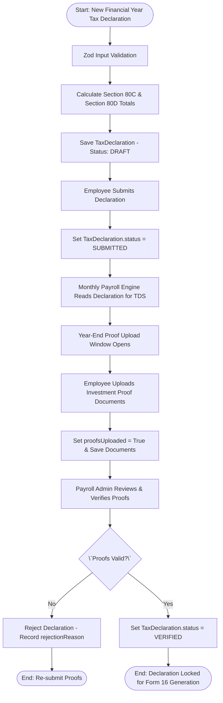
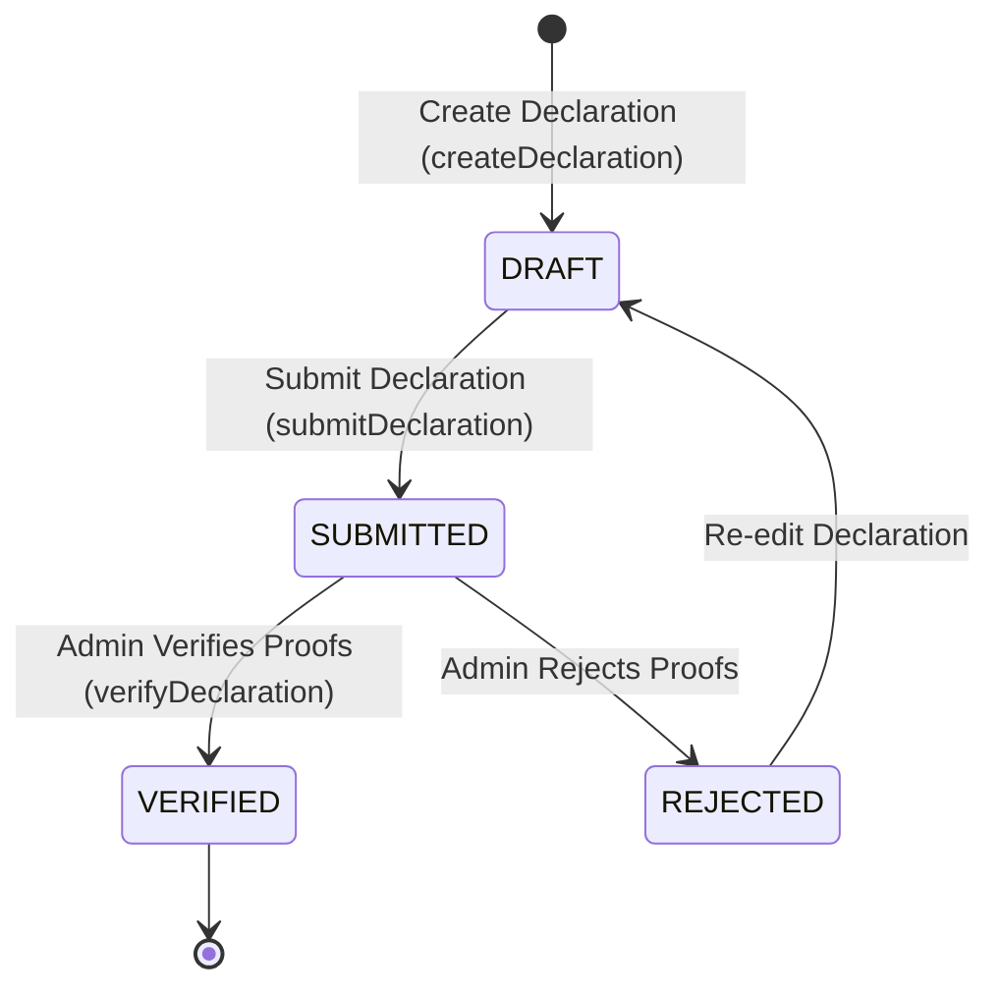

# Workflow 14 — Tax Declaration Submission Enterprise Specification

> **Document Code:** `SPEC-WF-14`  
> **System:** AuraOS Enterprise ERP / HCM Platform  
> **Version:** 1.0.0  
> **Date:** 2026-07-29  
> **Status:** Official Functional Specification  
> **Primary Code Location:** `apps/web/src/lib/services/payroll.service.ts`  
> **Primary API Route:** `POST /api/v1/tax-declarations`  
> **Primary Database Entity:** `TaxDeclaration` (`packages/@aura/database/prisma/schema.prisma#L2770-L2809`)

---

## Metadata Header

| Attribute                     | Value / Reference                                                             |
| ----------------------------- | ----------------------------------------------------------------------------- |
| **Workflow ID & Name**        | `14` — `Tax Declaration Submission Workflow`                                  |
| **Business Module**           | `Payroll & Financial Management`                                              |
| **Submodule / Domain**        | `Employee Tax Regime & Investment Deduction Governance`                       |
| **Business Process Owner**    | `Corporate Tax & Payroll Operations Director`                                 |
| **Technical System Owner**    | `Lead Financial Systems Architect`                                            |
| **Implementation Status**     | `Partially Implemented`                                                       |
| **Specification Version**     | `1.0.0`                                                                       |
| **Date Created / Updated**    | `2026-07-29`                                                                  |
| **Technical Author**          | `Enterprise Solution Architect (AI Agent)`                                    |
| **Technical Reviewer**        | `Senior Software Architect`                                                   |
| **QA Verifier**               | `QA Lead`                                                                     |
| **Final Approver**            | `Chief Product Officer`                                                       |
| **Primary Code Location**     | `apps/web/src/lib/services/payroll.service.ts`                                |
| **Primary API Route**         | `POST /api/v1/tax-declarations`                                               |
| **Primary Database Entity**   | `TaxDeclaration` (`packages/@aura/database/prisma/schema.prisma#L2770-L2809`) |
| **Related Architecture Docs** | `docs/architecture/WORKFLOW_AUDIT_FINDINGS.md`                                |

---

## Table of Contents

- [1. Executive Summary](#1-executive-summary)
- [2. Business Context](#2-business-context)
- [3. Business Objectives](#3-business-objectives)
- [4. Business Scope](#4-business-scope)
- [5. Workflow Overview](#5-workflow-overview)
- [6. Business Process Description](#6-business-process-description)
- [7. Mermaid Business Workflow Diagram](#7-mermaid-business-workflow-diagram)
- [8. Business Actors](#8-business-actors)
- [9. RACI Matrix](#9-raci-matrix)
- [10. Entry Points](#10-entry-points)
- [11. Trigger Events](#11-trigger-events)
- [12. Workflow Stages](#12-workflow-stages)
- [13. Workflow State Machine](#13-workflow-state-machine)
- [14. Approval Process](#14-approval-process)
- [15. Approval Matrix](#15-approval-matrix)
- [16. Decision Matrix](#16-decision-matrix)
- [17. Business Rules](#17-business-rules)
- [18. Compliance Rules](#18-compliance-rules)
- [19. Country-Specific Rules](#19-country-specific-rules)
- [20. Exception Handling](#20-exception-handling)
- [21. Notifications](#21-notifications)
- [22. Escalation Rules](#22-escalation-rules)
- [23. SLA Rules](#23-sla-rules)
- [24. RBAC Matrix](#24-rbac-matrix)
- [25. Audit Trail](#25-audit-trail)
- [26. UI Screens](#26-ui-screens)
- [27. Frontend Architecture](#27-frontend-architecture)
- [28. API Specification](#28-api-specification)
- [29. Backend Architecture](#29-backend-architecture)
- [30. Database Design](#30-database-design)
- [31. Integration Points](#31-integration-points)
- [32. Reports](#32-reports)
- [33. Dashboard KPIs](#33-dashboard-kpis)
- [34. Analytics](#34-analytics)
- [35. CURRENT IMPLEMENTATION](#35-current-implementation)
- [36. IMPLEMENTATION GAPS](#36-implementation-gaps)
- [37. PROPOSED ENTERPRISE IMPLEMENTATION](#37-proposed-enterprise-implementation)
- [38. Migration Strategy](#38-migration-strategy)
- [39. Testing Strategy](#39-testing-strategy)
- [40. Acceptance Criteria](#40-acceptance-criteria)
- [41. Implementation Checklist](#41-implementation-checklist)
- [42. Known Risks](#42-known-risks)
- [43. Related Architecture Findings](#43-related-architecture-findings)
- [44. Repository References](#44-repository-references)

---

## 1. Executive Summary

The **Tax Declaration Submission Workflow** manages the annual employee income tax regime election (e.g., Old vs. New Tax Regime in India) and statutory investment deduction declarations (Section 80C, Section 80D, HRA rent, Section 80E, 80G). The workflow enables employees to submit estimated investment declarations at the start of the financial year and upload proof documents towards year-end, allowing the payroll engine (`Workflow 11`) to compute accurate Tax Deducted at Source (TDS) withholdings.

The workflow is classified as **Partially Implemented**. Database entity models (`TaxDeclaration` in `packages/@aura/database/prisma/schema.prisma#L2770-L2809`), REST API handlers (`/api/v1/tax-declarations`), and service methods (`createDeclaration`, `submitDeclaration`, `verifyDeclaration`) are operational. However, proof document verification workflows and automatic TDS rebate recalculations carry technical debt.

---

## 2. Business Context

In taxable jurisdictions (such as India under Section 192 of the Income Tax Act), employers are legally obligated to deduct tax at source (TDS) from employee salary payments. Employees can optimize their tax liability by electing an appropriate tax regime and declaring eligible investments (PPF, ELSS, Life Insurance, Medical Insurance, Home Loan interest, House Rent Allowance). Accurate, verified tax declarations prevent employee over-taxation while protecting employers against tax authority audit non-compliance penalties.

---

## 3. Business Objectives

- **Automate Regime Election:** Enable employees to elect between `OLD` and `NEW` tax regimes for a given financial year.
- **Investment Deduction Math:** Automatically aggregate Section 80C (`PPF` + `ELSS` + `LifeInsurance` + `HomeLoanPrincipal`) and Section 80D (`MedicalSelf` + `MedicalParents`) totals.
- **Proof Document Upload & Verification:** Provide a workflow for employees to upload proof documents (`proofsUploaded`, `proofDocuments`) and Payroll Admins to verify declarations (`verifyDeclaration`).
- **Seamless TDS Integration:** Feed verified deduction totals into the monthly payroll engine to calculate accurate monthly TDS withholdings.

---

## 4. Business Scope

### 4.1 In-Scope

- Submission of initial tax declarations via `POST /api/v1/tax-declarations`.
- Zod schema validation (`createTaxDeclarationSchema`).
- Automated calculation of Section 80C, Section 80D, and `totalDeductions`.
- Declaration submission (`submitDeclaration`) and HR verification (`verifyDeclaration`).
- Unique constraint enforcement (`tenantId_employeeId_financialYear`).

### 4.2 Out-of-Scope

- Direct electronic filing of Form 16 / Tax returns with government tax portals (handled by Tax Portal Gateway).

---

## 5. Workflow Overview

The tax declaration lifecycle spans initial election, submission, proof verification, and monthly TDS integration:

```
┌─────────────┐     ┌───────────┐     ┌───────────┐     ┌───────────┐     ┌─────────────┐
│ Employee    │ ──> │ DRAFT     │ ──> │ SUBMITTED │ ──> │ VERIFIED  │ ──> │ Monthly TDS │
│ Declares    │     │ Status    │     │ Status    │     │ Status    │     │ Integration │
└─────────────┘     └───────────┘     └───────────┘     └───────────┘     └─────────────┘
```

---

## 6. Business Process Description

1. **Draft Creation:** At the start of the financial year (`financialYear`), the employee selects a `taxRegime` (`OLD` or `NEW`) and inputs planned investments (PPF, ELSS, HRA rent, medical insurance). `PayrollService.createDeclaration()` computes `section80C` and `section80D` totals, saving the record as `DRAFT`.
2. **Declaration Submission:** The employee submits the declaration via `submitDeclaration()`. The status transitions to `SUBMITTED`, recording `submittedAt`.
3. **Monthly TDS Impact:** During monthly payroll runs (`Workflow 11`), the payroll engine reads active `SUBMITTED` or `VERIFIED` declarations to compute monthly TDS deductions.
4. **Proof Upload Window:** Towards year-end (Q4), the employee uploads investment proof documents (`proofsUploaded = true`, `proofDocuments`).
5. **Verification & Lock:** Payroll Admin reviews uploaded proofs. Calling `verifyDeclaration()` updates status to `VERIFIED`, recording `verifiedBy` and `verifiedAt`. Verified numbers locked for annual Form 16 generation.

---

## 7. Mermaid Business Workflow Diagram



---

## 8. Business Actors

| Actor Role         | Actor Type | System Persona   | Operational Responsibilities                                       |
| ------------------ | ---------- | ---------------- | ------------------------------------------------------------------ |
| **Employee**       | Human      | `EMPLOYEE`       | Selects tax regime, declares investments, uploads proof documents  |
| **Payroll Admin**  | Human      | `PAYROLL_ADMIN`  | Reviews uploaded proof documents, verifies or rejects declarations |
| **Payroll Engine** | System     | `PayrollService` | Aggregates deductions and computes monthly TDS withholdings        |

---

## 9. RACI Matrix

| Workflow Activity           | Employee  | Payroll Admin | Payroll Engine |    Prisma DB     |
| --------------------------- | :-------: | :-----------: | :------------: | :--------------: |
| Create / Submit Declaration | **R / A** |       I       |       C        |        C         |
| Deduction Math              |     I     |       I       |   **R / A**    |        C         |
| Upload Proofs               | **R / A** |       I       |       I        |        C         |
| Verify Declaration          |     I     |   **R / A**   |       I        | **A (VERIFIED)** |

---

## 10. Entry Points

- **Primary REST API Endpoint:** `POST /api/v1/tax-declarations` (`apps/web/src/app/api/v1/tax-declarations/route.ts#L38`)
- **Verify Endpoint:** `POST /api/v1/tax-declarations/[id]/verify`
- **Frontend Dashboard Screen:** `apps/web/src/app/dashboard/payroll/tax-declarations/page.tsx`

---

## 11. Trigger Events

| Trigger Event Name          | Trigger Type   | Source System / Action          | Payload Attributes                                     |
| --------------------------- | -------------- | ------------------------------- | ------------------------------------------------------ |
| `TAX_DECLARATION_CREATED`   | User UI Action | `POST /api/v1/tax-declarations` | `tenantId`, `employeeId`, `financialYear`, `taxRegime` |
| `TAX_DECLARATION_SUBMITTED` | User UI Action | `submitDeclaration()`           | `id`, `submittedAt`                                    |
| `TAX_DECLARATION_VERIFIED`  | Admin Action   | `verifyDeclaration()`           | `id`, `verifiedBy`, `verifiedAt`                       |

---

## 12. Workflow Stages

### 12.1 Stage 1: Declaration Draft (`DRAFT`)

- **Stage Identifier:** `DRAFT`
- **Stage Owner Role:** `EMPLOYEE`
- **SLA Window:** Financial Year Start (April 30)
- **Status Value:** `DRAFT`

### 12.2 Stage 2: Submission (`SUBMITTED`)

- **Stage Identifier:** `SUBMITTED`
- **Stage Owner Role:** `EMPLOYEE`
- **SLA Window:** Immediate
- **Status Value:** `SUBMITTED`

### 12.3 Stage 3: Verification (`VERIFIED`)

- **Stage Identifier:** `VERIFIED`
- **Stage Owner Role:** `PAYROLL_ADMIN`
- **SLA Window:** Financial Year End (March 15)
- **Status Value:** `VERIFIED`

---

## 13. Workflow State Machine



| From State  | To State    | Trigger / Method      | Prerequisites / Guards             | Side Effects                       |
| ----------- | ----------- | --------------------- | ---------------------------------- | ---------------------------------- |
| `[*]`       | `DRAFT`     | `createDeclaration()` | `createTaxDeclarationSchema` valid | Calculates 80C/80D totals          |
| `DRAFT`     | `SUBMITTED` | `submitDeclaration()` | Declaration complete               | Sets `submittedAt` timestamp       |
| `SUBMITTED` | `VERIFIED`  | `verifyDeclaration()` | Proof documents uploaded           | Sets `verifiedBy` and `verifiedAt` |
| `SUBMITTED` | `REJECTED`  | Rejection Action      | Invalid proof documents            | Records `rejectionReason`          |

---

## 14. Approval Process

Verification requires single-step administrative review from a Payroll Admin to confirm that uploaded proof documents match declared investment amounts.

---

## 15. Approval Matrix

| Stage               | Approver Role | Action                    | SLA Target |
| ------------------- | ------------- | ------------------------- | ---------- |
| Initial Declaration | Employee      | Self-Submit Declaration   | 30 Days    |
| Proof Verification  | Payroll Admin | Verify Uploaded Documents | 15 Days    |

---

## 16. Decision Matrix

| Proof Documents Uploaded? | Document Amounts Match? | Admin Action  | Declaration Status |
| ------------------------- | ----------------------- | ------------- | ------------------ |
| Yes                       | Yes                     | Verify        | `VERIFIED`         |
| Yes                       | No (Discrepancy)        | Reject Proofs | `REJECTED`         |
| No                        | Irrelevant              | Await Upload  | `SUBMITTED`        |

---

## 17. Business Rules

#### BR-PAY-TAX-001: Unique Financial Year Declaration

- **Category:** Data Integrity
- **Severity:** BLOCKED
- **Description:** Only one `TaxDeclaration` record can exist per employee per financial year (`tenantId_employeeId_financialYear`).
- **Repository Reference:** `packages/@aura/database/prisma/schema.prisma#L2809`

#### BR-PAY-TAX-002: Automatic Section 80C / 80D Aggregation

- **Category:** Calculation Math
- **Severity:** AUTOMATED
- **Description:** `createDeclaration()` MUST automatically aggregate 80C and 80D component sums into `section80C`, `section80D`, and `totalDeductions`.
- **Repository Reference:** `apps/web/src/lib/services/payroll.service.ts#L228-L238`

---

## 18. Compliance Rules

- **Statutory Form 16 Compliance:** Verified tax declarations form the legal basis for annual Form 16 / tax certificate generation.
- **Tenant Scoping:** All queries MUST include `tenantId`.

---

## 19. Country-Specific Rules

| Country Code | Statutory Reference        | Tax Regimes Offered                                             | Repository Reference                                 |
| ------------ | -------------------------- | --------------------------------------------------------------- | ---------------------------------------------------- |
| `IN`         | Income Tax Act Section 192 | `OLD` (with deductions) vs `NEW` (lower rates, zero deductions) | `packages/@aura/database/prisma/schema.prisma#L2775` |

---

## 20. Exception Handling

| Error Code | HTTP Status | Error Message                                           | Root Cause            |
| ---------- | :---------: | ------------------------------------------------------- | --------------------- |
| `E4030`    |    `403`    | `Forbidden: missing tax-declarations:create permission` | User lacks permission |
| `E1001`    |    `400`    | `Validation error`                                      | Zod schema invalid    |

---

## 21. Notifications

- Dispatches alerts upon status changes (`TAX_DECLARATION_SUBMITTED`, `TAX_DECLARATION_VERIFIED`).

---

## 22–23. Escalation & SLA Rules

- **Verification SLA:** 15 Days from proof upload.

---

## 24. RBAC Matrix

| Role            | Read Declarations | Create Declaration | Verify Declaration | Admin Override |
| --------------- | :---------------: | :----------------: | :----------------: | :------------: |
| `EMPLOYEE`      |     ✅ (Own)      |      ✅ (Own)      |         ❌         |       ❌       |
| `PAYROLL_ADMIN` |        ✅         |         ✅         |         ✅         |       ✅       |
| `TENANT_ADMIN`  |        ✅         |         ✅         |         ✅         |       ✅       |

---

## 25. Audit Trail & Logging

- Every verification records `verifiedBy`, `verifiedAt`, and `rejectionReason`.

---

## 26–27. UI & Frontend Architecture

- **Page Path:** `apps/web/src/app/dashboard/payroll/tax-declarations/page.tsx`
- Tax Declaration workspace enabling regime selection, deduction inputs, document uploads, and verification status tracking.

---

## 28. API Specification

### POST /api/v1/tax-declarations

- **HTTP Method:** `POST`
- **Route Path:** `/api/v1/tax-declarations`
- **Authentication:** `Bearer JWT` (Session Context)
- **Required Permission:** `tax-declarations:create`
- **Request Body (JSON):**
  ```json
  {
    "financialYear": "2026-2027",
    "taxRegime": "OLD",
    "ppf": 150000.0,
    "elss": 0,
    "lifeInsurance": 25000.0,
    "homeLoanPrincipal": 0,
    "medicalSelf": 25000.0,
    "medicalParents": 50000.0,
    "rentPaid": 180000.0
  }
  ```
- **Success Response (201 Created):**
  ```json
  {
    "success": true,
    "data": {
      "id": "tax_decl_999",
      "status": "DRAFT",
      "section80C": 150000.0,
      "section80D": 75000.0,
      "totalDeductions": 225000.0
    }
  }
  ```
- **Repository Implementation:** `apps/web/src/app/api/v1/tax-declarations/route.ts#L38-L62`

---

## 29. Backend Architecture

- **Service Class:** `PayrollService` (`apps/web/src/lib/services/payroll.service.ts`).
- **Database Model:** `prisma.taxDeclaration` (`packages/@aura/database/prisma/schema.prisma#L2770-L2809`).

---

## 30. Database Design

- **Prisma Entity Name:** `TaxDeclaration`
- **Schema Location:** `packages/@aura/database/prisma/schema.prisma#L2770-L2809`
- **Entity Attributes:**
  ```prisma
  model TaxDeclaration {
    id                String    @id @default(uuid())
    tenantId          String
    employeeId        String
    financialYear     String
    taxRegime         String    @default("OLD")
    section80C        Decimal   @default(0)
    section80D        Decimal   @default(0)
    totalDeductions   Decimal   @default(0)
    proofsUploaded    Boolean   @default(false)
    status            String    @default("DRAFT")
    submittedAt       DateTime?
    verifiedBy        String?
    verifiedAt        DateTime?
    createdAt         DateTime  @default(now())

    @@unique([tenantId, employeeId, financialYear])
    @@map("aura_tax_declaration")
  }
  ```

---

## 31–34. Integrations, Reports & KPIs

- **Internal Service Integrations:** `PayrollRun` calculation engine, `DocumentStorageService`.
- **Key KPIs:** Declaration Verification SLA (Days), Proof Verification Pass Rate (%), Average Tax Savings per Employee.

---

## 35. CURRENT IMPLEMENTATION

> [!NOTE]
> **CURRENT PRODUCTION IMPLEMENTATION STATUS:**
> The following section describes ONLY functionality verified by existing codebase artifacts.

### 35.1 Verified Codebase Capabilities

- Operational methods `createDeclaration`, `submitDeclaration`, `verifyDeclaration` in `PayrollService`.
- Zod schema `createTaxDeclarationSchema` validating investment categories.
- Database entity `TaxDeclaration` model verified in `schema.prisma#L2770-L2809`.

---

## 36. IMPLEMENTATION GAPS

| Functional Area          | Current Codebase State    | Target Enterprise Target                | Priority / Impact |
| ------------------------ | ------------------------- | --------------------------------------- | ----------------- |
| **OCR Document Reading** | Manual admin verification | Automated OCR proof document validation | Low / UX          |

---

## 37. PROPOSED ENTERPRISE IMPLEMENTATION

> [!IMPORTANT]
> **PROPOSED ENTERPRISE IMPLEMENTATION DISCLAIMER:**
> The features outlined below represent target enterprise architecture specifications and are NOT currently present in the production codebase.

### 37.1 AI OCR Proof Document Verification Engine [PROPOSED]

Integrate OCR computer vision to extract investment amounts directly from uploaded PDF receipts, auto-verifying matching declarations.

---

## 38. Migration Strategy

- No database schema migrations required; workflow is operational.

---

## 39. Testing Strategy

### 39.1 Functional Tests

- Verify `createDeclaration()` calculates correct `section80C` and `section80D` sums.
- Verify `verifyDeclaration()` updates status to `VERIFIED`.

---

## 40. Acceptance Criteria

```gherkin
Scenario: Successful Tax Declaration Submission and Verification
  GIVEN an employee in financialYear 2026-2027
  WHEN the employee submits a tax declaration under OLD regime with PPF=150000 and MedicalSelf=25000
  THEN section80C MUST be 150000, section80D MUST be 25000, and totalDeductions MUST be 175000
  AND when Payroll Admin verifies uploaded proofs via verifyDeclaration()
  THEN status MUST update to VERIFIED with verifiedBy timestamp recorded
```

---

## 41. Implementation Checklist

- [x] Schema validation `createTaxDeclarationSchema` verified
- [x] Service methods `createDeclaration()`, `submitDeclaration()`, `verifyDeclaration()` verified
- [x] Prisma model `TaxDeclaration` verified
- [x] REST API endpoint `/api/v1/tax-declarations` verified

---

## 42. Known Risks

- None; workflow is operational.

---

## 43. Related Architecture Findings

- **Architecture Audit Findings:** Detailed in `docs/architecture/WORKFLOW_AUDIT_FINDINGS.md`.

---

## 44. Repository References

### 44.1 Frontend Files

- `apps/web/src/app/dashboard/payroll/tax-declarations/page.tsx`

### 44.2 API Routes

- `apps/web/src/app/api/v1/tax-declarations/route.ts`

### 44.3 Backend Service Classes

- `apps/web/src/lib/services/payroll.service.ts`

### 44.4 Database Schema Models

- `packages/@aura/database/prisma/schema.prisma#L2770-L2809`

---

_End of Workflow 14 — Tax Declaration Submission Enterprise Specification._
