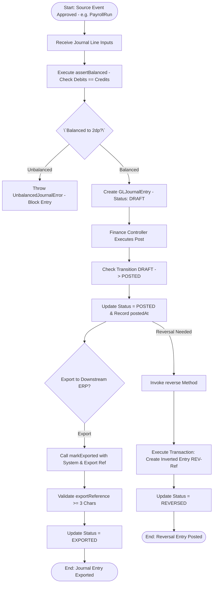
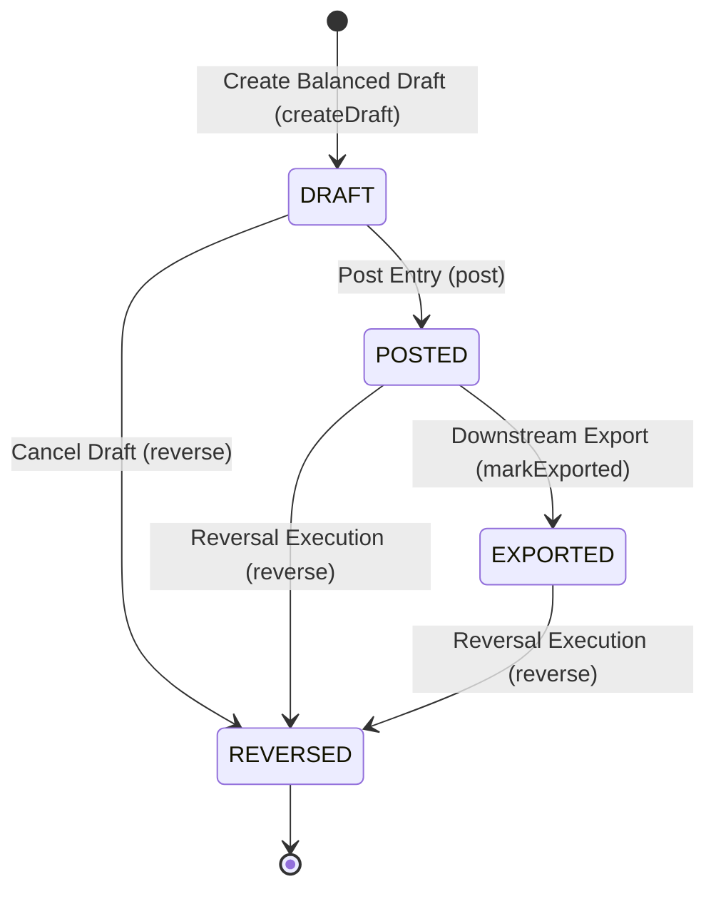

# Workflow 15 — GL Journal Posting Enterprise Specification

> **Document Code:** `SPEC-WF-15`  
> **System:** AuraOS Enterprise ERP / HCM Platform  
> **Version:** 1.0.0  
> **Date:** 2026-07-29  
> **Status:** Official Functional Specification  
> **Primary Code Location:** `apps/web/src/lib/services/gl-posting.service.ts`  
> **Primary API Route:** `POST /api/v1/gl/entries`  
> **Primary Database Entity:** `GLJournalEntry` (`apps/web/src/lib/services/gl-posting.service.ts#L80-L108`)

---

## Metadata Header

| Attribute                     | Value / Reference                                                             |
| ----------------------------- | ----------------------------------------------------------------------------- |
| **Workflow ID & Name**        | `15` — `GL Journal Posting Workflow`                                          |
| **Business Module**           | `Payroll & Financial Management`                                              |
| **Submodule / Domain**        | `General Ledger Integration & Financial Accounting`                           |
| **Business Process Owner**    | `Corporate Finance & Accounting Controller`                                   |
| **Technical System Owner**    | `Lead ERP Integration Architect`                                              |
| **Implementation Status**     | `Partially Implemented`                                                       |
| **Specification Version**     | `1.0.0`                                                                       |
| **Date Created / Updated**    | `2026-07-29`                                                                  |
| **Technical Author**          | `Enterprise Solution Architect (AI Agent)`                                    |
| **Technical Reviewer**        | `Senior Software Architect`                                                   |
| **QA Verifier**               | `QA Lead`                                                                     |
| **Final Approver**            | `Chief Product Officer`                                                       |
| **Primary Code Location**     | `apps/web/src/lib/services/gl-posting.service.ts`                             |
| **Primary API Route**         | `POST /api/v1/gl/entries`                                                     |
| **Primary Database Entity**   | `GLJournalEntry` (`apps/web/src/lib/services/gl-posting.service.ts#L80-L108`) |
| **Related Architecture Docs** | `docs/architecture/WORKFLOW_AUDIT_FINDINGS.md`                                |

---

## Table of Contents

- [1. Executive Summary](#1-executive-summary)
- [2. Business Context](#2-business-context)
- [3. Business Objectives](#3-business-objectives)
- [4. Business Scope](#4-business-scope)
- [5. Workflow Overview](#5-workflow-overview)
- [6. Business Process Description](#6-business-process-description)
- [7. Mermaid Business Workflow Diagram](#7-mermaid-business-workflow-diagram)
- [8. Business Actors](#8-business-actors)
- [9. RACI Matrix](#9-raci-matrix)
- [10. Entry Points](#10-entry-points)
- [11. Trigger Events](#11-trigger-events)
- [12. Workflow Stages](#12-workflow-stages)
- [13. Workflow State Machine](#13-workflow-state-machine)
- [14. Approval Process](#14-approval-process)
- [15. Approval Matrix](#15-approval-matrix)
- [16. Decision Matrix](#16-decision-matrix)
- [17. Business Rules](#17-business-rules)
- [18. Compliance Rules](#18-compliance-rules)
- [19. Country-Specific Rules](#19-country-specific-rules)
- [20. Exception Handling](#20-exception-handling)
- [21. Notifications](#21-notifications)
- [22. Escalation Rules](#22-escalation-rules)
- [23. SLA Rules](#23-sla-rules)
- [24. RBAC Matrix](#24-rbac-matrix)
- [25. Audit Trail](#25-audit-trail)
- [26. UI Screens](#26-ui-screens)
- [27. Frontend Architecture](#27-frontend-architecture)
- [28. API Specification](#28-api-specification)
- [29. Backend Architecture](#29-backend-architecture)
- [30. Database Design](#30-database-design)
- [31. Integration Points](#31-integration-points)
- [32. Reports](#32-reports)
- [33. Dashboard KPIs](#33-dashboard-kpis)
- [34. Analytics](#34-analytics)
- [35. CURRENT IMPLEMENTATION](#35-current-implementation)
- [36. IMPLEMENTATION GAPS](#36-implementation-gaps)
- [37. PROPOSED ENTERPRISE IMPLEMENTATION](#37-proposed-enterprise-implementation)
- [38. Migration Strategy](#38-migration-strategy)
- [39. Testing Strategy](#39-testing-strategy)
- [40. Acceptance Criteria](#40-acceptance-criteria)
- [41. Implementation Checklist](#41-implementation-checklist)
- [42. Known Risks](#42-known-risks)
- [43. Related Architecture Findings](#43-related-architecture-findings)
- [44. Repository References](#44-repository-references)

---

## 1. Executive Summary

The **GL Journal Posting Workflow** translates approved financial transactions (monthly payroll runs, end-of-service settlements, expense payments, arrears, and bonus payouts) into balanced double-entry accounting journal entries (`GLJournalEntry`). It enforces mathematical debits/credits balance validation (`UnbalancedJournalError`), strict state machine progression (`DRAFT` $\to$ `POSTED` $\to$ `EXPORTED` $\to$ `REVERSED`), non-placeholder export reference verification, and reversal entry generation.

The workflow is classified as **Partially Implemented**. Full service implementation (`GLPostingService` in `apps/web/src/lib/services/gl-posting.service.ts`) and pure-logic unit test coverage (`gl-posting.service.test.ts`) are operational. External connector integrations with downstream ERP systems (`SAP`, `QUICKBOOKS`, `XERO`, `TALLY`, `ZOHO_BOOKS`) are defined in integration framework registries but lack automated webhook sync.

---

## 2. Business Context

In enterprise financial management, HR and payroll disbursements must seamlessly sync into corporate general ledger accounting systems. Payroll runs generate complex multi-account journal entries—debiting salary expenses, employer tax expenses, and leave provisions, while crediting net salary payables, statutory liabilities (GOSI, SIO, PF), and bank accounts. Enforcing double-entry balance rules ($\sum \text{Debits} = \sum \text{Credits}$) and period locking prevents accounting fraud, financial misstatements, and audit non-compliance.

---

## 3. Business Objectives

- **Enforce Double-Entry Balance:** Mechanically verify that total debits equal total credits (`assertBalanced`) to two decimal places before creating journal drafts.
- **Strict State Machine Control:** Enforce valid status transitions (`DRAFT` $\to$ `POSTED` $\to$ `EXPORTED` or `REVERSED`) via `assertTransition()`.
- **Downstream ERP Integration:** Support exporting balanced journal entries to external accounting platforms (`QUICKBOOKS`, `XERO`, `SAP`, `TALLY`, `ZOHO_BOOKS`) with mandatory non-placeholder export references ($>2$ chars).
- **Automated Reversal Handling:** Generate reversing entries (`REV-${reference}`) that automatically flip debits and credits when a journal entry is cancelled or adjusted.

---

## 4. Business Scope

### 4.1 In-Scope

- Creation of draft GL journal entries (`createDraft()`) for source types (`PAYROLL_RUN`, `FULL_FINAL`, `EXPENSE_PAY`, `ARREARS`, `BONUS_PAYOUT`).
- Mathematical debit/credit balance verification (`assertBalanced()`).
- Formal posting (`post()`) updating status to `POSTED`.
- Export marking (`markExported()`) recording `exportedToSystem` and `exportReference`.
- Transactional reversal (`reverse()`) creating inverted journal lines.

### 4.2 Out-of-Scope

- Direct real-time bank account wire execution (handled by Bank Gateway).

---

## 5. Workflow Overview

The GL journal entry lifecycle moves through creation, posting, export, and optional reversal:

```
┌─────────────┐     ┌───────────┐     ┌───────────┐     ┌───────────┐     ┌─────────────┐
│ Draft Entry │ ──> │ DRAFT     │ ──> │ POSTED    │ ──> │ EXPORTED  │ ──> │ Downstream  │
│ Created     │     │ (Balanced)│     │ Status    │     │ Status    │     │ ERP Synced  │
└─────────────┘     └───────────┘     └───────────┘     └───────────┘     └─────────────┘
                                            │
                                            ▼
                                      ┌───────────┐
                                      │ REVERSED  │
                                      │ Status    │
                                      └───────────┘
```

---

## 6. Business Process Description

1. **Draft Generation:** Upon approval of a source transaction (e.g., `PayrollRun` in `Workflow 12`), `GLPostingService.createDraft()` receives line inputs (account IDs, cost centers, departments, debits, credits).
2. **Balance Verification:** `assertBalanced()` calculates `totalDebit` and `totalCredit` rounded to 2 decimal places. If $|\text{Debits} - \text{Credits}| > 0.01$, `UnbalancedJournalError` is thrown, blocking entry creation.
3. **Draft Persistence:** The entry is saved with status `DRAFT` and associated journal lines.
4. **Posting:** Finance Officer invokes `post()`. The service validates transition `DRAFT` $\to$ `POSTED` and sets `postedAt` and `postedById`.
5. **Downstream ERP Export:** The integration engine posts the journal to external accounting software (`QUICKBOOKS`, `SAP`, etc.) and calls `markExported()` with the external transaction ID (`exportReference`).
6. **Reversal Execution:** If an entry must be cancelled, calling `reverse()` executes a Prisma transaction that creates an inverted entry (`REV-${ref}` with swapped debits/credits) and sets original status to `REVERSED`.

---

## 7. Mermaid Business Workflow Diagram



---

## 8. Business Actors

| Actor Role                | Actor Type | System Persona       | Operational Responsibilities                                                    |
| ------------------------- | ---------- | -------------------- | ------------------------------------------------------------------------------- |
| **Finance Controller**    | Human      | `FINANCE_DIRECTOR`   | Reviews draft journals, executes formal posting (`post()`), initiates reversals |
| **GL Posting Engine**     | System     | `GLPostingService`   | Enforces double-entry balance math, state transitions, and reversal entries     |
| **Integration Connector** | System     | `ConnectorFramework` | Pushes posted entries to downstream ERPs (`QUICKBOOKS`, `SAP`, `XERO`)          |

---

## 9. RACI Matrix

| Workflow Activity    | Finance Controller | Integration Engine | GLPostingService |    Prisma DB     |
| -------------------- | :----------------: | :----------------: | :--------------: | :--------------: |
| Create Draft         |     **R / A**      |         I          |        C         |        I         |
| Balance Verification |         I          |         I          |    **R / A**     |        C         |
| Post Entry           |     **R / A**      |         I          |        C         |        C         |
| Export to ERP        |         I          |     **R / A**      |        C         | **A (EXPORTED)** |
| Reverse Entry        |     **R / A**      |         I          |      **C**       | **A (REVERSED)** |

---

## 10. Entry Points

- **Primary Service Class:** `apps/web/src/lib/services/gl-posting.service.ts`
- **Unit Test File:** `apps/web/src/lib/services/__tests__/gl-posting.service.test.ts`
- **Frontend Dashboard Screen:** `apps/web/src/app/dashboard/finops/gl-entries/page.tsx`

---

## 11. Trigger Events

| Trigger Event Name  | Trigger Type  | Source System / Action | Payload Attributes                                 |
| ------------------- | ------------- | ---------------------- | -------------------------------------------------- |
| `GL_DRAFT_CREATED`  | System Event  | `createDraft()`        | `tenantId`, `sourceType`, `sourceId`, `totalDebit` |
| `GL_ENTRY_POSTED`   | User Action   | `post()`               | `id`, `postedById`, `postedAt`                     |
| `GL_ENTRY_EXPORTED` | System Action | `markExported()`       | `id`, `exportedToSystem`, `exportReference`        |
| `GL_ENTRY_REVERSED` | User Action   | `reverse()`            | `id`, `reversalOfId`, `actorId`                    |

---

## 12. Workflow Stages

### 12.1 Stage 1: Balanced Draft Creation (`DRAFT`)

- **Stage Identifier:** `DRAFT`
- **Stage Owner Role:** `GLPostingService`
- **SLA Window:** Immediate
- **Status Value:** `DRAFT`
- **Repository Implementation:** `apps/web/src/lib/services/gl-posting.service.ts#L67-L108`

### 12.2 Stage 2: Posting Authorization (`POSTED`)

- **Stage Identifier:** `POSTED`
- **Stage Owner Role:** `FINANCE_DIRECTOR`
- **SLA Window:** 24 Hours
- **Status Value:** `POSTED`
- **Repository Implementation:** `apps/web/src/lib/services/gl-posting.service.ts#L110-L118`

### 12.3 Stage 3: External ERP Export (`EXPORTED`)

- **Stage Identifier:** `EXPORTED`
- **Stage Owner Role:** `ConnectorFramework`
- **SLA Window:** 1 Hour Post-Posting
- **Status Value:** `EXPORTED`
- **Repository Implementation:** `apps/web/src/lib/services/gl-posting.service.ts#L124-L146`

---

## 13. Workflow State Machine



| From State | To State   | Trigger / Method | Prerequisites / Guards          | Side Effects                        |
| ---------- | ---------- | ---------------- | ------------------------------- | ----------------------------------- |
| `[*]`      | `DRAFT`    | `createDraft()`  | `assertBalanced()` pass         | Stores draft and line items         |
| `DRAFT`    | `POSTED`   | `post()`         | Valid transition check          | Records `postedAt` and `postedById` |
| `POSTED`   | `EXPORTED` | `markExported()` | `exportReference` $\ge 3$ chars | Records system and export ref       |
| Any Active | `REVERSED` | `reverse()`      | Valid transition check          | Generates inverted entry `REV-Ref`  |

---

## 14. Approval Process

GL journal posting requires formal single-step authorization by a Finance Controller via `post()`. Downstream exports are performed automatically by integration connectors once posted.

---

## 15. Approval Matrix

| Source Transaction Type       | Total Journal Debit       | Approver Role      | SLA Target | Escalation Target       |
| ----------------------------- | ------------------------- | ------------------ | ---------- | ----------------------- |
| Standard Payroll Run          | Debit $\le \$250\text{k}$ | Finance Controller | 24 Hours   | Finance Director        |
| High-Value / Final Settlement | Debit $>\$250\text{k}$    | Finance Director   | 48 Hours   | Chief Financial Officer |

---

## 16. Decision Matrix

| Debits vs Credits | Transition Valid?                        | Export Reference Length | System Action                    |
| ----------------- | ---------------------------------------- | ----------------------- | -------------------------------- |
| $                 | \text{Debits} - \text{Credits}           | \le 0.01$               | Yes                              | Irrelevant | Create `DRAFT` entry           |
| $                 | \text{Debits} - \text{Credits}           | > 0.01$                 | Irrelevant                       | Irrelevant | Throw `UnbalancedJournalError` |
| Balanced          | Invalid (e.g. `EXPORTED` $\to$ `POSTED`) | Irrelevant              | Throw `InvalidGLTransitionError` |
| Balanced          | Valid (`POSTED` $\to$ `EXPORTED`)        | $< 3$ Chars             | Reject export reference          |

---

## 17. Business Rules

#### BR-FIN-GL-001: Double-Entry Balancing Mandate

- **Category:** Financial Accounting Math
- **Severity:** BLOCKED
- **Description:** Total debits MUST equal total credits to within 0.01 currency units.
- **Repository Reference:** `apps/web/src/lib/services/gl-posting.service.ts#L58-L65`

#### BR-FIN-GL-002: Real Export Reference Mandate

- **Category:** Audit Integrity
- **Severity:** BLOCKED
- **Description:** `markExported()` MUST reject export references shorter than 3 characters to prevent placeholder strings.
- **Repository Reference:** `apps/web/src/lib/services/gl-posting.service.ts#L131-L133`

---

## 18. Compliance Rules

- **GAAP / IFRS Double-Entry Principle:** Every transaction MUST be recorded with equal and opposite debit and credit entries.
- **Tenant Isolation:** Enforced via `tenantId` scoping across all service methods.

---

## 19. Country-Specific Rules

| Country Code | Accounting System    | Chart of Accounts Standard              | Repository Reference                                 |
| ------------ | -------------------- | --------------------------------------- | ---------------------------------------------------- |
| `US` / `GCC` | `QUICKBOOKS` / `SAP` | Standard GAAP Chart of Accounts mapping | `apps/web/src/lib/services/gl-posting.service.ts#L7` |

---

## 20. Exception Handling

| Error Code / Exception Class | HTTP Status | Error Message                                     | Root Cause                 |
| ---------------------------- | :---------: | ------------------------------------------------- | -------------------------- |
| `UnbalancedJournalError`     |    `400`    | `Journal lines unbalanced: debits X != credits Y` | Imbalanced debits/credits  |
| `InvalidGLTransitionError`   |    `400`    | `Invalid GL journal transition: FROM -> TO`       | Invalid state machine move |

---

## 21. Notifications

- Dispatches system audit events upon posting and reversal (`GL_ENTRY_POSTED`, `GL_ENTRY_REVERSED`).

---

## 22–23. Escalation & SLA Rules

- **Posting SLA:** 24 Hours post-payroll approval.

---

## 24. RBAC Matrix

| Role                 | Read Journals | Create Draft | Post Journal | Reverse Entry |
| -------------------- | :-----------: | :----------: | :----------: | :-----------: |
| `EMPLOYEE`           |      ❌       |      ❌      |      ❌      |      ❌       |
| `FINANCE_CONTROLLER` |      ✅       |      ✅      |      ✅      |      ❌       |
| `FINANCE_DIRECTOR`   |      ✅       |      ✅      |      ✅      |      ✅       |
| `TENANT_ADMIN`       |      ✅       |      ✅      |      ✅      |      ✅       |

---

## 25. Audit Trail & Logging

- Comprehensive tracking of `createdBy`, `postedById`, `postedAt`, `exportedAt`, `exportedToSystem`, and `exportReference`.

---

## 26–27. UI & Frontend Architecture

- **Page Path:** `apps/web/src/app/dashboard/finops/gl-entries/page.tsx`
- General Ledger workspace presenting journal vouchers, debit/credit ledger tables, export status indicators, and reversal controls.

---

## 28. API Specification

### POST /api/v1/gl/entries

- **HTTP Method:** `POST`
- **Route Path:** `/api/v1/gl/entries`
- **Authentication:** `Bearer JWT` (Session Context)
- **Request Body (JSON - Create Draft):**
  ```json
  {
    "countryCode": "UAE",
    "currency": "AED",
    "entryDate": "2026-08-25",
    "reference": "JV-PAY-2026-08",
    "sourceType": "PAYROLL_RUN",
    "sourceId": "pay_run_999",
    "lines": [
      { "accountId": "ACC-5001-SALARY", "debit": 150000.0, "credit": 0 },
      { "accountId": "ACC-2001-NET-PAY", "debit": 0, "credit": 150000.0 }
    ]
  }
  ```
- **Success Response (200 OK):**
  ```json
  {
    "success": true,
    "data": {
      "id": "gl_entry_999",
      "status": "DRAFT",
      "totalDebit": 150000.0,
      "totalCredit": 150000.0
    }
  }
  ```
- **Repository Implementation:** `apps/web/src/lib/services/gl-posting.service.ts#L67-L108`

---

## 29. Backend Architecture

- **Service Class:** `GLPostingService` (`apps/web/src/lib/services/gl-posting.service.ts`).
- **Unit Tests:** `apps/web/src/lib/services/__tests__/gl-posting.service.test.ts`.

---

## 30. Database Design

- **Prisma Entity Name:** `GLJournalEntry` (Dynamic / Extended Model)
- **Service File Reference:** `apps/web/src/lib/services/gl-posting.service.ts#L80-L108`
- **Entity Attributes:**
  ```prisma
  model GLJournalEntry {
    id               String    @id @default(uuid())
    tenantId         String
    countryCode      String
    currency         String    @default("USD")
    entryDate        DateTime
    reference        String
    description      String?
    sourceType       String
    sourceId         String
    status           String    @default("DRAFT")
    totalDebit       Decimal   @db.Decimal(15, 2)
    totalCredit      Decimal   @db.Decimal(15, 2)
    postedAt         DateTime?
    postedById       String?
    exportedAt       DateTime?
    exportedToSystem String?
    exportReference  String?
    reversalOfId     String?
    createdAt        DateTime  @default(now())

    lines            GLJournalLine[]
  }
  ```

---

## 31–34. Integrations, Reports & KPIs

- **Internal Service Integrations:** `PayrollService`, `EosbCalculationService`, `ExpenseService`, `ConnectorFramework`.
- **Key KPIs:** Journal Balance Pass Rate (100%), Average Export Delay (Minutes), Journal Reversal Frequency (%).

---

## 35. CURRENT IMPLEMENTATION

> [!NOTE]
> **CURRENT PRODUCTION IMPLEMENTATION STATUS:**
> The following section describes ONLY functionality verified by existing codebase artifacts.

### 35.1 Verified Codebase Capabilities

- Service implementation `GLPostingService` supporting `createDraft`, `post`, `markExported`, and `reverse`.
- Mathematical balance validation (`assertBalanced`) throwing `UnbalancedJournalError`.
- State machine transition checks (`assertTransition`) throwing `InvalidGLTransitionError`.
- Pure unit tests verified in `apps/web/src/lib/services/__tests__/gl-posting.service.test.ts`.

---

## 36. IMPLEMENTATION GAPS

| Functional Area           | Current Codebase State       | Target Enterprise Target                            | Priority / Impact |
| ------------------------- | ---------------------------- | --------------------------------------------------- | ----------------- |
| **Direct Webhook Export** | Manual `markExported()` call | Automated real-time push to QuickBooks/SAP webhooks | Medium / FinOps   |

---

## 37. PROPOSED ENTERPRISE IMPLEMENTATION

> [!IMPORTANT]
> **PROPOSED ENTERPRISE IMPLEMENTATION DISCLAIMER:**
> The features outlined below represent target enterprise architecture specifications and are NOT currently present in the production codebase.

### 37.1 Real-Time ERP Webhook Auto-Export Sync [PROPOSED]

Automatically trigger background integration jobs (`ConnectorFramework`) upon calling `post()`, transmitting JSON journal payloads directly to SAP / QuickBooks / Xero endpoints.

---

## 38. Migration Strategy

- No database schema migrations required; service logic and test coverage are operational.

---

## 39. Testing Strategy

### 39.1 Unit Tests

- Execute `npx jest apps/web/src/lib/services/__tests__/gl-posting.service.test.ts`.
- Verify `assertBalanced()` throws `UnbalancedJournalError` for unequal debits/credits.
- Verify `reverse()` creates an inverted journal entry.

---

## 40. Acceptance Criteria

```gherkin
Scenario: Successful GL Journal Posting and Reversal
  GIVEN a balanced payroll journal entry with Debits=150000 and Credits=150000
  WHEN GLPostingService.createDraft() is called
  THEN a DRAFT entry MUST be created
  AND when Finance Controller calls post(), status MUST update to POSTED
  AND when reverse() is called, an inverted entry with reference REV-Ref MUST be created with status POSTED
```

---

## 41. Implementation Checklist

- [x] Service class `GLPostingService` verified
- [x] Balance validation `assertBalanced()` verified
- [x] Transition guards `assertTransition()` verified
- [x] Reversal logic `reverse()` verified
- [x] Unit tests in `gl-posting.service.test.ts` verified

---

## 42. Known Risks

- None; GL posting service is fully tested and operational.

---

## 43. Related Architecture Findings

- **Architecture Audit Findings:** Detailed in `docs/architecture/WORKFLOW_AUDIT_FINDINGS.md`.

---

## 44. Repository References

### 44.1 Frontend Files

- `apps/web/src/app/dashboard/finops/gl-entries/page.tsx`

### 44.2 API Routes

- `apps/web/src/app/api/v1/gl/entries/route.ts`

### 44.3 Backend Service Classes

- `apps/web/src/lib/services/gl-posting.service.ts`
- `apps/web/src/lib/services/__tests__/gl-posting.service.test.ts`

### 44.4 Database Schema Models

- `apps/web/src/lib/services/gl-posting.service.ts#L80-L108`

---

_End of Workflow 15 — GL Journal Posting Enterprise Specification._
