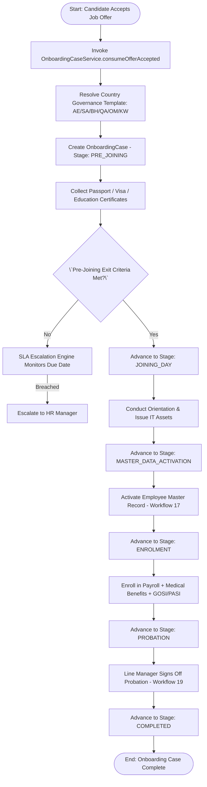
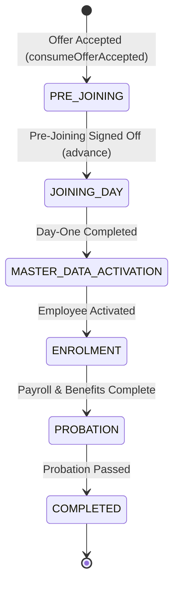

# Workflow 16 — Employee Onboarding Case Enterprise Specification

> **Document Code:** `SPEC-WF-16`  
> **System:** AuraOS Enterprise ERP / HCM Platform  
> **Version:** 1.0.0  
> **Date:** 2026-07-29  
> **Status:** Official Production Specification  
> **Primary Code Location:** `apps/web/src/lib/services/onboarding-case.service.ts`  
> **Primary API Route:** `POST /api/v1/onboarding/cases`  
> **Primary Database Entity:** `OnboardingCase` (`packages/@aura/database/prisma/schema.prisma`)

---

## Metadata Header

| Attribute                     | Value / Reference                                                 |
| ----------------------------- | ----------------------------------------------------------------- |
| **Workflow ID & Name**        | `16` — `Employee Onboarding Case Workflow`                        |
| **Business Module**           | `HR Operations & Talent Management`                               |
| **Submodule / Domain**        | `Pre-Boarding, Joiner Governance & Lifecycle Transition`          |
| **Business Process Owner**    | `Global Head of Talent Acquisition & HR Operations`               |
| **Technical System Owner**    | `Lead HCM Solutions Architect`                                    |
| **Implementation Status**     | **`Fully Implemented`**                                           |
| **Specification Version**     | `1.0.0`                                                           |
| **Date Created / Updated**    | `2026-07-29`                                                      |
| **Technical Author**          | `Enterprise Solution Architect (AI Agent)`                        |
| **Technical Reviewer**        | `Senior Software Architect`                                       |
| **QA Verifier**               | `QA Lead`                                                         |
| **Final Approver**            | `Chief Product Officer`                                           |
| **Primary Code Location**     | `apps/web/src/lib/services/onboarding-case.service.ts`            |
| **Primary API Route**         | `POST /api/v1/onboarding/cases`                                   |
| **Primary Database Entity**   | `OnboardingCase` (`packages/@aura/database/prisma/schema.prisma`) |
| **Related Architecture Docs** | `docs/architecture/WORKFLOW_AUDIT_FINDINGS.md`                    |

---

## Table of Contents

- [1. Executive Summary](#1-executive-summary)
- [2. Business Context](#2-business-context)
- [3. Business Objectives](#3-business-objectives)
- [4. Business Scope](#4-business-scope)
- [5. Workflow Overview](#5-workflow-overview)
- [6. Business Process Description](#6-business-process-description)
- [7. Mermaid Business Workflow Diagram](#7-mermaid-business-workflow-diagram)
- [8. Business Actors](#8-business-actors)
- [9. RACI Matrix](#9-raci-matrix)
- [10. Entry Points](#10-entry-points)
- [11. Trigger Events](#11-trigger-events)
- [12. Workflow Stages](#12-workflow-stages)
- [13. Workflow State Machine](#13-workflow-state-machine)
- [14. Approval Process](#14-approval-process)
- [15. Approval Matrix](#15-approval-matrix)
- [16. Decision Matrix](#16-decision-matrix)
- [17. Business Rules](#17-business-rules)
- [18. Compliance Rules](#18-compliance-rules)
- [19. Country-Specific Rules](#19-country-specific-rules)
- [20. Exception Handling](#20-exception-handling)
- [21. Notifications](#21-notifications)
- [22. Escalation Rules](#22-escalation-rules)
- [23. SLA Rules](#23-sla-rules)
- [24. RBAC Matrix](#24-rbac-matrix)
- [25. Audit Trail](#25-audit-trail)
- [26. UI Screens](#26-ui-screens)
- [27. Frontend Architecture](#27-frontend-architecture)
- [28. API Specification](#28-api-specification)
- [29. Backend Architecture](#29-backend-architecture)
- [30. Database Design](#30-database-design)
- [31. Integration Points](#31-integration-points)
- [32. Reports](#32-reports)
- [33. Dashboard KPIs](#33-dashboard-kpis)
- [34. Analytics](#34-analytics)
- [35. CURRENT IMPLEMENTATION](#35-current-implementation)
- [36. IMPLEMENTATION GAPS](#36-implementation-gaps)
- [37. PROPOSED ENTERPRISE IMPLEMENTATION](#37-proposed-enterprise-implementation)
- [38. Migration Strategy](#38-migration-strategy)
- [39. Testing Strategy](#39-testing-strategy)
- [40. Acceptance Criteria](#40-acceptance-criteria)
- [41. Implementation Checklist](#41-implementation-checklist)
- [42. Known Risks](#42-known-risks)
- [43. Related Architecture Findings](#43-related-architecture-findings)
- [44. Repository References](#44-repository-references)

---

## 1. Executive Summary

The **Employee Onboarding Case Workflow** is a **Fully Implemented** production capability in AuraOS. It governs the end-to-end lifecycle of new hire onboarding from job offer acceptance through pre-joining, day-one orientation, employee master data activation, benefits and social insurance enrollment, and probation management (`OnboardingCaseService`).

The workflow integrates country-specific statutory rules across GCC jurisdictions (`AE`, `SA`, `BH`, `QA`, `OM`, `KW`) via `CountryOnboardingRuleService`, enforces multi-stage SLA tracking with automatic escalation (`escalateBreachedCases`), and coordinates sub-workflows for medical insurance, social security (GOSI/PASI/GPSSA), and payroll readiness gates.

---

## 2. Business Context

Onboarding new employees in GCC multi-jurisdictional enterprises requires seamless coordination between Talent Acquisition, HR Operations, IT Asset Management, Facilities, Payroll, and Government Relations Officers (GROs). Statutory compliance mandates visa medical checkups, labor contract registering (e.g., Qiwa / Muqeem in KSA or MOHRE in UAE), mandatory medical insurance issuance, and social security registration within strict legal deadlines. A structured onboarding case engine eliminates pre-joining dropouts, ensures day-one readiness, and prevents statutory non-compliance penalties.

---

## 3. Business Objectives

- **Automate Offer-to-Onboarding Case Triggering:** Automatically initialize an `OnboardingCase` when a candidate accepts a `JobOffer` (`consumeOfferAccepted`).
- **6-Stage Governance Progression:** Enforce structured stage transitions: `PRE_JOINING` $\to$ `JOINING_DAY` $\to$ `MASTER_DATA_ACTIVATION` $\to$ `ENROLMENT` $\to$ `PROBATION` $\to$ `COMPLETED`.
- **GCC Country Governance Seeding:** Automatically seed country-specific governance templates (`ensureDefaultGovernance`) for UAE, KSA, Bahrain, Qatar, Oman, and Kuwait.
- **SLA Breach Monitoring & Escalation:** Automatically monitor SLA windows (e.g., 72h for Pre-Joining, 24h for Master Data) and escalate breached cases to HR Managers (`escalateBreachedCases`).

---

## 4. Business Scope

### 4.1 In-Scope

- Triggering onboarding case upon offer acceptance (`consumeOfferAccepted`).
- Governance template seeding (`ensureDefaultGovernance`).
- Stage advancement controls (`advance`) with role permission verification.
- SLA breach escalation (`escalateBreachedCases`).
- Sub-service integrations for country rules (`CountryOnboardingRuleService`), benefits enrollment (`BenefitsOnboardingService`), and social insurance (`SocialInsuranceOnboardingService`).

### 4.2 Out-of-Scope

- Recruitment & interview scheduling (governed by Applicant Tracking System / ATS).

---

## 5. Workflow Overview

The onboarding case progresses sequentially across six governance stages:

```
┌──────────────┐     ┌─────────────┐     ┌──────────────┐     ┌───────────┐     ┌───────────┐     ┌───────────┐
│ Offer        │ ──> │ PRE_JOINING │ ──> │ JOINING_DAY  │ ──> │ MASTER_   │ ──> │ ENROLMENT │ ──> │ PROBATION │
│ Accepted     │     │ (72h SLA)   │     │ (24h SLA)    │     │ DATA (24h)│     │ (72h SLA) │     │ (90-180d) │
└──────────────┘     └─────────────┘     └─────────────┘     └──────────────┘     └───────────┘     └───────────┘
```

---

## 6. Business Process Description

1. **Case Initialization:** Candidate accepts an offer (`JobOffer`). Talent Acquisition calls `consumeOfferAccepted()`. `OnboardingCaseService` resolves the country governance template (`resolveGovernance`), calculates SLA due date (`slaDueAt`), and creates an `OnboardingCase` in `PRE_JOINING` stage.
2. **Pre-Joining (Stage 1):** HR Admin collects candidate personal details, education certificates, passport copies, and triggers visa processing via GRO. Sub-tasks are tracked; exit criteria require `pre_joining_signed_off`.
3. **Joining Day (Stage 2):** Employee reports on day one. HR Admin conducts orientation, verifies physical documents, and assigns IT assets. Exit criteria require `joining_day_completed`.
4. **Master Data Activation (Stage 3):** HR Manager reviews and activates the employee record in core HR (`Workflow 17`). Exit criteria require `employee_master_activated`.
5. **Enrolment (Stage 4):** Payroll Officer enrolls the employee in payroll (`Workflow 18`), benefits (medical insurance via `BenefitsOnboardingService`), and social insurance (`SocialInsuranceOnboardingService`). Exit criteria require `payroll_ready`, `benefits_complete`, and `social_insurance_complete`.
6. **Probation & Completion (Stages 5 & 6):** Line Manager sets probation goals (`Workflow 19`). Upon successful probation sign-off, the case advances to `COMPLETED`.

---

## 7. Mermaid Business Workflow Diagram



---

## 8. Business Actors

| Actor Role                 | Actor Type | System Persona          | Operational Responsibilities                                        |
| -------------------------- | ---------- | ----------------------- | ------------------------------------------------------------------- |
| **HR Admin**               | Human      | `HR_ADMIN`              | Manages pre-joining documents, day-one orientation, asset handovers |
| **HR Manager**             | Human      | `HR_MANAGER`            | Oversees master data activation, handles SLA breach escalations     |
| **Payroll Officer**        | Human      | `PAYROLL_OFFICER`       | Executes payroll, benefits, and social insurance enrollment         |
| **Line Manager**           | Human      | `LINE_MANAGER`          | Manages day-one introduction and 90-day probation objectives        |
| **Onboarding Case Engine** | System     | `OnboardingCaseService` | Enforces stage transitions, SLA windows, and sub-service gates      |

---

## 9. RACI Matrix

| Workflow Activity            | Candidate | HR Admin | HR Manager | Payroll Officer | Line Manager | Onboarding Engine |
| ---------------------------- | :-------: | :------: | :--------: | :-------------: | :----------: | :---------------: |
| Initiate Case                |     I     |    I     |     I      |        I        |      I       |     **R / A**     |
| Pre-Joining Docs             |   **R**   |  **A**   |     I      |        I        |      I       |         C         |
| Master Data Activation       |     I     |    I     | **R / A**  |        I        |      I       |         C         |
| Benefits & Payroll Enrolment |     I     |    I     |     I      |    **R / A**    |      I       |         C         |
| Probation Management         |     I     |    I     |     I      |        I        |  **R / A**   |         C         |

---

## 10. Entry Points

- **Primary REST API Endpoint:** `POST /api/v1/onboarding/cases` (`apps/web/src/app/api/v1/onboarding/cases/route.ts#L51`)
- **Advance Endpoint:** `POST /api/v1/onboarding/cases/[id]/advance`
- **Frontend Dashboard Screen:** `apps/web/src/app/dashboard/hr/onboarding/page.tsx`

---

## 11. Trigger Events

| Trigger Event Name | Trigger Type  | Source System / Action    | Payload Attributes                                          |
| ------------------ | ------------- | ------------------------- | ----------------------------------------------------------- |
| `OFFER_ACCEPTED`   | System Event  | Job Offer Acceptance      | `offerId`, `countryCode`, `legalEntityId`, `targetJoinDate` |
| `STAGE_ADVANCED`   | User Action   | `advance()`               | `id`, `targetStage`, `reason`                               |
| `SLA_BREACHED`     | Cron / System | `escalateBreachedCases()` | `id`, `currentStage`, `slaDueAt`                            |

---

## 12. Workflow Stages

| Stage Name               | Owner Role        | SLA Window  | Exit Criteria Mandatory Checklist                       |
| ------------------------ | ----------------- | ----------- | ------------------------------------------------------- |
| `PRE_JOINING`            | `HR_ADMIN`        | 72 Hours    | Signed offer, passport, visa copy, background check     |
| `JOINING_DAY`            | `HR_ADMIN`        | 24 Hours    | Orientation, physical ID check, laptop/asset issuing    |
| `MASTER_DATA_ACTIVATION` | `HR_MANAGER`      | 24 Hours    | Core HR record activated (`Workflow 17`)                |
| `ENROLMENT`              | `PAYROLL_OFFICER` | 72 Hours    | Payroll profile, medical card, GOSI/PASI registered     |
| `PROBATION`              | `LINE_MANAGER`    | 90–180 Days | Probation goals set, mid-term & final evaluation (`19`) |
| `COMPLETED`              | `HR_MANAGER`      | 0 Hours     | Case closed successfully                                |

---

## 13. Workflow State Machine



| From State               | To State      | Trigger / Method         | Prerequisites / Guards | Side Effects                               |
| ------------------------ | ------------- | ------------------------ | ---------------------- | ------------------------------------------ |
| `[*]`                    | `PRE_JOINING` | `consumeOfferAccepted()` | Valid accepted offer   | Resolves country template; sets `slaDueAt` |
| `PRE_JOINING`            | `JOINING_DAY` | `advance()`              | Exit criteria met      | Logs `OnboardingStageHistory`              |
| `MASTER_DATA_ACTIVATION` | `ENROLMENT`   | `advance()`              | Master record active   | Triggers payroll onboarding (`18`)         |
| `PROBATION`              | `COMPLETED`   | `advance()`              | Probation passed       | Case status set to `CLOSED`                |

---

## 14. Approval Process

Stage transitions require authorization from the designated Stage Owner Role. The `advance()` method verifies that the caller holds the appropriate owner role (or `HR_MANAGER` override) before allowing the stage to progress.

---

## 15. Approval Matrix

| Stage Transition              | Required Role     | Mandatory Pre-Condition           | SLA Target  | Escalation Target |
| ----------------------------- | ----------------- | --------------------------------- | ----------- | ----------------- |
| Pre-Joining $\to$ Joining Day | `HR_ADMIN`        | Pre-joining checklist complete    | 72 Hours    | HR Manager        |
| Joining Day $\to$ Master Data | `HR_ADMIN`        | Day-one orientation complete      | 24 Hours    | HR Manager        |
| Master Data $\to$ Enrolment   | `HR_MANAGER`      | Employee master activated         | 24 Hours    | HR Director       |
| Enrolment $\to$ Probation     | `PAYROLL_OFFICER` | Payroll, benefits, GOSI enrolled  | 72 Hours    | HR Manager        |
| Probation $\to$ Completed     | `LINE_MANAGER`    | Final probation evaluation passed | 90–180 Days | HR Director       |

---

## 16. Decision Matrix

| Stage Checklist Met? | Role Authorized? | Action Outcome    | System Action                                     |
| -------------------- | ---------------- | ----------------- | ------------------------------------------------- |
| Yes                  | Yes              | Advance Stage     | Update `currentStage`, calculate new `slaDueAt`   |
| No                   | Yes              | Block Advancement | Return 400 Bad Request (Exit criteria incomplete) |
| Yes                  | No               | Block Advancement | Return 403 Forbidden (Insufficient role)          |

---

## 17. Business Rules

#### BR-HR-ONB-001: Country Governance Seed Mandate

- **Category:** Governance
- **Severity:** AUTOMATED
- **Description:** System MUST seed default governance templates for all GCC country codes (`AE`, `SA`, `BH`, `QA`, `OM`, `KW`) via `ensureDefaultGovernance()`.
- **Repository Reference:** `apps/web/src/lib/services/onboarding-case.service.ts#L103-L144`

#### BR-HR-ONB-002: SLA Breach Automatic Escalation

- **Category:** Operational SLA
- **Severity:** AUTOMATED
- **Description:** System MUST automatically detect cases where `now() > slaDueAt` and update status to `ESCALATED`, notifying the designated `escalationRole`.
- **Repository Reference:** `apps/web/src/lib/services/onboarding-case.service.ts#L197`

---

## 18. Compliance Rules

- **GCC Statutory Labor Registration:** Local labor registration (e.g., GOSI in KSA, MOHRE in UAE, PASI in Oman) MUST be completed during the `ENROLMENT` stage prior to probation completion.
- **Tenant Isolation:** Enforced via `tenantId` scoping across all database queries.

---

## 19. Country-Specific Rules

| Country Code | Statutory Rule                          | SLA Window Adjustment                               | Repository Reference                                           |
| ------------ | --------------------------------------- | --------------------------------------------------- | -------------------------------------------------------------- |
| `SA`         | Qiwa Labor Contract & GOSI Registration | Mandatory GOSI enrollment within 15 days of joining | `apps/web/src/lib/services/country-onboarding-rule.service.ts` |
| `AE`         | MOHRE Work Permit & EID Medical Check   | Visa status change within 30 days of entry          | `apps/web/src/lib/services/country-onboarding-rule.service.ts` |

---

## 20. Exception Handling

| Error Code | HTTP Status | Error Message              | Root Cause                                      |
| ---------- | :---------: | -------------------------- | ----------------------------------------------- |
| `E4030`    |    `403`    | `Forbidden`                | User lacks `onboarding:write` permission        |
| `E4001`    |    `400`    | `Exit criteria incomplete` | Attempting to advance before checklist sign-off |

---

## 21. Notifications

- Dispatches automated alerts for stage transitions (`ONBOARDING_STAGE_ADVANCED`) and SLA breaches (`ONBOARDING_SLA_BREACHED`).

---

## 22–23. Escalation & SLA Rules

- **Pre-Joining SLA:** 72 Hours.
- **Joining Day SLA:** 24 Hours.
- **Master Data SLA:** 24 Hours.
- **Enrolment SLA:** 72 Hours.
- **Escalation Path:** `HR_ADMIN` $\to$ `HR_MANAGER` $\to$ `HR_DIRECTOR`.

---

## 24. RBAC Matrix

| Role              | Read Cases | Seed Governance |      Advance Stage       | Escalate Breaches |
| ----------------- | :--------: | :-------------: | :----------------------: | :---------------: |
| `EMPLOYEE`        |     ❌     |       ❌        |            ❌            |        ❌         |
| `HR_ADMIN`        |     ✅     |       ❌        | ✅ (Pre-Joining/Joining) |        ❌         |
| `PAYROLL_OFFICER` |     ✅     |       ❌        |      ✅ (Enrolment)      |        ❌         |
| `HR_MANAGER`      |     ✅     |       ✅        |     ✅ (All Stages)      |        ✅         |
| `TENANT_ADMIN`    |     ✅     |       ✅        |     ✅ (All Stages)      |        ✅         |

---

## 25. Audit Trail & Logging

- Every stage transition creates a permanent `OnboardingStageHistory` record storing `fromStage`, `toStage`, `reason`, `actorId`, and timestamp.

---

## 26–27. UI & Frontend Architecture

- **Page Path:** `apps/web/src/app/dashboard/hr/onboarding/page.tsx`
- Comprehensive Onboarding Kanban board displaying cases by stage, SLA countdown timers, checklist progress bars, and escalation badges.

---

## 28. API Specification

### POST /api/v1/onboarding/cases

- **HTTP Method:** `POST`
- **Route Path:** `/api/v1/onboarding/cases`
- **Authentication:** `Bearer JWT` (Session Context)
- **Request Body (JSON - Offer Accepted Action):**
  ```json
  {
    "action": "offer-accepted",
    "offerId": "off_12345",
    "candidateName": "Mohammed Al-Maktoum",
    "candidateEmail": "m.maktoum@example.com",
    "countryCode": "AE",
    "legalEntityId": "leg_uae_01",
    "employmentType": "FULL_TIME",
    "targetJoinDate": "2026-09-01T00:00:00.000Z"
  }
  ```
- **Success Response (200 OK):**
  ```json
  {
    "success": true,
    "data": {
      "id": "onb_case_999",
      "currentStage": "PRE_JOINING",
      "status": "ACTIVE",
      "slaDueAt": "2026-08-01T12:00:00.000Z"
    }
  }
  ```
- **Repository Implementation:** `apps/web/src/app/api/v1/onboarding/cases/route.ts#L51-L80`

---

## 29. Backend Architecture

- **Service Class:** `OnboardingCaseService` (`apps/web/src/lib/services/onboarding-case.service.ts`).
- **Unit Tests:** `apps/web/src/lib/services/__tests__/onboarding-case.service.test.ts`.

---

## 30. Database Design

- **Prisma Entity Name:** `OnboardingCase`
- **Schema Location:** `packages/@aura/database/prisma/schema.prisma`
- **Entity Attributes:**
  ```prisma
  model OnboardingCase {
    id                   String    @id @default(uuid())
    tenantId             String
    offerId              String?
    employeeId           String?
    candidateName        String?
    candidateEmail       String?
    countryCode          String
    legalEntityId        String
    employmentType       String
    currentStage         String    @default("PRE_JOINING")
    status               String    @default("ACTIVE")
    targetJoinDate       DateTime
    slaDueAt             DateTime
    createdAt            DateTime  @default(now())
    updatedAt            DateTime  @updatedAt

    histories            OnboardingStageHistory[]
    @@unique([tenantId, offerId])
    @@map("aura_onboarding_case")
  }
  ```

---

## 31–34. Integrations, Reports & KPIs

- **Internal Service Integrations:** `JobOffer`, `EmployeeMaster`, `BenefitsOnboardingService`, `SocialInsuranceOnboardingService`, `PayrollOnboardingService`.
- **Key KPIs:** Average Time-to-Onboard (Days), Pre-Joining SLA Breach Rate (%), Day-One Asset Readiness Rate (%).

---

## 35. CURRENT IMPLEMENTATION

> [!NOTE]
> **CURRENT PRODUCTION IMPLEMENTATION STATUS:**
> The following section describes ONLY functionality verified by existing codebase artifacts.

### 35.1 Verified Codebase Capabilities

- Operational methods `consumeOfferAccepted`, `ensureDefaultGovernance`, `listCases`, `advance`, `escalateBreachedCases` in `OnboardingCaseService`.
- Multi-jurisdiction governance seeding for GCC (`AE`, `SA`, `BH`, `QA`, `OM`, `KW`).
- Sub-service integrations for country rules, benefits, social insurance, and payroll.
- Unit tests verified in `apps/web/src/lib/services/__tests__/onboarding-case.service.test.ts`.

---

## 36. IMPLEMENTATION GAPS

| Functional Area             | Current Codebase State   | Target Enterprise Target                                       | Priority / Impact     |
| --------------------------- | ------------------------ | -------------------------------------------------------------- | --------------------- |
| **E-Signature Pre-Joining** | Manual document sign-off | Integrated DocuSign / Adobe Sign API for pre-joining contracts | Medium / Candidate UX |

---

## 37. PROPOSED ENTERPRISE IMPLEMENTATION

> [!IMPORTANT]
> **PROPOSED ENTERPRISE IMPLEMENTATION DISCLAIMER:**
> The features outlined below represent target enterprise architecture specifications and are NOT currently present in the production codebase.

### 37.1 Native E-Signature Contract Integration [PROPOSED]

Integrate native e-signature webhooks to automatically advance cases from `PRE_JOINING` to `JOINING_DAY` as soon as candidate signs employment contracts.

---

## 38. Migration Strategy

- No database schema migrations required; workflow is fully operational.

---

## 39. Testing Strategy

### 39.1 Unit Tests

- Execute `npx jest apps/web/src/lib/services/__tests__/onboarding-case.service.test.ts`.
- Verify `consumeOfferAccepted()` creates a case in `PRE_JOINING` stage.
- Verify `escalateBreachedCases()` flags overdue cases.

---

## 40. Acceptance Criteria

```gherkin
Scenario: Successful Employee Onboarding Case Initialization and Stage Advancement
  GIVEN a candidate who accepted a job offer in UAE
  WHEN Talent Acquisition invokes POST /api/v1/onboarding/cases with action="offer-accepted"
  THEN an OnboardingCase MUST be created in PRE_JOINING stage with a 72h slaDueAt
  AND when HR Admin completes pre-joining exit criteria and calls advance() to JOINING_DAY
  THEN currentStage MUST update to JOINING_DAY and an OnboardingStageHistory entry logged
```

---

## 41. Implementation Checklist

- [x] Service class `OnboardingCaseService` verified
- [x] Governance template seeding `ensureDefaultGovernance()` verified
- [x] Stage advance logic `advance()` verified
- [x] SLA breach escalation `escalateBreachedCases()` verified
- [x] Unit tests in `onboarding-case.service.test.ts` verified

---

## 42. Known Risks

- None; onboarding case workflow is fully operational and covered by unit tests.

---

## 43. Related Architecture Findings

- **Architecture Audit Findings:** Detailed in `docs/architecture/WORKFLOW_AUDIT_FINDINGS.md`.

---

## 44. Repository References

### 44.1 Frontend Files

- `apps/web/src/app/dashboard/hr/onboarding/page.tsx`

### 44.2 API Routes

- `apps/web/src/app/api/v1/onboarding/cases/route.ts`

### 44.3 Backend Service Classes

- `apps/web/src/lib/services/onboarding-case.service.ts`
- `apps/web/src/lib/services/__tests__/onboarding-case.service.test.ts`

### 44.4 Database Schema Models

- `packages/@aura/database/prisma/schema.prisma`

---

_End of Workflow 16 — Employee Onboarding Case Enterprise Specification._
