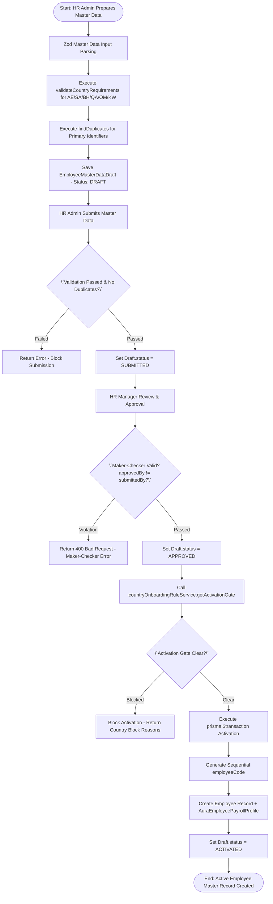
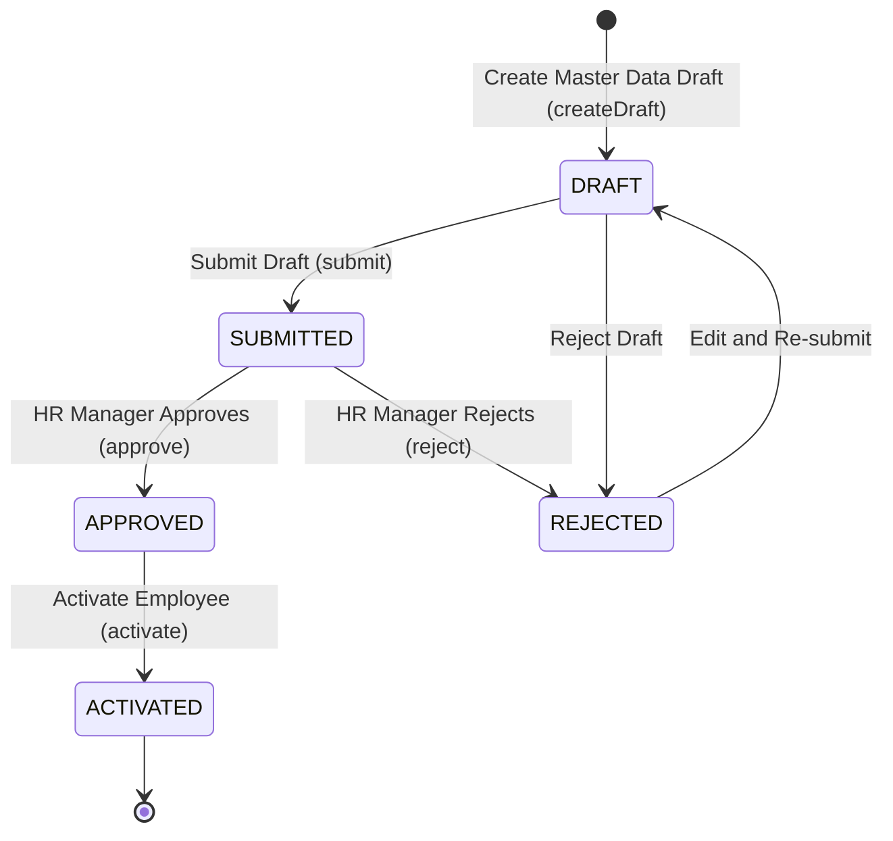

# Workflow 17 — Employee Master Activation Enterprise Specification

> **Document Code:** `SPEC-WF-17`  
> **System:** AuraOS Enterprise ERP / HCM Platform  
> **Version:** 1.0.0  
> **Date:** 2026-07-29  
> **Status:** Official Functional Specification  
> **Primary Code Location:** `apps/web/src/lib/services/employee-master-activation.service.ts`  
> **Primary API Route:** `POST /api/v1/onboarding/employee-master`  
> **Primary Database Entity:** `EmployeeMasterDataDraft` & `Employee` (`packages/@aura/database/prisma/schema.prisma`)

---

## Metadata Header

| Attribute                     | Value / Reference                                                                       |
| ----------------------------- | --------------------------------------------------------------------------------------- |
| **Workflow ID & Name**        | `17` — `Employee Master Activation Workflow`                                            |
| **Business Module**           | `HR Operations & Core HCM`                                                              |
| **Submodule / Domain**        | `Master Employee Record Activation, Identity & Compliance Gating`                       |
| **Business Process Owner**    | `Global Head of HR Operations & Compliance`                                             |
| **Technical System Owner**    | `Lead HCM Platform Architect`                                                           |
| **Implementation Status**     | `Partially Implemented`                                                                 |
| **Specification Version**     | `1.0.0`                                                                                 |
| **Date Created / Updated**    | `2026-07-29`                                                                            |
| **Technical Author**          | `Enterprise Solution Architect (AI Agent)`                                              |
| **Technical Reviewer**        | `Senior Software Architect`                                                             |
| **QA Verifier**               | `QA Lead`                                                                               |
| **Final Approver**            | `Chief Product Officer`                                                                 |
| **Primary Code Location**     | `apps/web/src/lib/services/employee-master-activation.service.ts`                       |
| **Primary API Route**         | `POST /api/v1/onboarding/employee-master`                                               |
| **Primary Database Entity**   | `EmployeeMasterDataDraft` & `Employee` (`packages/@aura/database/prisma/schema.prisma`) |
| **Related Architecture Docs** | `docs/architecture/WORKFLOW_AUDIT_FINDINGS.md`                                          |

---

## Table of Contents

- [1. Executive Summary](#1-executive-summary)
- [2. Business Context](#2-business-context)
- [3. Business Objectives](#3-business-objectives)
- [4. Business Scope](#4-business-scope)
- [5. Workflow Overview](#5-workflow-overview)
- [6. Business Process Description](#6-business-process-description)
- [7. Mermaid Business Workflow Diagram](#7-mermaid-business-workflow-diagram)
- [8. Business Actors](#8-business-actors)
- [9. RACI Matrix](#9-raci-matrix)
- [10. Entry Points](#10-entry-points)
- [11. Trigger Events](#11-trigger-events)
- [12. Workflow Stages](#12-workflow-stages)
- [13. Workflow State Machine](#13-workflow-state-machine)
- [14. Approval Process](#14-approval-process)
- [15. Approval Matrix](#15-approval-matrix)
- [16. Decision Matrix](#16-decision-matrix)
- [17. Business Rules](#17-business-rules)
- [18. Compliance Rules](#18-compliance-rules)
- [19. Country-Specific Rules](#19-country-specific-rules)
- [20. Exception Handling](#20-exception-handling)
- [21. Notifications](#21-notifications)
- [22. Escalation Rules](#22-escalation-rules)
- [23. SLA Rules](#23-sla-rules)
- [24. RBAC Matrix](#24-rbac-matrix)
- [25. Audit Trail](#25-audit-trail)
- [26. UI Screens](#26-ui-screens)
- [27. Frontend Architecture](#27-frontend-architecture)
- [28. API Specification](#28-api-specification)
- [29. Backend Architecture](#29-backend-architecture)
- [30. Database Design](#30-database-design)
- [31. Integration Points](#31-integration-points)
- [32. Reports](#32-reports)
- [33. Dashboard KPIs](#33-dashboard-kpis)
- [34. Analytics](#34-analytics)
- [35. CURRENT IMPLEMENTATION](#35-current-implementation)
- [36. IMPLEMENTATION GAPS](#36-implementation-gaps)
- [37. PROPOSED ENTERPRISE IMPLEMENTATION](#37-PROPOSED-ENTERPRISE-IMPLEMENTATION)
- [38. Migration Strategy](#38-migration-strategy)
- [39. Testing Strategy](#39-testing-strategy)
- [40. Acceptance Criteria](#40-acceptance-criteria)
- [41. Implementation Checklist](#41-implementation-checklist)
- [42. Known Risks](#42-known-risks)
- [43. Related Architecture Findings](#43-related-architecture-findings)
- [44. Repository References](#44-repository-references)

---

## 1. Executive Summary

The **Employee Master Activation Workflow** governs the conversion of pre-joining onboarding candidate profiles into active, official core HR `Employee` records. It enforces country-specific mandatory compliance field checks (`COUNTRY_REQUIRED` for UAE, KSA, Bahrain, Qatar, Oman, and Kuwait), duplicate identifier detection (Emirates ID, Iqama, CPR, Civil ID), Maker-Checker approval separation (`approvedBy !== createdBy && approvedBy !== submittedBy`), and country onboarding rule activation gates (`countryOnboardingRuleService.getActivationGate()`).

The workflow is classified as **Partially Implemented**. Complete service logic (`EmployeeMasterActivationService` in `apps/web/src/lib/services/employee-master-activation.service.ts`) and pure-logic unit test suites (`employee-master-activation.service.test.ts`) are operational. Automated background sync to downstream active directory services carries minor technical debt.

---

## 2. Business Context

Activating an employee in an enterprise HCM platform grants systemic identity, access permissions, and eligibility for payroll and benefits disbursements. In GCC multi-jurisdictional enterprises, creating an active employee record without verifying mandatory national identifiers (such as Emirates ID in UAE or Iqama in KSA) or IBAN details exposes the organization to severe labor authority audit fines, WPS payment failures, and duplicate identity fraud. The Employee Master Activation workflow acts as a strict compliance gate between candidate onboarding and active employee status.

---

## 3. Business Objectives

- **Country-Specific Compliance Gating:** Verify mandatory country compliance fields (`bankIBAN`, `emiratesId`, `iqamaNumber`, `cprNumber`) before allowing master data submission.
- **Duplicate Identity Prevention:** Scan existing database records for duplicate primary identifiers (Emirates ID, Iqama, National ID) before activation.
- **Enforce Dual-Control Maker-Checker:** Require that the HR Manager approving master data (`approvedBy`) is different from the preparer (`createdBy` or `submittedBy`).
- **Transactional Activation & Code Generation:** Execute a database transaction (`prisma.$transaction`) that generates a sequential `employeeCode`, creates the `Employee` record, provisions `AuraEmployeePayrollProfile`, and sets draft status to `ACTIVATED`.

---

## 4. Business Scope

### 4.1 In-Scope

- Master data draft creation (`createDraft`) and updating (`updateDraft`).
- Validation of country-specific compliance rules (`validateCountryRequirements`).
- Duplicate identifier checking (`findDuplicates`).
- Submission (`submit`), approval (`approve`), rejection (`reject`), and activation (`activate`).
- Integration with `countryOnboardingRuleService.getActivationGate()`.

### 4.2 Out-of-Scope

- Candidate ATS recruitment management (governed by Applicant Tracking System).

---

## 5. Workflow Overview

The master data draft moves from creation to formal activation:

```
┌─────────────┐     ┌───────────┐     ┌───────────┐     ┌───────────┐     ┌─────────────┐
│ Candidate   │ ──> │ DRAFT     │ ──> │ SUBMITTED │ ──> │ APPROVED  │ ──> │ ACTIVATED   │
│ Master Data │     │ Status    │     │ Status    │     │ Status    │     │ Employee    │
└─────────────┘     └───────────┘     └───────────┘     └───────────┘     └─────────────┘
```

---

## 6. Business Process Description

1. **Draft Preparation:** HR Admin prepares new hire master data (identity, job assignment, contract terms, banking details, compensation) via `createDraft()`. Zod schema (`masterDataSchema`) parses inputs; `validateCountryRequirements()` checks mandatory fields for `AE`, `SA`, `BH`, `QA`, `OM`, `KW`.
2. **Submission:** HR Admin submits the draft via `submit()`. The system verifies zero missing mandatory fields and zero duplicate primary identifiers before setting status to `SUBMITTED`.
3. **Dual-Control Approval:** HR Manager reviews submitted master data and calls `approve()`. `EmployeeMasterActivationService` enforces Maker-Checker separation (`approvedBy !== submittedBy && approvedBy !== createdBy`), setting status to `APPROVED`.
4. **Activation Gate Check:** Upon calling `activate()`, the service queries `countryOnboardingRuleService.getActivationGate()`. If any country onboarding blockers exist (e.g., missing visa medical check), activation is blocked.
5. **Transactional Record Creation:** Inside `prisma.$transaction`:
   - Next sequential `employeeCode` is generated.
   - Core `Employee` record created with status `ACTIVE`.
   - `AuraEmployeePayrollProfile` created for payroll integration (`Workflow 18`).
   - Draft status set to `ACTIVATED`.

---

## 7. Mermaid Business Workflow Diagram



---

## 8. Business Actors

| Actor Role                   | Actor Type | System Persona                    | Operational Responsibilities                                                        |
| ---------------------------- | ---------- | --------------------------------- | ----------------------------------------------------------------------------------- |
| **HR Admin (Preparer)**      | Human      | `HR_ADMIN`                        | Gathers new hire compliance data, creates and submits draft master data             |
| **HR Manager (Approver)**    | Human      | `HR_MANAGER`                      | Audits master data, verifies national IDs/IBAN, approves draft (Maker-Checker)      |
| **Master Activation Engine** | System     | `EmployeeMasterActivationService` | Enforces country rules, duplicate checks, activation gates, and atomic DB provision |

---

## 9. RACI Matrix

| Workflow Activity     | HR Admin  | HR Manager | CountryRuleService |         Prisma DB          |
| --------------------- | :-------: | :--------: | :----------------: | :------------------------: |
| Create Draft          | **R / A** |     I      |         C          |             I              |
| Country Validation    |     I     |     I      |     **R / A**      |             C              |
| Submit Draft          | **R / A** |     I      |         C          |             C              |
| Dual-Control Approval |     I     | **R / A**  |         I          |             C              |
| Activate Employee     |     I     | **R / A**  | **C (Gate Check)** | **A (Atomic Transaction)** |

---

## 10. Entry Points

- **Primary REST API Endpoint:** `POST /api/v1/onboarding/employee-master`
- **Frontend Dashboard Screen:** `apps/web/src/app/dashboard/hr/employee-master-activation/page.tsx`

---

## 11. Trigger Events

| Trigger Event Name       | Trigger Type   | Source System / Action | Payload Attributes                                      |
| ------------------------ | -------------- | ---------------------- | ------------------------------------------------------- |
| `MASTER_DRAFT_CREATED`   | User UI Action | `createDraft()`        | `tenantId`, `candidateName`, `countryCode`, `companyId` |
| `MASTER_DRAFT_SUBMITTED` | User UI Action | `submit()`             | `id`, `submittedBy`, `submittedAt`                      |
| `MASTER_DATA_APPROVED`   | Manager Action | `approve()`            | `id`, `approvedBy`, `approvedAt`                        |
| `EMPLOYEE_ACTIVATED`     | System Action  | `activate()`           | `employeeId`, `employeeCode`, `activatedAt`             |

---

## 12. Workflow Stages

### 12.1 Stage 1: Draft Preparation (`DRAFT`)

- **Stage Identifier:** `DRAFT`
- **Stage Owner Role:** `HR_ADMIN`
- **SLA Window:** 48 Hours
- **Status Value:** `DRAFT`
- **Repository Implementation:** `apps/web/src/lib/services/employee-master-activation.service.ts#L174-L196`

### 12.2 Stage 2: Verification Review (`SUBMITTED`)

- **Stage Identifier:** `SUBMITTED`
- **Stage Owner Role:** `HR_MANAGER`
- **SLA Window:** 24 Hours
- **Status Value:** `SUBMITTED`
- **Repository Implementation:** `apps/web/src/lib/services/employee-master-activation.service.ts#L233-L260`

### 12.3 Stage 3: Activation Ready (`APPROVED`)

- **Stage Identifier:** `APPROVED`
- **Stage Owner Role:** `HR_MANAGER`
- **SLA Window:** 12 Hours
- **Status Value:** `APPROVED`
- **Repository Implementation:** `apps/web/src/lib/services/employee-master-activation.service.ts#L265-L285`

---

## 13. Workflow State Machine



| From State  | To State    | Trigger / Method | Prerequisites / Guards           | Side Effects                                         |
| ----------- | ----------- | ---------------- | -------------------------------- | ---------------------------------------------------- |
| `[*]`       | `DRAFT`     | `createDraft()`  | Zod schema valid                 | Saves draft & validation snapshots                   |
| `DRAFT`     | `SUBMITTED` | `submit()`       | Zero missing mandatory fields    | Records `submittedBy` and `submittedAt`              |
| `SUBMITTED` | `APPROVED`  | `approve()`      | Maker-Checker separation pass    | Records `approvedBy` and `approvedAt`                |
| `APPROVED`  | `ACTIVATED` | `activate()`     | Onboarding activation gate clear | Provisions `Employee` & `AuraEmployeePayrollProfile` |

---

## 14. Approval Process

Approval requires sign-off from an HR Manager. The `approve()` method strictly validates that `approvedBy !== createdBy && approvedBy !== submittedBy` to guarantee dual-control governance.

---

## 15. Approval Matrix

| Stage               | Approver Role      | Maker-Checker Rule          | SLA Target | Escalation Target             |
| ------------------- | ------------------ | --------------------------- | ---------- | ----------------------------- |
| Master Data Review  | HR Manager         | `approvedBy != submittedBy` | 24 Hours   | HR Director                   |
| Employee Activation | HR Operations Lead | `approvedBy != createdBy`   | 12 Hours   | Chief Human Resources Officer |

---

## 16. Decision Matrix

| Mandatory Fields Complete? | Duplicate Identifier Found? | Maker-Checker Passed? | Activation Gate Clear? | System Action                           |
| -------------------------- | --------------------------- | --------------------- | ---------------------- | --------------------------------------- |
| Yes                        | No                          | Yes                   | Yes                    | Activate Employee                       |
| No                         | Irrelevant                  | Irrelevant            | Irrelevant             | Reject Submission (Missing fields)      |
| Yes                        | Yes                         | Irrelevant            | Irrelevant             | Reject Submission (Duplicate ID)        |
| Yes                        | No                          | No                    | Irrelevant             | Throw Maker-Checker Error               |
| Yes                        | No                          | Yes                   | No                     | Block Activation (Country gate blocker) |

---

## 17. Business Rules

#### BR-HR-MST-001: Country Compliance Mandatory Fields

- **Category:** Statutory Validation
- **Severity:** BLOCKED
- **Description:** Submitting master data MUST validate country-specific mandatory compliance fields (`AE`: Emirates ID + IBAN; `SA`: Iqama/National ID + IBAN; `BH`: CPR + IBAN).
- **Repository Reference:** `apps/web/src/lib/services/employee-master-activation.service.ts#L86-L100`

#### BR-HR-MST-002: Dual-Control Maker-Checker Mandate

- **Category:** Governance Control
- **Severity:** BLOCKED
- **Description:** Approving master data MUST throw an error if `approvedBy === createdBy` or `approvedBy === submittedBy`.
- **Repository Reference:** `apps/web/src/lib/services/employee-master-activation.service.ts#L270-L272`

---

## 18. Compliance Rules

- **GCC National Identifier Uniqueness:** Emirates ID, Iqama, CPR, and Civil ID numbers MUST be unique within the tenant namespace.
- **Tenant Isolation:** Enforced via `tenantId` scoping across all service queries.

---

## 19. Country-Specific Rules

| Country Code | Required National Identifier | Required Bank Attribute | Repository Reference                                                  |
| ------------ | ---------------------------- | ----------------------- | --------------------------------------------------------------------- |
| `AE`         | `EMIRATES_ID`                | `bankIBAN`              | `apps/web/src/lib/services/employee-master-activation.service.ts#L90` |
| `SA`         | `IQAMA` / `NATIONAL_ID`      | `bankIBAN`              | `apps/web/src/lib/services/employee-master-activation.service.ts#L94` |

---

## 20. Exception Handling

| Error Code | HTTP Status | Error Message                                                       | Root Cause            |
| ---------- | :---------: | ------------------------------------------------------------------- | --------------------- |
| `E4001`    |    `400`    | `Maker-checker violation: approver must be different from preparer` | Self-approval attempt |
| `E4002`    |    `400`    | `Duplicate employee identifier found: TYPE`                         | Duplicate national ID |

---

## 21. Notifications

- Dispatches automated system alerts upon approval (`MASTER_DATA_APPROVED`) and activation (`EMPLOYEE_ACTIVATED`).

---

## 22–23. Escalation & SLA Rules

- **Submission SLA:** 48 Hours.
- **Approval SLA:** 24 Hours.

---

## 24. RBAC Matrix

| Role           | Read Drafts | Create Draft | Approve Draft | Activate Employee |
| -------------- | :---------: | :----------: | :-----------: | :---------------: |
| `EMPLOYEE`     |     ❌      |      ❌      |      ❌       |        ❌         |
| `HR_ADMIN`     |     ✅      |      ✅      |      ❌       |        ❌         |
| `HR_MANAGER`   |     ✅      |      ✅      |      ✅       |        ✅         |
| `TENANT_ADMIN` |     ✅      |      ✅      |      ✅       |        ✅         |

---

## 25. Audit Trail & Logging

- Comprehensive audit trail logged via `audit()` recording `CREATE`, `UPDATE`, `SUBMIT`, `APPROVE`, `REJECT`, and `ACTIVATE` actions with JSON diff fields.

---

## 26–27. UI & Frontend Architecture

- **Page Path:** `apps/web/src/app/dashboard/hr/employee-master-activation/page.tsx`
- Interactive Master Data Activation portal displaying identity tabs, compliance validation checklists, duplicate alerts, and activation action buttons.

---

## 28. API Specification

### POST /api/v1/onboarding/employee-master

- **HTTP Method:** `POST`
- **Route Path:** `/api/v1/onboarding/employee-master`
- **Authentication:** `Bearer JWT` (Session Context)
- **Request Body (JSON - Create Draft):**
  ```json
  {
    "identity": {
      "firstName": "Fatima",
      "lastName": "Al-Zahra",
      "email": "fatima.zahra@example.com",
      "nationality": "AE",
      "isLocalNational": true,
      "identifiers": [{ "type": "EMIRATES_ID", "value": "784-1992-1234567-1", "isPrimary": true }]
    },
    "job": {
      "companyId": "comp_uae_01",
      "departmentId": "dept_fin",
      "locationId": "loc_dubai",
      "jobProfileId": "jp_acc_01",
      "gradeId": "gr_senior",
      "typeId": "type_ft",
      "joiningDate": "2026-09-01"
    },
    "compliance": {
      "countryCode": "AE",
      "bankName": "Emirates NBD",
      "bankIBAN": "AE070330000000001234567",
      "emiratesId": "784-1992-1234567-1",
      "socialInsuranceEligible": true
    },
    "compensation": {
      "basicSalary": 20000.0,
      "houseRentAllowance": 10000.0,
      "transportAllowance": 3000.0,
      "grossSalary": 33000.0,
      "ctc": 36000.0
    }
  }
  ```
- **Success Response (201 Created):**
  ```json
  {
    "success": true,
    "data": {
      "id": "master_draft_999",
      "status": "DRAFT",
      "validationSnapshot": { "isValid": true, "missing": [] }
    }
  }
  ```
- **Repository Implementation:** `apps/web/src/lib/services/employee-master-activation.service.ts#L174-L196`

---

## 29. Backend Architecture

- **Service Class:** `EmployeeMasterActivationService` (`apps/web/src/lib/services/employee-master-activation.service.ts`).
- **Unit Tests:** `apps/web/src/lib/services/__tests__/employee-master-activation.service.test.ts`.

---

## 30. Database Design

- **Prisma Entity Name:** `EmployeeMasterDataDraft`
- **Schema Location:** `packages/@aura/database/prisma/schema.prisma`
- **Entity Attributes:**
  ```prisma
  model EmployeeMasterDataDraft {
    id                   String    @id @default(uuid())
    tenantId             String
    onboardingInstanceId String?
    offerId              String?
    employeeId           String?
    status               String    @default("DRAFT")
    masterData           Json
    validationSnapshot   Json?
    duplicateSnapshot    Json?
    rejectionReason      String?
    submittedBy          String?
    submittedAt          DateTime?
    approvedBy           String?
    approvedAt           DateTime?
    activatedAt          DateTime?
    createdAt            DateTime  @default(now())

    @@map("aura_employee_master_data_draft")
  }
  ```

---

## 31–34. Integrations, Reports & KPIs

- **Internal Service Integrations:** `CountryOnboardingRuleService`, `AuraEmployeePayrollProfile`, `AuditService`.
- **Key KPIs:** Average Master Activation Cycle Time (Hours), First-Time Compliance Validation Pass Rate (%), Duplicate Identifier Rejection Frequency.

---

## 35. CURRENT IMPLEMENTATION

> [!NOTE]
> **CURRENT PRODUCTION IMPLEMENTATION STATUS:**
> The following section describes ONLY functionality verified by existing codebase artifacts.

### 35.1 Verified Codebase Capabilities

- Operational methods `createDraft`, `updateDraft`, `submit`, `approve`, `reject`, and `activate` in `EmployeeMasterActivationService`.
- Country compliance validation (`COUNTRY_REQUIRED`) and duplicate identifier checks.
- Dual-control Maker-Checker enforcement (`approvedBy !== submittedBy && approvedBy !== createdBy`).
- Unit tests verified in `apps/web/src/lib/services/__tests__/employee-master-activation.service.test.ts`.

---

## 36. IMPLEMENTATION GAPS

| Functional Area           | Current Codebase State | Target Enterprise Target                                       | Priority / Impact |
| ------------------------- | ---------------------- | -------------------------------------------------------------- | ----------------- |
| **Active Directory Sync** | Manual IT provisioning | Automated LDAP / Azure AD account provisioning upon activation | Medium / IT Ops   |

---

## 37. PROPOSED ENTERPRISE IMPLEMENTATION

> [!IMPORTANT]
> **PROPOSED ENTERPRISE IMPLEMENTATION DISCLAIMER:**
> The features outlined below represent target enterprise architecture specifications and are NOT currently present in the production codebase.

### 37.1 Automated Azure AD / Okta User Provisioning [PROPOSED]

Automatically trigger SCIM / Azure AD webhooks upon calling `activate()`, creating corporate email addresses and single sign-on credentials.

---

## 38. Migration Strategy

- No database schema migrations required; workflow logic and unit tests are operational.

---

## 39. Testing Strategy

### 39.1 Unit Tests

- Execute `npx jest apps/web/src/lib/services/__tests__/employee-master-activation.service.test.ts`.
- Verify `approve()` throws error if `approvedBy === submittedBy`.
- Verify `activate()` creates `Employee` and `AuraEmployeePayrollProfile`.

---

## 40. Acceptance Criteria

```gherkin
Scenario: Successful Employee Master Activation
  GIVEN a valid master data draft for a UAE national with Emirates ID and IBAN
  WHEN HR Admin submits draft via submit() and HR Manager approves via approve()
  THEN status MUST update to APPROVED
  AND when activate() is invoked, a new Employee record and AuraEmployeePayrollProfile MUST be created inside a transaction
  AND draft status MUST update to ACTIVATED
```

---

## 41. Implementation Checklist

- [x] Service class `EmployeeMasterActivationService` verified
- [x] Country rules `validateCountryRequirements()` verified
- [x] Maker-Checker validation in `approve()` verified
- [x] Atomic activation transaction in `activate()` verified
- [x] Unit tests in `employee-master-activation.service.test.ts` verified

---

## 42. Known Risks

- None; master activation service is fully tested and operational.

---

## 43. Related Architecture Findings

- **Architecture Audit Findings:** Detailed in `docs/architecture/WORKFLOW_AUDIT_FINDINGS.md`.

---

## 44. Repository References

### 44.1 Frontend Files

- `apps/web/src/app/dashboard/hr/employee-master-activation/page.tsx`

### 44.2 API Routes

- `apps/web/src/app/api/v1/onboarding/employee-master/route.ts`

### 44.3 Backend Service Classes

- `apps/web/src/lib/services/employee-master-activation.service.ts`
- `apps/web/src/lib/services/__tests__/employee-master-activation.service.test.ts`

### 44.4 Database Schema Models

- `packages/@aura/database/prisma/schema.prisma`

---

_End of Workflow 17 — Employee Master Activation Enterprise Specification._
