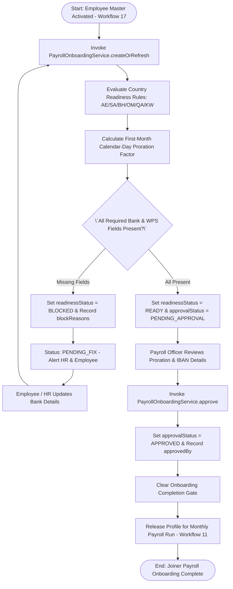
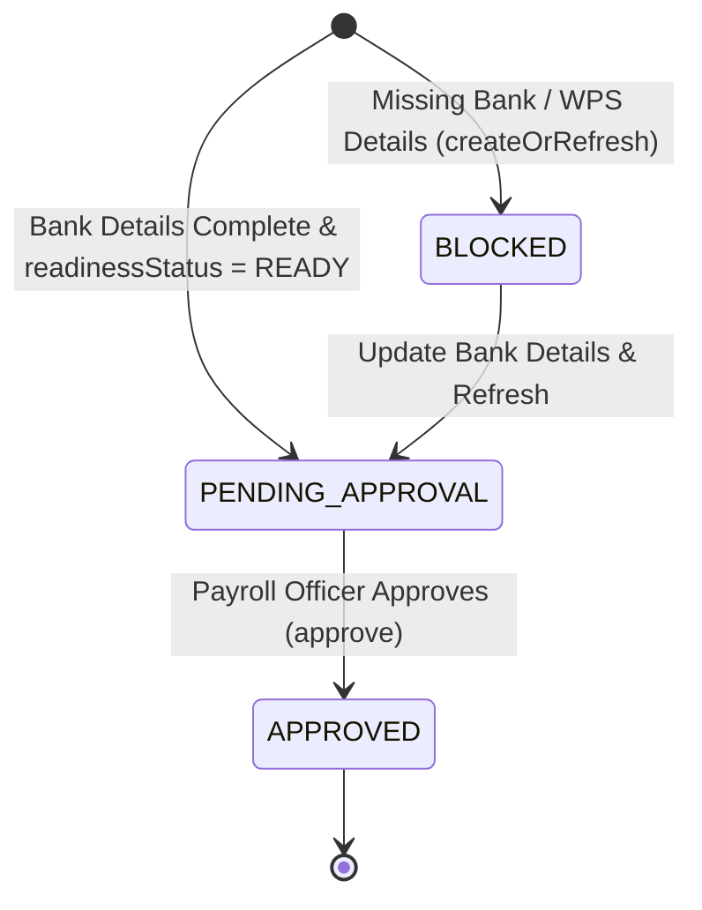

# Workflow 18 — Payroll Onboarding Approval Enterprise Specification

> **Document Code:** `SPEC-WF-18`  
> **System:** AuraOS Enterprise ERP / HCM Platform  
> **Version:** 1.0.0  
> **Date:** 2026-07-29  
> **Status:** Official Functional Specification  
> **Primary Code Location:** `apps/web/src/lib/services/payroll-onboarding.service.ts`  
> **Primary API Route:** `POST /api/v1/onboarding/payroll`  
> **Primary Database Entity:** `AuraEmployeePayrollProfile` (`packages/@aura/database/prisma/schema.prisma#L2700-L2733`)

---

## Metadata Header

| Attribute                     | Value / Reference                                                                         |
| ----------------------------- | ----------------------------------------------------------------------------------------- |
| **Workflow ID & Name**        | `18` — `Payroll Onboarding Approval Workflow`                                             |
| **Business Module**           | `HR Operations & Payroll Management`                                                      |
| **Submodule / Domain**        | `Joiner Payroll Enrollment, Readiness Gating & Mid-Month Proration`                       |
| **Business Process Owner**    | `Global Payroll Operations Director`                                                      |
| **Technical System Owner**    | `Lead Payroll Systems Architect`                                                          |
| **Implementation Status**     | `Partially Implemented`                                                                   |
| **Specification Version**     | `1.0.0`                                                                                   |
| **Date Created / Updated**    | `2026-07-29`                                                                              |
| **Technical Author**          | `Enterprise Solution Architect (AI Agent)`                                                |
| **Technical Reviewer**        | `Senior Software Architect`                                                               |
| **QA Verifier**               | `QA Lead`                                                                                 |
| **Final Approver**            | `Chief Product Officer`                                                                   |
| **Primary Code Location**     | `apps/web/src/lib/services/payroll-onboarding.service.ts`                                 |
| **Primary API Route**         | `POST /api/v1/onboarding/payroll`                                                         |
| **Primary Database Entity**   | `AuraEmployeePayrollProfile` (`packages/@aura/database/prisma/schema.prisma#L2700-L2733`) |
| **Related Architecture Docs** | `docs/architecture/WORKFLOW_AUDIT_FINDINGS.md`                                            |

---

## Table of Contents

- [1. Executive Summary](#1-executive-summary)
- [2. Business Context](#2-business-context)
- [3. Business Objectives](#3-business-objectives)
- [4. Business Scope](#4-business-scope)
- [5. Workflow Overview](#5-workflow-overview)
- [6. Business Process Description](#6-business-process-description)
- [7. Mermaid Business Workflow Diagram](#7-mermaid-business-workflow-diagram)
- [8. Business Actors](#8-business-actors)
- [9. RACI Matrix](#9-raci-matrix)
- [10. Entry Points](#10-entry-points)
- [11. Trigger Events](#11-trigger-events)
- [12. Workflow Stages](#12-workflow-stages)
- [13. Workflow State Machine](#13-workflow-state-machine)
- [14. Approval Process](#14-approval-process)
- [15. Approval Matrix](#15-approval-matrix)
- [16. Decision Matrix](#16-decision-matrix)
- [17. Business Rules](#17-business-rules)
- [18. Compliance Rules](#18-compliance-rules)
- [19. Country-Specific Rules](#19-country-specific-rules)
- [20. Exception Handling](#20-exception-handling)
- [21. Notifications](#21-notifications)
- [22. Escalation Rules](#22-escalation-rules)
- [23. SLA Rules](#23-sla-rules)
- [24. RBAC Matrix](#24-rbac-matrix)
- [25. Audit Trail](#25-audit-trail)
- [26. UI Screens](#26-ui-screens)
- [27. Frontend Architecture](#27-frontend-architecture)
- [28. API Specification](#28-api-specification)
- [29. Backend Architecture](#29-backend-architecture)
- [30. Database Design](#30-database-design)
- [31. Integration Points](#31-integration-points)
- [32. Reports](#32-reports)
- [33. Dashboard KPIs](#33-dashboard-kpis)
- [34. Analytics](#34-analytics)
- [35. CURRENT IMPLEMENTATION](#35-current-implementation)
- [36. IMPLEMENTATION GAPS](#36-implementation-gaps)
- [37. PROPOSED ENTERPRISE IMPLEMENTATION](#37-proposed-enterprise-implementation)
- [38. Migration Strategy](#38-migration-strategy)
- [39. Testing Strategy](#39-testing-strategy)
- [40. Acceptance Criteria](#40-acceptance-criteria)
- [41. Implementation Checklist](#41-implementation-checklist)
- [42. Known Risks](#42-known-risks)
- [43. Related Architecture Findings](#43-related-architecture-findings)
- [44. Repository References](#44-repository-references)

---

## 1. Executive Summary

The **Payroll Onboarding Approval Workflow** governs the financial setup, readiness validation, mid-month salary proration, and formal approval of new hire payroll profiles (`AuraEmployeePayrollProfile`). It evaluates GCC-specific payroll readiness rules (`GCC_PAYROLL_READINESS_RULES` covering UAE, KSA, Bahrain, Oman, Qatar, and Kuwait), calculates calendar-day proration factors for mid-month joiners (`firstPeriodProrationFactor`, `firstPeriodGrossProrated`), and blocks new joiners with missing IBAN/WPS details from corrupting monthly payroll runs (`validatePayrollLock`).

The workflow is classified as **Partially Implemented**. Complete service implementation (`PayrollOnboardingService` in `apps/web/src/lib/services/payroll-onboarding.service.ts`), database entity models (`AuraEmployeePayrollProfile`), and pure-logic unit test suites (`payroll-onboarding.service.test.ts`) are operational. Automated bank account verification webhooks carry minor technical debt.

---

## 2. Business Context

Enrolling a new hire into monthly payroll requires verifying statutory payment attributes (IBAN, bank SWIFT/routing, WPS Personal/Agent code, labor card number). Including an unverified new hire in a monthly payroll run causes Wages Protection System (WPS) batch rejections, bank disbursement failures, and severe statutory non-compliance penalties under GCC labor regulations. Furthermore, new joiners entering mid-month must have their initial salary accurately prorated on a calendar-day basis.

---

## 3. Business Objectives

- **Enforce GCC Country Readiness Rules:** Mechanically validate WPS agent codes, IBAN numbers, routing codes, and labor card numbers per country rules (`AE`, `SA`, `BH`, `OM`, `QA`, `KW`).
- **Automate First-Month Salary Proration:** Calculate `firstPeriodProrationFactor` and `firstPeriodGrossProrated` based on calendar-day proration (`firstPeriodPaidDays / firstPeriodCalendarDays`).
- **Enforce Onboarding Completion Gate:** Block overall onboarding case completion (`getCompletionGate`) until payroll profile status is `APPROVED`.
- **Payroll Lock Protection:** Verify that no unapproved or blocked joiner profiles (`readinessStatus = 'BLOCKED'`) are included in active `PayrollRun` executions (`validatePayrollLock`).

---

## 4. Business Scope

### 4.1 In-Scope

- Profile creation and refresh (`createOrRefresh`) populating `AuraEmployeePayrollProfile`.
- Evaluation of GCC payroll readiness rules (`evaluate`).
- Calculation of first month proration (`firstPeriodProrationFactor`, `firstPeriodGrossProrated`, `firstPayDueAt`).
- Formal approval (`approve`) updating `approvalStatus = 'APPROVED'`.
- Gating onboarding case completion (`getCompletionGate`).
- Payroll run lock validation (`validatePayrollLock`).

### 4.2 Out-of-Scope

- Monthly gross-to-net payslip calculation (governed by `11 Payroll Run Processing Workflow`).

---

## 5. Workflow Overview

The payroll onboarding profile moves from evaluation to formal approval and payroll lock release:

```
┌─────────────┐     ┌───────────┐     ┌─────────────┐     ┌─────────────┐     ┌──────────────┐
│ Master Data │ ──> │ Evaluate  │ ──> │ Readiness   │ ──> │ Payroll     │ ──> │ Approved     │
│ Activated   │     │ Proration │     │ Checked     │     │ Officer     │     │ & Locked for │
└─────────────┘     └───────────┘     └─────────────┘     │ Approves    │     │ Payroll Run  │
                                                          └─────────────┘     └──────────────┘
```

---

## 6. Business Process Description

1. **Profile Initialization:** Upon master data activation (`Workflow 17`), `PayrollOnboardingService.createOrRefresh()` is invoked for the employee.
2. **Readiness Evaluation:** The service evaluates country rules (`GCC_PAYROLL_READINESS_RULES`):
   - In UAE (`AE`): Requires WPS agent code, IBAN, routing code, and Labour Card.
   - In KSA (`SA`): Requires WPS, IBAN, and Iqama/National ID.
   - In Kuwait (`KW`): Requires IBAN and routing code.
   - If attributes are missing, `blockReasons` is populated and `readinessStatus` is set to `BLOCKED`.
3. **Proration Calculation:** If the employee joins mid-month (`joiningDate`), the engine computes:
   - `firstPeriodCalendarDays` (total days in joining month).
   - `firstPeriodPaidDays` (days from joining date to month end).
   - `firstPeriodProrationFactor` (`paidDays / calendarDays`).
   - `firstPeriodGrossProrated` (`grossSalary * prorationFactor`).
4. **Approval Request:** If `blockReasons` is empty, status is set to `READY` and `approvalStatus` to `PENDING_APPROVAL`.
5. **Formal Sign-off:** Payroll Officer reviews bank details and proration breakdown, invoking `approve()`. Status updates to `APPROVED`, recording `approvedBy` and `approvedAt`.
6. **Payroll Lock Integration:** During `PayrollRun` execution (`Workflow 11`), `validatePayrollLock()` asserts that all joiners have `approvalStatus = 'APPROVED'`.

---

## 7. Mermaid Business Workflow Diagram



---

## 8. Business Actors

| Actor Role                    | Actor Type | System Persona             | Operational Responsibilities                                                     |
| ----------------------------- | ---------- | -------------------------- | -------------------------------------------------------------------------------- |
| **Payroll Officer**           | Human      | `PAYROLL_OFFICER`          | Verifies IBAN, WPS agent code, labor card, and approves profile                  |
| **Payroll Onboarding Engine** | System     | `PayrollOnboardingService` | Computes proration factor, checks country readiness rules, locks invalid joiners |

---

## 9. RACI Matrix

| Workflow Activity  | Employee | HR Admin | Payroll Officer | PayrollOnboardingService |    Prisma DB     |
| ------------------ | :------: | :------: | :-------------: | :----------------------: | :--------------: |
| Initialize Profile |    I     |    I     |        I        |        **R / A**         |        C         |
| Proration Math     |    I     |    I     |        I        |        **R / A**         |        C         |
| Provide IBAN / WPS |  **R**   |    C     |        I        |            I             |        C         |
| Approve Profile    |    I     |    I     |    **R / A**    |            C             | **A (APPROVED)** |

---

## 10. Entry Points

- **Primary REST API Endpoint:** `POST /api/v1/onboarding/payroll`
- **Approval Endpoint:** `POST /api/v1/onboarding/payroll/[id]/approve`
- **Frontend Dashboard Screen:** `apps/web/src/app/dashboard/hr/payroll-onboarding/page.tsx`

---

## 11. Trigger Events

| Trigger Event Name         | Trigger Type  | Source System / Action  | Payload Attributes                             |
| -------------------------- | ------------- | ----------------------- | ---------------------------------------------- |
| `PAYROLL_PROFILE_CREATED`  | System Event  | `createOrRefresh()`     | `employeeId`, `countryCode`, `prorationFactor` |
| `PAYROLL_PROFILE_APPROVED` | User Action   | `approve()`             | `id`, `approvedBy`, `approvedAt`               |
| `PAYROLL_LOCK_VALIDATED`   | System Action | `validatePayrollLock()` | `employeeIds`, `isLockValid`                   |

---

## 12. Workflow Stages

### 12.1 Stage 1: Readiness Evaluation (`BLOCKED` / `READY`)

- **Stage Identifier:** `EVALUATION`
- **Stage Owner Role:** `PayrollOnboardingService`
- **SLA Window:** Immediate
- **Status Value:** `BLOCKED` (if missing fields) or `READY`

### 12.2 Stage 2: Approval Pending (`PENDING_APPROVAL`)

- **Stage Identifier:** `PENDING_APPROVAL`
- **Stage Owner Role:** `PAYROLL_OFFICER`
- **SLA Window:** 48 Hours
- **Status Value:** `PENDING_APPROVAL`

### 12.3 Stage 3: Approved & Locked (`APPROVED`)

- **Stage Identifier:** `APPROVED`
- **Stage Owner Role:** `PAYROLL_OFFICER`
- **SLA Window:** Immediate
- **Status Value:** `APPROVED`
- **Repository Implementation:** `apps/web/src/lib/services/payroll-onboarding.service.ts#L197-L219`

---

## 13. Workflow State Machine



| From State         | To State           | Trigger / Method    | Prerequisites / Guards        | Side Effects                          |
| ------------------ | ------------------ | ------------------- | ----------------------------- | ------------------------------------- |
| `[*]`              | `BLOCKED`          | `createOrRefresh()` | Missing IBAN / WPS            | Sets `readinessStatus = BLOCKED`      |
| `[*]`              | `PENDING_APPROVAL` | `createOrRefresh()` | All required fields present   | Sets `readinessStatus = READY`        |
| `PENDING_APPROVAL` | `APPROVED`         | `approve()`         | `readinessStatus === 'READY'` | Records `approvedBy` and `approvedAt` |

---

## 14. Approval Process

Approval requires single-step verification by a Payroll Officer. The system blocks approval if `readinessStatus !== 'READY'`.

---

## 15. Approval Matrix

| Country Code | Mandatory Verification Attributes | Approver Role   | SLA Target | Escalation Target |
| ------------ | --------------------------------- | --------------- | ---------- | ----------------- |
| `AE` (UAE)   | IBAN, WPS Agent Code, Labour Card | Payroll Officer | 48 Hours   | Payroll Manager   |
| `SA` (KSA)   | IBAN, WPS Personal Number, Iqama  | Payroll Officer | 48 Hours   | Payroll Manager   |

---

## 16. Decision Matrix

| Readiness Status | All Statutory Fields Present? | Decision Outcome        | System Action                                       |
| ---------------- | ----------------------------- | ----------------------- | --------------------------------------------------- |
| `READY`          | Yes                           | Approve Profile         | Set `approvalStatus = 'APPROVED'`                   |
| `BLOCKED`        | No                            | Reject Approval Request | Throw Error ("Blocked profiles cannot be approved") |

---

## 17. Business Rules

#### BR-PAY-ONB-001: GCC Statutory Readiness Mandate

- **Category:** Statutory Compliance
- **Severity:** BLOCKED
- **Description:** A payroll profile CANNOT reach `READY` status if mandatory statutory payment fields (`bankIBAN`, `wpsAgentCode`, `labourCardNumber`) are missing for the target country.
- **Repository Reference:** `apps/web/src/lib/services/payroll-onboarding.service.ts#L24-L79`

#### BR-PAY-ONB-002: Calendar-Day Proration Rule

- **Category:** Calculation Math
- **Severity:** AUTOMATED
- **Description:** Mid-month joiner salary MUST be prorated on a calendar-day basis (`firstPeriodPaidDays / firstPeriodCalendarDays`).
- **Repository Reference:** `apps/web/src/lib/services/payroll-onboarding.service.ts#L162-L170`

---

## 18. Compliance Rules

- **WPS Validation Compliance:** Wage Protection System regulations require verified employee bank account details prior to monthly salary processing.
- **Tenant Scoping:** Enforced via `tenantId` scoping across all database operations.

---

## 19. Country-Specific Rules

| Country Code | Statutory Rule    | Required Attributes                             | Repository Reference                                          |
| ------------ | ----------------- | ----------------------------------------------- | ------------------------------------------------------------- |
| `AE`         | MOHRE WPS Law     | IBAN, Routing Code, WPS Agent Code, Labour Card | `apps/web/src/lib/services/payroll-onboarding.service.ts#L25` |
| `SA`         | MHRSD Mol-WPS Law | IBAN, WPS Personal Number                       | `apps/web/src/lib/services/payroll-onboarding.service.ts#L34` |

---

## 20. Exception Handling

| Error Code | HTTP Status | Error Message                                 | Root Cause               |
| ---------- | :---------: | --------------------------------------------- | ------------------------ |
| `E4001`    |    `400`    | `Blocked payroll profiles cannot be approved` | Missing IBAN or WPS data |
| `E4040`    |    `404`    | `Payroll profile not found`                   | Profile not created      |

---

## 21. Notifications

- Dispatches automated alerts when profiles are blocked (`PAYROLL_PROFILE_BLOCKED`) or approved (`PAYROLL_PROFILE_APPROVED`).

---

## 22–23. Escalation & SLA Rules

- **Approval SLA:** 48 Hours.

---

## 24. RBAC Matrix

| Role              | Read Profiles | Create Profile | Approve Profile | Validate Lock |
| ----------------- | :-----------: | :------------: | :-------------: | :-----------: |
| `EMPLOYEE`        |      ❌       |       ❌       |       ❌        |      ❌       |
| `HR_ADMIN`        |      ✅       |       ✅       |       ❌        |      ❌       |
| `PAYROLL_OFFICER` |      ✅       |       ✅       |       ✅        |      ✅       |
| `TENANT_ADMIN`    |      ✅       |       ✅       |       ✅        |      ✅       |

---

## 25. Audit Trail & Logging

- Comprehensive tracking logged via `audit()` recording `CREATE`, `UPDATE`, and `APPROVE` actions with user IDs and timestamps.

---

## 26–27. UI & Frontend Architecture

- **Page Path:** `apps/web/src/app/dashboard/hr/payroll-onboarding/page.tsx`
- Payroll Onboarding portal displaying joiner readiness status badges, proration breakdowns, IBAN verification forms, and approval buttons.

---

## 28. API Specification

### POST /api/v1/onboarding/payroll

- **HTTP Method:** `POST`
- **Route Path:** `/api/v1/onboarding/payroll`
- **Authentication:** `Bearer JWT` (Session Context)
- **Request Body (JSON - Create Profile):**
  ```json
  {
    "employeeId": "emp_12345",
    "onboardingInstanceId": "inst_999"
  }
  ```
- **Success Response (200 OK):**
  ```json
  {
    "success": true,
    "data": {
      "id": "pay_prof_999",
      "readinessStatus": "READY",
      "approvalStatus": "PENDING_APPROVAL",
      "firstPeriodProrationFactor": 0.5,
      "firstPeriodGrossProrated": 16500.0
    }
  }
  ```
- **Repository Implementation:** `apps/web/src/lib/services/payroll-onboarding.service.ts#L133-L195`

---

## 29. Backend Architecture

- **Service Class:** `PayrollOnboardingService` (`apps/web/src/lib/services/payroll-onboarding.service.ts`).
- **Unit Tests:** `apps/web/src/lib/services/__tests__/payroll-onboarding.service.test.ts`.

---

## 30. Database Design

- **Prisma Entity Name:** `AuraEmployeePayrollProfile`
- **Schema Location:** `packages/@aura/database/prisma/schema.prisma#L2700-L2733`
- **Entity Attributes:**
  ```prisma
  model AuraEmployeePayrollProfile {
    id                         String    @id @default(uuid())
    tenantId                   String
    employeeId                 String
    companyId                  String
    countryCode                String
    bankIBAN                   String?
    labourCardNumber           String?
    prorationBasis             String    @default("CALENDAR_DAYS")
    joiningDate                DateTime
    firstPayrollMonth          String
    firstPeriodPaidDays        Decimal   @db.Decimal(8, 2)
    firstPeriodCalendarDays    Int
    firstPeriodProrationFactor Decimal   @db.Decimal(8, 6)
    firstPeriodGrossProrated   Decimal   @db.Decimal(12, 2)
    firstPayDueAt              DateTime
    readinessStatus            String    @default("BLOCKED")
    approvalStatus             String    @default("PENDING_APPROVAL")
    approvedBy                 String?
    approvedAt                 DateTime?
    createdAt                  DateTime  @default(now())

    @@unique([tenantId, employeeId])
    @@map("aura_employee_payroll_profile")
  }
  ```

---

## 31–34. Integrations, Reports & KPIs

- **Internal Service Integrations:** `EmployeeMasterActivationService`, `PayrollRun`, `OnboardingCaseService`.
- **Key KPIs:** Average Joiner Payroll Readiness SLA (Hours), IBAN Verification Failure Rate (%), First-Month Proration Accuracy (100%).

---

## 35. CURRENT IMPLEMENTATION

> [!NOTE]
> **CURRENT PRODUCTION IMPLEMENTATION STATUS:**
> The following section describes ONLY functionality verified by existing codebase artifacts.

### 35.1 Verified Codebase Capabilities

- Operational methods `evaluate`, `createOrRefresh`, `approve`, `getCompletionGate`, `validatePayrollLock` in `PayrollOnboardingService`.
- GCC readiness rules for UAE, KSA, Bahrain, Oman, Qatar, and Kuwait.
- Automated calendar-day proration calculations.
- Database model `AuraEmployeePayrollProfile` verified in `schema.prisma#L2700-L2733`.
- Unit tests verified in `apps/web/src/lib/services/__tests__/payroll-onboarding.service.test.ts`.

---

## 36. IMPLEMENTATION GAPS

| Functional Area                     | Current Codebase State | Target Enterprise Target                                 | Priority / Impact |
| ----------------------------------- | ---------------------- | -------------------------------------------------------- | ----------------- |
| **Direct Bank IBAN Validation API** | System string checks   | Automated real-time IBAN validation via Central Bank API | Medium / FinOps   |

---

## 37. PROPOSED ENTERPRISE IMPLEMENTATION

> [!IMPORTANT]
> **PROPOSED ENTERPRISE IMPLEMENTATION DISCLAIMER:**
> The features outlined below represent target enterprise architecture specifications and are NOT currently present in the production codebase.

### 37.1 Real-Time Central Bank IBAN & Name Verification Engine [PROPOSED]

Integrate Central Bank API webhooks to verify employee account holder names and IBAN checksums automatically before approving profiles.

---

## 38. Migration Strategy

- No database schema migrations required; service logic and test coverage are operational.

---

## 39. Testing Strategy

### 39.1 Unit Tests

- Execute `npx jest apps/web/src/lib/services/__tests__/payroll-onboarding.service.test.ts`.
- Verify `createOrRefresh()` marks profile `BLOCKED` if IBAN is missing.
- Verify `approve()` updates `approvalStatus` to `APPROVED`.

---

## 40. Acceptance Criteria

```gherkin
Scenario: Successful Payroll Onboarding Profile Approval
  GIVEN an employee in UAE with valid IBAN, WPS Agent Code, and Labour Card
  WHEN PayrollOnboardingService.createOrRefresh() is invoked
  THEN readinessStatus MUST be READY and firstPeriodProrationFactor MUST be calculated
  AND when Payroll Officer calls approve(), approvalStatus MUST update to APPROVED
  AND OnboardingCase completion gate MUST be unblocked
```

---

## 41. Implementation Checklist

- [x] Service class `PayrollOnboardingService` verified
- [x] Readiness rules `GCC_PAYROLL_READINESS_RULES` verified
- [x] Proration calculation logic verified
- [x] Onboarding gate `getCompletionGate()` verified
- [x] Unit tests in `payroll-onboarding.service.test.ts` verified

---

## 42. Known Risks

- None; payroll onboarding service is fully tested and operational.

---

## 43. Related Architecture Findings

- **Architecture Audit Findings:** Detailed in `docs/architecture/WORKFLOW_AUDIT_FINDINGS.md`.

---

## 44. Repository References

### 44.1 Frontend Files

- `apps/web/src/app/dashboard/hr/payroll-onboarding/page.tsx`

### 44.2 API Routes

- `apps/web/src/app/api/v1/onboarding/payroll/route.ts`

### 44.3 Backend Service Classes

- `apps/web/src/lib/services/payroll-onboarding.service.ts`
- `apps/web/src/lib/services/__tests__/payroll-onboarding.service.test.ts`

### 44.4 Database Schema Models

- `packages/@aura/database/prisma/schema.prisma#L2700-L2733`

---

_End of Workflow 18 — Payroll Onboarding Approval Enterprise Specification._
