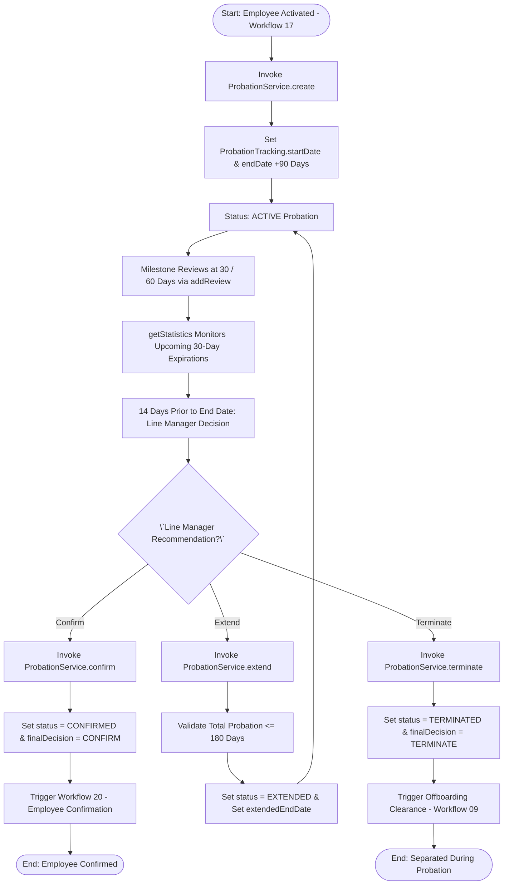
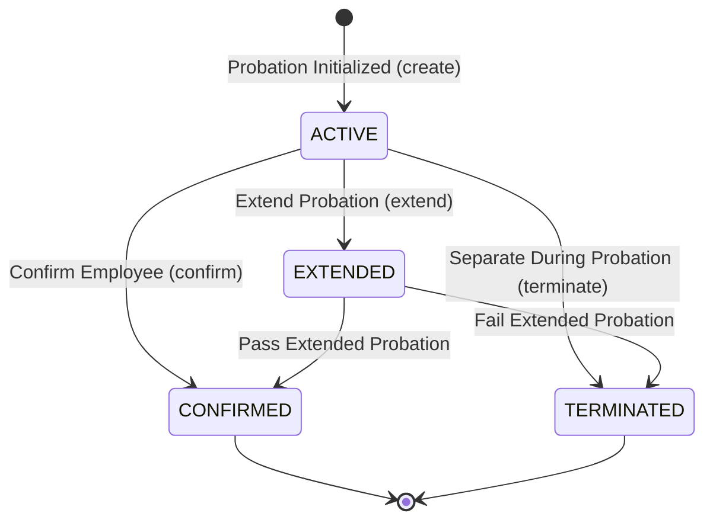

# Workflow 19 — Probation Period Management Enterprise Specification

> **Document Code:** `SPEC-WF-19`  
> **System:** AuraOS Enterprise ERP / HCM Platform  
> **Version:** 1.0.0  
> **Date:** 2026-07-29  
> **Status:** Official Functional Specification  
> **Primary Code Location:** `apps/web/src/lib/services/probation.service.ts`  
> **Primary API Route:** `POST /api/v1/probation`  
> **Primary Database Entity:** `ProbationTracking` & `ProbationReview` (`packages/@aura/database/prisma/schema.prisma`)

---

## Metadata Header

| Attribute                     | Value / Reference                                                                        |
| ----------------------------- | ---------------------------------------------------------------------------------------- |
| **Workflow ID & Name**        | `19` — `Probation Period Management Workflow`                                            |
| **Business Module**           | `HR Operations & Talent Management`                                                      |
| **Submodule / Domain**        | `New Joiner Probation Tracking, Milestone Reviews & Decision Governance`                 |
| **Business Process Owner**    | `Head of Talent Operations & Employee Relations`                                         |
| **Technical System Owner**    | `Lead HCM Platform Architect`                                                            |
| **Implementation Status**     | `Partially Implemented`                                                                  |
| **Specification Version**     | `1.0.0`                                                                                  |
| **Date Created / Updated**    | `2026-07-29`                                                                             |
| **Technical Author**          | `Enterprise Solution Architect (AI Agent)`                                               |
| **Technical Reviewer**        | `Senior Software Architect`                                                              |
| **QA Verifier**               | `QA Lead`                                                                                |
| **Final Approver**            | `Chief Product Officer`                                                                  |
| **Primary Code Location**     | `apps/web/src/lib/services/probation.service.ts`                                         |
| **Primary API Route**         | `POST /api/v1/probation`                                                                 |
| **Primary Database Entity**   | `ProbationTracking` & `ProbationReview` (`packages/@aura/database/prisma/schema.prisma`) |
| **Related Architecture Docs** | `docs/architecture/WORKFLOW_AUDIT_FINDINGS.md`                                           |

---

## Table of Contents

- [1. Executive Summary](#1-executive-summary)
- [2. Business Context](#2-business-context)
- [3. Business Objectives](#3-business-objectives)
- [4. Business Scope](#4-business-scope)
- [5. Workflow Overview](#5-workflow-overview)
- [6. Business Process Description](#6-business-process-description)
- [7. Mermaid Business Workflow Diagram](#7-mermaid-business-workflow-diagram)
- [8. Business Actors](#8-business-actors)
- [9. RACI Matrix](#9-raci-matrix)
- [10. Entry Points](#10-entry-points)
- [11. Trigger Events](#11-trigger-events)
- [12. Workflow Stages](#12-workflow-stages)
- [13. Workflow State Machine](#13-workflow-state-machine)
- [14. Approval Process](#14-approval-process)
- [15. Approval Matrix](#15-approval-matrix)
- [16. Decision Matrix](#16-decision-matrix)
- [17. Business Rules](#17-business-rules)
- [18. Compliance Rules](#18-compliance-rules)
- [19. Country-Specific Rules](#19-country-specific-rules)
- [20. Exception Handling](#20-exception-handling)
- [21. Notifications](#21-notifications)
- [22. Escalation Rules](#22-escalation-rules)
- [23. SLA Rules](#23-sla-rules)
- [24. RBAC Matrix](#24-rbac-matrix)
- [25. Audit Trail](#25-audit-trail)
- [26. UI Screens](#26-ui-screens)
- [27. Frontend Architecture](#27-frontend-architecture)
- [28. API Specification](#28-api-specification)
- [29. Backend Architecture](#29-backend-architecture)
- [30. Database Design](#30-database-design)
- [31. Integration Points](#31-integration-points)
- [32. Reports](#32-reports)
- [33. Dashboard KPIs](#33-dashboard-kpis)
- [34. Analytics](#34-analytics)
- [35. CURRENT IMPLEMENTATION](#35-current-implementation)
- [36. IMPLEMENTATION GAPS](#36-implementation-gaps)
- [37. PROPOSED ENTERPRISE IMPLEMENTATION](#37-proposed-enterprise-implementation)
- [38. Migration Strategy](#38-migration-strategy)
- [39. Testing Strategy](#39-testing-strategy)
- [40. Acceptance Criteria](#40-acceptance-criteria)
- [41. Implementation Checklist](#41-implementation-checklist)
- [42. Known Risks](#42-known-risks)
- [43. Related Architecture Findings](#43-related-architecture-findings)
- [44. Repository References](#44-repository-references)

---

## 1. Executive Summary

The **Probation Period Management Workflow** governs the performance tracking, milestone review, extension, confirmation, or separation of new hires during their statutory probation period (`ProbationService`). The workflow supports multi-jurisdictional labor law rules (such as 3-to-6 month probation windows under UAE Labor Law Article 9 and KSA Labor Law Article 80), manages milestone reviews (`ProbationReview`), provides automated 30-day expiration alerts (`getStatistics`), and triggers formal decision state transitions (`ACTIVE` $\to$ `EXTENDED` $\mid$ `CONFIRMED` $\mid$ `TERMINATED`).

The workflow is classified as **Partially Implemented**. Complete service logic (`ProbationService` in `apps/web/src/lib/services/probation.service.ts`) and database models (`ProbationTracking` and `ProbationReview` in `packages/@aura/database/prisma/schema.prisma`) are operational. Automated notification triggers for upcoming 30-day reviews carry minor technical debt.

---

## 2. Business Context

In GCC labor regulations, the probation period (typically 90 days, extendable up to 180 days) is a critical legal window. During probation, either party may terminate the employment contract with shorter notice requirements (e.g., 14 days in UAE or zero notice in KSA if explicitly stipulated) without triggering End-of-Service Benefit (EOSB) gratuity accruals. Unmanaged probation expirations lead to automatic default confirmation, exposing the organization to full statutory severance liabilities and performance management complications.

---

## 3. Business Objectives

- **Automated Probation Tracking:** Initialize a `ProbationTracking` record upon employee master activation (`Workflow 17`).
- **Milestone Performance Reviews:** Facilitate 30-day, 60-day, and 90-day performance evaluations (`addReview()`).
- **Probation Decision Governance:** Provide formal decision execution methods for confirmation (`confirm`), extension (`extend`), or separation during probation (`terminate`).
- **30-Day Expiration Monitoring:** Monitor probations ending within 30 days (`getStatistics`) to ensure Line Managers execute reviews prior to statutory cutoff dates.

---

## 4. Business Scope

### 4.1 In-Scope

- Creation (`create`) and query (`findAll`, `findById`) of probation records.
- Performance review logging (`addReview`) in `ProbationReview`.
- Probation extension (`extend`) updating `status = 'EXTENDED'` and `extendedEndDate`.
- Formal confirmation (`confirm`) setting `status = 'CONFIRMED'` and `finalDecision = 'CONFIRM'`.
- Separation during probation (`terminate`) setting `status = 'TERMINATED'` and `finalDecision = 'TERMINATE'`.
- Expiration statistics aggregation (`getStatistics`).

### 4.2 Out-of-Scope

- Annual performance appraisal management (governed by Performance Management Module).

---

## 5. Workflow Overview

The probation lifecycle moves from initiation to milestone review and final decision:

```
┌─────────────┐     ┌───────────┐     ┌───────────┐     ┌────────────────────────────────┐
│ Master Data │ ──> │ ACTIVE    │ ──> │ Milestone │ ──> │ Final Decision:                │
│ Activated   │     │ Probation │     │ Reviews   │     │ CONFIRMED / EXTENDED /         │
└─────────────┘     └───────────┘     └───────────┘     │ TERMINATED                     │
                                                        └────────────────────────────────┘
```

---

## 6. Business Process Description

1. **Initialization:** Upon employee master activation (`Workflow 17`), `ProbationService.create()` initializes a `ProbationTracking` record setting `startDate`, `endDate` (typically +90 days), and initial status `ACTIVE`.
2. **Milestone Reviews:** At 30, 60, and 90 days, the Line Manager conducts milestone evaluations via `addReview()`. Performance ratings and feedback are logged in `ProbationReview`.
3. **Expiration Alerts:** `ProbationService.getStatistics()` continuously queries probations expiring within the next 30 days (`endDate >= today AND endDate <= today + 30d`), raising dashboard warnings for Line Managers.
4. **Decision Execution:** 14 days prior to probation end date, Line Manager submits final recommendation:
   - **Confirmation:** Calling `confirm()` updates status to `CONFIRMED`, `finalDecision = 'CONFIRM'`, and triggers `Workflow 20 — Employee Confirmation`.
   - **Extension:** Calling `extend()` updates status to `EXTENDED` and sets `extendedEndDate` (max 180 days total).
   - **Termination:** Calling `terminate()` updates status to `TERMINATED` and triggers offboarding clearance (`Workflow 09`).

---

## 7. Mermaid Business Workflow Diagram



---

## 8. Business Actors

| Actor Role             | Actor Type | System Persona     | Operational Responsibilities                                                    |
| ---------------------- | ---------- | ------------------ | ------------------------------------------------------------------------------- |
| **Line Manager**       | Human      | `LINE_MANAGER`     | Conducts milestone reviews, submits confirmation/extension/termination decision |
| **HR Operations Lead** | Human      | `HR_MANAGER`       | Reviews manager recommendations, approves extensions or probation terminations  |
| **Probation Engine**   | System     | `ProbationService` | Tracks review dates, computes expiration statistics, enforces state transitions |

---

## 9. RACI Matrix

| Workflow Activity    | Employee | Line Manager | HR Manager | Probation Engine |     Prisma DB     |
| -------------------- | :------: | :----------: | :--------: | :--------------: | :---------------: |
| Initialize Probation |    I     |      I       |     I      |    **R / A**     |         C         |
| Milestone Reviews    |    C     |  **R / A**   |     I      |        C         |         C         |
| Expiration Alerts    |    I     |      I       |     I      |    **R / A**     |         C         |
| Confirm Employee     |    I     |    **R**     |   **A**    |        C         | **A (CONFIRMED)** |
| Extend Probation     |    I     |    **R**     |   **A**    |        C         | **A (EXTENDED)**  |

---

## 10. Entry Points

- **Primary REST API Endpoint:** `POST /api/v1/probation`
- **Reviews Endpoint:** `POST /api/v1/probation/reviews`
- **Frontend Dashboard Screen:** `apps/web/src/app/dashboard/hr/probation/page.tsx`

---

## 11. Trigger Events

| Trigger Event Name       | Trigger Type   | Source System / Action | Payload Attributes                               |
| ------------------------ | -------------- | ---------------------- | ------------------------------------------------ |
| `PROBATION_INITIALIZED`  | System Event   | `create()`             | `tenantId`, `employeeId`, `startDate`, `endDate` |
| `PROBATION_REVIEW_ADDED` | User UI Action | `addReview()`          | `probationId`, `reviewDate`, `rating`            |
| `PROBATION_CONFIRMED`    | Manager Action | `confirm()`            | `id`, `finalDecision=CONFIRM`                    |
| `PROBATION_EXTENDED`     | Manager Action | `extend()`             | `id`, `extendedEndDate`, `status=EXTENDED`       |

---

## 12. Workflow Stages

### 12.1 Stage 1: Active Probation (`ACTIVE`)

- **Stage Identifier:** `ACTIVE`
- **Stage Owner Role:** `LINE_MANAGER`
- **SLA Window:** 90 Days
- **Status Value:** `ACTIVE`
- **Repository Implementation:** `apps/web/src/lib/services/probation.service.ts#L92-L104`

### 12.2 Stage 2: Extended Probation (`EXTENDED`)

- **Stage Identifier:** `EXTENDED`
- **Stage Owner Role:** `LINE_MANAGER`
- **SLA Window:** Additional 30–90 Days (Max 180 Days Total)
- **Status Value:** `EXTENDED`
- **Repository Implementation:** `apps/web/src/lib/services/probation.service.ts#L124-L136`

### 12.3 Stage 3: Decision Finalization (`CONFIRMED` / `TERMINATED`)

- **Stage Identifier:** `DECISION`
- **Stage Owner Role:** `HR_MANAGER`
- **SLA Window:** Immediate
- **Status Value:** `CONFIRMED` or `TERMINATED`
- **Repository Implementation:** `apps/web/src/lib/services/probation.service.ts#L138-L165`

---

## 13. Workflow State Machine



| From State            | To State     | Trigger / Method | Prerequisites / Guards | Side Effects                       |
| --------------------- | ------------ | ---------------- | ---------------------- | ---------------------------------- |
| `[*]`                 | `ACTIVE`     | `create()`       | Employee activated     | Creates `ProbationTracking` record |
| `ACTIVE`              | `EXTENDED`   | `extend()`       | Status is `ACTIVE`     | Sets `extendedEndDate`             |
| `ACTIVE` / `EXTENDED` | `CONFIRMED`  | `confirm()`      | Not already confirmed  | Sets `finalDecision = 'CONFIRM'`   |
| `ACTIVE` / `EXTENDED` | `TERMINATED` | `terminate()`    | Reason provided        | Sets `finalDecision = 'TERMINATE'` |

---

## 14. Approval Process

Extension or termination during probation requires HR Manager sign-off on the Line Manager's written justification. Direct confirmation can be approved by the Line Manager.

---

## 15. Approval Matrix

| Decision Type | Required Approver   | Justification Mandate            | SLA Target    | Escalation Target |
| ------------- | ------------------- | -------------------------------- | ------------- | ----------------- |
| Confirmation  | Line Manager        | Standard Evaluation              | 14 Days Prior | HR Manager        |
| Extension     | HR Manager          | Written Improvement Plan         | 14 Days Prior | HR Director       |
| Termination   | HR Director & Legal | Written Non-Performance Evidence | 14 Days Prior | Head of HR        |

---

## 16. Decision Matrix

| Performance Rating       | Milestone Reviews Met? | Decision Outcome  | System Action                             |
| ------------------------ | ---------------------- | ----------------- | ----------------------------------------- |
| Satisfactory ($\ge 3/5$) | Yes                    | Confirm           | Set status `CONFIRMED` $\to$ Workflow 20  |
| Marginal ($2/5$)         | Partial                | Extend (max 180d) | Set status `EXTENDED` & new end date      |
| Unsatisfactory ($1/5$)   | No                     | Terminate         | Set status `TERMINATED` $\to$ Workflow 09 |

---

## 17. Business Rules

#### BR-HR-PRB-001: Maximum Probation Window Limit

- **Category:** Statutory Limit
- **Severity:** BLOCKED
- **Description:** Total probation period (initial + extended) CANNOT exceed 180 calendar days under GCC labor laws.
- **Repository Reference:** `apps/web/src/lib/services/probation.service.ts#L124`

#### BR-HR-PRB-002: Active Probation Extension Guard

- **Category:** State Guard
- **Severity:** BLOCKED
- **Description:** `extend()` MUST throw an error if probation status is NOT `ACTIVE`.
- **Repository Reference:** `apps/web/src/lib/services/probation.service.ts#L127`

---

## 18. Compliance Rules

- **GCC Statutory Probation Cap:** UAE Federal Law 33/2021 (Art. 9) and KSA Labor Law (Art. 80) cap maximum probation at 6 months (180 days).
- **Tenant Isolation:** Enforced via `tenantId` scoping across all database operations.

---

## 19. Country-Specific Rules

| Country Code | Statutory Reference   | Max Probation Duration       | Notice During Probation  | Repository Reference                                  |
| ------------ | --------------------- | ---------------------------- | ------------------------ | ----------------------------------------------------- |
| `AE`         | UAE Law 33/2021       | 6 Months (180 Days)          | 14 Days written notice   | `apps/web/src/lib/services/probation.service.ts#L124` |
| `SA`         | KSA Labor Law Art. 80 | 90 Days (extendable to 180d) | Same-day or per contract | `apps/web/src/lib/services/probation.service.ts#L124` |

---

## 20. Exception Handling

| Error Code | HTTP Status | Error Message                            | Root Cause                   |
| ---------- | :---------: | ---------------------------------------- | ---------------------------- |
| `E4040`    |    `404`    | `Probation not found`                    | Invalid probation ID         |
| `E4001`    |    `400`    | `Only active probations can be extended` | Invalid status for extension |
| `E4002`    |    `400`    | `Already confirmed`                      | Attempting to re-confirm     |

---

## 21. Notifications

- Dispatches automated dashboard alerts for 30-day expiring probations (`PROBATION_EXPIRING_WARNING`).

---

## 22–23. Escalation & SLA Rules

- **Review SLA:** 14 Days prior to probation end date.
- **Escalation Target:** HR Manager.

---

## 24. RBAC Matrix

| Role           | Read Probations | Create Probation | Add Review | Confirm / Extend / Terminate |
| -------------- | :-------------: | :--------------: | :--------: | :--------------------------: |
| `EMPLOYEE`     |       ❌        |        ❌        |     ❌     |              ❌              |
| `LINE_MANAGER` |  ✅ (Directs)   |        ❌        |     ✅     |      ✅ (Confirm Only)       |
| `HR_MANAGER`   |       ✅        |        ✅        |     ✅     |      ✅ (All Decisions)      |
| `TENANT_ADMIN` |       ✅        |        ✅        |     ✅     |      ✅ (All Decisions)      |

---

## 25. Audit Trail & Logging

- Logged via `ProbationReview` records and status field tracking in `ProbationTracking`.

---

## 26–27. UI & Frontend Architecture

- **Page Path:** `apps/web/src/app/dashboard/hr/probation/page.tsx`
- Probation Management dashboard presenting 30-day expiration alerts, milestone review timelines, rating forms, and decision action modals.

---

## 28. API Specification

### POST /api/v1/probation

- **HTTP Method:** `POST`
- **Route Path:** `/api/v1/probation`
- **Authentication:** `Bearer JWT` (Session Context)
- **Request Body (JSON - Create Record):**
  ```json
  {
    "employeeId": "emp_12345",
    "startDate": "2026-09-01",
    "endDate": "2026-11-30",
    "performanceRating": "MEETS_EXPECTATIONS"
  }
  ```
- **Success Response (201 Created):**
  ```json
  {
    "success": true,
    "data": {
      "id": "prb_track_999",
      "status": "ACTIVE",
      "startDate": "2026-09-01T00:00:00.000Z",
      "endDate": "2026-11-30T00:00:00.000Z"
    }
  }
  ```
- **Repository Implementation:** `apps/web/src/lib/services/probation.service.ts#L92-L104`

---

## 29. Backend Architecture

- **Service Class:** `ProbationService` (`apps/web/src/lib/services/probation.service.ts`).
- **Database Model:** `prisma.probationTracking` & `prisma.probationReview` (`packages/@aura/database/prisma/schema.prisma#L3460-L3520`).

---

## 30. Database Design

- **Prisma Entity Name:** `ProbationTracking`
- **Schema Location:** `packages/@aura/database/prisma/schema.prisma`
- **Entity Attributes:**
  ```prisma
  model ProbationTracking {
    id                    String            @id @default(uuid())
    tenantId              String
    employeeId            String
    startDate             DateTime
    endDate               DateTime
    extendedEndDate       DateTime?
    status                String            @default("ACTIVE")
    performanceRating     String?
    managerRecommendation String?
    finalDecision         String?
    hrRecommendation      String?
    createdAt             DateTime          @default(now())

    reviews               ProbationReview[]
    @@map("aura_probation_tracking")
  }
  ```

---

## 31–34. Integrations, Reports & KPIs

- **Internal Service Integrations:** `OnboardingCaseService`, `EmployeeMasterActivationService`, `ExitClearanceService`.
- **Key KPIs:** Probation Confirmation Rate (%), Average Time to Review (Days), Early Separation Frequency (%).

---

## 35. CURRENT IMPLEMENTATION

> [!NOTE]
> **CURRENT PRODUCTION IMPLEMENTATION STATUS:**
> The following section describes ONLY functionality verified by existing codebase artifacts.

### 35.1 Verified Codebase Capabilities

- Operational methods `findAll`, `findById`, `create`, `update`, `extend`, `confirm`, `terminate`, `addReview`, and `getStatistics` in `ProbationService`.
- Expiration statistics aggregation for 30-day window (`endDate >= today AND endDate <= next30Days`).
- Database models `ProbationTracking` and `ProbationReview` verified in `schema.prisma`.

---

## 36. IMPLEMENTATION GAPS

| Functional Area             | Current Codebase State  | Target Enterprise Target                                               | Priority / Impact |
| --------------------------- | ----------------------- | ---------------------------------------------------------------------- | ----------------- |
| **Automated Reminder Cron** | Manual dashboard checks | Scheduled cron job emailing Line Managers 30/14 days prior to end date | Medium / UX       |

---

## 37. PROPOSED ENTERPRISE IMPLEMENTATION

> [!IMPORTANT]
> **PROPOSED ENTERPRISE IMPLEMENTATION DISCLAIMER:**
> The features outlined below represent target enterprise architecture specifications and are NOT currently present in the production codebase.

### 37.1 Automated Email Notification Scheduler [PROPOSED]

Integrate background cron scheduler (`schedule`) to automatically send daily reminder emails to Line Managers for probations expiring in $<30$ days.

---

## 38. Migration Strategy

- No database schema migrations required; service logic is fully operational.

---

## 39. Testing Strategy

### 39.1 Functional Tests

- Verify `create()` initializes a `ProbationTracking` record with status `ACTIVE`.
- Verify `confirm()` sets status to `CONFIRMED` and `finalDecision = 'CONFIRM'`.
- Verify `extend()` sets status to `EXTENDED` and updates `extendedEndDate`.

---

## 40. Acceptance Criteria

```gherkin
Scenario: Successful Probation Milestone Review and Confirmation
  GIVEN an active new hire in probation status ACTIVE
  WHEN Line Manager logs a milestone review via addReview()
  AND submits confirmation via confirm() 14 days prior to end date
  THEN status MUST update to CONFIRMED and finalDecision MUST be CONFIRM
  AND Workflow 20 (Employee Confirmation) MUST be triggered
```

---

## 41. Implementation Checklist

- [x] Service class `ProbationService` verified
- [x] Schema validation `createProbationSchema` verified
- [x] Milestone review logging `addReview()` verified
- [x] Decision methods `confirm()`, `extend()`, `terminate()` verified
- [x] Statistics query `getStatistics()` verified

---

## 42. Known Risks

- None; probation service is fully operational.

---

## 43. Related Architecture Findings

- **Architecture Audit Findings:** Detailed in `docs/architecture/WORKFLOW_AUDIT_FINDINGS.md`.

---

## 44. Repository References

### 44.1 Frontend Files

- `apps/web/src/app/dashboard/hr/probation/page.tsx`

### 44.2 API Routes

- `apps/web/src/app/api/v1/probation/route.ts`

### 44.3 Backend Service Classes

- `apps/web/src/lib/services/probation.service.ts`

### 44.4 Database Schema Models

- `packages/@aura/database/prisma/schema.prisma#L3460-L3520`

---

_End of Workflow 19 — Probation Period Management Enterprise Specification._
