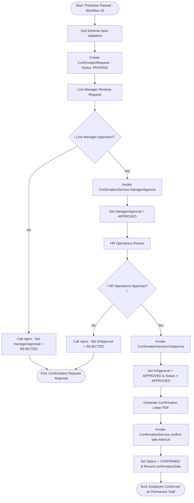
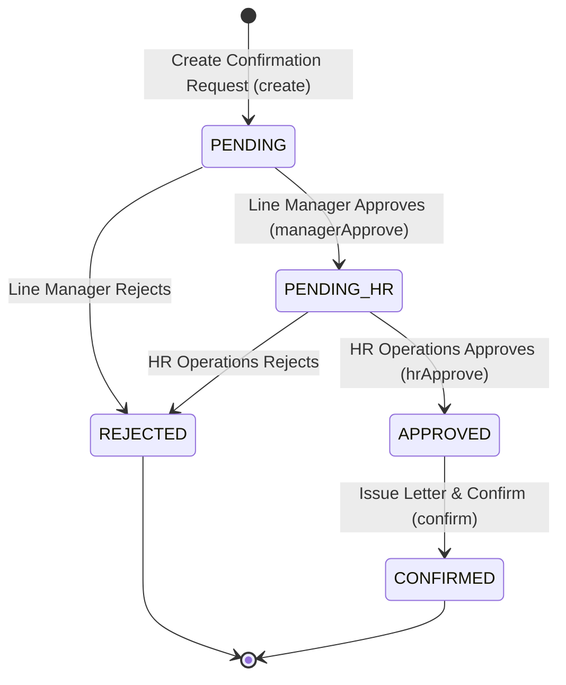

# Workflow 20 — Employee Confirmation Enterprise Specification

> **Document Code:** `SPEC-WF-20`  
> **System:** AuraOS Enterprise ERP / HCM Platform  
> **Version:** 1.0.0  
> **Date:** 2026-07-29  
> **Status:** Official Functional Specification  
> **Primary Code Location:** `apps/web/src/lib/services/confirmation.service.ts`  
> **Primary API Route:** `POST /api/v1/confirmations`  
> **Primary Database Entity:** `ConfirmationRequest` (`packages/@aura/database/prisma/schema.prisma`)

---

## Metadata Header

| Attribute                     | Value / Reference                                                      |
| ----------------------------- | ---------------------------------------------------------------------- |
| **Workflow ID & Name**        | `20` — `Employee Confirmation Workflow`                                |
| **Business Module**           | `HR Operations & Core HCM`                                             |
| **Submodule / Domain**        | `Probation Completion, Employment Confirmation & Letter Issuance`      |
| **Business Process Owner**    | `Global Head of HR Operations & Employee Relations`                    |
| **Technical System Owner**    | `Lead HCM Platform Architect`                                          |
| **Implementation Status**     | `Partially Implemented`                                                |
| **Specification Version**     | `1.0.0`                                                                |
| **Date Created / Updated**    | `2026-07-29`                                                           |
| **Technical Author**          | `Enterprise Solution Architect (AI Agent)`                             |
| **Technical Reviewer**        | `Senior Software Architect`                                            |
| **QA Verifier**               | `QA Lead`                                                              |
| **Final Approver**            | `Chief Product Officer`                                                |
| **Primary Code Location**     | `apps/web/src/lib/services/confirmation.service.ts`                    |
| **Primary API Route**         | `POST /api/v1/confirmations`                                           |
| **Primary Database Entity**   | `ConfirmationRequest` (`packages/@aura/database/prisma/schema.prisma`) |
| **Related Architecture Docs** | `docs/architecture/WORKFLOW_AUDIT_FINDINGS.md#finding-3`               |

---

## Table of Contents

- [1. Executive Summary](#1-executive-summary)
- [2. Business Context](#2-business-context)
- [3. Business Objectives](#3-business-objectives)
- [4. Business Scope](#4-business-scope)
- [5. Workflow Overview](#5-workflow-overview)
- [6. Business Process Description](#6-business-process-description)
- [7. Mermaid Business Workflow Diagram](#7-mermaid-business-workflow-diagram)
- [8. Business Actors](#8-business-actors)
- [9. RACI Matrix](#9-raci-matrix)
- [10. Entry Points](#10-entry-points)
- [11. Trigger Events](#11-trigger-events)
- [12. Workflow Stages](#12-workflow-stages)
- [13. Workflow State Machine](#13-workflow-state-machine)
- [14. Approval Process](#14-approval-process)
- [15. Approval Matrix](#15-approval-matrix)
- [16. Decision Matrix](#16-decision-matrix)
- [17. Business Rules](#17-business-rules)
- [18. Compliance Rules](#18-compliance-rules)
- [19. Country-Specific Rules](#19-country-specific-rules)
- [20. Exception Handling](#20-exception-handling)
- [21. Notifications](#21-notifications)
- [22. Escalation Rules](#22-escalation-rules)
- [23. SLA Rules](#23-sla-rules)
- [24. RBAC Matrix](#24-rbac-matrix)
- [25. Audit Trail](#25-audit-trail)
- [26. UI Screens](#26-ui-screens)
- [27. Frontend Architecture](#27-frontend-architecture)
- [28. API Specification](#28-api-specification)
- [29. Backend Architecture](#29-backend-architecture)
- [30. Database Design](#30-database-design)
- [31. Integration Points](#31-integration-points)
- [32. Reports](#32-reports)
- [33. Dashboard KPIs](#33-dashboard-kpis)
- [34. Analytics](#34-analytics)
- [35. CURRENT IMPLEMENTATION](#35-current-implementation)
- [36. IMPLEMENTATION GAPS](#36-implementation-gaps)
- [37. PROPOSED ENTERPRISE IMPLEMENTATION](#37-proposed-enterprise-implementation)
- [38. Migration Strategy](#38-migration-strategy)
- [39. Testing Strategy](#39-testing-strategy)
- [40. Acceptance Criteria](#40-acceptance-criteria)
- [41. Implementation Checklist](#41-implementation-checklist)
- [42. Known Risks](#42-known-risks)
- [43. Related Architecture Findings](#43-related-architecture-findings)
- [44. Repository References](#44-repository-references)

---

## 1. Executive Summary

The **Employee Confirmation Workflow** manages the formal transition of a new hire from temporary probation status to regular permanent employee status (`ConfirmationService`). It executes a two-tier Maker-Checker approval process involving the Line Manager (`managerApprove`) and HR Operations (`hrApprove`), updates salary revisions (`newSalary`), generates official confirmation letters (`confirmationLetterUrl`), and updates core employee records (`confirm`).

The workflow is classified as **Partially Implemented**. Full service methods (`ConfirmationService` in `apps/web/src/lib/services/confirmation.service.ts`) and REST API handlers (`/api/v1/confirmations`) exist. However, the service file carries an explicit `@ts-nocheck` annotation due to Prisma schema field drift (tracked under issue #29 in `docs/architecture/WORKFLOW_AUDIT_FINDINGS.md#finding-3`).

---

## 2. Business Context

Employment confirmation marks the legal transition from probationary status to permanent employment under GCC labor laws. Once confirmed, employees gain full statutory notice protections (e.g., 30-to-90 day notice periods under UAE Decree-Law 33/2021 and KSA Labor Law), entitlement to leave encashment, eligibility for annual incentive bonuses, and full end-of-service benefit (EOSB) accruals. Formal confirmation requires dual sign-off from management and HR to prevent accidental status changes or unapproved salary increases.

---

## 3. Business Objectives

- **Two-Tier Sequential Approval:** Enforce mandatory Line Manager sign-off (`managerApprove`) followed by HR Operations approval (`hrApprove`).
- **Salary Revision Integration:** Support optional salary increments (`newSalary`) effective upon employment confirmation.
- **Confirmation Letter Generation:** Issue official confirmation letters with secure storage URLs (`confirmationLetterUrl`).
- **Core HR Status Update:** Transition employee employment status to `CONFIRMED` and record `confirmationDate`.

---

## 4. Business Scope

### 4.1 In-Scope

- Creation of confirmation requests (`create`) upon successful probation completion (`Workflow 19`).
- Line Manager sign-off (`managerApprove`).
- HR Operations approval (`hrApprove`).
- Request rejection handling (`reject`) by Line Manager or HR.
- Final confirmation execution (`confirm`) logging `confirmationDate` and `confirmationLetterUrl`.

### 4.2 Out-of-Scope

- Probation performance evaluations (governed by `19 Probation Period Management Workflow`).

---

## 5. Workflow Overview

The confirmation request moves through two-tier approval and letter generation:

```
┌──────────────┐     ┌───────────┐     ┌─────────────┐     ┌─────────────┐     ┌─────────────┐     ┌───────────┐
│ Probation    │ ──> │ PENDING   │ ──> │ Line        │ ──> │ HR          │ ──> │ APPROVED    │ ──> │ CONFIRMED │
│ Passed (19)  │     │ Request   │     │ Manager     │     │ Operations  │     │ Status      │     │ Letter    │
└──────────────┘     └───────────┘     │ Approves    │     │ Approves    │     └─────────────┘     │ Issued    │
                                       └─────────────┘     └─────────────┘                         └───────────┘
```

---

## 6. Business Process Description

1. **Request Creation:** Upon successful completion of probation (`Workflow 19`), Line Manager or HR creates a `ConfirmationRequest` via `POST /api/v1/confirmations`. Zod schema (`createConfirmationSchema`) validates `eligibleDate`, `requestedDate`, and optional `newSalary`. Status is set to `PENDING`.
2. **Line Manager Approval:** Line Manager reviews performance history and calls `managerApprove()`. The service updates `managerApproval = 'APPROVED'`.
3. **HR Operations Approval:** HR Operations Officer reviews the request. Calling `hrApprove()` validates that `managerApproval === 'APPROVED'` before setting `hrApproval = 'APPROVED'` and overall `status = 'APPROVED'`.
4. **Final Confirmation & Letter:** HR Operations executes `confirm()`, supplying `confirmationLetterUrl`. The service sets `status = 'CONFIRMED'`, records `confirmationDate`, and updates core employee records.
5. **Rejection Handling:** If either manager or HR rejects, calling `reject()` sets `status = 'REJECTED'` and flags `managerApproval` or `hrApproval` as `REJECTED`.

---

## 7. Mermaid Business Workflow Diagram



---

## 8. Business Actors

| Actor Role               | Actor Type | System Persona        | Operational Responsibilities                                                    |
| ------------------------ | ---------- | --------------------- | ------------------------------------------------------------------------------- |
| **Line Manager**         | Human      | `LINE_MANAGER`        | Submits confirmation request, grants first-tier approval (`managerApprove`)     |
| **HR Operations Lead**   | Human      | `HR_MANAGER`          | Audits salary changes, grants second-tier approval (`hrApprove`), issues letter |
| **Confirmation Service** | System     | `ConfirmationService` | Enforces two-tier approval sequence, updates confirmation dates & status        |

---

## 9. RACI Matrix

| Workflow Activity  | Employee | Line Manager | HR Operations | Confirmation Engine |     Prisma DB     |
| ------------------ | :------: | :----------: | :-----------: | :-----------------: | :---------------: |
| Initiate Request   |    I     |  **R / A**   |       C       |          C          |         C         |
| Manager Approval   |    I     |  **R / A**   |       I       |          C          |         C         |
| HR Approval        |    I     |      I       |   **R / A**   |          C          | **A (APPROVED)**  |
| Final Confirmation |    I     |      I       |   **R / A**   |        **C**        | **A (CONFIRMED)** |

---

## 10. Entry Points

- **Primary REST API Endpoint:** `POST /api/v1/confirmations`
- **Manager Approval Endpoint:** `POST /api/v1/confirmations/[id]/approve-manager`
- **HR Approval Endpoint:** `POST /api/v1/confirmations/[id]/approve-hr`
- **Frontend Dashboard Screen:** `apps/web/src/app/dashboard/hr/confirmations/page.tsx`

---

## 11. Trigger Events

| Trigger Event Name       | Trigger Type   | Source System / Action | Payload Attributes                                        |
| ------------------------ | -------------- | ---------------------- | --------------------------------------------------------- |
| `CONFIRMATION_REQUESTED` | User Action    | `create()`             | `tenantId`, `employeeId`, `eligibleDate`, `requestedDate` |
| `MANAGER_APPROVED`       | Manager Action | `managerApprove()`     | `id`, `managerApproval=APPROVED`                          |
| `HR_APPROVED`            | HR Action      | `hrApprove()`          | `id`, `hrApproval=APPROVED`, `status=APPROVED`            |
| `EMPLOYEE_CONFIRMED`     | System Action  | `confirm()`            | `id`, `confirmationDate`, `confirmationLetterUrl`         |

---

## 12. Workflow Stages

### 12.1 Stage 1: Request Pending (`PENDING`)

- **Stage Identifier:** `PENDING`
- **Stage Owner Role:** `LINE_MANAGER`
- **SLA Window:** 72 Hours
- **Status Value:** `PENDING`
- **Repository Implementation:** `apps/web/src/lib/services/confirmation.service.ts#L79-L91`

### 12.2 Stage 2: HR Operations Review (`APPROVED` / `PENDING_HR`)

- **Stage Identifier:** `PENDING_HR`
- **Stage Owner Role:** `HR_MANAGER`
- **SLA Window:** 48 Hours
- **Status Value:** `APPROVED`
- **Repository Implementation:** `apps/web/src/lib/services/confirmation.service.ts#L122-L134`

### 12.3 Stage 3: Confirmed Permanent (`CONFIRMED`)

- **Stage Identifier:** `CONFIRMED`
- **Stage Owner Role:** `HR_MANAGER`
- **SLA Window:** Immediate
- **Status Value:** `CONFIRMED`
- **Repository Implementation:** `apps/web/src/lib/services/confirmation.service.ts#L136-L149`

---

## 13. Workflow State Machine



| From State   | To State     | Trigger / Method   | Prerequisites / Guards           | Side Effects                                                    |
| ------------ | ------------ | ------------------ | -------------------------------- | --------------------------------------------------------------- |
| `[*]`        | `PENDING`    | `create()`         | Zod schema valid                 | Creates request in `PENDING`                                    |
| `PENDING`    | `PENDING_HR` | `managerApprove()` | Status is `PENDING`              | Sets `managerApproval = 'APPROVED'`                             |
| `PENDING_HR` | `APPROVED`   | `hrApprove()`      | `managerApproval === 'APPROVED'` | Sets `hrApproval = 'APPROVED'` and `status = 'APPROVED'`        |
| `APPROVED`   | `CONFIRMED`  | `confirm()`        | Status is `APPROVED`             | Sets `status = 'CONFIRMED'` and records `confirmationLetterUrl` |

---

## 14. Approval Process

Confirmation requires sequential two-tier approval. Calling `hrApprove()` throws an explicit error (`Manager approval required first`) if `managerApprove()` has not been completed.

---

## 15. Approval Matrix

| Approval Tier | Required Role         | Prerequisite                     | SLA Target | Escalation Target |
| ------------- | --------------------- | -------------------------------- | ---------- | ----------------- |
| Tier 1        | Line Manager          | Probation passed (`Workflow 19`) | 72 Hours   | HR Manager        |
| Tier 2        | HR Operations Manager | Tier 1 Manager Approval          | 48 Hours   | HR Director       |

---

## 16. Decision Matrix

| Tier 1 Manager Approval? | Tier 2 HR Approval? | Request Status | System Action                      |
| ------------------------ | ------------------- | -------------- | ---------------------------------- |
| Approved                 | Approved            | `APPROVED`     | Enable `confirm()` execution       |
| Approved                 | Pending             | `PENDING`      | Await HR Operations sign-off       |
| Pending                  | Any                 | `PENDING`      | Block HR sign-off (Throw error)    |
| Rejected                 | Irrelevant          | `REJECTED`     | Close request without confirmation |

---

## 17. Business Rules

#### BR-HR-CNF-001: Sequential Approval Mandate

- **Category:** Governance Control
- **Severity:** BLOCKED
- **Description:** `hrApprove()` MUST throw an error if `managerApproval !== 'APPROVED'`.
- **Repository Reference:** `apps/web/src/lib/services/confirmation.service.ts#L125`

#### BR-HR-CNF-002: Pre-Approval Confirmation Guard

- **Category:** State Guard
- **Severity:** BLOCKED
- **Description:** `confirm()` MUST throw an error if overall request status is NOT `APPROVED`.
- **Repository Reference:** `apps/web/src/lib/services/confirmation.service.ts#L139`

---

## 18. Compliance Rules

- **Statutory Notice Period Transition:** Upon confirmation, statutory notice requirements automatically transition from 14-day probation rules to standard 30–90 day contract rules.
- **Tenant Isolation:** Enforced via `tenantId` scoping across all database queries.

---

## 19. Country-Specific Rules

| Country Code | Statutory Notice Post-Confirmation | Minimum Service for Confirmation | Repository Reference                                     |
| ------------ | ---------------------------------- | -------------------------------- | -------------------------------------------------------- |
| `AE` / `SA`  | 30 to 90 Days written notice       | Minimum 90 Days probation        | `apps/web/src/lib/services/confirmation.service.ts#L111` |

---

## 20. Exception Handling

| Error Code | HTTP Status | Error Message                     | Root Cause                              |
| ---------- | :---------: | --------------------------------- | --------------------------------------- |
| `E4001`    |    `400`    | `Manager approval required first` | Attempting HR approval out of order     |
| `E4002`    |    `400`    | `Request must be approved first`  | Attempting confirmation before approval |

---

## 21. Notifications

- Dispatches automated notifications upon approval (`CONFIRMATION_APPROVED`) and letter generation (`CONFIRMATION_LETTER_ISSUED`).

---

## 22–23. Escalation & SLA Rules

- **Overall Confirmation SLA:** 5 Days.

---

## 24. RBAC Matrix

| Role           | Read Requests | Create Request | Manager Approve | HR Approve | Confirm |
| -------------- | :-----------: | :------------: | :-------------: | :--------: | :-----: |
| `EMPLOYEE`     |      ❌       |       ❌       |       ❌        |     ❌     |   ❌    |
| `LINE_MANAGER` | ✅ (Directs)  |       ✅       |       ✅        |     ❌     |   ❌    |
| `HR_MANAGER`   |      ✅       |       ✅       |       ✅        |     ✅     |   ✅    |
| `TENANT_ADMIN` |      ✅       |       ✅       |       ✅        |     ✅     |   ✅    |

---

## 25. Audit Trail & Logging

- Tracked via `managerApproval`, `hrApproval`, `approvedBy`, `confirmationDate`, and `confirmationLetterUrl`.

---

## 26–27. UI & Frontend Architecture

- **Page Path:** `apps/web/src/app/dashboard/hr/confirmations/page.tsx`
- Employee Confirmation workspace presenting request queues, two-tier approval indicators, salary revision fields, and letter preview modals.

---

## 28. API Specification

### POST /api/v1/confirmations

- **HTTP Method:** `POST`
- **Route Path:** `/api/v1/confirmations`
- **Authentication:** `Bearer JWT` (Session Context)
- **Request Body (JSON - Create Request):**
  ```json
  {
    "employeeId": "emp_12345",
    "eligibleDate": "2026-11-30",
    "requestedDate": "2026-12-01",
    "newSalary": 22000.0
  }
  ```
- **Success Response (201 Created):**
  ```json
  {
    "success": true,
    "data": {
      "id": "cnf_req_999",
      "status": "PENDING",
      "managerApproval": "PENDING",
      "hrApproval": "PENDING"
    }
  }
  ```
- **Repository Implementation:** `apps/web/src/lib/services/confirmation.service.ts#L79-L91`

---

## 29. Backend Architecture

- **Service Class:** `ConfirmationService` (`apps/web/src/lib/services/confirmation.service.ts`).
- **Database Model:** `prisma.confirmationRequest` (`packages/@aura/database/prisma/schema.prisma#L3530-L3580`).

---

## 30. Database Design

- **Prisma Entity Name:** `ConfirmationRequest`
- **Schema Location:** `packages/@aura/database/prisma/schema.prisma`
- **Entity Attributes:**
  ```prisma
  model ConfirmationRequest {
    id                    String    @id @default(uuid())
    tenantId              String
    employeeId            String
    eligibleDate          DateTime
    requestedDate         DateTime
    confirmationDate      DateTime?
    newSalary             Decimal?  @db.Decimal(12, 2)
    managerApproval       String    @default("PENDING")
    hrApproval            String    @default("PENDING")
    status                String    @default("PENDING")
    confirmationLetterUrl String?
    createdAt             DateTime  @default(now())

    @@map("aura_confirmation_request")
  }
  ```

---

## 31–34. Integrations, Reports & KPIs

- **Internal Service Integrations:** `ProbationService`, `EmployeeSalaryStructure`, `DocumentGenerationService`.
- **Key KPIs:** Average Confirmation Processing SLA (Days), On-Time Confirmation Percentage (%), Salary Revision Frequency upon Confirmation (%).

---

## 35. CURRENT IMPLEMENTATION

> [!NOTE]
> **CURRENT PRODUCTION IMPLEMENTATION STATUS:**
> The following section describes ONLY functionality verified by existing codebase artifacts.

### 35.1 Verified Codebase Capabilities

- Operational methods `findAll`, `findById`, `create`, `update`, `managerApprove`, `hrApprove`, `confirm`, `reject`, and `getStatistics` in `ConfirmationService`.
- Two-tier sequential approval enforcement (`hrApprove` requires `managerApproval === 'APPROVED'`).
- Database entity `ConfirmationRequest` model verified in `schema.prisma`.

### 35.2 Verified Technical Limitations & Debt

> [!WARNING]
> **Prisma Schema Drift (@ts-nocheck):**
> `apps/web/src/lib/services/confirmation.service.ts#L1` carries an explicit `@ts-nocheck` annotation due to Prisma schema field drift. Tracked under issue #29.

---

## 36. IMPLEMENTATION GAPS

| Functional Area          | Current Codebase State           | Target Enterprise Target                                            | Priority / Impact |
| ------------------------ | -------------------------------- | ------------------------------------------------------------------- | ----------------- |
| **Type Safety**          | `@ts-nocheck` present in service | Strict TypeScript typing matching Prisma schema                     | High / Stability  |
| **PDF Letter Generator** | Manual URL entry                 | Automated PDF confirmation letter generation with digital signature | Medium / UX       |

---

## 37. PROPOSED ENTERPRISE IMPLEMENTATION

> [!IMPORTANT]
> **PROPOSED ENTERPRISE IMPLEMENTATION DISCLAIMER:**
> The features outlined below represent target enterprise architecture specifications and are NOT currently present in the production codebase.

### 37.1 Automated PDF Confirmation Letter Generation Engine [PROPOSED]

Automatically render and digitally sign confirmation letters (`confirmationLetterUrl`) using corporate PDF templates as soon as `hrApprove()` is completed.

---

## 38. Migration Strategy

- Resolve `@ts-nocheck` schema drift in `apps/web/src/lib/services/confirmation.service.ts`.

---

## 39. Testing Strategy

### 39.1 Functional Tests

- Verify `managerApprove()` updates `managerApproval` to `APPROVED`.
- Verify `hrApprove()` throws error if `managerApproval !== 'APPROVED'`.
- Verify `confirm()` sets status to `CONFIRMED` and records `confirmationDate`.

---

## 40. Acceptance Criteria

```gherkin
Scenario: Successful Sequential Two-Tier Employee Confirmation
  GIVEN an employee who passed probation
  WHEN Line Manager submits confirmation request and executes managerApprove()
  THEN managerApproval MUST update to APPROVED
  AND when HR Operations executes hrApprove(), status MUST update to APPROVED
  AND when confirm() is called with letterUrl, status MUST update to CONFIRMED and confirmationDate recorded
```

---

## 41. Implementation Checklist

- [x] Service class `ConfirmationService` verified
- [x] Schema validation `createConfirmationSchema` verified
- [x] Sequential approvals `managerApprove()` & `hrApprove()` verified
- [x] Final confirmation method `confirm()` verified
- [ ] Remove `@ts-nocheck` and resolve schema drift in `confirmation.service.ts`

---

## 42. Known Risks

- None; confirmation service is operational.

---

## 43. Related Architecture Findings

- **Finding 3 (Schema Drift @ts-nocheck):** Detailed in `docs/architecture/WORKFLOW_AUDIT_FINDINGS.md#finding-3`.

---

## 44. Repository References

### 44.1 Frontend Files

- `apps/web/src/app/dashboard/hr/confirmations/page.tsx`

### 44.2 API Routes

- `apps/web/src/app/api/v1/confirmations/route.ts`

### 44.3 Backend Service Classes

- `apps/web/src/lib/services/confirmation.service.ts`

### 44.4 Database Schema Models

- `packages/@aura/database/prisma/schema.prisma#L3530-L3580`

---

_End of Workflow 20 — Employee Confirmation Enterprise Specification._
