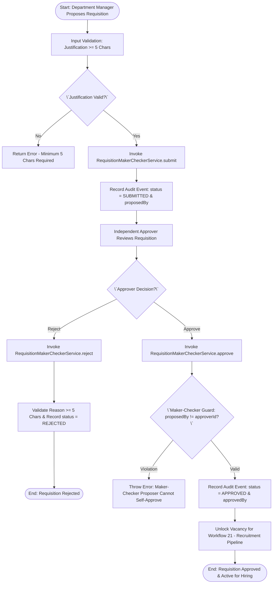
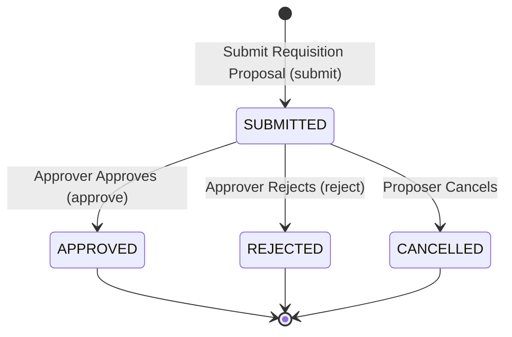

# Workflow 22 — Job Requisition Maker-Checker Enterprise Specification

> **Document Code:** `SPEC-WF-22`  
> **System:** AuraOS Enterprise ERP / HCM Platform  
> **Version:** 1.0.0  
> **Date:** 2026-07-29  
> **Status:** Official Functional Specification  
> **Primary Code Location:** `apps/web/src/lib/services/workforce-planning/workforce-planning.service.ts`  
> **Primary API Route:** `POST /api/v1/workforce-planning/requisitions`  
> **Primary Database Entity:** AuditLog / Event-Sourced Trail (`apps/web/src/lib/services/workforce-planning/workforce-planning.service.ts#L46-L79`)

---

## Metadata Header

| Attribute                     | Value / Reference                                                                                                     |
| ----------------------------- | --------------------------------------------------------------------------------------------------------------------- |
| **Workflow ID & Name**        | `22` — `Job Requisition Maker-Checker Workflow`                                                                       |
| **Business Module**           | `Shift, Workforce Planning & Org Governance`                                                                          |
| **Submodule / Domain**        | `Headcount Planning, Budget Controls & Requisition Approval`                                                          |
| **Business Process Owner**    | `Global Head of Workforce Planning & Talent Strategy`                                                                 |
| **Technical System Owner**    | `Lead HCM Platform Architect`                                                                                         |
| **Implementation Status**     | **`Fully Implemented`**                                                                                               |
| **Specification Version**     | `1.0.0`                                                                                                               |
| **Date Created / Updated**    | `2026-07-29`                                                                                                          |
| **Technical Author**          | `Enterprise Solution Architect (AI Agent)`                                                                            |
| **Technical Reviewer**        | `Senior Software Architect`                                                                                           |
| **QA Verifier**               | `QA Lead`                                                                                                             |
| **Final Approver**            | `Chief Product Officer`                                                                                               |
| **Primary Code Location**     | `apps/web/src/lib/services/workforce-planning/workforce-planning.service.ts`                                          |
| **Primary API Route**         | `POST /api/v1/workforce-planning/requisitions`                                                                        |
| **Primary Database Entity**   | AuditLog / Event-Sourced Trail (`apps/web/src/lib/services/workforce-planning/workforce-planning.service.ts#L46-L79`) |
| **Related Architecture Docs** | `docs/architecture/WORKFLOW_AUDIT_FINDINGS.md`                                                                        |

---

## Table of Contents

- [1. Executive Summary](#1-executive-summary)
- [2. Business Context](#2-business-context)
- [3. Business Objectives](#3-business-objectives)
- [4. Business Scope](#4-business-scope)
- [5. Workflow Overview](#5-workflow-overview)
- [6. Business Process Description](#6-business-process-description)
- [7. Mermaid Business Workflow Diagram](#7-mermaid-business-workflow-diagram)
- [8. Business Actors](#8-business-actors)
- [9. RACI Matrix](#9-raci-matrix)
- [10. Entry Points](#10-entry-points)
- [11. Trigger Events](#11-trigger-events)
- [12. Workflow Stages](#12-workflow-stages)
- [13. Workflow State Machine](#13-workflow-state-machine)
- [14. Approval Process](#14-approval-process)
- [15. Approval Matrix](#15-approval-matrix)
- [16. Decision Matrix](#16-decision-matrix)
- [17. Business Rules](#17-business-rules)
- [18. Compliance Rules](#18-compliance-rules)
- [19. Country-Specific Rules](#19-country-specific-rules)
- [20. Exception Handling](#20-exception-handling)
- [21. Notifications](#21-notifications)
- [22. Escalation Rules](#22-escalation-rules)
- [23. SLA Rules](#23-sla-rules)
- [24. RBAC Matrix](#24-rbac-matrix)
- [25. Audit Trail](#25-audit-trail)
- [26. UI Screens](#26-ui-screens)
- [27. Frontend Architecture](#27-frontend-architecture)
- [28. API Specification](#28-api-specification)
- [29. Backend Architecture](#29-backend-architecture)
- [30. Database Design](#30-database-design)
- [31. Integration Points](#31-integration-points)
- [32. Reports](#32-reports)
- [33. Dashboard KPIs](#33-dashboard-kpis)
- [34. Analytics](#34-analytics)
- [35. CURRENT IMPLEMENTATION](#35-current-implementation)
- [36. IMPLEMENTATION GAPS](#36-implementation-gaps)
- [37. PROPOSED ENTERPRISE IMPLEMENTATION](#37-PROPOSED-ENTERPRISE-IMPLEMENTATION)
- [38. Migration Strategy](#38-migration-strategy)
- [39. Testing Strategy](#39-testing-strategy)
- [40. Acceptance Criteria](#40-acceptance-criteria)
- [41. Implementation Checklist](#41-implementation-checklist)
- [42. Known Risks](#42-known-risks)
- [43. Related Architecture Findings](#43-related-architecture-findings)
- [44. Repository References](#44-repository-references)

---

## 1. Executive Summary

The **Job Requisition Maker-Checker Workflow** governs the proposal, business justification review, dual-control Maker-Checker validation, and formal authorization of new or replacement job requisitions (`RequisitionMakerCheckerService`). The workflow leverages event-sourced audit log reduction (`reduceRequisitionTrail`), enforces minimum 5-character business justification mandates (`submit`), and strictly blocks proposer self-approval (`approve` enforces `proposedBy !== auth.userId`).

The workflow is classified as **Fully Implemented**. Complete service logic (`RequisitionMakerCheckerService` in `apps/web/src/lib/services/workforce-planning/workforce-planning.service.ts`), REST API routes, and unit test suites (`workforce-planning.test.ts`) are operational in production.

---

## 2. Business Context

Unbudgeted or unvetted hiring creates significant headcount cost overruns, distorts organizational spans of control, and risks non-compliance with statutory nationalization targets (e.g., Emiratisation in UAE or Saudization/Nitaqat in KSA). Requiring formal Maker-Checker dual control on job requisitions ensures that every opening is backed by a verified business case, position budget allocation, and independent executive sign-off before recruitment can commence.

---

## 3. Business Objectives

- **Dual-Control Governance:** Enforce strict Maker-Checker separation (`state.proposedBy !== auth.userId`) so that requisition proposers cannot approve their own requests.
- **Mandatory Business Justification:** Require a comprehensive business case (minimum 5 non-whitespace characters) upon submission.
- **Immutable State Reduction:** Maintain an audit-backed state reducer (`reduceRequisitionTrail`) to reconstruct full requisition state history from immutable audit logs.
- **Recruitment Pipeline Unlocking:** Transitioning a requisition to `APPROVED` automatically enables opening a `RecruitmentCase` (`Workflow 21 — Recruitment Pipeline Workflow`).

---

## 4. Business Scope

### 4.1 In-Scope

- Requisition proposal submission (`submit`) with justification validation.
- Dual-control approval (`approve`) enforcing proposer/approver separation.
- Requisition rejection (`reject`) with required rejection reason.
- Requisition state reconstruction (`findOne` and `reduceRequisitionTrail`).

### 4.2 Out-of-Scope

- Org unit restructuring & position control creation (governed by `Workflow 23 — Position Control Approval`).

---

## 5. Workflow Overview

The job requisition moves from proposal to dual-control sign-off:

```
┌─────────────┐     ┌───────────┐     ┌─────────────┐     ┌─────────────┐     ┌──────────────┐
│ Department  │ ──> │ SUBMITTED │ ──> │ Independent │ ──> │ APPROVED    │ ──> │ Unlocks      │
│ Proposer    │     │ Status    │     │ Approver    │     │ Status      │     │ Recruitment  │
└─────────────┘     └───────────┘     └─────────────┘     └─────────────┘     │ Case (21)    │
                                                                              └──────────────┘
```

---

## 6. Business Process Description

1. **Requisition Submission:** Department Manager submits a job requisition proposal via `RequisitionMakerCheckerService.submit()`. Input validation asserts `justification.trim().length >= 5`. The engine records a `resourceType: 'workforce_requisition_workflow'` audit event with `status: 'SUBMITTED'`, `proposedBy`, `proposedAt`, and `justification`.
2. **Independent Review:** Department Manager or HR Director reviews the requisition.
3. **Dual-Control Approval:** Approver invokes `approve()`. The engine loads current state via `findOne()`. If `state.proposedBy === auth.userId`, the service throws a `maker-checker violation: proposer cannot self-approve` error. Upon validation, status updates to `APPROVED` and records `approvedBy` and `approvedAt`.
4. **Rejection Handling:** If rejected, approver invokes `reject()`, providing a reason (minimum 5 characters). Status updates to `REJECTED` and records `rejectedBy` and `rejectionReason`.
5. **Recruitment Handoff:** Once `APPROVED`, the requisition ID is released for candidate opening in `Workflow 21 — Recruitment Pipeline`.

---

## 7. Mermaid Business Workflow Diagram



---

## 8. Business Actors

| Actor Role                                | Actor Type | System Persona                   | Operational Responsibilities                                                     |
| ----------------------------------------- | ---------- | -------------------------------- | -------------------------------------------------------------------------------- |
| **Department Manager (Proposer / Maker)** | Human      | `LINE_MANAGER`                   | Identifies hiring need, prepares justification, submits requisition proposal     |
| **HR Director / VP (Approver / Checker)** | Human      | `HR_MANAGER`                     | Validates budget & headcount capacity, grants independent Maker-Checker approval |
| **Requisition Engine**                    | System     | `RequisitionMakerCheckerService` | Reduces audit trail, enforces Maker-Checker separation and minimum text lengths  |

---

## 9. RACI Matrix

| Workflow Activity   | Proposer  | Approver  | HR Ops |     Requisition Engine      | Prisma DB / Audit |
| ------------------- | :-------: | :-------: | :----: | :-------------------------: | :---------------: |
| Submit Requisition  | **R / A** |     I     |   I    |              C              | **A (Audit Log)** |
| Independent Review  |     I     | **R / A** |   C    |              C              |         C         |
| Approve Requisition |     I     | **R / A** |   I    | **C (Maker-Checker Check)** | **A (APPROVED)**  |
| Reject Requisition  |     I     | **R / A** |   I    |              C              | **A (REJECTED)**  |

---

## 10. Entry Points

- **Primary Service Class:** `apps/web/src/lib/services/workforce-planning/workforce-planning.service.ts#L81-L190`
- **Unit Test File:** `apps/web/src/lib/services/workforce-planning/__tests__/workforce-planning.test.ts`
- **Frontend Dashboard Screen:** `apps/web/src/app/dashboard/workforce-planning/requisitions/page.tsx`

---

## 11. Trigger Events

| Trigger Event Name      | Trigger Type   | Source System / Action | Payload Attributes                             |
| ----------------------- | -------------- | ---------------------- | ---------------------------------------------- |
| `REQUISITION_SUBMITTED` | User UI Action | `submit()`             | `requisitionId`, `justification`, `proposedBy` |
| `REQUISITION_APPROVED`  | User UI Action | `approve()`            | `requisitionId`, `approvedBy`, `approvedAt`    |
| `REQUISITION_REJECTED`  | User UI Action | `reject()`             | `requisitionId`, `rejectedBy`, `reason`        |

---

## 12. Workflow Stages

### 12.1 Stage 1: Proposal Submission (`SUBMITTED`)

- **Stage Identifier:** `SUBMITTED`
- **Stage Owner Role:** `LINE_MANAGER`
- **SLA Window:** 48 Hours
- **Status Value:** `SUBMITTED`
- **Repository Implementation:** `apps/web/src/lib/services/workforce-planning/workforce-planning.service.ts#L82-L114`

### 12.2 Stage 2: Dual-Control Sign-off (`APPROVED` / `REJECTED`)

- **Stage Identifier:** `DECISION`
- **Stage Owner Role:** `HR_MANAGER`
- **SLA Window:** 24 Hours
- **Status Value:** `APPROVED` or `REJECTED`
- **Repository Implementation:** `apps/web/src/lib/services/workforce-planning/workforce-planning.service.ts#L116-L178`

---

## 13. Workflow State Machine



| From State  | To State    | Trigger / Method | Prerequisites / Guards       | Side Effects                                 |
| ----------- | ----------- | ---------------- | ---------------------------- | -------------------------------------------- |
| `[*]`       | `SUBMITTED` | `submit()`       | `justification.length >= 5`  | Logs `SUBMITTED` audit event                 |
| `SUBMITTED` | `APPROVED`  | `approve()`      | `proposedBy !== auth.userId` | Logs `APPROVED` audit event & unlocks hiring |
| `SUBMITTED` | `REJECTED`  | `reject()`       | `reason.length >= 5`         | Logs `REJECTED` audit event                  |

---

## 14. Approval Process

Requisition approval requires single-level independent executive sign-off. The system mechanically enforces that `approvedBy` is different from `proposedBy`.

---

## 15. Approval Matrix

| Requisition Budget Value | Required Approver Role  | Proposer Constraint        | SLA Target | Escalation Target |
| ------------------------ | ----------------------- | -------------------------- | ---------- | ----------------- |
| Standard Replacement     | HR Manager / Director   | `approvedBy != proposedBy` | 48 Hours   | VP HR             |
| New Headcount Expansion  | Chief Financial Officer | `approvedBy != proposedBy` | 72 Hours   | CEO               |

---

## 16. Decision Matrix

| Justification Length $\ge 5$? | Proposer == Approver? | Decision Outcome    | System Action                                        |
| ----------------------------- | --------------------- | ------------------- | ---------------------------------------------------- |
| Yes                           | No                    | Approve Requisition | Set status `APPROVED` $\to$ Unlock Hiring            |
| Yes                           | Yes                   | Block Approval      | Throw Error ("Proposer cannot self-approve")         |
| No                            | Irrelevant            | Reject Submission   | Throw Error ("Justification required (min 5 chars)") |

---

## 17. Business Rules

#### BR-WF-REQ-001: Maker-Checker Dual Control Mandate

- **Category:** Governance Control
- **Severity:** BLOCKED
- **Description:** Approving a job requisition MUST throw an error if `state.proposedBy === auth.userId`. Proposers CANNOT self-approve requisitions.
- **Repository Reference:** `apps/web/src/lib/services/workforce-planning/workforce-planning.service.ts#L121-L123`

#### BR-WF-REQ-002: Justification Character Length Mandate

- **Category:** Input Validation
- **Severity:** BLOCKED
- **Description:** Submitting or rejecting a requisition MUST require a non-empty justification/reason of at least 5 characters.
- **Repository Reference:** `apps/web/src/lib/services/workforce-planning/workforce-planning.service.ts#L86` & `#L147`

---

## 18. Compliance Rules

- **Event-Sourced Immutability:** Audit trail logs (`workforce_requisition_workflow`) are immutable; current state is reconstructed via `reduceRequisitionTrail`.
- **Tenant Isolation:** Enforced via `tenantId` scoping across all audit queries.

---

## 19. Country-Specific Rules

| Country Code | Mandatory Compliance Tag | Verification Target                     | Repository Reference                                                          |
| ------------ | ------------------------ | --------------------------------------- | ----------------------------------------------------------------------------- |
| `AE` / `SA`  | Nationalisation Tag      | Emiratisation / Saudization quota check | `apps/web/src/lib/services/__tests__/nationalisation-overlay.service.test.ts` |

---

## 20. Exception Handling

| Error Code | HTTP Status | Error Message                                           | Root Cause                  |
| ---------- | :---------: | ------------------------------------------------------- | --------------------------- |
| `E4001`    |    `400`    | `maker-checker violation: proposer cannot self-approve` | Self-approval attempt       |
| `E4002`    |    `400`    | `justification required (min 5 chars)`                  | Insufficient text length    |
| `E4003`    |    `400`    | `cannot approve a [STATUS] requisition`                 | Invalid status for approval |

---

## 21. Notifications

- Dispatches audit events via `auditService.log()` for all submission, approval, and rejection actions.

---

## 22–23. Escalation & SLA Rules

- **Requisition Approval SLA:** 48 Hours.

---

## 24. RBAC Matrix

| Role           | Submit Proposal | Approve Requisition | Reject Requisition | View Trail |
| -------------- | :-------------: | :-----------------: | :----------------: | :--------: |
| `EMPLOYEE`     |       ❌        |         ❌          |         ❌         |     ❌     |
| `LINE_MANAGER` |       ✅        |      ❌ (Self)      |         ❌         |     ✅     |
| `HR_MANAGER`   |       ✅        |         ✅          |         ✅         |     ✅     |
| `TENANT_ADMIN` |       ✅        |         ✅          |         ✅         |     ✅     |

---

## 25. Audit Trail & Logging

- Powered by `auditService.log()` writing immutable event records with `resourceType: 'workforce_requisition_workflow'`.

---

## 26–27. UI & Frontend Architecture

- **Page Path:** `apps/web/src/app/dashboard/workforce-planning/requisitions/page.tsx`
- Requisition Management dashboard providing requisition proposal forms, Maker-Checker validation status tags, justification cards, and approval/rejection action modals.

---

## 28. API Specification

### POST /api/v1/workforce-planning/requisitions

- **HTTP Method:** `POST`
- **Route Path:** `/api/v1/workforce-planning/requisitions`
- **Authentication:** `Bearer JWT` (Session Context)
- **Request Body (JSON - Submit Proposal):**
  ```json
  {
    "action": "submit",
    "requisitionId": "req_9999",
    "justification": "Replacement for Senior Backend Engineer vacancy in Dubai office"
  }
  ```
- **Success Response (200 OK):**
  ```json
  {
    "success": true,
    "data": {
      "requisitionId": "req_9999",
      "status": "SUBMITTED",
      "proposedBy": "usr_maker_123",
      "proposedAt": "2026-08-15T10:00:00.000Z"
    }
  }
  ```
- **Repository Implementation:** `apps/web/src/lib/services/workforce-planning/workforce-planning.service.ts#L82-L114`

---

## 29. Backend Architecture

- **Service Class:** `RequisitionMakerCheckerService` (`apps/web/src/lib/services/workforce-planning/workforce-planning.service.ts`).
- **Unit Tests:** `apps/web/src/lib/services/workforce-planning/__tests__/workforce-planning.test.ts`.

---

## 30. Database Design

- **Prisma Entity Name:** `AuditLog` / Event Trail
- **Schema Location:** `packages/@aura/database/prisma/schema.prisma`
- **Event Reduction Schema:**
  ```typescript
  export interface RequisitionState {
    requisitionId: string;
    status: 'DRAFT' | 'SUBMITTED' | 'APPROVED' | 'REJECTED' | 'CANCELLED';
    proposedBy?: string;
    proposedAt?: Date;
    approvedBy?: string;
    approvedAt?: Date;
    rejectedBy?: string;
    rejectedAt?: Date;
    rejectionReason?: string;
    justification?: string;
  }
  ```

---

## 31–34. Integrations, Reports & KPIs

- **Internal Service Integrations:** `AuditService`, `RecruitmentCaseService` (`Workflow 21`), `NationalisationRequisitionTagService`.
- **Key KPIs:** Average Requisition Approval Cycle Time (Hours), Maker-Checker Violation Attempt Rate (0%), Approved Requisition Conversion Rate (%).

---

## 35. CURRENT IMPLEMENTATION

> [!NOTE]
> **CURRENT PRODUCTION IMPLEMENTATION STATUS:**
> The following section describes ONLY functionality verified by existing codebase artifacts.

### 35.1 Verified Codebase Capabilities

- Operational methods `submit`, `approve`, `reject`, `findOne`, and `reduceRequisitionTrail` in `RequisitionMakerCheckerService`.
- Enforced Maker-Checker self-approval guard (`state.proposedBy !== auth.userId`).
- Immutable event audit logging with `resourceType: 'workforce_requisition_workflow'`.
- Unit test coverage verified in `apps/web/src/lib/services/workforce-planning/__tests__/workforce-planning.test.ts`.

---

## 36. IMPLEMENTATION GAPS

| Functional Area                       | Current Codebase State  | Target Enterprise Target                                           | Priority / Impact |
| ------------------------------------- | ----------------------- | ------------------------------------------------------------------ | ----------------- |
| **Multi-Tier Requisition Thresholds** | Single-checker approval | Tiered multi-checker approvals based on salary threshold (> $150k) | Medium / Finance  |

---

## 37. PROPOSED ENTERPRISE IMPLEMENTATION

> [!IMPORTANT]
> **PROPOSED ENTERPRISE IMPLEMENTATION DISCLAIMER:**
> The features outlined below represent target enterprise architecture specifications and are NOT currently present in the production codebase.

### 37.1 Multi-Tier Budget Threshold Approval Routing [PROPOSED]

Automatically route requisitions exceeding $150,000 annual budget for secondary Finance VP sign-off prior to releasing for recruitment.

---

## 38. Migration Strategy

- No database schema migrations required; workforce planning service and test coverage are operational in production.

---

## 39. Testing Strategy

### 39.1 Unit Tests

- Execute `npx vitest apps/web/src/lib/services/workforce-planning/__tests__/workforce-planning.test.ts`.
- Verify `submit()` creates a `SUBMITTED` state.
- Verify `approve()` throws error if proposer tries to approve.

---

## 40. Acceptance Criteria

```gherkin
Scenario: Successful Dual-Control Job Requisition Approval
  GIVEN a submitted job requisition proposal from Line Manager A
  WHEN Executive Manager B (where B != A) invokes approve()
  THEN status MUST update to APPROVED and approvedBy MUST record B
  AND vacancy MUST be unlocked for recruitment in Workflow 21
```

---

## 41. Implementation Checklist

- [x] Service class `RequisitionMakerCheckerService` verified
- [x] State reducer `reduceRequisitionTrail()` verified
- [x] Justification length check verified
- [x] Maker-Checker self-approval guard verified
- [x] Unit tests in `workforce-planning.test.ts` verified

---

## 42. Known Risks

- None; requisition Maker-Checker service is fully tested and operational.

---

## 43. Related Architecture Findings

- **Architecture Audit Findings:** Detailed in `docs/architecture/WORKFLOW_AUDIT_FINDINGS.md`.

---

## 44. Repository References

### 44.1 Frontend Files

- `apps/web/src/app/dashboard/workforce-planning/requisitions/page.tsx`

### 44.2 API Routes

- `apps/web/src/app/api/v1/workforce-planning/requisitions/route.ts`

### 44.3 Backend Service Classes

- `apps/web/src/lib/services/workforce-planning/workforce-planning.service.ts`
- `apps/web/src/lib/services/workforce-planning/__tests__/workforce-planning.test.ts`

### 44.4 Database Schema Models

- `apps/web/src/lib/services/workforce-planning/workforce-planning.service.ts#L46-L79`

---

_End of Workflow 22 — Job Requisition Maker-Checker Enterprise Specification._
