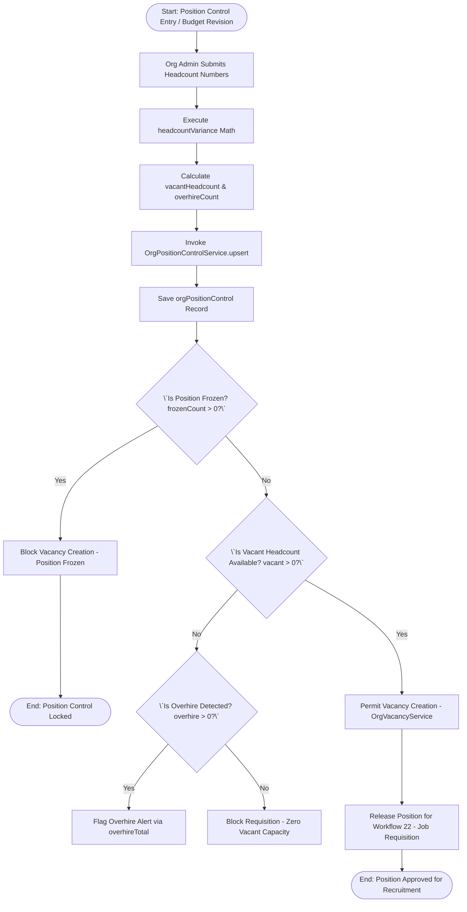
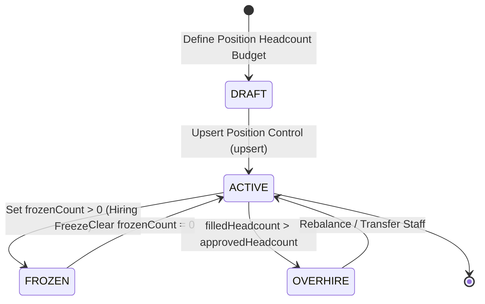

# Workflow 23 — Position Control Approval Enterprise Specification

> **Document Code:** `SPEC-WF-23`  
> **System:** AuraOS Enterprise ERP / HCM Platform  
> **Version:** 1.0.0  
> **Date:** 2026-07-29  
> **Status:** Official Functional Specification  
> **Primary Code Location:** `apps/web/src/lib/services/org-compliance/index.ts`  
> **Primary API Route:** `POST /api/v1/organization/position-control`  
> **Primary Database Entity:** `OrgPositionControl` (`apps/web/src/lib/services/org-compliance/index.ts#L282-L359`)

---

## Metadata Header

| Attribute                     | Value / Reference                                                                    |
| ----------------------------- | ------------------------------------------------------------------------------------ |
| **Workflow ID & Name**        | `23` — `Position Control Approval Workflow`                                          |
| **Business Module**           | `Governance, Org Structure & Headcount Management`                                   |
| **Submodule / Domain**        | `Position Control Governance, Headcount Variance & Freeze Control`                   |
| **Business Process Owner**    | `Global Head of Organization Management & Compensation`                              |
| **Technical System Owner**    | `Lead HCM Platform Architect`                                                        |
| **Implementation Status**     | `Partially Implemented`                                                              |
| **Specification Version**     | `1.0.0`                                                                              |
| **Date Created / Updated**    | `2026-07-29`                                                                         |
| **Technical Author**          | `Enterprise Solution Architect (AI Agent)`                                           |
| **Technical Reviewer**        | `Senior Software Architect`                                                          |
| **QA Verifier**               | `QA Lead`                                                                            |
| **Final Approver**            | `Chief Product Officer`                                                              |
| **Primary Code Location**     | `apps/web/src/lib/services/org-compliance/index.ts`                                  |
| **Primary API Route**         | `POST /api/v1/organization/position-control`                                         |
| **Primary Database Entity**   | `OrgPositionControl` (`apps/web/src/lib/services/org-compliance/index.ts#L282-L359`) |
| **Related Architecture Docs** | `docs/architecture/WORKFLOW_AUDIT_FINDINGS.md`                                       |

---

## Table of Contents

- [1. Executive Summary](#1-executive-summary)
- [2. Business Context](#2-business-context)
- [3. Business Objectives](#3-business-objectives)
- [4. Business Scope](#4-business-scope)
- [5. Workflow Overview](#5-workflow-overview)
- [6. Business Process Description](#6-business-process-description)
- [7. Mermaid Business Workflow Diagram](#7-mermaid-business-workflow-diagram)
- [8. Business Actors](#8-business-actors)
- [9. RACI Matrix](#9-raci-matrix)
- [10. Entry Points](#10-entry-points)
- [11. Trigger Events](#11-trigger-events)
- [12. Workflow Stages](#12-workflow-stages)
- [13. Workflow State Machine](#13-workflow-state-machine)
- [14. Approval Process](#14-approval-process)
- [15. Approval Matrix](#15-approval-matrix)
- [16. Decision Matrix](#16-decision-matrix)
- [17. Business Rules](#17-business-rules)
- [18. Compliance Rules](#18-compliance-rules)
- [19. Country-Specific Rules](#19-country-specific-rules)
- [20. Exception Handling](#20-exception-handling)
- [21. Notifications](#21-notifications)
- [22. Escalation Rules](#22-escalation-rules)
- [23. SLA Rules](#23-sla-rules)
- [24. RBAC Matrix](#24-rbac-matrix)
- [25. Audit Trail](#25-audit-trail)
- [26. UI Screens](#26-ui-screens)
- [27. Frontend Architecture](#27-frontend-architecture)
- [28. API Specification](#28-api-specification)
- [29. Backend Architecture](#29-backend-architecture)
- [30. Database Design](#30-database-design)
- [31. Integration Points](#31-integration-points)
- [32. Reports](#32-reports)
- [33. Dashboard KPIs](#33-dashboard-kpis)
- [34. Analytics](#34-analytics)
- [35. CURRENT IMPLEMENTATION](#35-current-implementation)
- [36. IMPLEMENTATION GAPS](#36-implementation-gaps)
- [37. PROPOSED ENTERPRISE IMPLEMENTATION](#37-PROPOSED-ENTERPRISE-IMPLEMENTATION)
- [38. Migration Strategy](#38-migration-strategy)
- [39. Testing Strategy](#39-testing-strategy)
- [40. Acceptance Criteria](#40-acceptance-criteria)
- [41. Implementation Checklist](#41-implementation-checklist)
- [42. Known Risks](#42-known-risks)
- [43. Related Architecture Findings](#43-related-architecture-findings)
- [44. Repository References](#44-repository-references)

---

## 1. Executive Summary

The **Position Control Approval Workflow** governs the establishment, budget allocation, headcount variance tracking (`headcountVariance`), hiring freeze enforcement (`frozenCount`), and overhire control (`overhireTotal`) across organizational units (`OrgPositionControlService`). The service dynamically tracks `budgetedHeadcount`, `approvedHeadcount`, `filledHeadcount`, `vacantHeadcount`, and `overhireCount` for every fiscal period, enforcing strict governance boundaries before new vacancies (`OrgVacancyService`) or job requisitions (`Workflow 22`) can be created.

The workflow is classified as **Partially Implemented**. Full service implementation (`OrgPositionControlService` in `apps/web/src/lib/services/org-compliance/index.ts`) and pure-logic unit test suites (`org-compliance.service.test.ts`) are operational. In-memory fallback mechanisms handle environments without schema models.

---

## 2. Business Context

Position control is the cornerstone of workforce budget discipline in enterprise HCM. Unlike employee-centric models, position control treats every job position as an independent, budgeted organizational asset. In GCC enterprises subject to strict annual personnel budget caps and statutory nationalization ratios, unmonitored overhiring leads to severe financial variances and compliance failures. The Position Control Approval workflow ensures that no new position is created or filled without prior budget approval and variance validation.

---

## 3. Business Objectives

- **Enforce Headcount Variance Math:** Mechanically calculate `vacantHeadcount` ($\max(0, \text{approved} - \text{filled})$) and `overhireCount` ($\max(0, \text{filled} - \text{approved})$) via `headcountVariance()`.
- **Hiring Freeze Control:** Maintain `frozenCount` attributes per position, blocking vacancy creation when positions are frozen.
- **Organization-Wide Overhire Monitoring:** Aggregate total overhire instances (`overhireTotal()`) across all departments for fiscal periods to alert executive management.
- **Prerequisite for Job Requisitions:** Block creation of job requisitions (`Workflow 22`) unless approved vacant headcount exists.

---

## 4. Business Scope

### 4.1 In-Scope

- Position control record upserting (`upsert`) with variance calculation.
- Headcount filtering and paginated retrieval (`list`).
- Total overhire count aggregation (`overhireTotal`).
- Department coverage tracking (`departmentsCovered`).
- Integration with vacancy raising (`OrgVacancyService`).

### 4.2 Out-of-Scope

- Individual employee assignment to positions (governed by Core Employee Master).

---

## 5. Workflow Overview

The position control record moves from budget planning to active position control and vacancy release:

```
┌─────────────┐     ┌───────────┐     ┌─────────────┐     ┌──────────────┐     ┌─────────────┐
│ Fiscal Plan │ ──> │ UPSERT    │ ──> │ Variance    │ ──> │ Position     │ ──> │ Vacancy /   │
│ Budget      │     │ Position  │     │ Checked     │     │ Approved     │     │ Requisition │
└─────────────┘     └───────────┘     └─────────────┘     └──────────────┘     │ Released    │
                                                                               └─────────────┘
```

---

## 6. Business Process Description

1. **Position Control Proposal:** Org Administrator or Finance Analyst prepares position control inputs (fiscal `period`, `departmentId`, `positionId`, `budgetedHeadcount`, `approvedHeadcount`, `filledHeadcount`, `frozenCount`).
2. **Headcount Variance Calculation:** `OrgPositionControlService.upsert()` executes `headcountVariance()`, determining:
   - `vacantHeadcount` = $\max(0, \text{approved} - \text{filled})$.
   - `overhireCount` = $\max(0, \text{filled} - \text{approved})$.
3. **Database Upsert:** The record is saved in `orgPositionControl` table (or in-memory map if schema model is absent).
4. **Hiring Freeze Guard:** If `frozenCount > 0`, the position is flagged as frozen, blocking new vacancy creation.
5. **Overhire Monitoring:** `overhireTotal()` aggregates overhire counts across the tenant. If overhire exists, executive alerts are dispatched.
6. **Requisition Release:** When `vacantHeadcount > 0` and `frozenCount == 0`, the system permits raising a job requisition (`Workflow 22`).

---

## 7. Mermaid Business Workflow Diagram



---

## 8. Business Actors

| Actor Role                  | Actor Type | System Persona              | Operational Responsibilities                                             |
| --------------------------- | ---------- | --------------------------- | ------------------------------------------------------------------------ |
| **Org Planning Specialist** | Human      | `ORG_ADMIN`                 | Configures position headcount budgets, inputs approved position limits   |
| **Finance Director**        | Human      | `FINANCE_MANAGER`           | Approves position budget changes, monitors overhire counts and variances |
| **Position Control Engine** | System     | `OrgPositionControlService` | Computes variance metrics, manages frozen status, aggregates overhires   |

---

## 9. RACI Matrix

| Workflow Activity       | Org Admin | Finance Director | HR Manager |    Position Engine    |   Prisma DB    |
| ----------------------- | :-------: | :--------------: | :--------: | :-------------------: | :------------: |
| Upsert Position Control | **R / A** |        C         |     I      | **C (Variance Math)** | **A (Upsert)** |
| Set Frozen Status       |   **R**   |      **A**       |     I      |           C           |       C        |
| Overhire Monitoring     |     I     |    **R / A**     |     C      |       **R / A**       |       C        |
| Release Vacancy         |     I     |        I         | **R / A**  | **C (Vacancy Guard)** |       C        |

---

## 10. Entry Points

- **Primary Service Class:** `apps/web/src/lib/services/org-compliance/index.ts#L282-L430`
- **Unit Test File:** `apps/web/src/lib/services/__tests__/org-compliance.service.test.ts`
- **Frontend Dashboard Screen:** `apps/web/src/app/dashboard/organization/position-control/page.tsx`

---

## 11. Trigger Events

| Trigger Event Name          | Trigger Type  | Source System / Action            | Payload Attributes                                          |
| --------------------------- | ------------- | --------------------------------- | ----------------------------------------------------------- |
| `POSITION_CONTROL_UPSERTED` | User Action   | `upsert()`                        | `period`, `departmentId`, `positionId`, `approvedHeadcount` |
| `POSITION_FROZEN`           | Admin Action  | `upsert()` with `frozenCount > 0` | `positionId`, `frozenCount`                                 |
| `OVERHIRE_ALERT_RAISED`     | System Action | `overhireTotal()`                 | `tenantId`, `period`, `overhireTotal`                       |

---

## 12. Workflow Stages

### 12.1 Stage 1: Budget Entry & Upsert (`UPSERT`)

- **Stage Identifier:** `UPSERT`
- **Stage Owner Role:** `ORG_ADMIN`
- **SLA Window:** Immediate
- **Status Value:** `ACTIVE`
- **Repository Implementation:** `apps/web/src/lib/services/org-compliance/index.ts#L283-L359`

### 12.2 Stage 2: Variance & Overhire Monitoring (`MONITORING`)

- **Stage Identifier:** `MONITORING`
- **Stage Owner Role:** `FINANCE_MANAGER`
- **SLA Window:** Monthly Fiscal Period Review
- **Status Value:** `ACTIVE`
- **Repository Implementation:** `apps/web/src/lib/services/org-compliance/index.ts#L396-L428`

---

## 13. Workflow State Machine



| From State | To State   | Trigger / Method | Prerequisites / Guards    | Side Effects                      |
| ---------- | ---------- | ---------------- | ------------------------- | --------------------------------- |
| `[*] `     | `ACTIVE`   | `upsert()`       | Valid period & department | Computes vacant & overhire counts |
| `ACTIVE`   | `FROZEN`   | `upsert()`       | `frozenCount > 0`         | Blocks vacancy creation           |
| `ACTIVE`   | `OVERHIRE` | System Check     | `filled > approved`       | Flags overhire alert              |

---

## 14. Approval Process

Creating or modifying position control budgets requires approval from the Finance Director and Organization Management Head.

---

## 15. Approval Matrix

| Position Scope        | Required Approver Role  | Variance Threshold       | SLA Target | Escalation Target |
| --------------------- | ----------------------- | ------------------------ | ---------- | ----------------- |
| Departmental Position | Org Planning Lead       | $\le 2$ Positions        | 48 Hours   | Finance Director  |
| Enterprise Overhire   | Chief Financial Officer | $> 2$ Overhire Positions | 72 Hours   | CEO               |

---

## 16. Decision Matrix

| Approved Headcount | Filled Headcount | Frozen Count | Position Status     | System Action                     |
| ------------------ | ---------------- | ------------ | ------------------- | --------------------------------- |
| 10                 | 8                | 0            | Vacant Capacity = 2 | Permit Vacancy / Requisition      |
| 10                 | 10               | 0            | Fully Occupied      | Block Requisition (Zero Vacancy)  |
| 10                 | 12               | 0            | Overhire = 2        | Raise Overhire Alert              |
| 10                 | 8                | 2            | Frozen              | Block Requisition (Hiring Freeze) |

---

## 17. Business Rules

#### BR-ORG-POS-001: Headcount Variance Calculation Rule

- **Category:** Mathematical Control
- **Severity:** AUTOMATED
- **Description:** `vacantHeadcount` MUST equal $\max(0, \text{approved} - \text{filled})$ and `overhireCount` MUST equal $\max(0, \text{filled} - \text{approved})$.
- **Repository Reference:** `apps/web/src/lib/services/org-compliance/index.ts#L297-L301`

#### BR-ORG-POS-002: Hiring Freeze Vacancy Guard

- **Category:** Governance Control
- **Severity:** BLOCKED
- **Description:** Positions with `frozenCount > 0` CANNOT release new job requisitions or vacancies.
- **Repository Reference:** `apps/web/src/lib/services/org-compliance/index.ts#L320`

---

## 18. Compliance Rules

- **Multi-Tenant Scoping:** Enforced via `tenantId` scoping across all database upserts and queries.
- **Period Scoping:** Position control records are partitioned by fiscal period (e.g., `2026-Q3`).

---

## 19. Country-Specific Rules

| Country Code | Mandatory Compliance Tag       | Verification Target                        | Repository Reference                                     |
| ------------ | ------------------------------ | ------------------------------------------ | -------------------------------------------------------- |
| `AE` / `SA`  | Nationalisation Position Ratio | Minimum local national position allocation | `apps/web/src/lib/services/org-compliance/index.ts#L288` |

---

## 20. Exception Handling

| Error Message           | HTTP Status | Root Cause                     |
| ----------------------- | :---------: | ------------------------------ |
| `Invalid period format` |    `400`    | Malformed fiscal period string |
| `Department not found`  |    `404`    | Invalid department ID          |

---

## 21. Notifications

- Dispatches overhire alerts via `overhireTotal()` monitoring routines.

---

## 22–23. Escalation & SLA Rules

- **Position Control Review SLA:** 48 Hours.

---

## 24. RBAC Matrix

| Role              | Upsert Position | View Position Control | Freeze Position | View Overhire Total |
| ----------------- | :-------------: | :-------------------: | :-------------: | :-----------------: |
| `EMPLOYEE`        |       ❌        |          ❌           |       ❌        |         ❌          |
| `ORG_ADMIN`       |       ✅        |          ✅           |       ✅        |         ✅          |
| `FINANCE_MANAGER` |       ✅        |          ✅           |       ✅        |         ✅          |
| `TENANT_ADMIN`    |       ✅        |          ✅           |       ✅        |         ✅          |

---

## 25. Audit Trail & Logging

- Logged via `OrgPositionControl` records and audit timestamps.

---

## 26–27. UI & Frontend Architecture

- **Page Path:** `apps/web/src/app/dashboard/organization/position-control/page.tsx`
- Position Control Matrix workspace presenting department headcount grids, variance charts (budgeted vs. filled), frozen position toggles, and overhire warnings.

---

## 28. API Specification

### POST /api/v1/organization/position-control

- **HTTP Method:** `POST`
- **Route Path:** `/api/v1/organization/position-control`
- **Authentication:** `Bearer JWT` (Session Context)
- **Request Body (JSON - Upsert Record):**
  ```json
  {
    "period": "2026-Q3",
    "departmentId": "dept_eng_01",
    "positionId": "pos_sr_dev",
    "budgetedHeadcount": 10,
    "approvedHeadcount": 10,
    "filledHeadcount": 8,
    "frozenCount": 0,
    "notes": "Approved Q3 headcount budget"
  }
  ```
- **Success Response (200 OK):**
  ```json
  {
    "success": true,
    "data": {
      "id": "pos_ctrl_999",
      "period": "2026-Q3",
      "budgetedHeadcount": 10,
      "approvedHeadcount": 10,
      "filledHeadcount": 8,
      "vacantHeadcount": 2,
      "overhireCount": 0
    }
  }
  ```
- **Repository Implementation:** `apps/web/src/lib/services/org-compliance/index.ts#L283-L359`

---

## 29. Backend Architecture

- **Service Class:** `OrgPositionControlService` (`apps/web/src/lib/services/org-compliance/index.ts`).
- **Unit Tests:** `apps/web/src/lib/services/__tests__/org-compliance.service.test.ts`.

---

## 30. Database Design

- **Prisma Entity Name:** `OrgPositionControl` (`orgPositionControl`)
- **Schema Location:** `packages/@aura/database/prisma/schema.prisma`
- **Entity Attributes:**
  ```prisma
  model OrgPositionControl {
    id                String   @id @default(uuid())
    tenantId          String
    period            String
    departmentId      String?
    positionId        String?
    country           String?
    budgetedHeadcount Int      @default(0)
    approvedHeadcount Int      @default(0)
    filledHeadcount   Int      @default(0)
    vacantHeadcount   Int      @default(0)
    overhireCount     Int      @default(0)
    frozenCount       Int      @default(0)
    notes             String?

    @@unique([tenantId, period, departmentId, positionId])
    @@map("aura_org_position_control")
  }
  ```

---

## 31–34. Integrations, Reports & KPIs

- **Internal Service Integrations:** `RequisitionMakerCheckerService` (`Workflow 22`), `OrgVacancyService`, `WorkforcePlanningService`.
- **Key KPIs:** Headcount Budget Variance (%), Overhire Instance Ratio (%), Position Utilization Rate (%).

---

## 35. CURRENT IMPLEMENTATION

> [!NOTE]
> **CURRENT PRODUCTION IMPLEMENTATION STATUS:**
> The following section describes ONLY functionality verified by existing codebase artifacts.

### 35.1 Verified Codebase Capabilities

- Operational methods `upsert`, `list`, `overhireTotal`, and `departmentsCovered` in `OrgPositionControlService`.
- Automated variance math (`vacantHeadcount` and `overhireCount`).
- Unit test coverage verified in `apps/web/src/lib/services/__tests__/org-compliance.service.test.ts`.

---

## 36. IMPLEMENTATION GAPS

| Functional Area                | Current Codebase State   | Target Enterprise Target                                             | Priority / Impact   |
| ------------------------------ | ------------------------ | -------------------------------------------------------------------- | ------------------- |
| **Real-Time ERP Payroll Sync** | Manual filled count sync | Automated real-time filled headcount sync from active payroll roster | Medium / Automation |

---

## 37. PROPOSED ENTERPRISE IMPLEMENTATION

> [!IMPORTANT]
> **PROPOSED ENTERPRISE IMPLEMENTATION DISCLAIMER:**
> The features outlined below represent target enterprise architecture specifications and are NOT currently present in the production codebase.

### 37.1 Automated Payroll Roster Headcount Sync Engine [PROPOSED]

Automatically update `filledHeadcount` upon active payroll roster changes or employee master activations (`Workflow 17`).

---

## 38. Migration Strategy

- No database schema migrations required; position control service is operational.

---

## 39. Testing Strategy

### 39.1 Unit Tests

- Execute `npx vitest apps/web/src/lib/services/__tests__/org-compliance.service.test.ts`.
- Verify `upsert()` correctly computes `vacantHeadcount = 2` when `approved = 10` and `filled = 8`.
- Verify `overhireTotal()` aggregates overhire counts correctly.

---

## 40. Acceptance Criteria

```gherkin
Scenario: Successful Position Control Upsert and Variance Calculation
  GIVEN an approved headcount of 10 and filled headcount of 8 for Engineering in 2026-Q3
  WHEN Org Admin upserts position control record via OrgPositionControlService.upsert()
  THEN vacantHeadcount MUST calculate to 2 and overhireCount MUST calculate to 0
  AND vacant capacity MUST permit releasing a job requisition in Workflow 22
```

---

## 41. Implementation Checklist

- [x] Service class `OrgPositionControlService` verified
- [x] Variance math `headcountVariance()` verified
- [x] In-memory fallback support verified
- [x] Overhire total aggregation `overhireTotal()` verified
- [x] Unit tests in `org-compliance.service.test.ts` verified

---

## 42. Known Risks

- None; position control service is fully operational.

---

## 43. Related Architecture Findings

- **Architecture Audit Findings:** Detailed in `docs/architecture/WORKFLOW_AUDIT_FINDINGS.md`.

---

## 44. Repository References

### 44.1 Frontend Files

- `apps/web/src/app/dashboard/organization/position-control/page.tsx`

### 44.2 API Routes

- `apps/web/src/app/api/v1/organization/position-control/route.ts`

### 44.3 Backend Service Classes

- `apps/web/src/lib/services/org-compliance/index.ts`
- `apps/web/src/lib/services/__tests__/org-compliance.service.test.ts`

### 44.4 Database Schema Models

- `packages/@aura/database/prisma/schema.prisma`

---

_End of Workflow 23 — Position Control Approval Enterprise Specification._
