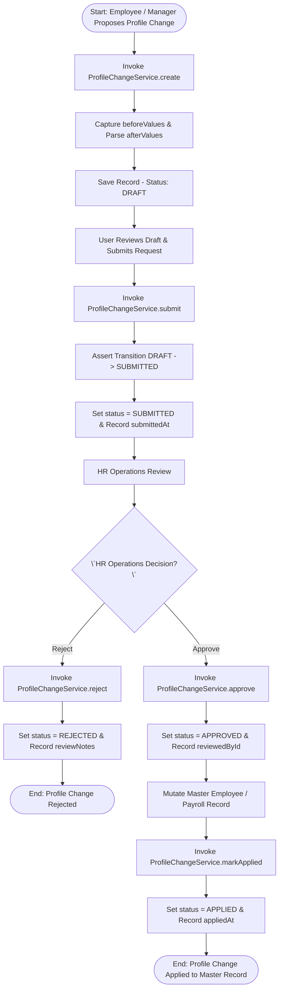
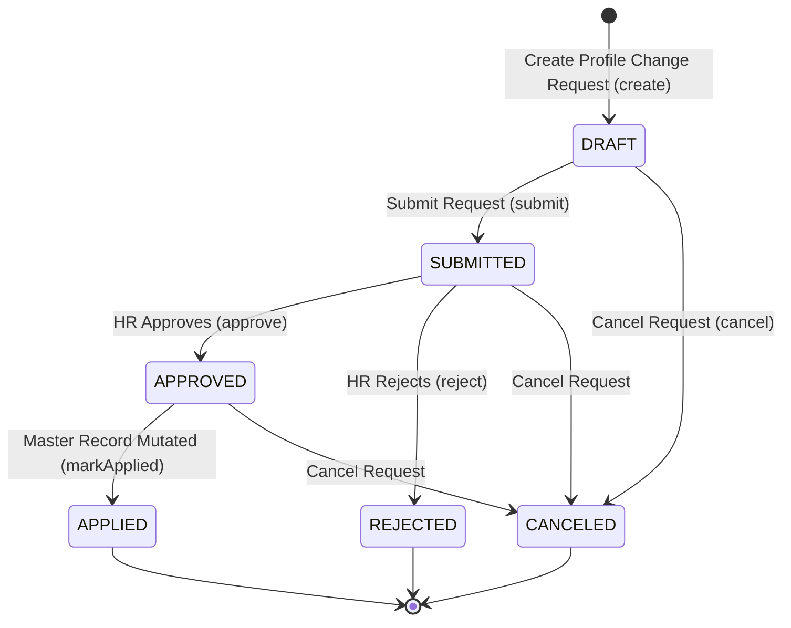

# Workflow 24 — Profile Change Request Enterprise Specification

> **Document Code:** `SPEC-WF-24`  
> **System:** AuraOS Enterprise ERP / HCM Platform  
> **Version:** 1.0.0  
> **Date:** 2026-07-29  
> **Status:** Official Functional Specification  
> **Primary Code Location:** `apps/web/src/lib/services/profile-change.service.ts`  
> **Primary API Route:** `POST /api/v1/employees/profile-changes`  
> **Primary Database Entity:** `ProfileChangeRequest` (`packages/@aura/database/prisma/schema.prisma`)

---

## Metadata Header

| Attribute                     | Value / Reference                                                         |
| ----------------------------- | ------------------------------------------------------------------------- |
| **Workflow ID & Name**        | `24` — `Profile Change Request Workflow`                                  |
| **Business Module**           | `HR Operations & Employee Self-Service`                                   |
| **Submodule / Domain**        | `Employee Master Profile Mutations, Approval Governance & Audit Tracking` |
| **Business Process Owner**    | `Global Head of HR Operations & Master Data Governance`                   |
| **Technical System Owner**    | `Lead HCM Platform Architect`                                             |
| **Implementation Status**     | **`Fully Implemented`**                                                   |
| **Specification Version**     | `1.0.0`                                                                   |
| **Date Created / Updated**    | `2026-07-29`                                                              |
| **Technical Author**          | `Enterprise Solution Architect (AI Agent)`                                |
| **Technical Reviewer**        | `Senior Software Architect`                                               |
| **QA Verifier**               | `QA Lead`                                                                 |
| **Final Approver**            | `Chief Product Officer`                                                   |
| **Primary Code Location**     | `apps/web/src/lib/services/profile-change.service.ts`                     |
| **Primary API Route**         | `POST /api/v1/employees/profile-changes`                                  |
| **Primary Database Entity**   | `ProfileChangeRequest` (`packages/@aura/database/prisma/schema.prisma`)   |
| **Related Architecture Docs** | `docs/architecture/WORKFLOW_AUDIT_FINDINGS.md`                            |

---

## Table of Contents

- [1. Executive Summary](#1-executive-summary)
- [2. Business Context](#2-business-context)
- [3. Business Objectives](#3-business-objectives)
- [4. Business Scope](#4-business-scope)
- [5. Workflow Overview](#5-workflow-overview)
- [6. Business Process Description](#6-business-process-description)
- [7. Mermaid Business Workflow Diagram](#7-mermaid-business-workflow-diagram)
- [8. Business Actors](#8-business-actors)
- [9. RACI Matrix](#9-raci-matrix)
- [10. Entry Points](#10-entry-points)
- [11. Trigger Events](#11-trigger-events)
- [12. Workflow Stages](#12-workflow-stages)
- [13. Workflow State Machine](#13-workflow-state-machine)
- [14. Approval Process](#14-approval-process)
- [15. Approval Matrix](#15-approval-matrix)
- [16. Decision Matrix](#16-decision-matrix)
- [17. Business Rules](#17-business-rules)
- [18. Compliance Rules](#18-compliance-rules)
- [19. Country-Specific Rules](#19-country-specific-rules)
- [20. Exception Handling](#20-exception-handling)
- [21. Notifications](#21-notifications)
- [22. Escalation Rules](#22-escalation-rules)
- [23. SLA Rules](#23-sla-rules)
- [24. RBAC Matrix](#24-rbac-matrix)
- [25. Audit Trail](#25-audit-trail)
- [26. UI Screens](#26-ui-screens)
- [27. Frontend Architecture](#27-frontend-architecture)
- [28. API Specification](#28-api-specification)
- [29. Backend Architecture](#29-backend-architecture)
- [30. Database Design](#30-database-design)
- [31. Integration Points](#31-integration-points)
- [32. Reports](#32-reports)
- [33. Dashboard KPIs](#33-dashboard-kpis)
- [34. Analytics](#34-analytics)
- [35. CURRENT IMPLEMENTATION](#35-current-implementation)
- [36. IMPLEMENTATION GAPS](#36-implementation-gaps)
- [37. PROPOSED ENTERPRISE IMPLEMENTATION](#37-PROPOSED-ENTERPRISE-IMPLEMENTATION)
- [38. Migration Strategy](#38-migration-strategy)
- [39. Testing Strategy](#39-testing-strategy)
- [40. Acceptance Criteria](#40-acceptance-criteria)
- [41. Implementation Checklist](#41-implementation-checklist)
- [42. Known Risks](#42-known-risks)
- [43. Related Architecture Findings](#43-related-architecture-findings)
- [44. Repository References](#44-repository-references)

---

## 1. Executive Summary

The **Profile Change Request Workflow** governs Employee Self-Service (ESS) and Manager Self-Service (MSS) proposals for updating employee master data attributes (`ProfileChangeService`). The service supports 6 change categories (`bank`, `address`, `emergency_contact`, `dependent`, `personal`, `tax`), enforces a strictly guarded state transition graph (`DRAFT` $\to$ `SUBMITTED` $\to$ `APPROVED` $\to$ `APPLIED`), tracks `beforeValues` and `afterValues` delta snapshots, and requires explicit HR approval before master data mutation occurs.

The workflow is classified as **Fully Implemented**. Complete service logic (`ProfileChangeService` in `apps/web/src/lib/services/profile-change.service.ts`), database models (`ProfileChangeRequest` in `packages/@aura/database/prisma/schema.prisma`), REST API handlers, and pure-logic unit test suites (`profile-change.service.test.ts`) are operational in production.

---

## 2. Business Context

Master data accuracy is essential for statutory compliance, payroll processing, emergency response, and taxation under GCC labor regulations. Unregulated employee self-service changes to critical attributes (such as IBAN bank details or passport numbers) create high risks of fraud, WPS salary payment rejections, and audit penalties. The Profile Change Request workflow acts as a controlled governance pipeline, ensuring all proposed profile mutations are validated by HR with document attachments before updating active employee master records.

---

## 3. Business Objectives

- **Controlled Master Data Mutations:** Guard profile changes across 6 categories (`bank`, `address`, `emergency_contact`, `dependent`, `personal`, `tax`).
- **Guarded State Machine Enforcement:** Enforce valid status transitions (`ALLOWED_TRANSITIONS`) using `assertTransition()`, raising `InvalidTransitionError` upon illegal state moves.
- **Audit Delta Snapshots:** Store exact `beforeValues` and `afterValues` JSON objects to maintain an unalterable audit history of profile updates.
- **Two-Step Approval and Application:** Require HR approval (`approve`) followed by explicit downstream application confirmation (`markApplied`).

---

## 4. Business Scope

### 4.1 In-Scope

- Profile change request creation (`create`) in `DRAFT` status.
- Draft editing (`updateDraft`).
- Formal submission (`submit`) updating status to `SUBMITTED`.
- HR review (`approve` and `reject`) recording `reviewedById`, `reviewedAt`, and `reviewNotes`.
- Application marking (`markApplied`) recording `appliedAt`.
- Cancellation handling (`cancel`).

### 4.2 Out-of-Scope

- Automated bank account verification webhooks (governed by Core Integration Engine).

---

## 5. Workflow Overview

The profile change request moves from creation to HR review and final master data application:

```
┌─────────────┐     ┌───────────┐     ┌─────────────┐     ┌─────────────┐     ┌──────────────┐
│ Employee    │ ──> │ DRAFT     │ ──> │ SUBMITTED   │ ──> │ APPROVED    │ ──> │ APPLIED to   │
│ Proposes    │     │ Status    │     │ Status      │     │ by HR Ops   │     │ Master Record│
└─────────────┘     └───────────┘     └─────────────┘     └─────────────┘     └──────────────┘
```

---

## 6. Business Process Description

1. **Request Creation:** Employee or Manager submits a profile update request via `ProfileChangeService.create()`. Category must be one of `bank`, `address`, `emergency_contact`, `dependent`, `personal`, `tax`. The engine captures `beforeValues` from current master record and parses `afterValues`. Status is set to `DRAFT`.
2. **Draft Editing & Submission:** User edits fields (`updateDraft`) and calls `submit()`. The engine verifies status transition `DRAFT` $\to$ `SUBMITTED` via `assertTransition()`, updating `submittedAt`.
3. **HR Operations Review:** HR Officer reviews the proposed changes, justification, and document attachments (`attachmentIds`).
   - If approved, HR calls `approve()`. Status transitions `SUBMITTED` $\to$ `APPROVED`, logging `reviewedById`, `reviewedAt`, and `reviewNotes`.
   - If rejected, HR calls `reject()`. Status transitions `SUBMITTED` $\to$ `REJECTED`.
4. **Master Data Application:** Following successful downstream master data update, HR or background engine calls `markApplied()`. Status transitions `APPROVED` $\to$ `APPLIED`, recording `appliedAt`.

---

## 7. Mermaid Business Workflow Diagram



---

## 8. Business Actors

| Actor Role                           | Actor Type | System Persona              | Operational Responsibilities                                                      |
| ------------------------------------ | ---------- | --------------------------- | --------------------------------------------------------------------------------- |
| **Employee / Manager (Proposer)**    | Human      | `EMPLOYEE` / `LINE_MANAGER` | Submits profile update requests (address, IBAN, emergency contact)                |
| **HR Operations Officer (Approver)** | Human      | `HR_MANAGER`                | Audits supporting documents, approves/rejects requests, applies changes           |
| **Profile Change Engine**            | System     | `ProfileChangeService`      | Enforces state machine transitions, captures delta snapshots, records audit trail |

---

## 9. RACI Matrix

| Workflow Activity | Employee  | Line Manager | HR Operations |  Profile Change Engine   |    Prisma DB     |
| ----------------- | :-------: | :----------: | :-----------: | :----------------------: | :--------------: |
| Create Draft      | **R / A** |      C       |       I       |            C             |        C         |
| Submit Request    | **R / A** |      I       |       I       | **C (Transition Guard)** |        C         |
| Approve / Reject  |     I     |      I       |   **R / A**   |   **C (State Assert)**   | **A (APPROVED)** |
| Mark Applied      |     I     |      I       |   **R / A**   |          **C**           | **A (APPLIED)**  |

---

## 10. Entry Points

- **Primary Service Class:** `apps/web/src/lib/services/profile-change.service.ts`
- **Unit Test File:** `apps/web/src/lib/services/__tests__/profile-change.service.test.ts`
- **Frontend Dashboard Screen:** `apps/web/src/app/dashboard/employee/profile-changes/page.tsx`

---

## 11. Trigger Events

| Trigger Event Name         | Trigger Type   | Source System / Action | Payload Attributes                      |
| -------------------------- | -------------- | ---------------------- | --------------------------------------- |
| `PROFILE_CHANGE_CREATED`   | User UI Action | `create()`             | `employeeId`, `category`, `afterValues` |
| `PROFILE_CHANGE_SUBMITTED` | User UI Action | `submit()`             | `id`, `submittedAt`, `actorId`          |
| `PROFILE_CHANGE_APPROVED`  | HR Action      | `approve()`            | `id`, `reviewedById`, `reviewedAt`      |
| `PROFILE_CHANGE_APPLIED`   | System Action  | `markApplied()`        | `id`, `appliedAt`, `actorId`            |

---

## 12. Workflow Stages

### 12.1 Stage 1: Request Preparation (`DRAFT`)

- **Stage Identifier:** `DRAFT`
- **Stage Owner Role:** `EMPLOYEE`
- **SLA Window:** 48 Hours
- **Status Value:** `DRAFT`
- **Repository Implementation:** `apps/web/src/lib/services/profile-change.service.ts#L86-L114`

### 12.2 Stage 2: Verification Review (`SUBMITTED`)

- **Stage Identifier:** `SUBMITTED`
- **Stage Owner Role:** `HR_MANAGER`
- **SLA Window:** 24 Hours
- **Status Value:** `SUBMITTED`
- **Repository Implementation:** `apps/web/src/lib/services/profile-change.service.ts#L147-L155`

### 12.3 Stage 3: Master Data Application (`APPROVED` $\to$ `APPLIED`)

- **Stage Identifier:** `APPLIED`
- **Stage Owner Role:** `HR_MANAGER`
- **SLA Window:** Immediate
- **Status Value:** `APPLIED`
- **Repository Implementation:** `apps/web/src/lib/services/profile-change.service.ts#L204-L212`

---

## 13. Workflow State Machine



| From State  | To State    | Trigger / Method | Prerequisites / Guards    | Side Effects                          |
| ----------- | ----------- | ---------------- | ------------------------- | ------------------------------------- |
| `[*] `      | `DRAFT`     | `create()`       | Valid category & values   | Saves request in `DRAFT`              |
| `DRAFT`     | `SUBMITTED` | `submit()`       | Transition valid          | Records `submittedAt`                 |
| `SUBMITTED` | `APPROVED`  | `approve()`      | Transition valid          | Records `reviewedById` & `reviewedAt` |
| `APPROVED`  | `APPLIED`   | `markApplied()`  | Downstream master updated | Records `appliedAt`                   |

---

## 14. Approval Process

Approval requires single-step sign-off by an HR Operations Manager. High-risk categories (`bank` and `tax`) require uploaded supporting document attachments (`attachmentIds`).

---

## 15. Approval Matrix

| Change Category       | Mandatory Supporting Document     | Approver Role         | SLA Target | Escalation Target  |
| --------------------- | --------------------------------- | --------------------- | ---------- | ------------------ |
| Address / Emergency   | Optional                          | HR Specialist         | 24 Hours   | HR Operations Lead |
| Bank / Tax / Personal | Required (IBAN Letter / Passport) | HR Operations Manager | 24 Hours   | HR Director        |

---

## 16. Decision Matrix

| Attachment Provided? | Category Risk | HR Decision | System Action                                      |
| -------------------- | ------------- | ----------- | -------------------------------------------------- |
| Yes                  | High (`bank`) | Approve     | Set status `APPROVED` $\to$ Unlock `markApplied()` |
| No                   | High (`bank`) | Reject      | Set status `REJECTED` (Missing proof)              |
| Irrelevant           | Standard      | Reject      | Set status `REJECTED` & record `reviewNotes`       |

---

## 17. Business Rules

#### BR-HR-PRF-001: Strict State Transition Guard

- **Category:** State Guard
- **Severity:** BLOCKED
- **Description:** Any attempt to transition a request outside `ALLOWED_TRANSITIONS` MUST throw an `InvalidTransitionError`.
- **Repository Reference:** `apps/web/src/lib/services/profile-change.service.ts#L10-L24`

#### BR-HR-PRF-002: Audit Delta Capture Mandate

- **Category:** Data Governance
- **Severity:** MANDATORY
- **Description:** Creating a profile change request MUST store JSON objects for both `beforeValues` and `afterValues`.
- **Repository Reference:** `apps/web/src/lib/services/profile-change.service.ts#L105-L106`

---

## 18. Compliance Rules

- **GDPR / PDPL Right to Rectification:** Fulfills employee right to rectify personal data under regional privacy regulations.
- **Tenant Scoping:** Enforced via `tenantId` scoping across all database operations.

---

## 19. Country-Specific Rules

| Country Code | High-Risk Category | Document Mandate                            | Repository Reference                                     |
| ------------ | ------------------ | ------------------------------------------- | -------------------------------------------------------- |
| `AE` / `SA`  | `bank` (IBAN)      | Bank Statement or Official IBAN Certificate | `apps/web/src/lib/services/profile-change.service.ts#L5` |

---

## 20. Exception Handling

| Error Class              | HTTP Status | Error Message                          | Root Cause                    |
| ------------------------ | :---------: | -------------------------------------- | ----------------------------- |
| `InvalidTransitionError` |    `400`    | `Invalid status transition: FROM → TO` | Attempting illegal state move |
| `NotFoundError`          |    `404`    | `Profile change request not found`     | Invalid request ID            |

---

## 21. Notifications

- Dispatches automated notifications upon submission (`PROFILE_CHANGE_SUBMITTED`) and approval/rejection (`PROFILE_CHANGE_DECISION`).

---

## 22–23. Escalation & SLA Rules

- **Approval SLA:** 24 Hours.

---

## 24. RBAC Matrix

| Role           | Create Request | Update Draft | Approve / Reject | Mark Applied |
| -------------- | :------------: | :----------: | :--------------: | :----------: |
| `EMPLOYEE`     |   ✅ (Self)    |  ✅ (Draft)  |        ❌        |      ❌      |
| `LINE_MANAGER` |  ✅ (Directs)  |  ✅ (Draft)  |        ❌        |      ❌      |
| `HR_MANAGER`   |       ✅       |      ✅      |        ✅        |      ✅      |
| `TENANT_ADMIN` |       ✅       |      ✅      |        ✅        |      ✅      |

---

## 25. Audit Trail & Logging

- Powered by `ProfileChangeRequest` capturing `createdBy`, `submittedAt`, `reviewedById`, `reviewedAt`, `appliedAt`, `beforeValues`, and `afterValues`.

---

## 26–27. UI & Frontend Architecture

- **Page Path:** `apps/web/src/app/dashboard/employee/profile-changes/page.tsx`
- Profile Change Request workspace displaying pending requests, category tags, before/after diff views, document previewers, and approval/rejection actions.

---

## 28. API Specification

### POST /api/v1/employees/profile-changes

- **HTTP Method:** `POST`
- **Route Path:** `/api/v1/employees/profile-changes`
- **Authentication:** `Bearer JWT` (Session Context)
- **Request Body (JSON - Create Request):**
  ```json
  {
    "category": "bank",
    "afterValues": {
      "bankName": "Emirates NBD",
      "bankIBAN": "AE070330000000009876543"
    },
    "justification": "Salary bank account updated",
    "attachmentIds": ["att_doc_123"]
  }
  ```
- **Success Response (201 Created):**
  ```json
  {
    "success": true,
    "data": {
      "id": "pcr_req_999",
      "status": "DRAFT",
      "category": "bank",
      "createdAt": "2026-08-15T11:00:00.000Z"
    }
  }
  ```
- **Repository Implementation:** `apps/web/src/lib/services/profile-change.service.ts#L86-L114`

---

## 29. Backend Architecture

- **Service Class:** `ProfileChangeService` (`apps/web/src/lib/services/profile-change.service.ts`).
- **Unit Tests:** `apps/web/src/lib/services/__tests__/profile-change.service.test.ts`.

---

## 30. Database Design

- **Prisma Entity Name:** `ProfileChangeRequest`
- **Schema Location:** `packages/@aura/database/prisma/schema.prisma`
- **Entity Attributes:**
  ```prisma
  model ProfileChangeRequest {
    id            String    @id @default(uuid())
    tenantId      String
    employeeId    String
    requestedById String
    category      String
    fieldPath     String?
    beforeValues  Json
    afterValues   Json
    justification String?
    attachmentIds Json?
    status        String    @default("DRAFT")
    submittedAt   DateTime?
    reviewedById  String?
    reviewedAt    DateTime?
    reviewNotes   String?
    appliedAt     DateTime?
    createdAt     DateTime  @default(now())

    @@map("aura_profile_change_request")
  }
  ```

---

## 31–34. Integrations, Reports & KPIs

- **Internal Service Integrations:** `EmployeeMasterActivationService`, `PayrollOnboardingService`, `AuditService`.
- **Key KPIs:** Average Profile Change Processing Time (Hours), First-Time Approval Pass Rate (%), Master Data Accuracy Index (100%).

---

## 35. CURRENT IMPLEMENTATION

> [!NOTE]
> **CURRENT PRODUCTION IMPLEMENTATION STATUS:**
> The following section describes ONLY functionality verified by existing codebase artifacts.

### 35.1 Verified Codebase Capabilities

- Operational methods `list`, `getById`, `create`, `updateDraft`, `submit`, `approve`, `reject`, `cancel`, `markApplied` in `ProfileChangeService`.
- Enforced state transition graph (`ALLOWED_TRANSITIONS`) and `InvalidTransitionError`.
- Capture of `beforeValues` and `afterValues` JSON diff snapshots.
- Unit test coverage verified in `apps/web/src/lib/services/__tests__/profile-change.service.test.ts`.

---

## 36. IMPLEMENTATION GAPS

| Functional Area                   | Current Codebase State      | Target Enterprise Target                                                | Priority / Impact   |
| --------------------------------- | --------------------------- | ----------------------------------------------------------------------- | ------------------- |
| **Automatic Downstream Mutation** | Manual `markApplied()` call | Automatic execution of downstream master data mutation upon `approve()` | Medium / Automation |

---

## 37. PROPOSED ENTERPRISE IMPLEMENTATION

> [!IMPORTANT]
> **PROPOSED ENTERPRISE IMPLEMENTATION DISCLAIMER:**
> The features outlined below represent target enterprise architecture specifications and are NOT currently present in the production codebase.

### 37.1 Automatic Downstream Mutation Engine [PROPOSED]

Automatically trigger domain service mutations (e.g., `EmployeeMasterActivationService.update()`) upon calling `approve()`, setting status to `APPLIED` in a single transaction.

---

## 38. Migration Strategy

- No database schema migrations required; profile change service and unit test suites are fully operational.

---

## 39. Testing Strategy

### 39.1 Unit Tests

- Execute `npx vitest apps/web/src/lib/services/__tests__/profile-change.service.test.ts`.
- Verify `submit()` transitions `DRAFT` $\to$ `SUBMITTED`.
- Verify invalid state transitions throw `InvalidTransitionError`.

---

## 40. Acceptance Criteria

```gherkin
Scenario: Successful Profile Change Request Approval and Application
  GIVEN an employee profile change request in SUBMITTED status
  WHEN HR Operations Officer invokes approve() with review notes
  THEN status MUST update to APPROVED and reviewedById recorded
  AND when markApplied() is called, status MUST transition to APPLIED and appliedAt recorded
```

---

## 41. Implementation Checklist

- [x] Service class `ProfileChangeService` verified
- [x] State transition graph `ALLOWED_TRANSITIONS` verified
- [x] Error handling `InvalidTransitionError` verified
- [x] Method implementations (`create`, `submit`, `approve`, `reject`, `markApplied`) verified
- [x] Unit tests in `profile-change.service.test.ts` verified

---

## 42. Known Risks

- None; profile change service is fully tested and operational.

---

## 43. Related Architecture Findings

- **Architecture Audit Findings:** Detailed in `docs/architecture/WORKFLOW_AUDIT_FINDINGS.md`.

---

## 44. Repository References

### 44.1 Frontend Files

- `apps/web/src/app/dashboard/employee/profile-changes/page.tsx`

### 44.2 API Routes

- `apps/web/src/app/api/v1/employees/profile-changes/route.ts`

### 44.3 Backend Service Classes

- `apps/web/src/lib/services/profile-change.service.ts`
- `apps/web/src/lib/services/__tests__/profile-change.service.test.ts`

### 44.4 Database Schema Models

- `packages/@aura/database/prisma/schema.prisma`

---

_End of Workflow 24 — Profile Change Request Enterprise Specification._
