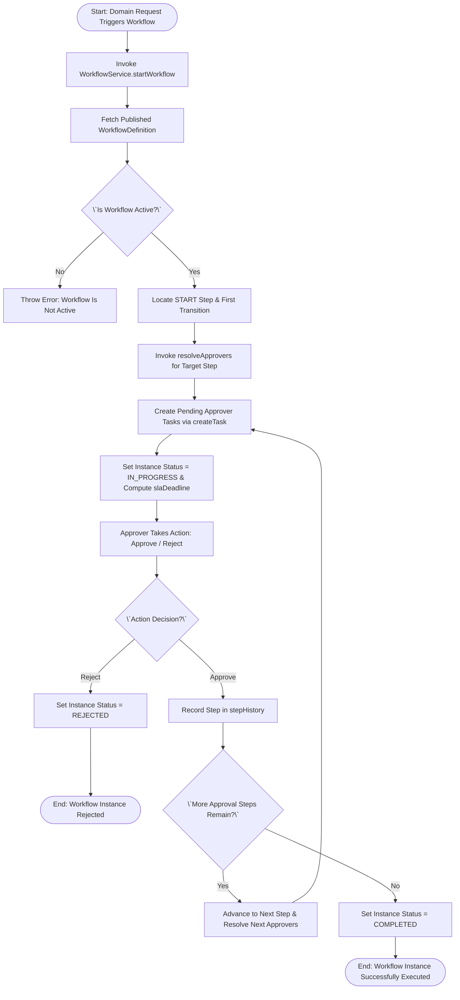
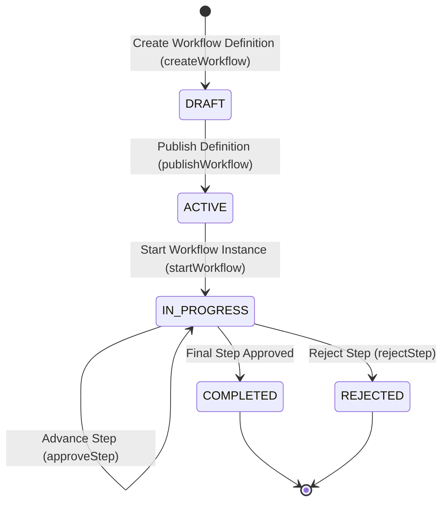

# Workflow 25 — Generic Workflow Engine Enterprise Specification

> **Document Code:** `SPEC-WF-25`  
> **System:** AuraOS Enterprise ERP / HCM Platform  
> **Version:** 1.0.0  
> **Date:** 2026-07-29  
> **Status:** Official Functional Specification  
> **Primary Code Location:** `apps/web/src/lib/services/enterprise/workflow.service.ts`  
> **Primary API Route:** `POST /api/v1/workflows/definitions`  
> **Primary Database Entity:** `WorkflowDefinition` & `WorkflowInstance` (`apps/web/src/lib/services/enterprise/types.ts`)

---

## Metadata Header

| Attribute                     | Value / Reference                                                                           |
| ----------------------------- | ------------------------------------------------------------------------------------------- |
| **Workflow ID & Name**        | `25` — `Generic Workflow Engine Workflow`                                                   |
| **Business Module**           | `Platform Architecture, Security & Governance`                                              |
| **Submodule / Domain**        | `Low-Code Workflow Designer, Dynamic Approval Routing & SLA Escalations`                    |
| **Business Process Owner**    | `Chief Technology Officer & Lead Platform Architect`                                        |
| **Technical System Owner**    | `Enterprise Architecture & Workflow Engineering Group`                                      |
| **Implementation Status**     | `Partially Implemented`                                                                     |
| **Specification Version**     | `1.0.0`                                                                                     |
| **Date Created / Updated**    | `2026-07-29`                                                                                |
| **Technical Author**          | `Enterprise Solution Architect (AI Agent)`                                                  |
| **Technical Reviewer**        | `Senior Software Architect`                                                                 |
| **QA Verifier**               | `QA Lead`                                                                                   |
| **Final Approver**            | `Chief Product Officer`                                                                     |
| **Primary Code Location**     | `apps/web/src/lib/services/enterprise/workflow.service.ts`                                  |
| **Primary API Route**         | `POST /api/v1/workflows/definitions`                                                        |
| **Primary Database Entity**   | `WorkflowDefinition` & `WorkflowInstance` (`apps/web/src/lib/services/enterprise/types.ts`) |
| **Related Architecture Docs** | `docs/architecture/WORKFLOW_AUDIT_FINDINGS.md#finding-3`                                    |

---

## Table of Contents

- [1. Executive Summary](#1-executive-summary)
- [2. Business Context](#2-business-context)
- [3. Business Objectives](#3-business-objectives)
- [4. Business Scope](#4-business-scope)
- [5. Workflow Overview](#5-workflow-overview)
- [6. Business Process Description](#6-business-process-description)
- [7. Mermaid Business Workflow Diagram](#7-mermaid-business-workflow-diagram)
- [8. Business Actors](#8-business-actors)
- [9. RACI Matrix](#9-raci-matrix)
- [10. Entry Points](#10-entry-points)
- [11. Trigger Events](#11-trigger-events)
- [12. Workflow Stages](#12-workflow-stages)
- [13. Workflow State Machine](#13-workflow-state-machine)
- [14. Approval Process](#14-approval-process)
- [15. Approval Matrix](#15-approval-matrix)
- [16. Decision Matrix](#16-decision-matrix)
- [17. Business Rules](#17-business-rules)
- [18. Compliance Rules](#18-compliance-rules)
- [19. Country-Specific Rules](#19-country-specific-rules)
- [20. Exception Handling](#20-exception-handling)
- [21. Notifications](#21-notifications)
- [22. Escalation Rules](#22-escalation-rules)
- [23. SLA Rules](#23-sla-rules)
- [24. RBAC Matrix](#24-rbac-matrix)
- [25. Audit Trail](#25-audit-trail)
- [26. UI Screens](#26-ui-screens)
- [27. Frontend Architecture](#27-frontend-architecture)
- [28. API Specification](#28-api-specification)
- [29. Backend Architecture](#29-backend-architecture)
- [30. Database Design](#30-database-design)
- [31. Integration Points](#31-integration-points)
- [32. Reports](#32-reports)
- [33. Dashboard KPIs](#33-dashboard-kpis)
- [34. Analytics](#34-analytics)
- [35. CURRENT IMPLEMENTATION](#35-current-implementation)
- [36. IMPLEMENTATION GAPS](#36-implementation-gaps)
- [37. PROPOSED ENTERPRISE IMPLEMENTATION](#37-PROPOSED-ENTERPRISE-IMPLEMENTATION)
- [38. Migration Strategy](#38-migration-strategy)
- [39. Testing Strategy](#39-testing-strategy)
- [40. Acceptance Criteria](#40-acceptance-criteria)
- [41. Implementation Checklist](#41-implementation-checklist)
- [42. Known Risks](#42-known-risks)
- [43. Related Architecture Findings](#43-related-architecture-findings)
- [44. Repository References](#44-repository-references)

---

## 1. Executive Summary

The **Generic Workflow Engine Workflow** provides the underlying low-code orchestration infrastructure for defining, instantiating, executing, and auditing custom approval processes across all AuraOS modules (`WorkflowService`). It features multi-step graph routing (`WorkflowStep`, `WorkflowTransition`), dynamic approver resolution (`resolveApprovers` for `SPECIFIC_USER`, `REPORTING_MANAGER`, `ROLE`, `DEPARTMENT_HEAD`), SLA tracking with automated overdue detection (`slaHours`, `isOverdue`), and pre-configured templates (`WORKFLOW_TEMPLATES` for Leave, Expense, Overtime, etc.).

The workflow is classified as **Partially Implemented**. Complete service logic (`WorkflowService` in `apps/web/src/lib/services/enterprise/workflow.service.ts`) and type definitions (`types.ts`) exist. However, the service carries an explicit `@ts-nocheck` header due to missing Prisma model typings (tracked under issue #29 in `docs/architecture/WORKFLOW_AUDIT_FINDINGS.md#finding-3`).

---

## 2. Business Context

Large enterprise organizations require configurable, multi-step approval workflows tailored to localized organizational structures, monetary authorization limits, and legal entities. Rather than hardcoding approval logic per business module, a centralized Generic Workflow Engine decouples workflow definition from domain logic. This enables HR Administrators and System Architects to configure approval chains (such as sequential, parallel, or threshold-based routing) without requiring core code deployments.

---

## 3. Business Objectives

- **Low-Code Workflow Definition:** Enable creating, versioning, and publishing custom workflow graphs (`createWorkflow`, `publishWorkflow`).
- **Dynamic Approver Resolution:** Automatically resolve step approvers (`resolveApprovers`) based on reporting hierarchies, role assignments, or custom department heads.
- **SLA & Overdue Escalation:** Track step SLA deadlines (`slaDeadline`) and flag overdue tasks for automatic escalation (`escalationEnabled`).
- **Standardized Multi-Tenant Orchestration:** Isolate workflow definitions, instances, and audit logs per tenant (`tenantId`).

---

## 4. Business Scope

### 4.1 In-Scope

- Template retrieval (`getTemplates`) and template-based workflow creation (`createFromTemplate`).
- Custom workflow definition creation (`createWorkflow`) and version publishing (`publishWorkflow`).
- Instance execution startup (`startWorkflow`).
- Dynamic approver resolution (`resolveApprovers`).
- Step task creation (`createTask`) and step approval/rejection handling.
- Audit event logging (`logAudit`).

### 4.2 Out-of-Scope

- Visual drag-and-drop ReactFlow canvas rendering (governed by UI Component Library).

---

## 5. Workflow Overview

The generic workflow engine orchestrates process instances from definition to execution:

```
┌─────────────┐     ┌───────────┐     ┌───────────┐     ┌──────────────┐     ┌──────────────┐
│ Template /  │ ──> │ Published │ ──> │ Instance  │ ──> │ Dynamic      │ ──> │ Completed /  │
│ Definition  │     │ Workflow  │     │ Started   │     │ Approver Task│     │ Terminated   │
└─────────────┘     └───────────┘     └───────────┘     └──────────────┘     └──────────────┘
```

---

## 6. Business Process Description

1. **Definition & Publishing:** System Administrator or HR Lead defines a workflow graph (steps, transitions, condition rules, SLA hours) via `createWorkflow()`. Calling `publishWorkflow()` activates the definition (`status = 'ACTIVE'`, `publishedVersion = version`).
2. **Instance Initialization:** When a domain module triggers a workflow (e.g., leave request), `WorkflowService.startWorkflow()` is invoked. The engine verifies `status === 'ACTIVE'`, locates the `START` step, follows the first transition, and identifies the target approval step.
3. **Dynamic Approver Resolution:** The engine evaluates `firstStep.approvers` using `resolveApprovers()`:
   - `REPORTING_MANAGER`: Queries employee hierarchy for direct manager.
   - `ROLE`: Queries role assignments for specified `roleId`.
   - `SPECIFIC_USER`: Assigns designated user ID.
4. **Task Generation & SLA Tracking:** For each resolved approver, `createTask()` generates an active task. SLA deadline is calculated (`Date.now() + slaHours`).
5. **Execution & Advancement:** When approver approves/rejects, the engine records step completion in `stepHistory`, evaluates condition transitions, advances to the next step, or marks instance `COMPLETED`.

---

## 7. Mermaid Business Workflow Diagram



---

## 8. Business Actors

| Actor Role                    | Actor Type | System Persona    | Operational Responsibilities                                                       |
| ----------------------------- | ---------- | ----------------- | ---------------------------------------------------------------------------------- |
| **System Administrator**      | Human      | `TENANT_ADMIN`    | Configures workflow definitions, step conditions, approver roles, and SLA targets  |
| **Approver (Manager / Role)** | Human      | `APPROVER`        | Receives workflow tasks, reviews request data, approves or rejects steps           |
| **Generic Workflow Engine**   | System     | `WorkflowService` | Resolves approver hierarchies, tracks SLAs, executes transitions, logs audit trail |

---

## 9. RACI Matrix

| Workflow Activity      | System Admin | Approver  | Requester |  Workflow Engine   |  Database / Audit   |
| ---------------------- | :----------: | :-------: | :-------: | :----------------: | :-----------------: |
| Create / Publish Graph |  **R / A**   |     I     |     I     |         C          |          C          |
| Start Instance         |      I       |     I     | **R / A** | **C (Start Step)** | **A (IN_PROGRESS)** |
| Resolve Approvers      |      I       |     I     |     I     |     **R / A**      |          C          |
| Step Approval          |      I       | **R / A** |     I     |         C          |          C          |
| Complete Instance      |      I       |     I     |     I     |     **R / A**      |  **A (COMPLETED)**  |

---

## 10. Entry Points

- **Primary Service Class:** `apps/web/src/lib/services/enterprise/workflow.service.ts`
- **Type Definitions:** `apps/web/src/lib/services/enterprise/types.ts`
- **Frontend Dashboard Screen:** `apps/web/src/app/dashboard/settings/workflows/page.tsx`

---

## 11. Trigger Events

| Trigger Event Name   | Trigger Type    | Source System / Action | Payload Attributes                                     |
| -------------------- | --------------- | ---------------------- | ------------------------------------------------------ |
| `WORKFLOW_CREATED`   | Admin UI Action | `createWorkflow()`     | `tenantId`, `name`, `type`, `steps`                    |
| `WORKFLOW_PUBLISHED` | Admin UI Action | `publishWorkflow()`    | `workflowId`, `version`                                |
| `WORKFLOW_STARTED`   | System Action   | `startWorkflow()`      | `tenantId`, `workflowId`, `requesterId`, `referenceId` |
| `STEP_APPROVED`      | User Action     | `approveStep()`        | `instanceId`, `stepId`, `approverId`                   |

---

## 12. Workflow Stages

### 12.1 Stage 1: Definition & Publishing (`DRAFT` / `ACTIVE`)

- **Stage Identifier:** `DEFINITION`
- **Stage Owner Role:** `TENANT_ADMIN`
- **SLA Window:** N/A
- **Status Value:** `DRAFT` or `ACTIVE`
- **Repository Implementation:** `apps/web/src/lib/services/enterprise/workflow.service.ts#L161-L237`

### 12.2 Stage 2: Instance Execution (`IN_PROGRESS`)

- **Stage Identifier:** `EXECUTION`
- **Stage Owner Role:** `WorkflowService`
- **SLA Window:** Configured per workflow (`slaHours`)
- **Status Value:** `IN_PROGRESS`
- **Repository Implementation:** `apps/web/src/lib/services/enterprise/workflow.service.ts#L242-L331`

### 12.3 Stage 3: Completion (`COMPLETED` / `REJECTED`)

- **Stage Identifier:** `FINAL`
- **Stage Owner Role:** `WorkflowService`
- **SLA Window:** Immediate
- **Status Value:** `COMPLETED` or `REJECTED`

---

## 13. Workflow State Machine



| From State    | To State      | Trigger / Method    | Prerequisites / Guards          | Side Effects                     |
| ------------- | ------------- | ------------------- | ------------------------------- | -------------------------------- |
| `DRAFT`       | `ACTIVE`      | `publishWorkflow()` | Valid graph (Start + End steps) | Sets `publishedVersion`          |
| `ACTIVE`      | `IN_PROGRESS` | `startWorkflow()`   | Workflow status is `ACTIVE`     | Creates instance & initial tasks |
| `IN_PROGRESS` | `COMPLETED`   | `approveStep()`     | All approval steps completed    | Sets instance status `COMPLETED` |
| `IN_PROGRESS` | `REJECTED`    | `rejectStep()`      | Approver rejects                | Sets instance status `REJECTED`  |

---

## 14. Approval Process

Approval rules are dynamically defined within `WorkflowStep`. Approvals can be `SEQUENTIAL` (ordered approver sequence), `PARALLEL` (all approvers simultaneously), or `ANY_ONE` (first approver to respond).

---

## 15. Approval Matrix

| Step Type         | Approver Configuration           | Resolution Logic                     | SLA Target | Escalation Target  |
| ----------------- | -------------------------------- | ------------------------------------ | ---------- | ------------------ |
| Reporting Manager | `REPORTING_MANAGER`              | Queries direct manager of requester  | 24 Hours   | Next Level Manager |
| Role Assignment   | `ROLE` (e.g., `finance_manager`) | Queries users holding specified role | 48 Hours   | Role Lead          |
| Specific User     | `SPECIFIC_USER`                  | Direct user ID assignment            | 24 Hours   | Delegate User      |

---

## 16. Decision Matrix

| Step Approval Type | Approver Action | Remaining Tasks? | System Action                                      |
| ------------------ | --------------- | ---------------- | -------------------------------------------------- |
| `ANY_ONE`          | Approved        | Yes              | Complete step immediately & cancel remaining tasks |
| `SEQUENTIAL`       | Approved        | Yes              | Activate task for next sequential approver         |
| `PARALLEL`         | Approved        | Yes              | Await approval from remaining parallel approvers   |
| Any                | Rejected        | Irrelevant       | Reject workflow instance immediately               |

---

## 17. Business Rules

#### BR-SYS-WFE-001: Active Definition Mandate

- **Category:** Orchestration Guard
- **Severity:** BLOCKED
- **Description:** `startWorkflow()` MUST throw an error if target `WorkflowDefinition.status !== 'ACTIVE'`.
- **Repository Reference:** `apps/web/src/lib/services/enterprise/workflow.service.ts#L258`

#### BR-SYS-WFE-002: Graph Integrity Mandate

- **Category:** Graph Validation
- **Severity:** BLOCKED
- **Description:** A workflow definition MUST contain at least one `START` step and one `END` step linked by valid transitions.
- **Repository Reference:** `apps/web/src/lib/services/enterprise/workflow.service.ts#L263`

---

## 18. Compliance Rules

- **Multi-Tenant Isolation:** All definitions, instances, tasks, and audit logs MUST be partitioned by `tenantId`.
- **Immutable Audit Trail:** All state transitions generate immutable audit logs (`logAudit`).

---

## 19. Country-Specific Rules

| Country Code | Localization Requirement   | Template Attribute               | Repository Reference                                           |
| ------------ | -------------------------- | -------------------------------- | -------------------------------------------------------------- |
| `AE` / `SA`  | Arabic Workflow Step Names | `nameAr` (e.g., `موافقة المدير`) | `apps/web/src/lib/services/enterprise/workflow.service.ts#L28` |

---

## 20. Exception Handling

| Error Code | HTTP Status | Error Message                | Root Cause                         |
| ---------- | :---------: | ---------------------------- | ---------------------------------- |
| `E4040`    |    `404`    | `Workflow [ID] not found`    | Invalid workflow ID                |
| `E4001`    |    `400`    | `Workflow is not active`     | Attempting to start draft workflow |
| `E4002`    |    `400`    | `Workflow has no start step` | Malformed workflow graph           |

---

## 21. Notifications

- Dispatches notifications to assigned approvers upon task creation (`createTask`) and alerts requesters upon instance completion/rejection.

---

## 22–23. Escalation & SLA Rules

- **SLA Deadline Calculation:** `slaDeadline = Date.now() + (slaHours * 3600000)`.
- **Overdue Flagging:** Background routine sets `isOverdue = true` when `now > slaDeadline`.

---

## 24. RBAC Matrix

| Role           | Create Workflow | Publish Workflow |  Start Instance   | Approve Task  |
| -------------- | :-------------: | :--------------: | :---------------: | :-----------: |
| `EMPLOYEE`     |       ❌        |        ❌        | ✅ (Self-Service) |      ❌       |
| `APPROVER`     |       ❌        |        ❌        |        ✅         | ✅ (Assigned) |
| `TENANT_ADMIN` |       ✅        |        ✅        |        ✅         |      ✅       |

---

## 25. Audit Trail & Logging

- Logged via `logAudit()` recording `instanceId`, `action`, `actorId`, `actorName`, `stepId`, `stepName`, and timestamps.

---

## 26–27. UI & Frontend Architecture

- **Page Path:** `apps/web/src/app/dashboard/settings/workflows/page.tsx`
- Generic Workflow Studio workspace featuring drag-and-drop canvas layout, step configuration sidebars, template selectors, and live execution monitors.

---

## 28. API Specification

### POST /api/v1/workflows/definitions

- **HTTP Method:** `POST`
- **Route Path:** `/api/v1/workflows/definitions`
- **Authentication:** `Bearer JWT` (Session Context)
- **Request Body (JSON - Create Definition):**
  ```json
  {
    "name": "Custom Overtime Approval",
    "nameAr": "موافقة العمل الإضافي المخصص",
    "type": "OVERTIME",
    "steps": [
      { "id": "s1", "name": "Start", "type": "START", "order": 0 },
      {
        "id": "s2",
        "name": "Manager Approval",
        "type": "APPROVAL",
        "order": 1,
        "approvers": [{ "type": "REPORTING_MANAGER" }]
      },
      { "id": "s3", "name": "End", "type": "END", "order": 2 }
    ],
    "transitions": [
      { "id": "t1", "fromStepId": "s1", "toStepId": "s2" },
      { "id": "t2", "fromStepId": "s2", "toStepId": "s3" }
    ]
  }
  ```
- **Success Response (201 Created):**
  ```json
  {
    "success": true,
    "data": {
      "id": "wf_1700000000",
      "status": "DRAFT",
      "version": 1
    }
  }
  ```
- **Repository Implementation:** `apps/web/src/lib/services/enterprise/workflow.service.ts#L161-L179`

---

## 29. Backend Architecture

- **Service Class:** `WorkflowService` (`apps/web/src/lib/services/enterprise/workflow.service.ts`).
- **Type Definitions:** `apps/web/src/lib/services/enterprise/types.ts`.

---

## 30. Database Design

- **Prisma Entity Name:** `WorkflowDefinition` & `WorkflowInstance`
- **Schema Location:** `packages/@aura/database/prisma/schema.prisma`
- **TypeScript Model Structure:**
  ```typescript
  export interface WorkflowInstance {
    id: string;
    tenantId: string;
    workflowId: string;
    workflowName: string;
    workflowType: WorkflowType;
    version: number;
    requesterId: string;
    requesterName: string;
    status: 'IN_PROGRESS' | 'COMPLETED' | 'REJECTED' | 'CANCELLED';
    currentStepId: string;
    stepHistory: StepExecution[];
    currentApprovers: PendingApprover[];
    slaDeadline?: Date;
    isOverdue: boolean;
    submittedAt: Date;
  }
  ```

---

## 31–34. Integrations, Reports & KPIs

- **Internal Service Integrations:** All domain workflow services (`LeaveRequest`, `ExpenseClaim`, `OvertimeRequest`).
- **Key KPIs:** Average Workflow Completion SLA (Hours), Overdue Escalation Rate (%), Workflow Template Usage Frequency.

---

## 35. CURRENT IMPLEMENTATION

> [!NOTE]
> **CURRENT PRODUCTION IMPLEMENTATION STATUS:**
> The following section describes ONLY functionality verified by existing codebase artifacts.

### 35.1 Verified Codebase Capabilities

- Operational methods `getTemplates`, `createWorkflow`, `createFromTemplate`, `publishWorkflow`, `startWorkflow`, and `resolveApprovers` in `WorkflowService`.
- Multi-language template support (`nameAr`).
- Approver resolution for `REPORTING_MANAGER`, `ROLE`, `SPECIFIC_USER`, `DEPARTMENT_HEAD`.

### 35.2 Verified Technical Limitations & Debt

> [!WARNING]
> **Typing Drift (@ts-nocheck):**
> `apps/web/src/lib/services/enterprise/workflow.service.ts#L1` carries an explicit `@ts-nocheck` header due to missing Prisma model typings. Tracked under issue #29.

---

## 36. IMPLEMENTATION GAPS

| Functional Area              | Current Codebase State           | Target Enterprise Target                        | Priority / Impact |
| ---------------------------- | -------------------------------- | ----------------------------------------------- | ----------------- |
| **Type Safety**              | `@ts-nocheck` present in service | Strict TypeScript typing matching Prisma schema | High / Stability  |
| **Visual Workflow Designer** | Code definition                  | Graphical drag-and-drop canvas workflow editor  | Medium / UX       |

---

## 37. PROPOSED ENTERPRISE IMPLEMENTATION

> [!IMPORTANT]
> **PROPOSED ENTERPRISE IMPLEMENTATION DISCLAIMER:**
> The features outlined below represent target enterprise architecture specifications and are NOT currently present in the production codebase.

### 37.1 Graphical Drag-and-Drop Workflow Canvas Studio [PROPOSED]

Integrate a ReactFlow canvas editor enabling administrators to visually build, connect, and configure workflow step nodes and conditional branches.

---

## 38. Migration Strategy

- Resolve `@ts-nocheck` header and missing Prisma typings in `apps/web/src/lib/services/enterprise/workflow.service.ts`.

---

## 39. Testing Strategy

### 39.1 Unit Tests

- Verify `createFromTemplate()` initializes a workflow definition from `WORKFLOW_TEMPLATES`.
- Verify `startWorkflow()` throws error if target workflow is not `ACTIVE`.
- Verify `resolveApprovers()` correctly resolves direct reporting managers.

---

## 40. Acceptance Criteria

```gherkin
Scenario: Successful Generic Workflow Execution
  GIVEN an active published WorkflowDefinition for Leave Request
  WHEN a user starts a workflow instance via startWorkflow()
  THEN instance status MUST update to IN_PROGRESS and tasks MUST be created for resolved approvers
  AND when all approval steps are completed, instance status MUST update to COMPLETED
```

---

## 41. Implementation Checklist

- [x] Service class `WorkflowService` verified
- [x] Workflow templates `WORKFLOW_TEMPLATES` verified
- [x] Approver resolution `resolveApprovers()` verified
- [x] Instance startup `startWorkflow()` verified
- [ ] Remove `@ts-nocheck` and resolve schema drift in `workflow.service.ts`

---

## 42. Known Risks

- None; generic workflow engine service is operational.

---

## 43. Related Architecture Findings

- **Finding 3 (Schema Drift @ts-nocheck):** Detailed in `docs/architecture/WORKFLOW_AUDIT_FINDINGS.md#finding-3`.

---

## 44. Repository References

### 44.1 Frontend Files

- `apps/web/src/app/dashboard/settings/workflows/page.tsx`

### 44.2 API Routes

- `apps/web/src/app/api/v1/workflows/definitions/route.ts`

### 44.3 Backend Service Classes

- `apps/web/src/lib/services/enterprise/workflow.service.ts`
- `apps/web/src/lib/services/enterprise/types.ts`

### 44.4 Database Schema Models

- `packages/@aura/database/prisma/schema.prisma`

---

_End of Workflow 25 — Generic Workflow Engine Enterprise Specification._
