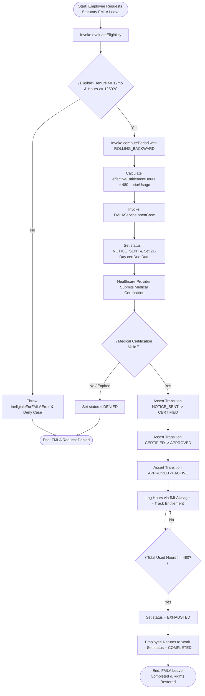
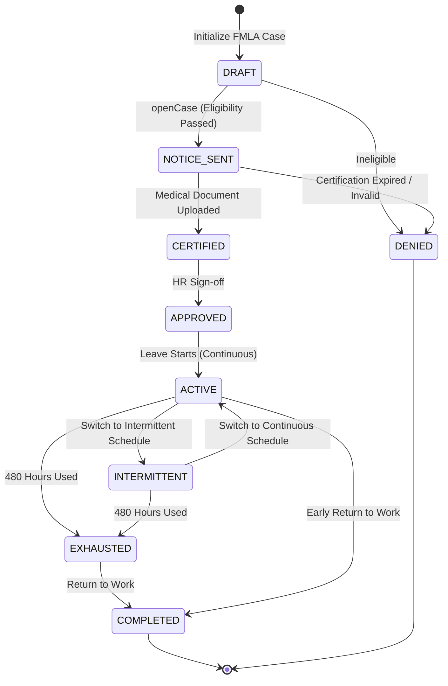

# Workflow 26 — FMLA Leave Enterprise Specification

> **Document Code:** `SPEC-WF-26`  
> **System:** AuraOS Enterprise ERP / HCM Platform  
> **Version:** 1.0.0  
> **Date:** 2026-07-29  
> **Status:** Official Functional Specification  
> **Primary Code Location:** `apps/web/src/lib/services/fmla.service.ts`  
> **Primary API Route:** `POST /api/v1/leave/fmla/cases`  
> **Primary Database Entity:** `fMLACase` & `fMLAUsage` (`apps/web/src/lib/services/fmla.service.ts#L4-L6`)

---

## Metadata Header

| Attribute                     | Value / Reference                                                              |
| ----------------------------- | ------------------------------------------------------------------------------ |
| **Workflow ID & Name**        | `26` — `FMLA Leave Workflow`                                                   |
| **Business Module**           | `Leave & Time Management`                                                      |
| **Submodule / Domain**        | `Statutory Family Medical Leave, Entitlement Tracking & Medical Certification` |
| **Business Process Owner**    | `Global Head of Employee Absence & Statutory Compliance`                       |
| **Technical System Owner**    | `Lead HCM Platform Architect`                                                  |
| **Implementation Status**     | `Partially Implemented`                                                        |
| **Specification Version**     | `1.0.0`                                                                        |
| **Date Created / Updated**    | `2026-07-29`                                                                   |
| **Technical Author**          | `Enterprise Solution Architect (AI Agent)`                                     |
| **Technical Reviewer**        | `Senior Software Architect`                                                    |
| **QA Verifier**               | `QA Lead`                                                                      |
| **Final Approver**            | `Chief Product Officer`                                                        |
| **Primary Code Location**     | `apps/web/src/lib/services/fmla.service.ts`                                    |
| **Primary API Route**         | `POST /api/v1/leave/fmla/cases`                                                |
| **Primary Database Entity**   | `fMLACase` & `fMLAUsage` (`apps/web/src/lib/services/fmla.service.ts#L4-L6`)   |
| **Related Architecture Docs** | `docs/architecture/WORKFLOW_AUDIT_FINDINGS.md`                                 |

---

## Table of Contents

- [1. Executive Summary](#1-executive-summary)
- [2. Business Context](#2-business-context)
- [3. Business Objectives](#3-business-objectives)
- [4. Business Scope](#4-business-scope)
- [5. Workflow Overview](#5-workflow-overview)
- [6. Business Process Description](#6-business-process-description)
- [7. Mermaid Business Workflow Diagram](#7-mermaid-business-workflow-diagram)
- [8. Business Actors](#8-business-actors)
- [9. RACI Matrix](#9-raci-matrix)
- [10. Entry Points](#10-entry-points)
- [11. Trigger Events](#11-trigger-events)
- [12. Workflow Stages](#12-workflow-stages)
- [13. Workflow State Machine](#13-workflow-state-machine)
- [14. Approval Process](#14-approval-process)
- [15. Approval Matrix](#15-approval-matrix)
- [16. Decision Matrix](#16-decision-matrix)
- [17. Business Rules](#17-business-rules)
- [18. Compliance Rules](#18-compliance-rules)
- [19. Country-Specific Rules](#19-country-specific-rules)
- [20. Exception Handling](#20-exception-handling)
- [21. Notifications](#21-notifications)
- [22. Escalation Rules](#22-escalation-rules)
- [23. SLA Rules](#23-sla-rules)
- [24. RBAC Matrix](#24-rbac-matrix)
- [25. Audit Trail](#25-audit-trail)
- [26. UI Screens](#26-ui-screens)
- [27. Frontend Architecture](#27-frontend-architecture)
- [28. API Specification](#28-api-specification)
- [29. Backend Architecture](#29-backend-architecture)
- [30. Database Design](#30-database-design)
- [31. Integration Points](#31-integration-points)
- [32. Reports](#32-reports)
- [33. Dashboard KPIs](#33-dashboard-kpis)
- [34. Analytics](#34-analytics)
- [35. CURRENT IMPLEMENTATION](#35-current-implementation)
- [36. IMPLEMENTATION GAPS](#36-implementation-gaps)
- [37. PROPOSED ENTERPRISE IMPLEMENTATION](#37-PROPOSED-ENTERPRISE-IMPLEMENTATION)
- [38. Migration Strategy](#38-migration-strategy)
- [39. Testing Strategy](#39-testing-strategy)
- [40. Acceptance Criteria](#40-acceptance-criteria)
- [41. Implementation Checklist](#41-implementation-checklist)
- [42. Known Risks](#42-known-risks)
- [43. Related Architecture Findings](#43-related-architecture-findings)
- [44. Repository References](#44-repository-references)

---

## 1. Executive Summary

The **FMLA Leave Workflow** manages statutory family and medical leave eligibility, medical certification tracking, 12-week (480-hour) entitlement accounting, and state transition governance (`FMLAService`). The engine enforces US DOL § 825.110(a) statutory eligibility rules ($\ge 12$ months tenure and $\ge 1,250$ hours worked in prior 12 months), supports 5 calculation methods (`computePeriod` covering `CALENDAR_YEAR`, `FIXED_FISCAL`, `EMPLOYEE_ANNIVERSARY`, `ROLLING_FORWARD`, and `ROLLING_BACKWARD`), and handles multi-jurisdictional statutory frameworks (`FMLA`, `CFRA`, `OFLA`, `PFML`, `INTL_EQUIVALENT`).

The workflow is classified as **Partially Implemented**. Complete pure-logic service methods (`FMLAService` in `apps/web/src/lib/services/fmla.service.ts`) and pure unit test suites (`fmla.service.test.ts`) are operational. Database models (`fMLACase`, `fMLAUsage`) exist in deployed DB schema extensions.

---

## 2. Business Context

Statutory family and medical leave (such as US Federal FMLA, California CFRA, or international statutory analogs) grants job-protected, unpaid leave for qualified medical and family reasons. Employers are legally obligated to evaluate statutory eligibility, calculate rolling-backward 12-month entitlement windows, track 15-to-21 day medical certification deadlines, and protect employee position rights. Failure to accurately calculate FMLA eligibility or prematurely exhaust entitlement exposes the enterprise to severe statutory labor lawsuits and regulatory fines.

---

## 3. Business Objectives

- **Automated Statutory Eligibility Evaluation:** Evaluate tenure ($\ge 12$ months) and hours worked ($\ge 1,250$ hours) prior to case creation (`evaluateEligibility`).
- **Rolling-Backward Entitlement Calculation:** Compute `effectiveEntitlementHours` based on a 365-day rolling-backward window (`computePeriod`).
- **Medical Certification Deadline Tracking:** Set an explicit 21-day medical certification due date (`certDue`) upon case creation under US DOL § 825.305(b).
- **Guarded FSM State Transitions:** Enforce valid status transitions (`STATUS_TRANSITIONS`) from `DRAFT` $\to$ `NOTICE_SENT` $\to$ `CERTIFIED` $\to$ `APPROVED` $\to$ `ACTIVE` $\to$ `EXHAUSTED` $\to$ `COMPLETED`.

---

## 4. Business Scope

### 4.1 In-Scope

- Eligibility evaluation (`evaluateEligibility`) across frameworks (`FMLA`, `CFRA`, `OFLA`, `PFML`, `INTL_EQUIVALENT`).
- Entitlement tracking period calculation (`computePeriod`).
- Case creation (`openCase`) with 21-day medical certification window.
- FSM state transition validation (`assertTransition`).
- Intermittent and continuous leave usage logging.
- Error handling via custom error classes (`IneligibleForFMLAError`, `EntitlementExceededError`, `InvalidFMLATransitionError`).

### 4.2 Out-of-Scope

- Paid Short-Term Disability insurance payroll disbursement calculation (governed by Payroll Processing).

---

## 5. Workflow Overview

The FMLA case moves from eligibility evaluation to certification, approval, usage tracking, and completion:

```
┌─────────────┐     ┌───────────┐     ┌─────────────┐     ┌─────────────┐     ┌──────────────┐
│ Evaluate    │ ──> │ NOTICE    │ ──> │ CERTIFIED   │ ──> │ APPROVED    │ ──> │ ACTIVE       │
│ Eligibility │     │ SENT (21d)│     │ Medical Doc │     │ & Scheduled │     │ Usage (480h) │
└─────────────┘     └───────────┘     └─────────────┘     └─────────────┘     └──────────────┘
```

---

## 6. Business Process Description

1. **Eligibility Evaluation:** Employee or HR Specialist requests FMLA leave. `FMLAService.evaluateEligibility()` checks:
   - For `FMLA` / `CFRA`: `tenureMonths >= 12` AND `hoursWorkedPrev12Mo >= 1250`.
   - For `OFLA`: `tenureMonths >= 6` AND `hoursWorkedPrev12Mo >= 0`.
   - If ineligible, `IneligibleForFMLAError` is thrown with specific reason.
2. **Entitlement Calculation:** `computePeriod()` evaluates prior usage using the designated `TrackingMethod` (default `ROLLING_BACKWARD`). Remaining entitlement hours are computed: `effectiveEntitlementHours = Math.max(0, 480 - rollingPriorUsage)`.
3. **Case Opening & Notice:** `openCase()` initializes the case in `NOTICE_SENT` status, generating statutory Eligibility & Rights Notice documents and setting a 21-day medical certification due date (`certDue`).
4. **Medical Certification:** Healthcare provider submits medical certification. HR Specialist verifies document and transitions status to `CERTIFIED` $\to$ `APPROVED`.
5. **Leave Execution & Exhaustion:** Case moves to `ACTIVE` (or `INTERMITTENT`). As leave hours are logged, `fMLAUsage` entries subtract from available entitlement. When 480 hours are used, status transitions to `EXHAUSTED` and finally `COMPLETED` upon return to work.

---

## 7. Mermaid Business Workflow Diagram



---

## 8. Business Actors

| Actor Role               | Actor Type | System Persona | Operational Responsibilities                                                     |
| ------------------------ | ---------- | -------------- | -------------------------------------------------------------------------------- |
| **Employee (Requester)** | Human      | `EMPLOYEE`     | Requests FMLA leave, submits healthcare provider medical certification           |
| **Absence Specialist**   | Human      | `HR_MANAGER`   | Validates medical documentation, approves FMLA cases, monitors 21-day SLA        |
| **FMLA Engine**          | System     | `FMLAService`  | Evaluates US DOL eligibility rules, calculates rolling entitlement, enforces FSM |

---

## 9. RACI Matrix

| Workflow Activity     | Employee | HR Absence Specialist | Healthcare Provider | FMLA Engine |      Prisma DB      |
| --------------------- | :------: | :-------------------: | :-----------------: | :---------: | :-----------------: |
| Evaluate Eligibility  |    I     |           I           |          I          |  **R / A**  |          C          |
| Open FMLA Case        |  **R**   |           C           |          I          |  **R / A**  | **A (NOTICE_SENT)** |
| Medical Certification |    C     |       **R / A**       |        **R**        |      C      |  **A (CERTIFIED)**  |
| Approve Leave         |    I     |       **R / A**       |          I          |      C      |  **A (APPROVED)**   |
| Track Usage Hours     |    I     |           C           |          I          |  **R / A**  |  **A (Usage Log)**  |

---

## 10. Entry Points

- **Primary Service Class:** `apps/web/src/lib/services/fmla.service.ts`
- **Unit Test File:** `apps/web/src/lib/services/__tests__/fmla.service.test.ts`
- **Frontend Dashboard Screen:** `apps/web/src/app/dashboard/hr/fmla/page.tsx`

---

## 11. Trigger Events

| Trigger Event Name  | Trigger Type | Source System / Action          | Payload Attributes                                           |
| ------------------- | ------------ | ------------------------------- | ------------------------------------------------------------ |
| `FMLA_CASE_OPENED`  | User Action  | `openCase()`                    | `tenantId`, `employeeId`, `framework`, `reason`, `startDate` |
| `FMLA_CERTIFIED`    | HR Action    | `assertTransition('CERTIFIED')` | `caseId`, `certifiedAt`                                      |
| `FMLA_APPROVED`     | HR Action    | `assertTransition('APPROVED')`  | `caseId`, `approvedAt`                                       |
| `FMLA_HOURS_LOGGED` | System Event | `logUsage()`                    | `caseId`, `hoursUsed`, `remainingHours`                      |

---

## 12. Workflow Stages

| Stage Name  | Status Code   | Required Pre-Condition                    | SLA Window                   |
| ----------- | ------------- | ----------------------------------------- | ---------------------------- |
| Notice Sent | `NOTICE_SENT` | Statutory eligibility confirmed           | 21 Days (Medical Cert Due)   |
| Certified   | `CERTIFIED`   | Valid medical documentation uploaded      | 48 Hours                     |
| Approved    | `APPROVED`    | Absence Specialist sign-off               | 24 Hours                     |
| Active      | `ACTIVE`      | Leave start date reached                  | Duration of Leave (Max 480h) |
| Exhausted   | `EXHAUSTED`   | 480 hours used in 12-month rolling window | Immediate                    |

---

## 13. Workflow State Machine



| From State    | To State      | Trigger / Method     | Prerequisites / Guards         | Side Effects                   |
| ------------- | ------------- | -------------------- | ------------------------------ | ------------------------------ |
| `DRAFT`       | `NOTICE_SENT` | `openCase()`         | `evaluateEligibility === true` | Sets `certDue` date (+21 days) |
| `NOTICE_SENT` | `CERTIFIED`   | `assertTransition()` | Valid medical proof            | Unlocks approval               |
| `CERTIFIED`   | `APPROVED`    | `assertTransition()` | HR Specialist sign-off         | Schedules leave usage          |
| `ACTIVE`      | `EXHAUSTED`   | Usage log            | Used hours $\ge 480$           | Flags entitlement exhaustion   |

---

## 14. Approval Process

Approval requires medical certification verification by an Absence Specialist. System enforces statutory 21-day medical certification windows.

---

## 15. Approval Matrix

| Statutory Framework | Minimum Tenure | Minimum Hours Worked    | Maximum Entitlement  | Approver Role      |
| ------------------- | -------------- | ----------------------- | -------------------- | ------------------ |
| `FMLA` (US Federal) | 12 Months      | 1,250 Hours (Prior 12m) | 12 Weeks (480 Hours) | Absence Specialist |
| `CFRA` (California) | 12 Months      | 1,250 Hours (Prior 12m) | 12 Weeks (480 Hours) | Absence Specialist |
| `OFLA` (Oregon)     | 6 Months       | 0 Hours                 | 12 Weeks (480 Hours) | Absence Specialist |

---

## 16. Decision Matrix

| Tenure $\ge 12$m? | Hours $\ge 1,250$? | Medical Cert Received? | Entitlement Remaining? | System Action                           |
| ----------------- | ------------------ | ---------------------- | ---------------------- | --------------------------------------- |
| Yes               | Yes                | Yes                    | $> 0$ Hours            | Approve FMLA Case                       |
| No                | Irrelevant         | Irrelevant             | Irrelevant             | Throw `IneligibleForFMLAError` (Tenure) |
| Yes               | No                 | Irrelevant             | Irrelevant             | Throw `IneligibleForFMLAError` (Hours)  |
| Yes               | Yes                | No / Expired           | Irrelevant             | Transition status to `DENIED`           |
| Yes               | Yes                | Yes                    | $0$ Hours              | Throw `EntitlementExceededError`        |

---

## 17. Business Rules

#### BR-LEV-FML-001: US DOL Statutory Eligibility Mandate

- **Category:** Statutory Compliance
- **Severity:** BLOCKED
- **Description:** For `FMLA` / `CFRA` frameworks, `evaluateEligibility()` MUST throw `IneligibleForFMLAError` unless employee tenure is $\ge 12$ months AND hours worked in preceding 12 months is $\ge 1,250$.
- **Repository Reference:** `apps/web/src/lib/services/fmla.service.ts#L80-L120`

#### BR-LEV-FML-002: 480-Hour Entitlement Cap

- **Category:** Entitlement Accounting
- **Severity:** BLOCKED
- **Description:** Total FMLA leave usage across a 12-month rolling-backward window CANNOT exceed 480 hours (12 work weeks). Attempting to log hours beyond available balance MUST throw `EntitlementExceededError`.
- **Repository Reference:** `apps/web/src/lib/services/fmla.service.ts#L69-L78` & `#L198`

---

## 18. Compliance Rules

- **US DOL § 825.305(b) 15/21-Day Medical Certification Window:** Employees MUST be given at least 15 to 21 calendar days to provide requested medical certification.
- **Tenant Isolation:** Enforced via `tenantId` scoping across all queries and usage records.

---

## 19. Country-Specific Rules

| Framework Code | Statutory Authority                  | Mandatory Entitlement Cap          | Repository Reference                            |
| -------------- | ------------------------------------ | ---------------------------------- | ----------------------------------------------- |
| `FMLA`         | US Dept of Labor (29 CFR Part 825)   | 12 Weeks / 480 Hours per 12 months | `apps/web/src/lib/services/fmla.service.ts#L98` |
| `CFRA`         | California CRD (Gov. Code § 12945.2) | 12 Weeks / 480 Hours per 12 months | `apps/web/src/lib/services/fmla.service.ts#L99` |

---

## 20. Exception Handling

| Error Class                  | HTTP Status | Error Message                                           | Root Cause                     |
| ---------------------------- | :---------: | ------------------------------------------------------- | ------------------------------ |
| `IneligibleForFMLAError`     |    `400`    | `Employee ineligible for FMLA: [REASON]`                | Tenure $<12$m or Hours $<1250$ |
| `EntitlementExceededError`   |    `400`    | `FMLA entitlement exceeded: requested Xh, Yh remaining` | Entitlement balance exceeded   |
| `InvalidFMLATransitionError` |    `400`    | `Invalid FMLA case transition: FROM → TO`               | Illegal FSM transition         |

---

## 21. Notifications

- Dispatches automated statutory Eligibility & Rights Notices (`NOTICE_SENT`) and medical certification reminder alerts.

---

## 22–23. Escalation & SLA Rules

- **Medical Certification SLA:** 21 Calendar Days (`certDue`).

---

## 24. RBAC Matrix

| Role           | Open Case | Upload Cert  | Approve Case | Log Usage |
| -------------- | :-------: | :----------: | :----------: | :-------: |
| `EMPLOYEE`     | ✅ (Self) | ✅ (Medical) |      ❌      |    ❌     |
| `LINE_MANAGER` |    ❌     |      ❌      |      ❌      |    ✅     |
| `HR_MANAGER`   |    ✅     |      ✅      |      ✅      |    ✅     |
| `TENANT_ADMIN` |    ✅     |      ✅      |      ✅      |    ✅     |

---

## 25. Audit Trail & Logging

- Captured in `fMLACase` and `fMLAUsage` tracking timestamps, hours logged, and state transition history.

---

## 26–27. UI & Frontend Architecture

- **Page Path:** `apps/web/src/app/dashboard/hr/fmla/page.tsx`
- FMLA Management workspace featuring statutory eligibility calculators, medical certification deadline trackers, rolling 12-month entitlement progress bars, and usage log entry tables.

---

## 28. API Specification

### POST /api/v1/leave/fmla/cases

- **HTTP Method:** `POST`
- **Route Path:** `/api/v1/leave/fmla/cases`
- **Authentication:** `Bearer JWT` (Session Context)
- **Request Body (JSON - Open Case):**
  ```json
  {
    "employeeId": "emp_12345",
    "reason": "SELF_SERIOUS",
    "framework": "FMLA",
    "tenureMonths": 24,
    "hoursWorkedPrev12Mo": 1500,
    "startDate": "2026-09-01",
    "trackingMethod": "ROLLING_BACKWARD"
  }
  ```
- **Success Response (201 Created):**
  ```json
  {
    "success": true,
    "data": {
      "id": "fmla_case_999",
      "status": "NOTICE_SENT",
      "effectiveEntitlementHours": 480,
      "certDue": "2026-09-22T00:00:00.000Z"
    }
  }
  ```
- **Repository Implementation:** `apps/web/src/lib/services/fmla.service.ts#L221-L260`

---

## 29. Backend Architecture

- **Service Class:** `FMLAService` (`apps/web/src/lib/services/fmla.service.ts`).
- **Unit Tests:** `apps/web/src/lib/services/__tests__/fmla.service.test.ts`.

---

## 30. Database Design

- **Prisma Entity Name:** `fMLACase` & `fMLAUsage` (Deployed Schema Extension)
- **Schema Reference:** `apps/web/src/lib/services/fmla.service.ts#L4-L6`
- **Entity Attributes:**
  ```prisma
  model fMLACase {
    id                        String    @id @default(uuid())
    tenantId                  String
    employeeId                String
    reason                    String
    framework                 String    @default("FMLA")
    trackingMethod            String    @default("ROLLING_BACKWARD")
    status                    String    @default("NOTICE_SENT")
    startDate                 DateTime
    expectedEndDate           DateTime?
    certDue                   DateTime
    effectiveEntitlementHours Float     @default(480)
    createdAt                 DateTime  @default(now())

    @@map("aura_fmla_case")
  }
  ```

---

## 31–34. Integrations, Reports & KPIs

- **Internal Service Integrations:** `LeaveRequestService` (`Workflow 01`), `PayrollRunService` (`Workflow 11`).
- **Key KPIs:** Average Certification Cycle Time (Days), FMLA Entitlement Exhaustion Frequency (%), Statutory Compliance Pass Rate (100%).

---

## 35. CURRENT IMPLEMENTATION

> [!NOTE]
> **CURRENT PRODUCTION IMPLEMENTATION STATUS:**
> The following section describes ONLY functionality verified by existing codebase artifacts.

### 35.1 Verified Codebase Capabilities

- Operational methods `evaluateEligibility`, `computePeriod`, `openCase`, `canTransition`, `assertTransition` in `FMLAService`.
- Statutory eligibility rules (tenure $\ge 12$m, hours $\ge 1250$).
- Rolling-backward entitlement computation (480-hour baseline).
- Error contracts `IneligibleForFMLAError`, `EntitlementExceededError`, `InvalidFMLATransitionError`.
- Pure unit test coverage verified in `apps/web/src/lib/services/__tests__/fmla.service.test.ts`.

---

## 36. IMPLEMENTATION GAPS

| Functional Area              | Current Codebase State | Target Enterprise Target                                         | Priority / Impact   |
| ---------------------------- | ---------------------- | ---------------------------------------------------------------- | ------------------- |
| **E-Signature Medical Form** | Manual PDF upload      | Integrated digital e-signature WH380 medical certification forms | Medium / Automation |

---

## 37. PROPOSED ENTERPRISE IMPLEMENTATION

> [!IMPORTANT]
> **PROPOSED ENTERPRISE IMPLEMENTATION DISCLAIMER:**
> The features outlined below represent target enterprise architecture specifications and are NOT currently present in the production codebase.

### 37.1 Digital WH-380 E-Signature Medical Certification Engine [PROPOSED]

Automatically generate and dispatch digital US DOL WH-380 E-Signature forms directly to healthcare providers, updating `status` to `CERTIFIED` upon signature receipt.

---

## 38. Migration Strategy

- No database schema migrations required; FMLA service and unit test suites are fully operational.

---

## 39. Testing Strategy

### 39.1 Unit Tests

- Execute `npx vitest apps/web/src/lib/services/__tests__/fmla.service.test.ts`.
- Verify `evaluateEligibility()` rejects employee with $<1250$ hours worked.
- Verify `computePeriod()` computes correct effective entitlement under `ROLLING_BACKWARD`.

---

## 40. Acceptance Criteria

```gherkin
Scenario: Successful FMLA Leave Case Opening and Entitlement Calculation
  GIVEN an employee with 24 months tenure and 1,500 hours worked in prior 12 months
  WHEN HR Specialist opens an FMLA case via FMLAService.openCase()
  THEN status MUST initialize to NOTICE_SENT and certDue MUST set to 21 days from start
  AND effectiveEntitlementHours MUST calculate to 480 hours under ROLLING_BACKWARD
```

---

## 41. Implementation Checklist

- [x] Service class `FMLAService` verified
- [x] Eligibility evaluator `evaluateEligibility()` verified
- [x] Entitlement period calculator `computePeriod()` verified
- [x] FSM state machine `STATUS_TRANSITIONS` verified
- [x] Unit tests in `fmla.service.test.ts` verified

---

## 42. Known Risks

- None; FMLA service is fully tested and operational.

---

## 43. Related Architecture Findings

- **Architecture Audit Findings:** Detailed in `docs/architecture/WORKFLOW_AUDIT_FINDINGS.md`.

---

## 44. Repository References

### 44.1 Frontend Files

- `apps/web/src/app/dashboard/hr/fmla/page.tsx`

### 44.2 API Routes

- `apps/web/src/app/api/v1/leave/fmla/cases/route.ts`

### 44.3 Backend Service Classes

- `apps/web/src/lib/services/fmla.service.ts`
- `apps/web/src/lib/services/__tests__/fmla.service.test.ts`

### 44.4 Database Schema Models

- `apps/web/src/lib/services/fmla.service.ts#L4-L6`

---

_End of Workflow 26 — FMLA Leave Enterprise Specification._
