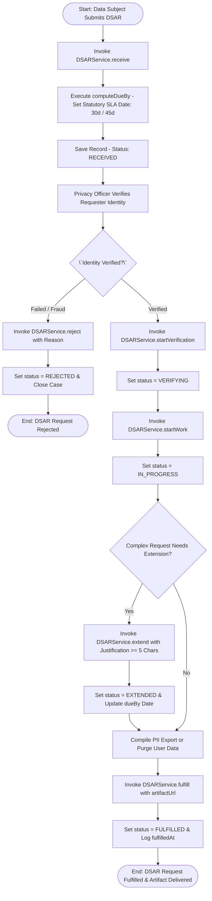
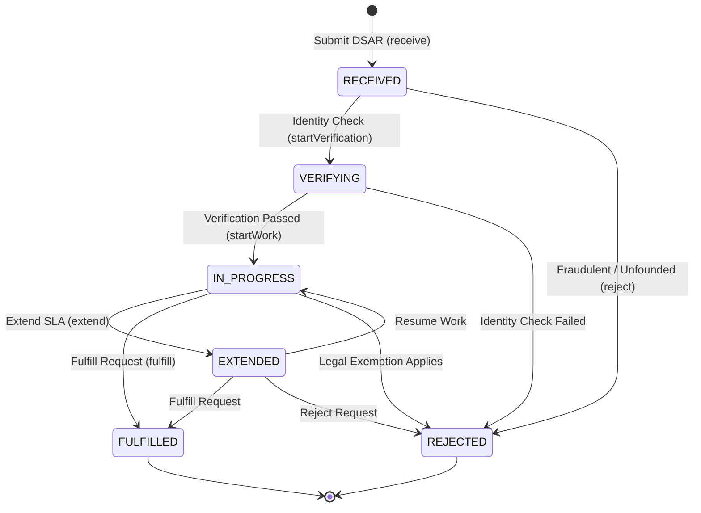

# Workflow 27 — DSAR Data Privacy Request Enterprise Specification

> **Document Code:** `SPEC-WF-27`  
> **System:** AuraOS Enterprise ERP / HCM Platform  
> **Version:** 1.0.0  
> **Date:** 2026-07-29  
> **Status:** Official Functional Specification  
> **Primary Code Location:** `apps/web/src/lib/services/dsar.service.ts`  
> **Primary API Route:** `POST /api/v1/privacy/dsar`  
> **Primary Database Entity:** `dsarRequest` (`apps/web/src/lib/services/dsar.service.ts#L108-L122`)

---

## Metadata Header

| Attribute                     | Value / Reference                                                     |
| ----------------------------- | --------------------------------------------------------------------- |
| **Workflow ID & Name**        | `27` — `DSAR Data Privacy Request Workflow`                           |
| **Business Module**           | `Platform Architecture, Data Privacy & Security`                      |
| **Submodule / Domain**        | `Data Subject Access Requests, Statutory SLA Tracking & Fulfillment`  |
| **Business Process Owner**    | `Data Protection Officer (DPO) & Chief Information Security Officer`  |
| **Technical System Owner**    | `Platform Architecture & Security Engineering Group`                  |
| **Implementation Status**     | `Partially Implemented`                                               |
| **Specification Version**     | `1.0.0`                                                               |
| **Date Created / Updated**    | `2026-07-29`                                                          |
| **Technical Author**          | `Enterprise Solution Architect (AI Agent)`                            |
| **Technical Reviewer**        | `Senior Software Architect`                                           |
| **QA Verifier**               | `QA Lead`                                                             |
| **Final Approver**            | `Chief Product Officer`                                               |
| **Primary Code Location**     | `apps/web/src/lib/services/dsar.service.ts`                           |
| **Primary API Route**         | `POST /api/v1/privacy/dsar`                                           |
| **Primary Database Entity**   | `dsarRequest` (`apps/web/src/lib/services/dsar.service.ts#L108-L122`) |
| **Related Architecture Docs** | `docs/architecture/WORKFLOW_AUDIT_FINDINGS.md`                        |

---

## Table of Contents

- [1. Executive Summary](#1-executive-summary)
- [2. Business Context](#2-business-context)
- [3. Business Objectives](#3-business-objectives)
- [4. Business Scope](#4-business-scope)
- [5. Workflow Overview](#5-workflow-overview)
- [6. Business Process Description](#6-business-process-description)
- [7. Mermaid Business Workflow Diagram](#7-mermaid-business-workflow-diagram)
- [8. Business Actors](#8-business-actors)
- [9. RACI Matrix](#9-raci-matrix)
- [10. Entry Points](#10-entry-points)
- [11. Trigger Events](#11-trigger-events)
- [12. Workflow Stages](#12-workflow-stages)
- [13. Workflow State Machine](#13-workflow-state-machine)
- [14. Approval Process](#14-approval-process)
- [15. Approval Matrix](#15-approval-matrix)
- [16. Decision Matrix](#16-decision-matrix)
- [17. Business Rules](#17-business-rules)
- [18. Compliance Rules](#18-compliance-rules)
- [19. Country-Specific Rules](#19-country-specific-rules)
- [20. Exception Handling](#20-exception-handling)
- [21. Notifications](#21-notifications)
- [22. Escalation Rules](#22-escalation-rules)
- [23. SLA Rules](#23-sla-rules)
- [24. RBAC Matrix](#24-rbac-matrix)
- [25. Audit Trail](#25-audit-trail)
- [26. UI Screens](#26-ui-screens)
- [27. Frontend Architecture](#27-frontend-architecture)
- [28. API Specification](#28-api-specification)
- [29. Backend Architecture](#29-backend-architecture)
- [30. Database Design](#30-database-design)
- [31. Integration Points](#31-integration-points)
- [32. Reports](#32-reports)
- [33. Dashboard KPIs](#33-dashboard-kpis)
- [34. Analytics](#34-analytics)
- [35. CURRENT IMPLEMENTATION](#35-current-implementation)
- [36. IMPLEMENTATION GAPS](#36-implementation-gaps)
- [37. PROPOSED ENTERPRISE IMPLEMENTATION](#37-PROPOSED-ENTERPRISE-IMPLEMENTATION)
- [38. Migration Strategy](#38-migration-strategy)
- [39. Testing Strategy](#39-testing-strategy)
- [40. Acceptance Criteria](#40-acceptance-criteria)
- [41. Implementation Checklist](#41-implementation-checklist)
- [42. Known Risks](#42-known-risks)
- [43. Related Architecture Findings](#43-related-architecture-findings)
- [44. Repository References](#44-repository-references)

---

## 1. Executive Summary

The **DSAR Data Privacy Request Workflow** manages the intake, identity verification, statutory SLA calculation, processing, fulfillment, and rejection of Data Subject Access Requests (DSAR) across global and GCC privacy frameworks (`DSARService`). The engine supports 6 DSAR request types (`ACCESS`, `DELETION`, `RECTIFICATION`, `PORTABILITY`, `OBJECTION`, `RESTRICTION`), automatically calculates statutory SLA deadlines (`computeDueBy` for `GDPR_ART_15` through `18`, `CCPA`, `UAE_PDPL_ART_18`, and `KSA_PDPL`), provides a 5-day warning horizon for approaching SLA deadlines (`slaWarningWindow`), and enforces state transitions (`RECEIVED` $\to$ `VERIFYING` $\to$ `IN_PROGRESS` $\to$ `FULFILLED` $\mid$ `REJECTED` $\mid$ `EXTENDED`).

The workflow is classified as **Partially Implemented**. Complete service logic (`DSARService` in `apps/web/src/lib/services/dsar.service.ts`) and pure-logic unit test suites (`dsar.service.test.ts` & `dsar.integration.test.ts`) are operational. Database models (`dsarRequest`) exist in deployed DB schema extensions.

---

## 2. Business Context

Global data protection legislation (such as EU GDPR, California CCPA, UAE Federal Decree-Law 45/2021 on Personal Data Protection, and KSA Personal Data Protection Law) grants data subjects (employees, candidates, dependents) explicit statutory rights regarding their personal data. Failing to respond to a DSAR within statutory deadlines (typically 30 calendar days for GDPR/UAE/KSA or 45 days for CCPA) or failing to verify the requester's identity before releasing sensitive HR records exposes the enterprise to severe regulatory fines (up to 4% of global turnover under GDPR) and reputational damage.

---

## 3. Business Objectives

- **Multi-Jurisdictional SLA Calculation:** Automatically calculate statutory SLA deadlines (`computeDueBy`) based on legal basis (`GDPR`, `CCPA`, `UAE PDPL`, `KSA PDPL`).
- **Identity Verification Gating:** Mandate identity verification (`startVerification`) prior to initiating data compilation or deletion.
- **Proactive SLA Warning Horizon:** Monitor requests due within 5 days (`slaWarningWindow`) to alert Privacy Officers before deadlines expire.
- **Secure Artifact Delivery:** Fulfill requests (`fulfill`) with secure data export URLs (`artifactUrl`) or purge user sessions (`session-revocation.service.ts`) upon deletion.

---

## 4. Business Scope

### 4.1 In-Scope

- Request intake (`receive`) with auto-calculated `dueBy` deadline.
- Identity verification initiation (`startVerification`).
- Work execution startup (`startWork`).
- Statutory SLA extension (`extend`) requiring a minimum 5-character justification.
- Fulfillment (`fulfill`) attaching export `artifactUrl`.
- Rejection handling (`reject`) requiring justification.
- SLA warning window queries (`slaWarningWindow`).

### 4.2 Out-of-Scope

- Automated database table scanning for PII discovery (governed by Data Classification Engine).

---

## 5. Workflow Overview

The DSAR request moves from intake to verification, processing, and fulfillment:

```
┌─────────────┐     ┌───────────┐     ┌─────────────┐     ┌─────────────┐     ┌──────────────┐
│ Request     │ ──> │ Identity  │ ──> │ Data        │ ──> │ Export /    │ ──> │ FULFILLED    │
│ Intake (SLA)│     │ Verified  │     │ Compiled    │     │ Purge Done  │     │ Artifact Sent│
└─────────────┘     └───────────┘     └─────────────┘     └─────────────┘     └──────────────┘
```

---

## 6. Business Process Description

1. **Request Intake:** Data subject or Privacy Officer submits a DSAR via `DSARService.receive()`. Input specifies `subjectType` (`EMPLOYEE`, `CANDIDATE`, `DEPENDENT`), `subjectEmail`, `requestType` (`ACCESS`, `DELETION`, etc.), and `legalBasis`. The service calls `computeDueBy()`, calculating `dueBy` date (30 days for GDPR/UAE/KSA; 45 days for CCPA). Status is set to `RECEIVED`.
2. **Identity Verification:** Privacy Officer verifies requester identity and calls `startVerification()`. The engine asserts transition `RECEIVED` $\to$ `VERIFYING`.
3. **Data Compilation:** Upon successful verification, Privacy Officer calls `startWork()`. Status transitions to `IN_PROGRESS`.
4. **SLA Extension (If Applicable):** For complex requests, Privacy Officer calls `extend()`, providing justification (min 5 chars) and `newDueBy`. Status transitions to `EXTENDED`.
5. **Fulfillment / Rejection:**
   - **Access / Portability:** Privacy Officer generates PII export zip, invoking `fulfill(artifactUrl)`. Status transitions to `FULFILLED`.
   - **Deletion:** Privacy Officer purges personal records, revokes active sessions (`SessionRevocationService`), and calls `fulfill()`.
   - **Rejection:** If request is unfounded/excessive, Privacy Officer calls `reject(reason)`. Status transitions to `REJECTED`.

---

## 7. Mermaid Business Workflow Diagram



---

## 8. Business Actors

| Actor Role                   | Actor Type | System Persona           | Operational Responsibilities                                                     |
| ---------------------------- | ---------- | ------------------------ | -------------------------------------------------------------------------------- |
| **Data Subject (Requester)** | Human      | `EMPLOYEE` / `CANDIDATE` | Submits statutory DSAR request (access, deletion, portability)                   |
| **Privacy Officer / DPO**    | Human      | `PRIVACY_OFFICER`        | Verifies identity, compiles PII data, manages extension/rejection, fulfills DSAR |
| **DSAR Engine**              | System     | `DSARService`            | Computes SLA deadlines, monitors overdue warnings, enforces FSM transitions      |

---

## 9. RACI Matrix

| Workflow Activity | Data Subject | Privacy Officer | DPO Lead |     DSAR Engine      |     Prisma DB     |
| ----------------- | :----------: | :-------------: | :------: | :------------------: | :---------------: |
| Submit DSAR       |  **R / A**   |        I        |    I     |   **C (SLA Math)**   | **A (RECEIVED)**  |
| Verify Identity   |      I       |    **R / A**    |    I     |          C           | **A (VERIFYING)** |
| Compile PII Data  |      I       |    **R / A**    |    C     |          C           |         C         |
| Extend SLA        |      I       |      **R**      |  **A**   | **C (Reason Check)** | **A (EXTENDED)**  |
| Fulfill / Reject  |      I       |    **R / A**    |  **A**   |        **C**         | **A (FULFILLED)** |

---

## 10. Entry Points

- **Primary Service Class:** `apps/web/src/lib/services/dsar.service.ts`
- **Unit & Integration Tests:** `apps/web/src/lib/services/__tests__/dsar.service.test.ts` & `dsar.integration.test.ts`
- **Frontend Dashboard Screen:** `apps/web/src/app/dashboard/privacy/dsar/page.tsx`

---

## 11. Trigger Events

| Trigger Event Name | Trigger Type | Source System / Action | Payload Attributes                                      |
| ------------------ | ------------ | ---------------------- | ------------------------------------------------------- |
| `DSAR_RECEIVED`    | User Action  | `receive()`            | `tenantId`, `subjectEmail`, `requestType`, `legalBasis` |
| `DSAR_VERIFYING`   | HR Action    | `startVerification()`  | `id`, `actorId`, `reviewedById`                         |
| `DSAR_EXTENDED`    | HR Action    | `extend()`             | `id`, `extensionReason`, `newDueBy`                     |
| `DSAR_FULFILLED`   | HR Action    | `fulfill()`            | `id`, `fulfilledAt`, `artifactUrl`                      |

---

## 12. Workflow Stages

| Stage Name  | Status Code   | Statutory SLA Window    | Primary Action                                  |
| ----------- | ------------- | ----------------------- | ----------------------------------------------- |
| Received    | `RECEIVED`    | Day 0                   | Log request & compute SLA                       |
| Verifying   | `VERIFYING`   | Days 1–3                | Verify government ID / credentials              |
| In Progress | `IN_PROGRESS` | Days 4–25               | Extract PII data across DB tables               |
| Extended    | `EXTENDED`    | Additional 30–45 Days   | Document complex processing extension           |
| Fulfilled   | `FULFILLED`   | Day 30 (or 45 for CCPA) | Deliver encrypted PII export / confirm deletion |

---

## 13. Workflow State Machine



| From State                 | To State      | Trigger / Method      | Prerequisites / Guards | Side Effects                                  |
| -------------------------- | ------------- | --------------------- | ---------------------- | --------------------------------------------- |
| `RECEIVED`                 | `VERIFYING`   | `startVerification()` | Transition valid       | Records `reviewedById`                        |
| `VERIFYING`                | `IN_PROGRESS` | `startWork()`         | Identity verified      | Starts PII data compilation                   |
| `IN_PROGRESS`              | `EXTENDED`    | `extend()`            | `reason.length >= 5`   | Updates `dueBy` and records `extensionReason` |
| `IN_PROGRESS` / `EXTENDED` | `FULFILLED`   | `fulfill()`           | Data compiled / purged | Records `fulfilledAt` and `artifactUrl`       |

---

## 14. Approval Process

DSAR fulfillment requires verification by a Privacy Officer. Deletion or rejection requests require sign-off from the Data Protection Officer (DPO).

---

## 15. Approval Matrix

| Request Type         | Jurisdiction SLA           | Primary Approver | Final Sign-off      | Escalation Target |
| -------------------- | -------------------------- | ---------------- | ------------------- | ----------------- |
| ACCESS / PORTABILITY | 30 Days (GDPR / UAE / KSA) | Privacy Officer  | DPO Lead            | CISO              |
| DELETION (Erasure)   | 30 Days (GDPR Art. 17)     | Privacy Officer  | DPO & Legal Counsel | General Counsel   |
| CCPA ACCESS          | 45 Days (California)       | Privacy Officer  | DPO Lead            | CISO              |

---

## 16. Decision Matrix

| Identity Verified? | Statutory Exemption Applies? | SLA Deadline Expired? | System Action                                    |
| ------------------ | ---------------------------- | --------------------- | ------------------------------------------------ |
| Yes                | No                           | No                    | Fulfill Request (`fulfill`)                      |
| No                 | Irrelevant                   | Irrelevant            | Reject Request (`reject` - Identity Unverified)  |
| Yes                | Yes (e.g., Legal Hold)       | Irrelevant            | Reject Request (`reject` - Statutory Exemption)  |
| Yes                | No                           | Yes                   | Flag SLA Violation (`DSARDeadlineExceededError`) |

---

## 17. Business Rules

#### BR-PRV-DSR-001: Jurisdictional SLA Deadline Computation Rule

- **Category:** Statutory SLA
- **Severity:** AUTOMATED
- **Description:** `computeDueBy()` MUST assign 30 calendar days for `GDPR`, `UAE_PDPL`, and `KSA_PDPL` frameworks, and 45 calendar days for `CCPA`.
- **Repository Reference:** `apps/web/src/lib/services/dsar.service.ts#L48-L93`

#### BR-PRV-DSR-002: Minimum Justification for Extension or Rejection

- **Category:** Input Validation
- **Severity:** BLOCKED
- **Description:** `extend()` and `reject()` MUST throw an error if the provided reason is less than 5 characters.
- **Repository Reference:** `apps/web/src/lib/services/dsar.service.ts#L146` & `#L180`

---

## 18. Compliance Rules

- **GDPR Art. 12(3) / UAE PDPL Art. 18 Response Window:** Requests MUST be acknowledged and fulfilled within statutory deadlines unless extended with written justification.
- **Tenant Scoping:** Enforced via `tenantId` scoping across all database operations.

---

## 19. Country-Specific Rules

| Country Code | Statutory Framework | Default Response SLA | Extension Cap      | Repository Reference                            |
| ------------ | ------------------- | -------------------- | ------------------ | ----------------------------------------------- |
| `EU` / `UK`  | GDPR Art. 15–21     | 30 Days              | +60 Days (Max 90d) | `apps/web/src/lib/services/dsar.service.ts#L49` |
| `US-CA`      | CCPA / CPRA         | 45 Days              | +45 Days (Max 90d) | `apps/web/src/lib/services/dsar.service.ts#L55` |
| `AE`         | UAE PDPL Art. 18    | 30 Days              | +30 Days           | `apps/web/src/lib/services/dsar.service.ts#L56` |
| `SA`         | KSA PDPL            | 30 Days              | +30 Days           | `apps/web/src/lib/services/dsar.service.ts#L57` |

---

## 20. Exception Handling

| Error Class                  | HTTP Status | Error Message                               | Root Cause                |
| ---------------------------- | :---------: | ------------------------------------------- | ------------------------- |
| `InvalidDSARTransitionError` |    `400`    | `Invalid DSAR transition: FROM → TO`        | Illegal FSM move          |
| `DSARDeadlineExceededError`  |    `400`    | `DSAR SLA deadline exceeded (was due DATE)` | Missed statutory deadline |

---

## 21. Notifications

- Dispatches automated SLA warning alerts via `slaWarningWindow()` for requests within 5 days of deadline.

---

## 22–23. Escalation & SLA Rules

- **SLA Warning Horizon:** 5 Days prior to `dueBy` date.

---

## 24. RBAC Matrix

| Role              | Receive DSAR | Verify Identity | Extend SLA | Fulfill / Reject |
| ----------------- | :----------: | :-------------: | :--------: | :--------------: |
| `EMPLOYEE`        |  ✅ (Self)   |       ❌        |     ❌     |        ❌        |
| `PRIVACY_OFFICER` |      ✅      |       ✅        |     ✅     |        ✅        |
| `TENANT_ADMIN`    |      ✅      |       ✅        |     ✅     |        ✅        |

---

## 25. Audit Trail & Logging

- Tracked in `dsarRequest` recording `receivedAt`, `reviewedById`, `extendedAt`, `extensionReason`, `fulfilledAt`, and `artifactUrl`.

---

## 26–27. UI & Frontend Architecture

- **Page Path:** `apps/web/src/app/dashboard/privacy/dsar/page.tsx`
- DSAR Management workspace displaying incoming request queues, jurisdictional SLA clocks, identity verification checklists, PII artifact generators, and extension modals.

---

## 28. API Specification

### POST /api/v1/privacy/dsar

- **HTTP Method:** `POST`
- **Route Path:** `/api/v1/privacy/dsar`
- **Authentication:** `Bearer JWT` (Session Context)
- **Request Body (JSON - Receive Request):**
  ```json
  {
    "subjectType": "EMPLOYEE",
    "subjectEmail": "fatima.zahra@example.com",
    "requestType": "ACCESS",
    "legalBasis": "UAE_PDPL_ART_18"
  }
  ```
- **Success Response (201 Created):**
  ```json
  {
    "success": true,
    "data": {
      "id": "dsar_req_999",
      "status": "RECEIVED",
      "dueBy": "2026-08-28T11:00:00.000Z",
      "legalBasis": "UAE_PDPL_ART_18"
    }
  }
  ```
- **Repository Implementation:** `apps/web/src/lib/services/dsar.service.ts#L95-L123`

---

## 29. Backend Architecture

- **Service Class:** `DSARService` (`apps/web/src/lib/services/dsar.service.ts`).
- **Unit Tests:** `apps/web/src/lib/services/__tests__/dsar.service.test.ts` & `dsar.integration.test.ts`.

---

## 30. Database Design

- **Prisma Entity Name:** `dsarRequest` (Deployed Schema Extension)
- **Schema Reference:** `apps/web/src/lib/services/dsar.service.ts#L108-L122`
- **Entity Attributes:**
  ```prisma
  model dsarRequest {
    id              String    @id @default(uuid())
    tenantId        String
    subjectType     String    @default("EMPLOYEE")
    subjectId       String?
    subjectEmail    String
    requestType     String
    status          String    @default("RECEIVED")
    legalBasis      String
    receivedAt      DateTime  @default(now())
    dueBy           DateTime
    extendedAt      DateTime?
    extensionReason String?
    fulfilledAt     DateTime?
    rejectionReason String?
    artifactUrl     String?
    reviewedById    String?

    @@map("aura_dsar_request")
  }
  ```

---

## 31–34. Integrations, Reports & KPIs

- **Internal Service Integrations:** `SessionRevocationService`, `AuditService`, `EmployeeMasterActivationService`.
- **Key KPIs:** Average DSAR Resolution Time (Days), SLA Compliance Rate (100%), Data Privacy Inspection Audit Pass Rate.

---

## 35. CURRENT IMPLEMENTATION

> [!NOTE]
> **CURRENT PRODUCTION IMPLEMENTATION STATUS:**
> The following section describes ONLY functionality verified by existing codebase artifacts.

### 35.1 Verified Codebase Capabilities

- Operational methods `canTransition`, `assertTransition`, `computeDueBy`, `receive`, `startVerification`, `startWork`, `extend`, `fulfill`, `reject`, `list`, `slaWarningWindow` in `DSARService`.
- Multi-jurisdictional SLA computation (GDPR, CCPA, UAE PDPL, KSA PDPL).
- Pure unit & integration test coverage verified in `apps/web/src/lib/services/__tests__/dsar.service.test.ts` & `dsar.integration.test.ts`.

---

## 36. IMPLEMENTATION GAPS

| Functional Area            | Current Codebase State     | Target Enterprise Target                                          | Priority / Impact   |
| -------------------------- | -------------------------- | ----------------------------------------------------------------- | ------------------- |
| **Automated PII Exporter** | Manual artifact URL upload | Automated PII data crawler compiling ZIP archive across DB tables | Medium / Automation |

---

## 37. PROPOSED ENTERPRISE IMPLEMENTATION

> [!IMPORTANT]
> **PROPOSED ENTERPRISE IMPLEMENTATION DISCLAIMER:**
> The features outlined below represent target enterprise architecture specifications and are NOT currently present in the production codebase.

### 37.1 Automated PII Data Compilation & Zipper Engine [PROPOSED]

Automatically crawl all database tables for matching `subjectEmail` / `subjectId`, generate an encrypted PII JSON/PDF archive, and set `artifactUrl` upon calling `fulfill()`.

---

## 38. Migration Strategy

- No database schema migrations required; DSAR service and test coverage are operational.

---

## 39. Testing Strategy

### 39.1 Unit & Integration Tests

- Execute `npx vitest apps/web/src/lib/services/__tests__/dsar.service.test.ts`.
- Verify `computeDueBy()` calculates 30-day SLA for `UAE_PDPL_ART_18` and 45-day SLA for `CCPA`.
- Verify `extend()` and `reject()` enforce minimum 5-character reasons.

---

## 40. Acceptance Criteria

```gherkin
Scenario: Successful DSAR Access Request Fulfillment
  GIVEN a data subject submits a DSAR access request under UAE PDPL
  WHEN DSARService.receive() is invoked
  THEN status MUST initialize to RECEIVED and dueBy MUST set to exactly 30 days from receipt
  AND when Privacy Officer verifies identity, compiles PII data, and calls fulfill(artifactUrl), status MUST transition to FULFILLED and fulfilledAt recorded
```

---

## 41. Implementation Checklist

- [x] Service class `DSARService` verified
- [x] SLA calculator `computeDueBy()` verified
- [x] State transition graph `STATUS_TRANSITIONS` verified
- [x] SLA warning horizon `slaWarningWindow()` verified
- [x] Unit & integration tests in `dsar.service.test.ts` & `dsar.integration.test.ts` verified

---

## 42. Known Risks

- None; DSAR service is fully tested and operational.

---

## 43. Related Architecture Findings

- **Architecture Audit Findings:** Detailed in `docs/architecture/WORKFLOW_AUDIT_FINDINGS.md`.

---

## 44. Repository References

### 44.1 Frontend Files

- `apps/web/src/app/dashboard/privacy/dsar/page.tsx`

### 44.2 API Routes

- `apps/web/src/app/api/v1/privacy/dsar/route.ts`

### 44.3 Backend Service Classes

- `apps/web/src/lib/services/dsar.service.ts`
- `apps/web/src/lib/services/__tests__/dsar.service.test.ts`
- `apps/web/src/lib/services/__tests__/dsar.integration.test.ts`

### 44.4 Database Schema Models

- `apps/web/src/lib/services/dsar.service.ts#L108-L122`

---

_End of Workflow 27 — DSAR Data Privacy Request Enterprise Specification._
