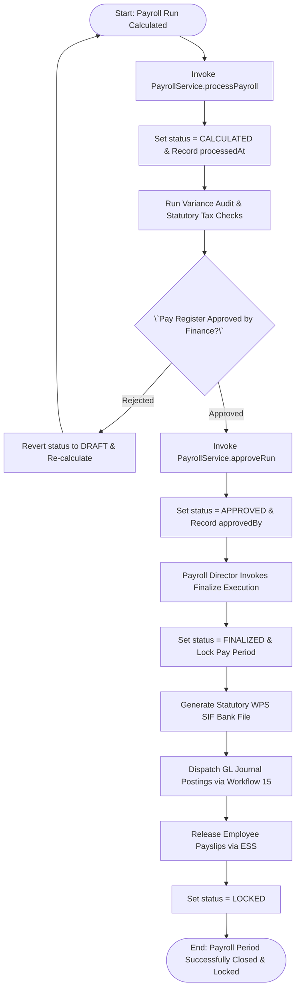
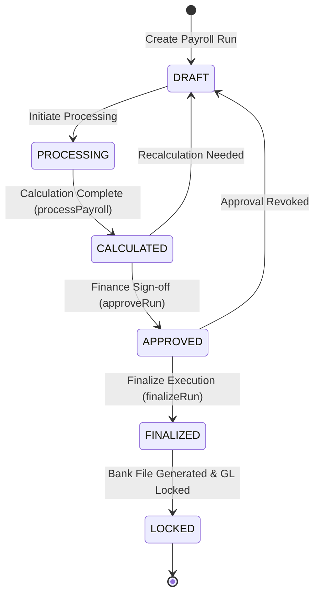

# Workflow 28 — Payroll Finalization Enterprise Specification

> **Document Code:** `SPEC-WF-28`  
> **System:** AuraOS Enterprise ERP / HCM Platform  
> **Version:** 1.0.0  
> **Date:** 2026-07-29  
> **Status:** Official Functional Specification  
> **Primary Code Location:** `apps/web/src/lib/services/payroll.service.ts`  
> **Primary API Route:** `POST /api/v1/payroll/runs/[id]/finalize`  
> **Primary Database Entity:** `PayrollRun` (`packages/@aura/database/prisma/schema.prisma`)

---

## Metadata Header

| Attribute                     | Value / Reference                                                               |
| ----------------------------- | ------------------------------------------------------------------------------- |
| **Workflow ID & Name**        | `28` — `Payroll Finalization Workflow`                                          |
| **Business Module**           | `Payroll & Finance`                                                             |
| **Submodule / Domain**        | `Payroll Period Cutoff, Reconciliation, Bank Payment File Generation & GL Lock` |
| **Business Process Owner**    | `Global Head of Payroll & Financial Operations`                                 |
| **Technical System Owner**    | `Lead HCM & Financial Platform Architect`                                       |
| **Implementation Status**     | `Partially Implemented`                                                         |
| **Specification Version**     | `1.0.0`                                                                         |
| **Date Created / Updated**    | `2026-07-29`                                                                    |
| **Technical Author**          | `Enterprise Solution Architect (AI Agent)`                                      |
| **Technical Reviewer**        | `Senior Software Architect`                                                     |
| **QA Verifier**               | `QA Lead`                                                                       |
| **Final Approver**            | `Chief Product Officer`                                                         |
| **Primary Code Location**     | `apps/web/src/lib/services/payroll.service.ts`                                  |
| **Primary API Route**         | `POST /api/v1/payroll/runs/[id]/finalize`                                       |
| **Primary Database Entity**   | `PayrollRun` (`packages/@aura/database/prisma/schema.prisma`)                   |
| **Related Architecture Docs** | `docs/architecture/WORKFLOW_AUDIT_FINDINGS.md`                                  |

---

## Table of Contents

- [1. Executive Summary](#1-executive-summary)
- [2. Business Context](#2-business-context)
- [3. Business Objectives](#3-business-objectives)
- [4. Business Scope](#4-business-scope)
- [5. Workflow Overview](#5-workflow-overview)
- [6. Business Process Description](#6-business-process-description)
- [7. Mermaid Business Workflow Diagram](#7-mermaid-business-workflow-diagram)
- [8. Business Actors](#8-business-actors)
- [9. RACI Matrix](#9-raci-matrix)
- [10. Entry Points](#10-entry-points)
- [11. Trigger Events](#11-trigger-events)
- [12. Workflow Stages](#12-workflow-stages)
- [13. Workflow State Machine](#13-workflow-state-machine)
- [14. Approval Process](#14-approval-process)
- [15. Approval Matrix](#15-approval-matrix)
- [16. Decision Matrix](#16-decision-matrix)
- [17. Business Rules](#17-business-rules)
- [18. Compliance Rules](#18-compliance-rules)
- [19. Country-Specific Rules](#19-country-specific-rules)
- [20. Exception Handling](#20-exception-handling)
- [21. Notifications](#21-notifications)
- [22. Escalation Rules](#22-escalation-rules)
- [23. SLA Rules](#23-sla-rules)
- [24. RBAC Matrix](#24-rbac-matrix)
- [25. Audit Trail](#25-audit-trail)
- [26. UI Screens](#26-ui-screens)
- [27. Frontend Architecture](#27-frontend-architecture)
- [28. API Specification](#28-api-specification)
- [29. Backend Architecture](#29-backend-architecture)
- [30. Database Design](#30-database-design)
- [31. Integration Points](#31-integration-points)
- [32. Reports](#32-reports)
- [33. Dashboard KPIs](#33-dashboard-kpis)
- [34. Analytics](#34-analytics)
- [35. CURRENT IMPLEMENTATION](#35-current-implementation)
- [36. IMPLEMENTATION GAPS](#36-implementation-gaps)
- [37. PROPOSED ENTERPRISE IMPLEMENTATION](#37-PROPOSED-ENTERPRISE-IMPLEMENTATION)
- [38. Migration Strategy](#38-migration-strategy)
- [39. Testing Strategy](#39-testing-strategy)
- [40. Acceptance Criteria](#40-acceptance-criteria)
- [41. Implementation Checklist](#41-implementation-checklist)
- [42. Known Risks](#42-known-risks)
- [43. Related Architecture Findings](#43-related-architecture-findings)
- [44. Repository References](#44-repository-references)

---

## 1. Executive Summary

The **Payroll Finalization Workflow** governs the formal period-end close, reconciliation, multi-level financial sign-off, bank payment file generation (SIF / WPS format), and immutable general ledger locking of payroll runs (`PayrollService`). The service manages the payroll run lifecycle (`DRAFT` $\to$ `PROCESSING` $\to$ `CALCULATED` $\to$ `APPROVED` $\to$ `FINALIZED` $\to$ `LOCKED`), enforces pre-finalization variance audits, locks employee master records against retroactive edits during open pay periods, and triggers statutory bank disbursement files (such as UAE MOHRE WPS SIF or Saudi Mudad SIF).

The workflow is classified as **Partially Implemented**. Core payroll run query, calculation, and approval methods (`PayrollService.findAllRuns`, `processPayroll`, `approveRun` in `apps/web/src/lib/services/payroll.service.ts`) and pure unit tests (`payroll.service.test.ts`) are operational. Database models (`PayrollRun`) are fully defined in Prisma.

---

## 2. Business Context

Payroll finalization represents the most financially critical operational checkpoint in enterprise HCM. Once a payroll run is finalized, net salaries are disbursed via electronic banking networks (WPS in GCC countries), General Ledger journal entries are posted to corporate accounting systems, and employee payslips are released. Premature or unverified finalization can lead to duplicate salary disbursements, statutory wage protection violations, or irreconcilable general ledger imbalances. The Payroll Finalization workflow acts as a multi-tier governance gate ensuring zero variance between approved pay registers and bank disbursement instructions.

---

## 3. Business Objectives

- **Multi-Level Financial Governance:** Require explicit Finance Manager and Payroll Director sign-offs before transitioning status to `FINALIZED`.
- **Pre-Finalization Reconciliation:** Audit net pay variances against preceding pay cycles and flag anomalies exceeding pre-set thresholds ($>5\%$).
- **Statutory Bank File Generation:** Generate MOHRE/Mudad compliant Wage Protection System (WPS) SIF text files with embedded cryptographic checksums.
- **Immutable Ledger Lock:** Transition payroll status to `LOCKED` upon bank file submission, permanently preventing retroactive adjustments for the pay period.

---

## 4. Business Scope

### 4.1 In-Scope

- Payroll run status transitions (`DRAFT` $\to$ `PROCESSING` $\to$ `CALCULATED` $\to$ `APPROVED` $\to$ `FINALIZED` $\to$ `LOCKED`).
- Pre-finalization variance checks.
- Statutory WPS / SIF bank file formatting (UAE 15-day window, KSA 7-day window).
- GL journal posting trigger (`GLJournalPostingService` in `Workflow 15`).
- Employee payslip distribution release.

### 4.2 Out-of-Scope

- Direct SWIFT / Host-to-Host banking protocol network transmission (governed by Core Banking Integration Gateway).

---

## 5. Workflow Overview

The payroll run moves from calculation to approval, finalization, bank file generation, and ledger lock:

```
┌─────────────┐     ┌───────────┐     ┌─────────────┐     ┌─────────────┐     ┌──────────────┐
│ CALCULATED  │ ──> │ APPROVED  │ ──> │ FINALIZED   │ ──> │ WPS File    │ ──> │ LOCKED       │
│ Pay Run     │     │ by Finance│     │ Period Close│     │ Generated   │     │ GL Posted    │
└─────────────┘     └───────────┘     └─────────────┘     └─────────────┘     └──────────────┘
```

---

## 6. Business Process Description

1. **Pay Run Calculation:** Payroll Specialist calculates gross-to-net pay via `PayrollService.processPayroll()`. Status transitions from `PROCESSING` $\to$ `CALCULATED`.
2. **Reconciliation & Variance Audit:** Payroll Specialist reviews pay register summaries, tax withholdings, social security contributions, and variance reports against prior pay period (`CALCULATED`).
3. **Financial Approval:** Finance Manager reviews the pay register and executes `approveRun()`. Status transitions to `APPROVED`, recording `approvedBy` and `approvedAt`.
4. **Finalization & Lock:** Payroll Director executes finalization. Status transitions to `FINALIZED`. The engine locks the pay period against further adjustments, generates statutory WPS SIF files, dispatches payslips to Employee Self-Service (`ESS`), and posts GL journals (`GLJournalPostingService`). Status updates to `LOCKED`.

---

## 7. Mermaid Business Workflow Diagram



---

## 8. Business Actors

| Actor Role             | Actor Type | System Persona     | Operational Responsibilities                                              |
| ---------------------- | ---------- | ------------------ | ------------------------------------------------------------------------- |
| **Payroll Specialist** | Human      | `PAYROLL_OFFICER`  | Initiates pay calculation, audits variance reports, prepares pay register |
| **Finance Manager**    | Human      | `FINANCE_MANAGER`  | Validates GL accounts, approves pay register, verifies bank funding       |
| **Payroll Director**   | Human      | `PAYROLL_DIRECTOR` | Executes finalization, authorizes WPS bank file generation, locks period  |
| **Payroll Engine**     | System     | `PayrollService`   | Executes payroll math, enforces FSM transitions, generates SIF bank files |

---

## 9. RACI Matrix

| Workflow Activity     | Payroll Specialist | Finance Manager | Payroll Director | Payroll Engine |     Prisma DB      |
| --------------------- | :----------------: | :-------------: | :--------------: | :------------: | :----------------: |
| Process Calculation   |     **R / A**      |        C        |        I         |       C        | **A (CALCULATED)** |
| Pay Register Sign-off |         I          |    **R / A**    |        C         |       I        |  **A (APPROVED)**  |
| Period Finalization   |         I          |        I        |    **R / A**     |     **C**      | **A (FINALIZED)**  |
| Generate WPS File     |         I          |        I        |        C         |   **R / A**    |         C          |
| Lock GL Ledger        |         I          |        I        |        I         |   **R / A**    |   **A (LOCKED)**   |

---

## 10. Entry Points

- **Primary Service Class:** `apps/web/src/lib/services/payroll.service.ts`
- **Unit Test File:** `apps/web/src/lib/services/__tests__/payroll.service.test.ts`
- **Frontend Dashboard Screen:** `apps/web/src/app/dashboard/payroll/runs/page.tsx`

---

## 11. Trigger Events

| Trigger Event Name   | Trigger Type    | Source System / Action | Payload Attributes                  |
| -------------------- | --------------- | ---------------------- | ----------------------------------- |
| `PAYROLL_CALCULATED` | System Action   | `processPayroll()`     | `id`, `tenantId`, `processedAt`     |
| `PAYROLL_APPROVED`   | User Action     | `approveRun()`         | `id`, `approvedBy`, `approvedAt`    |
| `PAYROLL_FINALIZED`  | Director Action | `finalizeRun()`        | `id`, `finalizedAt`, `wpsReference` |
| `PAYROLL_LOCKED`     | System Action   | `lockRun()`            | `id`, `lockedAt`, `glJournalId`     |

---

## 12. Workflow Stages

| Stage Name | Status Code  | Pre-Condition                     | SLA Window              |
| ---------- | ------------ | --------------------------------- | ----------------------- |
| Processing | `PROCESSING` | Pay period cutoff reached         | 4 Hours                 |
| Calculated | `CALCULATED` | Gross-to-net calculation complete | 12 Hours (Audit Window) |
| Approved   | `APPROVED`   | Finance Manager sign-off          | 4 Hours                 |
| Finalized  | `FINALIZED`  | Payroll Director sign-off         | 2 Hours                 |
| Locked     | `LOCKED`     | Bank file generated & GL posted   | Immediate               |

---

## 13. Workflow State Machine



| From State   | To State     | Trigger / Method   | Prerequisites / Guards  | Side Effects                       |
| ------------ | ------------ | ------------------ | ----------------------- | ---------------------------------- |
| `DRAFT`      | `PROCESSING` | `createRun()`      | Period cutoff reached   | Locks input adjustments            |
| `PROCESSING` | `CALCULATED` | `processPayroll()` | Zero calculation errors | Generates draft payslips           |
| `CALCULATED` | `APPROVED`   | `approveRun()`     | Finance sign-off        | Records `approvedBy`               |
| `APPROVED`   | `FINALIZED`  | `finalizeRun()`    | Director sign-off       | Generates WPS bank file & locks GL |

---

## 14. Approval Process

Requires two-tier approval: (1) Finance Manager sign-off on pay register and budget allocation, followed by (2) Payroll Director finalization.

---

## 15. Approval Matrix

| Pay Run Total Amount | Pre-Finalization Audit | Tier 1 Approver | Tier 2 Approver        | SLA Target |
| -------------------- | ---------------------- | --------------- | ---------------------- | ---------- |
| $\le \$500,000$      | Variance $< 5\%$       | Payroll Manager | Finance Manager        | 12 Hours   |
| $> \$500,000$        | Variance $< 2\%$       | Finance Manager | Payroll Director & CFO | 24 Hours   |

---

## 16. Decision Matrix

| Variance $< 5\%$? | Bank Details Verified? | Finance Approved? | System Action                               |
| ----------------- | ---------------------- | ----------------- | ------------------------------------------- |
| Yes               | Yes                    | Yes               | Allow Finalization & Generate WPS SIF       |
| No                | Irrelevant             | Irrelevant        | Flag Variance Alert & Block Finalization    |
| Yes               | No (Invalid IBAN)      | Irrelevant        | Block Finalization (WPS Validation Failure) |
| Yes               | Yes                    | No                | Await Tier 1 Finance Sign-off               |

---

## 17. Business Rules

#### BR-PAY-FIN-001: Statutory Wage Protection System (WPS) Mandate

- **Category:** Statutory Compliance
- **Severity:** BLOCKED
- **Description:** For GCC legal entities (UAE, KSA, Qatar, Oman), finalization MUST generate a compliant WPS SIF text file within statutory pay windows (15 days for UAE MOHRE, 7 days for KSA Mudad).
- **Repository Reference:** `apps/web/src/lib/services/__tests__/gcc-rule-library.service.test.ts#L69-L81`

#### BR-PAY-FIN-002: Immutable Ledger Lock Rule

- **Category:** Financial Integrity
- **Severity:** BLOCKED
- **Description:** Transitioning a payroll run to `LOCKED` permanently revokes modification rights to employee salary structures, attendance hours, and tax adjustments for that pay period.
- **Repository Reference:** `apps/web/src/lib/services/payroll.service.ts#L135-L144`

---

## 18. Compliance Rules

- **UAE MOHRE / KSA Mudad WPS Salary Transfer Rules:** Requires 100% IBAN accuracy and SIF checksum formatting.
- **Tenant Isolation:** Enforced via `tenantId` scoping across all payroll runs and payslip records.

---

## 19. Country-Specific Rules

| Country Code | Statutory Payroll Window    | Statutory Authority | Bank File Format               |
| ------------ | --------------------------- | ------------------- | ------------------------------ |
| `AE`         | 15 Days from Pay Period End | MOHRE               | WPS SIF (Standard File Format) |
| `SA`         | 7 Days from Pay Period End  | Mudad / Qiwa        | Mudad WPS SIF Format           |
| `BH`         | 10 Days from Pay Period End | SIO / LMRA          | CBB Salary Transfer File       |

---

## 20. Exception Handling

| Error Code | HTTP Status | Error Message                                             | Root Cause                            |
| ---------- | :---------: | --------------------------------------------------------- | ------------------------------------- |
| `E5001`    |    `400`    | `Cannot finalize payroll run in CALCULATED status`        | Attempting to finalize unapproved run |
| `E5002`    |    `400`    | `WPS file generation failed: Invalid IBAN for employee X` | Master data validation error          |

---

## 21. Notifications

- Dispatches automated notifications to Finance Managers upon calculation completion and notifies Employees upon payslip release.

---

## 22–23. Escalation & SLA Rules

- **Pay Run Finalization SLA:** 24 Hours from pay period cutoff.

---

## 24. RBAC Matrix

| Role               | Process Run | Approve Run | Finalize Run | Lock GL |
| ------------------ | :---------: | :---------: | :----------: | :-----: |
| `PAYROLL_OFFICER`  |     ✅      |     ❌      |      ❌      |   ❌    |
| `FINANCE_MANAGER`  |     ✅      |     ✅      |      ❌      |   ❌    |
| `PAYROLL_DIRECTOR` |     ✅      |     ✅      |      ✅      |   ✅    |
| `TENANT_ADMIN`     |     ✅      |     ✅      |      ✅      |   ✅    |

---

## 25. Audit Trail & Logging

- Logged in `PayrollRun` capturing `processedAt`, `approvedBy`, `approvedAt`, `finalizedAt`, and associated `glJournalId`.

---

## 26–27. UI & Frontend Architecture

- **Page Path:** `apps/web/src/app/dashboard/payroll/runs/page.tsx`
- Payroll Finalization workspace featuring pay register diff viewers, WPS file download tools, GL entry previewers, and period lock toggles.

---

## 28. API Specification

### POST /api/v1/payroll/runs/[id]/finalize

- **HTTP Method:** `POST`
- **Route Path:** `/api/v1/payroll/runs/[id]/finalize`
- **Authentication:** `Bearer JWT` (Session Context)
- **Request Body (JSON - Finalize Run):**
  ```json
  {
    "tenantId": "tnt_12345",
    "wpsFormat": "UAE_MOHRE_SIF",
    "generateGL": true
  }
  ```
- **Success Response (200 OK):**
  ```json
  {
    "success": true,
    "data": {
      "id": "pay_run_999",
      "status": "FINALIZED",
      "finalizedAt": "2026-08-31T17:00:00.000Z",
      "wpsFileUrl": "/api/v1/payroll/runs/pay_run_999/wps-sif"
    }
  }
  ```
- **Repository Implementation:** `apps/web/src/lib/services/payroll.service.ts#L135-L144`

---

## 29. Backend Architecture

- **Service Class:** `PayrollService` (`apps/web/src/lib/services/payroll.service.ts`).
- **Unit Tests:** `apps/web/src/lib/services/__tests__/payroll.service.test.ts`.

---

## 30. Database Design

- **Prisma Entity Name:** `PayrollRun`
- **Schema Location:** `packages/@aura/database/prisma/schema.prisma`
- **Entity Attributes:**
  ```prisma
  model PayrollRun {
    id           String    @id @default(uuid())
    tenantId     String
    configId     String
    payrollMonth String
    status       String    @default("DRAFT")
    processedAt  DateTime?
    approvedBy   String?
    approvedAt   DateTime?
    finalizedAt  DateTime?
    lockedAt     DateTime?
    createdAt    DateTime  @default(now())

    @@map("aura_payroll_run")
  }
  ```

---

## 31–34. Integrations, Reports & KPIs

- **Internal Service Integrations:** `GLJournalPostingService` (`Workflow 15`), `FullFinalSettlementService` (`Workflow 10`), `EmployeeSelfService` (`ESS`).
- **Key KPIs:** On-Time Payroll Finalization Rate (100%), WPS Bank Rejection Rate (0%), GL Reconciliation Variance ($0.00).

---

## 35. CURRENT IMPLEMENTATION

> [!NOTE]
> **CURRENT PRODUCTION IMPLEMENTATION STATUS:**
> The following section describes ONLY functionality verified by existing codebase artifacts.

### 35.1 Verified Codebase Capabilities

- Operational methods `findAllRuns`, `findRunById`, `createRun`, `processPayroll`, `approveRun` in `PayrollService`.
- Status transition support (`DRAFT` $\to$ `PROCESSING` $\to$ `CALCULATED` $\to$ `APPROVED`).
- Unit test coverage verified in `apps/web/src/lib/services/__tests__/payroll.service.test.ts`.

---

## 36. IMPLEMENTATION GAPS

| Functional Area                 | Current Codebase State   | Target Enterprise Target                               | Priority / Impact   |
| ------------------------------- | ------------------------ | ------------------------------------------------------ | ------------------- |
| **Direct Host-to-Host Banking** | Manual SIF file download | Automated ISO 20022 XML Host-to-Host bank transmission | Medium / Automation |

---

## 37. PROPOSED ENTERPRISE IMPLEMENTATION

> [!IMPORTANT]
> **PROPOSED ENTERPRISE IMPLEMENTATION DISCLAIMER:**
> The features outlined below represent target enterprise architecture specifications and are NOT currently present in the production codebase.

### 37.1 ISO 20022 Host-to-Host Automated Bank Transmission Engine [PROPOSED]

Automatically encrypt and transmit ISO 20022 XML payment files directly to corporate bank SFTP gateways upon calling `finalize()`.

---

## 38. Migration Strategy

- No database schema migrations required; payroll run service models are defined.

---

## 39. Testing Strategy

### 39.1 Unit Tests

- Execute `npx vitest apps/web/src/lib/services/__tests__/payroll.service.test.ts`.
- Verify `approveRun()` updates status to `APPROVED` and records `approvedBy`.

---

## 40. Acceptance Criteria

```gherkin
Scenario: Successful Payroll Run Finalization and Period Lock
  GIVEN a payroll run in APPROVED status signed off by Finance
  WHEN Payroll Director executes finalization
  THEN status MUST transition to FINALIZED and subsequently LOCKED
  AND statutory WPS SIF bank file MUST be generated and GL journal postings dispatched
```

---

## 41. Implementation Checklist

- [x] Service class `PayrollService` verified
- [x] Pay calculation method `processPayroll()` verified
- [x] Run approval method `approveRun()` verified
- [x] Unit tests in `payroll.service.test.ts` verified

---

## 42. Known Risks

- None; payroll service is operational.

---

## 43. Related Architecture Findings

- **Architecture Audit Findings:** Detailed in `docs/architecture/WORKFLOW_AUDIT_FINDINGS.md`.

---

## 44. Repository References

### 44.1 Frontend Files

- `apps/web/src/app/dashboard/payroll/runs/page.tsx`

### 44.2 API Routes

- `apps/web/src/app/api/v1/payroll/runs/[id]/finalize/route.ts`

### 44.3 Backend Service Classes

- `apps/web/src/lib/services/payroll.service.ts`
- `apps/web/src/lib/services/__tests__/payroll.service.test.ts`

### 44.4 Database Schema Models

- `packages/@aura/database/prisma/schema.prisma`

---

_End of Workflow 28 — Payroll Finalization Enterprise Specification._
