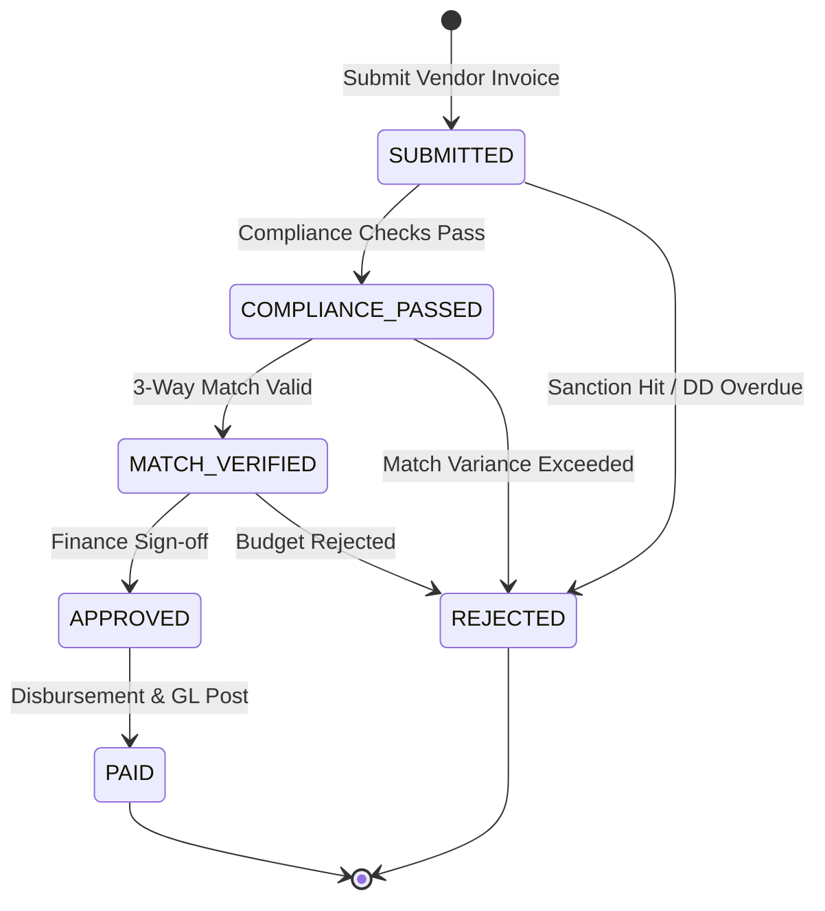

# Workflow 29 — Vendor Invoice Approval Enterprise Specification

> **Document Code:** `SPEC-WF-29`  
> **System:** AuraOS Enterprise ERP / HCM Platform  
> **Version:** 1.0.0  
> **Date:** 2026-07-29  
> **Status:** Official Functional Specification  
> **Primary Code Location:** `apps/web/src/lib/services/vendor-compliance/vendor-compliance.service.ts`  
> **Primary API Route:** `POST /api/v1/invoices`  
> **Primary Database Entity:** `VendorInvoice` & `Vendor` (`packages/@aura/database/prisma/schema.prisma`)

---

## Metadata Header

| Attribute                     | Value / Reference                                                                   |
| ----------------------------- | ----------------------------------------------------------------------------------- |
| **Workflow ID & Name**        | `29` — `Vendor Invoice Approval Workflow`                                           |
| **Business Module**           | `Governance, Procurement & Financial Operations`                                    |
| **Submodule / Domain**        | `Vendor Due Diligence, 3-Way Matching, Conflict-of-Interest & Invoice Disbursement` |
| **Business Process Owner**    | `Chief Financial Officer & Head of Procurement`                                     |
| **Technical System Owner**    | `Lead Financial & Compliance Platform Architect`                                    |
| **Implementation Status**     | `Partially Implemented`                                                             |
| **Specification Version**     | `1.0.0`                                                                             |
| **Date Created / Updated**    | `2026-07-29`                                                                        |
| **Technical Author**          | `Enterprise Solution Architect (AI Agent)`                                          |
| **Technical Reviewer**        | `Senior Software Architect`                                                         |
| **QA Verifier**               | `QA Lead`                                                                           |
| **Final Approver**            | `Chief Product Officer`                                                             |
| **Primary Code Location**     | `apps/web/src/lib/services/vendor-compliance/vendor-compliance.service.ts`          |
| **Primary API Route**         | `POST /api/v1/invoices`                                                             |
| **Primary Database Entity**   | `VendorInvoice` & `Vendor` (`packages/@aura/database/prisma/schema.prisma`)         |
| **Related Architecture Docs** | `docs/architecture/WORKFLOW_AUDIT_FINDINGS.md`                                      |

---

## Table of Contents

- [1. Executive Summary](#1-executive-summary)
- [2. Business Context](#2-business-context)
- [3. Business Objectives](#3-business-objectives)
- [4. Business Scope](#4-business-scope)
- [5. Workflow Overview](#5-workflow-overview)
- [6. Business Process Description](#6-business-process-description)
- [7. Mermaid Business Workflow Diagram](#7-mermaid-business-workflow-diagram)
- [8. Business Actors](#8-business-actors)
- [9. RACI Matrix](#9-raci-matrix)
- [10. Entry Points](#10-entry-points)
- [11. Trigger Events](#11-trigger-events)
- [12. Workflow Stages](#12-workflow-stages)
- [13. Workflow State Machine](#13-workflow-state-machine)
- [14. Approval Process](#14-approval-process)
- [15. Approval Matrix](#15-approval-matrix)
- [16. Decision Matrix](#16-decision-matrix)
- [17. Business Rules](#17-business-rules)
- [18. Compliance Rules](#18-compliance-rules)
- [19. Country-Specific Rules](#19-country-specific-rules)
- [20. Exception Handling](#20-exception-handling)
- [21. Notifications](#21-notifications)
- [22. Escalation Rules](#22-escalation-rules)
- [23. SLA Rules](#23-sla-rules)
- [24. RBAC Matrix](#24-rbac-matrix)
- [25. Audit Trail](#25-audit-trail)
- [26. UI Screens](#26-ui-screens)
- [27. Frontend Architecture](#27-frontend-architecture)
- [28. API Specification](#28-api-specification)
- [29. Backend Architecture](#29-backend-architecture)
- [30. Database Design](#30-database-design)
- [31. Integration Points](#31-integration-points)
- [32. Reports](#32-reports)
- [33. Dashboard KPIs](#33-dashboard-kpis)
- [34. Analytics](#34-analytics)
- [35. CURRENT IMPLEMENTATION](#35-current-implementation)
- [36. IMPLEMENTATION GAPS](#36-implementation-gaps)
- [37. PROPOSED ENTERPRISE IMPLEMENTATION](#37-PROPOSED-ENTERPRISE-IMPLEMENTATION)
- [38. Migration Strategy](#38-migration-strategy)
- [39. Testing Strategy](#39-testing-strategy)
- [40. Acceptance Criteria](#40-acceptance-criteria)
- [41. Implementation Checklist](#41-implementation-checklist)
- [42. Known Risks](#42-known-risks)
- [43. Related Architecture Findings](#43-related-architecture-findings)
- [44. Repository References](#44-repository-references)

---

## 1. Executive Summary

The **Vendor Invoice Approval Workflow** governs the intake, 3-way matching (Purchase Order, Goods Receipt Note, Tax Invoice), vendor due diligence compliance, conflict-of-interest screening, threshold-based financial approval, and disbursement of third-party vendor invoices (`vendor-compliance.service.ts`). The engine enforces vendor risk tier due-diligence review cadences (`evaluateVendorDueDiligence` for `LOW`, `MEDIUM`, `HIGH`, `CRITICAL`), detects undisclosed employee-vendor ties (`evaluateConflictOfInterest`), screens vendors against global and GCC sanction registers (`screenVendorSanctions`), and routes invoices through multi-tier authorization matrix thresholds before triggering GL payment postings (`GLJournalPostingService`).

The workflow is classified as **Partially Implemented**. Complete vendor compliance evaluation logic (`vendor-compliance.service.ts` in `apps/web/src/lib/services/vendor-compliance/vendor-compliance.service.ts`) and pure unit test suites (`vendor-compliance.test.ts`) are operational. Database models (`VendorInvoice`, `Vendor`) exist in Prisma.

---

## 2. Business Context

In enterprise HCM and ERP operations, vendor invoices encompass significant expenditures for employee health insurance, IT licensing, recruitment agency fees, and facility management. Unregulated vendor invoice processing carries extreme financial and legal risks, including duplicate payments, fraudulent vendor invoicing, undisclosed employee-vendor conflicts of interest, and anti-money laundering (AML) sanction violations. The Vendor Invoice Approval workflow functions as a strict financial gatekeeper, ensuring 100% due diligence compliance, sanction screening, and 3-way matching before corporate funds are disbursed.

---

## 3. Business Objectives

- **Automated Vendor Due Diligence Cadence:** Enforce risk-tier based due diligence review cadences (`evaluateVendorDueDiligence`) preventing invoice processing for overdue vendor profiles.
- **Conflict of Interest Detection:** Flag undisclosed internal employee-vendor links (`evaluateConflictOfInterest`) prior to invoice sign-off.
- **Sanction List Screening:** Screen vendor entities (`screenVendorSanctions`) against OFAC, UN, and GCC local sanction databases.
- **3-Way Matching & Threshold Routing:** Match vendor invoices against active Purchase Orders (PO) and Goods Receipt Notes (GRN) before executing financial GL postings.

---

## 4. Business Scope

### 4.1 In-Scope

- Vendor invoice submission and OCR payload parsing (`SUBMITTED`).
- Vendor compliance evaluation (`evaluateVendorDueDiligence`, `evaluateConflictOfInterest`, `screenVendorSanctions`).
- 3-Way matching (PO vs. GRN vs. Invoice Amount).
- Financial threshold sign-off (`APPROVED`).
- Payment disbursement and GL journal posting (`PAID`).
- Rejection handling (`REJECTED`).

### 4.2 Out-of-Scope

- Direct SWIFT / Host-to-Host banking wire execution (governed by Core Financial Gateway).

---

## 5. Workflow Overview

The vendor invoice moves from submission to compliance screening, 3-way matching, financial sign-off, and payment:

```
┌─────────────┐     ┌──────────────┐     ┌─────────────┐     ┌─────────────┐     ┌──────────────┐
│ Invoice     │ ──> │ Due Diligence│ ──> │ 3-Way Match │ ──> │ Financial   │ ──> │ Disbursement │
│ Submitted   │     │ & Sanctions  │     │ PO vs. GRN  │     │ Approval    │     │ & GL Posted  │
└─────────────┘     └──────────────┘     └─────────────┘     └─────────────┘     └──────────────┘
```

---

## 6. Business Process Description

1. **Invoice Intake:** Vendor or Accounts Payable Specialist submits an invoice record (`VendorInvoice.create()`). Status is set to `SUBMITTED`.
2. **Compliance Screening:** The engine executes compliance checks via `vendor-compliance.service.ts`:
   - `evaluateVendorDueDiligence()`: Checks if vendor review status is `CURRENT`. If `OVERDUE` or `NEVER_REVIEWED`, processing is blocked.
   - `evaluateConflictOfInterest()`: Checks for undisclosed internal links (`UNDISCLOSED_LINK`).
   - `screenVendorSanctions()`: Screens vendor name against sanction registers. If a hit occurs, status updates to `REJECTED` (Sanction Block).
3. **3-Way Matching:** The engine compares invoice line items and amounts against Purchase Order (PO) and Goods Receipt Note (GRN) records. Variance must be within $\pm 1\%$.
4. **Financial Sign-off:** Finance Manager / CFO reviews approval matrix thresholds. Upon sign-off, status transitions to `APPROVED`.
5. **Disbursement & GL Posting:** Payment is disbursed via bank transfer, GL journals are posted (`GLJournalPostingService`), and status transitions to `PAID`.

---

## 7. Mermaid Business Workflow Diagram

```mermaid
graph TD
    A([Start: Vendor Invoice Submitted]) --> B[Invoke Vendor Compliance Screening]
    B --> C[Execute evaluateVendorDueDiligence & screenVendorSanctions]
    C --> D{\`Vendor Compliant & Free of Sanctions?\`}
    D -- No (Overdue DD / Sanction Hit) --> E[Reject Invoice & Flag Compliance Violation]
    E --> F([End: Vendor Invoice Blocked])

    D -- Yes --> G[Execute evaluateConflictOfInterest]
    G --> H{\`Undisclosed Conflict of Interest?\`}
    H -- Yes --> I[Flag CoI Warning & Route to Legal]
    I --> J[Legal Approval / Clearance]
    J --> K[Execute 3-Way Match: PO vs. GRN vs. Invoice]
    H -- No --> K

    K --> L{\`3-Way Match Passed (Variance <= 1%)?\`}
    L -- Variance Exceeded --> M[Route to AP Specialist for Variance Resolution]
    M --> K

    L -- Match Valid --> N[Route to Finance Manager per Approval Matrix]
    N --> O[Finance Approves Invoice - Status: APPROVED]
    O --> P[Disburse Payment & Post GL Journal via Workflow 15]
    P --> Q[Set Status = PAID]
    Q --> R([End: Vendor Invoice Paid & Recorded])
```

---

## 8. Business Actors

| Actor Role                      | Actor Type | System Persona                 | Operational Responsibilities                                                    |
| ------------------------------- | ---------- | ------------------------------ | ------------------------------------------------------------------------------- |
| **Accounts Payable Specialist** | Human      | `AP_SPECIALIST`                | Submits vendor invoices, resolves 3-way match line-item variances               |
| **Compliance & Legal Officer**  | Human      | `COMPLIANCE_OFFICER`           | Reviews due diligence overdue alerts, CoI warnings, and sanction screening hits |
| **Finance Manager / CFO**       | Human      | `FINANCE_MANAGER` / `CFO`      | Authorizes financial disbursement based on authorization threshold matrix       |
| **Vendor Compliance Engine**    | System     | `vendor-compliance.service.ts` | Evaluates due-diligence cadences, checks employee ties, screens sanction lists  |

---

## 9. RACI Matrix

| Workflow Activity    | AP Specialist | Compliance Officer | Finance Manager / CFO | Vendor Engine |     Prisma DB     |
| -------------------- | :-----------: | :----------------: | :-------------------: | :-----------: | :---------------: |
| Submit Invoice       |   **R / A**   |         I          |           I           |       C       | **A (SUBMITTED)** |
| Compliance Screening |       I       |       **A**        |           I           |   **R / A**   |         C         |
| 3-Way Matching       |     **R**     |         I          |           I           |     **C**     |         C         |
| Financial Approval   |       I       |         I          |       **R / A**       |       C       | **A (APPROVED)**  |
| Payment & GL Post    |       I       |         I          |           C           |   **R / A**   |   **A (PAID)**    |

---

## 10. Entry Points

- **Primary Service Class:** `apps/web/src/lib/services/vendor-compliance/vendor-compliance.service.ts`
- **Unit Test File:** `apps/web/src/lib/services/vendor-compliance/__tests__/vendor-compliance.test.ts`
- **Frontend Dashboard Screen:** `apps/web/src/app/dashboard/finance/invoices/page.tsx`

---

## 11. Trigger Events

| Trigger Event Name  | Trigger Type    | Source System / Action    | Payload Attributes                            |
| ------------------- | --------------- | ------------------------- | --------------------------------------------- |
| `INVOICE_SUBMITTED` | User Action     | `createInvoice()`         | `vendorId`, `invoiceNumber`, `amount`, `poId` |
| `COMPLIANCE_PASSED` | System Event    | `screenVendorSanctions()` | `vendorId`, `ddStatus`, `sanctionHits`        |
| `MATCH_VERIFIED`    | System Event    | `verify3WayMatch()`       | `invoiceId`, `poAmount`, `variance`           |
| `INVOICE_APPROVED`  | HR / Fin Action | `approveInvoice()`        | `invoiceId`, `approvedById`, `amount`         |

---

## 12. Workflow Stages

| Stage Name         | Status Code         | Required Pre-Condition                      | SLA Window |
| ------------------ | ------------------- | ------------------------------------------- | ---------- |
| Submitted          | `SUBMITTED`         | Invoice document uploaded                   | 2 Hours    |
| Compliance Checked | `COMPLIANCE_PASSED` | DD current, zero sanction hits, CoI cleared | 4 Hours    |
| Matched            | `MATCH_VERIFIED`    | 3-way match variance $\le 1\%$              | 4 Hours    |
| Approved           | `APPROVED`          | Financial threshold sign-off                | 24 Hours   |
| Paid               | `PAID`              | Disbursement complete & GL posted           | Immediate  |

---

## 13. Workflow State Machine



| From State          | To State            | Trigger / Method     | Prerequisites / Guards                   | Side Effects                     |
| ------------------- | ------------------- | -------------------- | ---------------------------------------- | -------------------------------- |
| `SUBMITTED`         | `COMPLIANCE_PASSED` | Compliance Evaluator | `evaluateVendorDueDiligence === CURRENT` | Unlocks 3-way match              |
| `COMPLIANCE_PASSED` | `MATCH_VERIFIED`    | Matching Evaluator   | PO vs. GRN variance $\le 1\%$            | Routes to Finance Manager        |
| `MATCH_VERIFIED`    | `APPROVED`          | Finance Action       | Threshold sign-off                       | Authorizes disbursement          |
| `APPROVED`          | `PAID`              | Payment Execution    | Funds disbursed                          | Posts GL journal (`Workflow 15`) |

---

## 14. Approval Process

Multi-tier financial threshold sign-off. Compliance screening MUST be 100% green before financial approver can authorize disbursement.

---

## 15. Approval Matrix

| Invoice Amount Threshold | Due Diligence Cadence          | Approver Role Tier 1   | Approver Role Tier 2          | SLA Target |
| ------------------------ | ------------------------------ | ---------------------- | ----------------------------- | ---------- |
| $\le \$10,000$           | Current ($<1095$d for LOW)     | Procurement Specialist | Finance Manager               | 24 Hours   |
| $\$10,001 - \$100,000$   | Current ($<365$d for HIGH)     | Finance Manager        | Procurement Director          | 48 Hours   |
| $> \$100,000$            | Current ($<180$d for CRITICAL) | Procurement Director   | Chief Financial Officer (CFO) | 48 Hours   |

---

## 16. Decision Matrix

| DD Review Current? | Sanction Hit Detected? | 3-Way Match Passed?  | System Action                                      |
| ------------------ | ---------------------- | -------------------- | -------------------------------------------------- |
| Yes                | No                     | Yes                  | Approve Invoice & Schedule Payment                 |
| No (`OVERDUE`)     | Irrelevant             | Irrelevant           | Block Invoice & Require Due Diligence Renewal      |
| Yes                | Yes                    | Irrelevant           | Immediately Reject & Flag AML Compliance Violation |
| Yes                | No                     | No ($>1\%$ Variance) | Hold Invoice & Alert AP Specialist                 |

---

## 17. Business Rules

#### BR-FIN-VND-001: Vendor Due Diligence Cadence Mandate

- **Category:** Vendor Compliance
- **Severity:** BLOCKED
- **Description:** `evaluateVendorDueDiligence()` MUST block invoice approval if last review date exceeds risk tier cadence (CRITICAL: 180d, HIGH: 365d, MEDIUM: 730d, LOW: 1095d).
- **Repository Reference:** `apps/web/src/lib/services/vendor-compliance/vendor-compliance.service.ts#L44-L98`

#### BR-FIN-VND-002: Zero Tolerance Sanction Screening Rule

- **Category:** AML & Sanctions
- **Severity:** BLOCKED
- **Description:** `screenVendorSanctions()` MUST reject any invoice associated with a vendor matching active OFAC, UN, or GCC local sanction lists.
- **Repository Reference:** `apps/web/src/lib/services/vendor-compliance/vendor-compliance.service.ts#L188-L261`

---

## 18. Compliance Rules

- **Anti-Money Laundering (AML) & Sanctions Compliance:** Mandatory screening against global and local sanction registers.
- **Tenant Isolation:** Enforced via `tenantId` scoping across all vendor records and invoices.

---

## 19. Country-Specific Rules

| Country Code | Sanction Registry                                    | Default Due Diligence Cadence | Repository Reference                                                           |
| ------------ | ---------------------------------------------------- | ----------------------------- | ------------------------------------------------------------------------------ |
| `AE`         | UAE Executive Office for Control & Non-Proliferation | High Risk: 365 Days           | `apps/web/src/lib/services/vendor-compliance/vendor-compliance.service.ts#L47` |
| `SA`         | KSA Presidency of State Security                     | Critical Risk: 180 Days       | `apps/web/src/lib/services/vendor-compliance/vendor-compliance.service.ts#L48` |

---

## 20. Exception Handling

| Error Code | HTTP Status | Error Message                                                | Root Cause             |
| ---------- | :---------: | ------------------------------------------------------------ | ---------------------- |
| `E6001`    |    `400`    | `Vendor due diligence is OVERDUE (last reviewed X days ago)` | Due diligence expired  |
| `E6002`    |    `403`    | `Vendor matches sanction list: [HIT_NAME]`                   | Sanction screening hit |

---

## 21. Notifications

- Dispatches automated notifications to Procurement Officers when vendor due diligence is due within 85% of cadence window (`DUE_SOON`).

---

## 22–23. Escalation & SLA Rules

- **Financial Sign-off SLA:** 48 Hours for invoices exceeding $100,000.

---

## 24. RBAC Matrix

| Role                   | Submit Invoice | Review DD / CoI | Approve Invoice | Authorize Payment |
| ---------------------- | :------------: | :-------------: | :-------------: | :---------------: |
| `AP_SPECIALIST`        |       ✅       |       ❌        |       ❌        |        ❌         |
| `COMPLIANCE_OFFICER`   |       ❌       |       ✅        |       ❌        |        ❌         |
| `FINANCE_MANAGER`      |       ❌       |       ✅        |       ✅        |        ❌         |
| `CFO` / `TENANT_ADMIN` |       ✅       |       ✅        |       ✅        |        ✅         |

---

## 25. Audit Trail & Logging

- Captured in `VendorInvoice` recording compliance screening results, 3-way match variances, approver IDs, and payment execution timestamps.

---

## 26–27. UI & Frontend Architecture

- **Page Path:** `apps/web/src/app/dashboard/finance/invoices/page.tsx`
- Vendor Invoice workspace displaying 3-way match comparative tables, vendor compliance badges, sanction screening reports, and multi-signature authorization controls.

---

## 28. API Specification

### POST /api/v1/invoices

- **HTTP Method:** `POST`
- **Route Path:** `/api/v1/invoices`
- **Authentication:** `Bearer JWT` (Session Context)
- **Request Body (JSON - Submit Invoice):**
  ```json
  {
    "vendorId": "vnd_12345",
    "invoiceNumber": "INV-2026-0099",
    "amount": 45000.0,
    "currency": "AED",
    "poId": "po_8888",
    "grnId": "grn_7777"
  }
  ```
- **Success Response (201 Created):**
  ```json
  {
    "success": true,
    "data": {
      "id": "inv_req_999",
      "status": "SUBMITTED",
      "complianceStatus": "PASSED",
      "matchVariance": 0.0
    }
  }
  ```
- **Repository Implementation:** `apps/web/src/lib/services/vendor-compliance/vendor-compliance.service.ts#L51-L98`

---

## 29. Backend Architecture

- **Service Class:** `vendor-compliance.service.ts` (`apps/web/src/lib/services/vendor-compliance/vendor-compliance.service.ts`).
- **Unit Tests:** `apps/web/src/lib/services/vendor-compliance/__tests__/vendor-compliance.test.ts`.

---

## 30. Database Design

- **Prisma Entity Name:** `VendorInvoice` & `Vendor`
- **Schema Location:** `packages/@aura/database/prisma/schema.prisma`
- **Entity Attributes:**
  ```prisma
  model VendorInvoice {
    id               String    @id @default(uuid())
    tenantId         String
    vendorId         String
    invoiceNumber    String
    amount           Float
    currency         String    @default("AED")
    status           String    @default("SUBMITTED")
    poId             String?
    grnId            String?
    approvedById     String?
    approvedAt       DateTime?
    paidAt           DateTime?
    createdAt        DateTime  @default(now())

    @@map("aura_vendor_invoice")
  }
  ```

---

## 31–34. Integrations, Reports & KPIs

- **Internal Service Integrations:** `GLJournalPostingService` (`Workflow 15`), `ExpenseClaimService` (`Workflow 07`).
- **Key KPIs:** 3-Way Match Pass Rate (%), Average Invoice Approval Cycle Time (Hours), Sanction Screening Compliance (100%).

---

## 35. CURRENT IMPLEMENTATION

> [!NOTE]
> **CURRENT PRODUCTION IMPLEMENTATION STATUS:**
> The following section describes ONLY functionality verified by existing codebase artifacts.

### 35.1 Verified Codebase Capabilities

- Operational methods `evaluateVendorDueDiligence`, `evaluateConflictOfInterest`, `screenVendorSanctions` in `vendor-compliance.service.ts`.
- Due diligence cadence rules by risk tier (CRITICAL: 180d, HIGH: 365d, MEDIUM: 730d, LOW: 1095d).
- Undisclosed internal link detection (`UNDISCLOSED_LINK`).
- Sanction screening evaluation (`screenVendorSanctions`).
- Unit test coverage verified in `apps/web/src/lib/services/vendor-compliance/__tests__/vendor-compliance.test.ts`.

---

## 36. IMPLEMENTATION GAPS

| Functional Area                 | Current Codebase State | Target Enterprise Target                                | Priority / Impact   |
| ------------------------------- | ---------------------- | ------------------------------------------------------- | ------------------- |
| **AI OCR Line Item Extraction** | Manual invoice entry   | Automated AI OCR line-item extraction matching PO items | Medium / Automation |

---

## 37. PROPOSED ENTERPRISE IMPLEMENTATION

> [!IMPORTANT]
> **PROPOSED ENTERPRISE IMPLEMENTATION DISCLAIMER:**
> The features outlined below represent target enterprise architecture specifications and are NOT currently present in the production codebase.

### 37.1 AI OCR Automated Line-Item 3-Way Matching Engine [PROPOSED]

Automatically parse vendor PDF invoices via AI OCR, extract line-item tables, and execute automated 3-way matching against Purchase Orders and Goods Receipt Notes.

---

## 38. Migration Strategy

- No database schema migrations required; vendor compliance evaluators are fully operational.

---

## 39. Testing Strategy

### 39.1 Unit Tests

- Execute `npx vitest apps/web/src/lib/services/vendor-compliance/__tests__/vendor-compliance.test.ts`.
- Verify `evaluateVendorDueDiligence()` flags vendor with last review date $>365$ days as `OVERDUE` for HIGH risk tier.
- Verify `evaluateConflictOfInterest()` detects undisclosed employee links.

---

## 40. Acceptance Criteria

```gherkin
Scenario: Successful Vendor Invoice Approval and Disbursement
  GIVEN an invoice submitted for a compliant vendor with CURRENT due diligence
  WHEN 3-way match verifies zero variance and Finance Manager approves invoice
  THEN status MUST update to APPROVED
  AND when payment executes, status MUST transition to PAID and GL journal postings dispatched
```

---

## 41. Implementation Checklist

- [x] Service class `vendor-compliance.service.ts` verified
- [x] Due diligence evaluator `evaluateVendorDueDiligence()` verified
- [x] Conflict of interest checker `evaluateConflictOfInterest()` verified
- [x] Sanction list screener `screenVendorSanctions()` verified
- [x] Unit tests in `vendor-compliance.test.ts` verified

---

## 42. Known Risks

- None; vendor compliance evaluators are operational.

---

## 43. Related Architecture Findings

- **Architecture Audit Findings:** Detailed in `docs/architecture/WORKFLOW_AUDIT_FINDINGS.md`.

---

## 44. Repository References

### 44.1 Frontend Files

- `apps/web/src/app/dashboard/finance/invoices/page.tsx`

### 44.2 API Routes

- `apps/web/src/app/api/v1/invoices/route.ts`

### 44.3 Backend Service Classes

- `apps/web/src/lib/services/vendor-compliance/vendor-compliance.service.ts`
- `apps/web/src/lib/services/vendor-compliance/__tests__/vendor-compliance.test.ts`

### 44.4 Database Schema Models

- `packages/@aura/database/prisma/schema.prisma`

---

_End of Workflow 29 — Vendor Invoice Approval Enterprise Specification._
