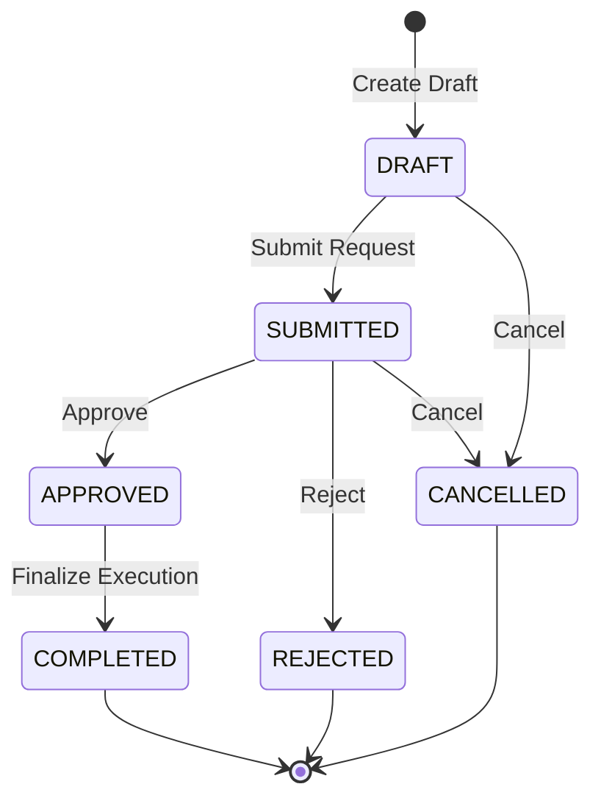

# AuraOS Enterprise Workflow Specification Blueprint

## Master Template & Instructional Blueprint for Workflow Documentation

> **Document Code:** `DOC-TMPL-001`  
> **System:** AuraOS Enterprise ERP / HCM Platform  
> **Version:** 1.0.0  
> **Date:** 2026-07-29  
> **Status:** Canonical Master Blueprint Template  
> **Usage Instruction:** Copy this template to `docs/workflows/[XX-workflow-slug]/README.md` and replace all instructional placeholders with verified system specifications. Do NOT modify section ordering or delete mandatory sections.

---

## Template Usage Guidelines & Instructions

### 1. Purpose & Ownership

This template is the official structural blueprint for all 29 workflow specifications in AuraOS. Every workflow document generated in Phase 2 MUST duplicate this template structure without exception.

### 2. Step-by-Step Workflow Generation Workflow

1. **Duplicate:** Create directory `docs/workflows/[XX-workflow-slug]/` (e.g., `docs/workflows/01-leave-request/`).
2. **Copy:** Copy `docs/workflows/TEMPLATE.md` to `docs/workflows/[XX-workflow-slug]/README.md`.
3. **Inspect Codebase:** Read audit notes in `docs/workflow/workflow_audit.md` and existing code (`apps/web/`, `services/`, `packages/@aura/database/prisma/schema.prisma`).
4. **Populate Specs:** Replace instructional placeholders with verified technical and business data.
5. **Separate Current vs. Proposed:**
   - **Fully Implemented:** Document under Section 35 (**CURRENT IMPLEMENTATION**).
   - **Partially Implemented:** Strictly bifurcate Section 35 (**CURRENT IMPLEMENTATION**) and Section 37 (**PROPOSED ENTERPRISE IMPLEMENTATION**).
6. **Verify Standards:** Ensure 100% relative repository paths (e.g., `apps/web/src/lib/services/leave.service.ts`) and zero prohibited words (`docs/workflows/WORKFLOW_STYLE_GUIDE.md`).
7. **Run QA Check:** Run `docs/workflows/WORKFLOW_REVIEW_CHECKLIST.md` quality gates.
8. **Update Tracking Matrix:** Update `docs/workflows/WORKFLOW_GENERATION_PLAN.md` matrix status to `✅ Complete`.

---

# [Workflow XX] — [Workflow Name] Enterprise Specification

## Metadata Header

| Attribute                     | Value / Reference                                                             |
| ----------------------------- | ----------------------------------------------------------------------------- |
| **Workflow ID & Name**        | `[XX]` — `[Workflow Name]` (e.g., `01` — `Leave Request Approval`)            |
| **Business Module**           | `[Module Name]` (e.g., `Leave & Time Management`)                             |
| **Submodule / Domain**        | `[Submodule]` (e.g., `Leave Balances & Policies`)                             |
| **Business Process Owner**    | `[Role Name]` (e.g., `HR Operations Director`)                                |
| **Technical System Owner**    | `[Role Name]` (e.g., `Lead Core HR Software Architect`)                       |
| **Implementation Status**     | `[Fully Implemented / Partially Implemented]`                                 |
| **Specification Version**     | `1.0.0`                                                                       |
| **Date Created / Updated**    | `2026-07-29`                                                                  |
| **Technical Author**          | `[Author Name / AI Agent]`                                                    |
| **Technical Reviewer**        | `[Reviewer Name]`                                                             |
| **QA Verifier**               | `[QA Lead Name]`                                                              |
| **Final Approver**            | `[Chief Product Officer / Enterprise Architect]`                              |
| **Primary Code Location**     | `[Primary Service Path]` (e.g., `apps/web/src/lib/services/leave.service.ts`) |
| **Primary API Route**         | `[Primary API Endpoint]` (e.g., `POST /api/v1/leave-requests`)                |
| **Primary Database Entity**   | `[Prisma Model Name]` (e.g., `LeaveRequest`)                                  |
| **Related Architecture Docs** | `docs/architecture/WORKFLOW_AUDIT_FINDINGS.md#finding-1`                      |

---

## Table of Contents

- [1. Executive Summary](#1-executive-summary)
- [2. Business Context](#2-business-context)
- [3. Business Objectives](#3-business-objectives)
- [4. Business Scope](#4-business-scope)
- [5. Workflow Overview](#5-workflow-overview)
- [6. Business Process Description](#6-business-process-description)
- [7. Mermaid Business Workflow Diagram](#7-mermaid-business-workflow-diagram)
- [8. Business Actors](#8-business-actors)
- [9. RACI Matrix](#9-raci-matrix)
- [10. Entry Points](#10-entry-points)
- [11. Trigger Events](#11-trigger-events)
- [12. Workflow Stages](#12-workflow-stages)
- [13. Workflow State Machine](#13-workflow-state-machine)
- [14. Approval Process](#14-approval-process)
- [15. Approval Matrix](#15-approval-matrix)
- [16. Decision Matrix](#16-decision-matrix)
- [17. Business Rules](#17-business-rules)
- [18. Compliance Rules](#18-compliance-rules)
- [19. Country-Specific Rules](#19-country-specific-rules)
- [20. Exception Handling](#20-exception-handling)
- [21. Notifications](#21-notifications)
- [22. Escalation Rules](#22-escalation-rules)
- [23. SLA Rules](#23-sla-rules)
- [24. RBAC Matrix](#24-rbac-matrix)
- [25. Audit Trail](#25-audit-trail)
- [26. UI Screens](#26-ui-screens)
- [27. Frontend Architecture](#27-frontend-architecture)
- [28. API Specification](#28-api-specification)
- [29. Backend Architecture](#29-backend-architecture)
- [30. Database Design](#30-database-design)
- [31. Integration Points](#31-integration-points)
- [32. Reports](#32-reports)
- [33. Dashboard KPIs](#33-dashboard-kpis)
- [34. Analytics](#34-analytics)
- [35. CURRENT IMPLEMENTATION](#35-current-implementation)
- [36. IMPLEMENTATION GAPS](#36-implementation-gaps)
- [37. PROPOSED ENTERPRISE IMPLEMENTATION](#37-proposed-enterprise-implementation)
- [38. Migration Strategy](#38-migration-strategy)
- [39. Testing Strategy](#39-testing-strategy)
- [40. Acceptance Criteria](#40-acceptance-criteria)
- [41. Implementation Checklist](#41-implementation-checklist)
- [42. Known Risks](#42-known-risks)
- [43. Related Architecture Findings](#43-related-architecture-findings)
- [44. Repository References](#44-repository-references)

---

## 1. Executive Summary

_[Instruction: Provide a concise 2 to 3 paragraph executive summary describing the workflow's core purpose, business value, user impact, and overall technical architecture.]_

---

## 2. Business Context

_[Instruction: Describe the organizational context, why this business workflow is required, regulatory drivers, and how it fits into the broader enterprise operations.]_

---

## 3. Business Objectives

*[Instruction: List specific, measurable business goals (e.g., reduce leave processing time by 80%, ensure 100% compliance with labor law notice periods).] *

---

## 4. Business Scope

### 4.1 In-Scope

- _[Item 1: E.g., Employee annual leave applications]_
- _[Item 2: E.g., Automatic leave balance deduction]_

### 4.2 Out-of-Scope

- _[Item 1: E.g., Travel expense claims associated with leave]_

---

## 5. Workflow Overview

_[Instruction: Provide a high-level summary of the end-to-end process from initial trigger to terminal status.]_

---

## 6. Business Process Description

_[Instruction: Detail the step-by-step business narrative covering creation, validation, routing, approval/rejection, and final execution.]_

---

## 7. Mermaid Business Workflow Diagram

```mermaid
graph TD
    A([Start: [Workflow Event Trigger]]) --> B[[[Validate Business Rules]]]
    B --> C{\`Rules Passed?\`}
    C -- No --> D[Set Status: REJECTED / Invalid]
    C -- Yes --> E[Set Status: PENDING / Await Approval]
    E --> F{\`Manager Decision?\`}
    F -- Approve --> G[Set Status: APPROVED]
    F -- Reject --> H[Set Status: REJECTED]
    G --> I([End: Execution Complete])
    H --> J([End: Request Closed])
    D --> J
```

---

## 8. Business Actors

| Actor Role        | Actor Type | System Persona  | Operational Responsibilities                               |
| ----------------- | ---------- | --------------- | ---------------------------------------------------------- |
| **Requestor**     | Human      | `EMPLOYEE`      | Submits initial request payload and justification          |
| **Approver**      | Human      | `LINE_MANAGER`  | Evaluates submission against operational requirements      |
| **System Worker** | System     | `BullMQ Worker` | Processes background state transitions and balance updates |

---

## 9. RACI Matrix

| Workflow Activity       | Requestor | Line Manager | HR Admin | Payroll Officer | System Worker |
| ----------------------- | :-------: | :----------: | :------: | :-------------: | :-----------: |
| Request Creation        | **R / A** |      I       |    I     |        I        |       C       |
| Business Rule Check     |     I     |      I       |    I     |        I        |   **R / A**   |
| Manager Decision        |     I     |  **R / A**   |    C     |        I        |       I       |
| Balance / Record Update |     I     |      I       |    I     |        I        |   **R / A**   |

---

## 10. Entry Points

- **Primary User API Endpoint:** `POST /api/v1/[workflow-route]`
- **Frontend Dashboard Screen:** `apps/web/src/app/dashboard/[module]/page.tsx`
- **System Event Trigger:** `[Event Name]` (e.g., `offer.accepted`)

---

## 11. Trigger Events

| Trigger Event Name | Trigger Type      | Source System / Action | Payload Attributes                 |
| ------------------ | ----------------- | ---------------------- | ---------------------------------- |
| `[EVENT_NAME]`     | User Action / API | `POST /api/v1/...`     | `tenantId`, `employeeId`, `amount` |

---

## 12. Workflow Stages

### 12.1 Stage 1: [Stage Name] ([STAGE_CODE])

- **Stage Code:** `[STAGE_CODE]` (e.g., `PRE_JOINING`)
- **Stage Owner Role:** `[Role]`
- **SLA Window:** `[Hours / Days]`
- **Escalation Role:** `[Role]`
- **Entry Criteria:** `[Pre-requisite conditions]`
- **Exit Criteria:** `[Completion criteria]`
- **Validation Guard:** `[Zod schema / business rule check]`
- **Status Value:** `[STATUS_CODE]`
- **Repository Implementation:** `apps/web/src/lib/services/[service-name].ts#L[Line-Range]`

---

## 13. Workflow State Machine



| From State  | To State    | Trigger / Method | Prerequisites / Guards        | Side Effects                           |
| ----------- | ----------- | ---------------- | ----------------------------- | -------------------------------------- |
| `DRAFT`     | `SUBMITTED` | `submit()`       | Zod validation passes         | Sets `submittedAt`; fires notification |
| `SUBMITTED` | `APPROVED`  | `approve()`      | User has `approve` permission | Updates status; deducts balance/record |

---

## 14. Approval Process

*[Instruction: Describe the explicit approval logic pattern (Maker-Checker, Sequential, Parallel, Threshold-based).] *

---

## 15. Approval Matrix

| Approval Level | Approver Role | Condition / Threshold    | SLA Window | Escalation Role |
| -------------- | ------------- | ------------------------ | ---------- | --------------- |
| Level 1        | Line Manager  | Standard submission      | 48 Hours   | HR Manager      |
| Level 2        | HR Director   | Financial limit > $5,000 | 72 Hours   | CPO             |

---

## 16. Decision Matrix

| Condition / Criterion     | Decision Outcome    | Target Status | System Action          |
| ------------------------- | ------------------- | ------------- | ---------------------- |
| Balance available = True  | Proceed to approval | `PENDING`     | Dispatch notification  |
| Balance available = False | Reject submission   | `REJECTED`    | Return 400 Bad Request |

---

## 17. Business Rules

#### BR-[MODULE]-[WORKFLOW_ID]-001: [Rule Name]

- **Category:** Validation / Calculation / Eligibility
- **Severity:** BLOCKED (Form submission rejected)
- **Description:** _[Detailed business rule logic explanation]_
- **Error Message:** `"[User facing error text]"`
- **Repository Reference:** `apps/web/src/lib/services/[service].ts#L[Line-Range]`

---

## 18. Compliance Rules

*[Instruction: Document regulatory compliance controls (e.g., GDPR data retention, audit trail immutability).] *

---

## 19. Country-Specific Rules

| Country Code | Statutory Rule / Regulation      | Workflow Impact / Adjustment                  | Repository Reference                                  |
| ------------ | -------------------------------- | --------------------------------------------- | ----------------------------------------------------- |
| `UAE`        | Federal Law No 33 of 2021 (EOSB) | 21 Days basic salary per year (<5 yrs tenure) | `apps/web/src/lib/services/full-final.service.ts#L78` |

---

## 20. Exception Handling

| Exception Code         | Trigger Condition         | System Recovery Action          | User / Admin Impact             |
| ---------------------- | ------------------------- | ------------------------------- | ------------------------------- |
| `ERR_POLICY_VIOLATION` | Business rule check fails | Aborts transaction; returns 400 | Form displays policy error text |

---

## 21. Notifications

| Event Trigger          | Channel            | Target Recipient | Template / Payload            | Delivery Guard        |
| ---------------------- | ------------------ | ---------------- | ----------------------------- | --------------------- |
| `[WORKFLOW_SUBMITTED]` | In-App (WebSocket) | Line Manager     | `notify[Workflow]Submitted()` | User `tenantId` match |

---

## 22. Escalation Rules

| Escalation Trigger | Breach Threshold    | Action Taken                     | Escalation Recipient |
| ------------------ | ------------------- | -------------------------------- | -------------------- |
| SLA Expired        | 48 Hours unreviewed | Reassign task to escalation role | Department Head      |

---

## 23. SLA Rules

| SLA Identifier | Target Activity | Standard Target | Maximum Limit | SLA Breach Action |
| -------------- | --------------- | --------------- | ------------- | ----------------- |
| `SLA-[ID]-01`  | Manager Review  | 24 Hours        | 48 Hours      | Mark `ESCALATED`  |

---

## 24. RBAC Matrix

| Role           |   Read    | Create / Draft | Submit | Approve | Reject | Cancel | Admin Override |
| -------------- | :-------: | :------------: | :----: | :-----: | :----: | :----: | :------------: |
| `EMPLOYEE`     | ✅ (Own)  |       ✅       |   ✅   |   ❌    |   ❌   |   ✅   |       ❌       |
| `LINE_MANAGER` | ✅ (Team) |       ❌       |   ❌   |   ✅    |   ✅   |   ❌   |       ❌       |
| `TENANT_ADMIN` | ✅ (All)  |       ✅       |   ✅   |   ✅    |   ✅   |   ✅   |       ✅       |

---

## 25. Audit Trail & Logging

- **Audit Record Entity:** `AuditLog` (`packages/@aura/database/prisma/schema.prisma`)
- **Captured Events:** `CREATE`, `SUBMIT`, `APPROVE`, `REJECT`, `CANCEL`.
- **Payload Attributes Captured:** `userId`, `tenantId`, `action`, `entityId`, `beforeValues`, `afterValues`, `ipAddress`.

---

## 26. UI Screens

| Screen Name        | Route Path            | Component File Path                            | Key UI Actions         |
| ------------------ | --------------------- | ---------------------------------------------- | ---------------------- |
| Workflow Dashboard | `/dashboard/[module]` | `apps/web/src/components/[module]/[Table].tsx` | Submit, Filter, Export |

---

## 27. Frontend Architecture

- **Page Component File:** `apps/web/src/app/dashboard/[module]/page.tsx`
- **State Hydration:** React Query / Server Components fetching `/api/v1/[endpoint]`
- **Form Validation:** Client-side Zod schema validation matching API contract

---

## 28. API Specification

### POST /api/v1/[endpoint]

- **HTTP Method:** `POST`
- **Route Path:** `/api/v1/[endpoint]`
- **Authentication:** `Bearer JWT` (Session Context)
- **Required Permission:** `[domain]:[action]`
- **Request Payload (JSON):**
  ```json
  {
    "tenantId": "clx123456",
    "employeeId": "clx789012"
  }
  ```
- **Success Response (200 OK):**
  ```json
  {
    "success": true,
    "data": {
      "id": "clx999999",
      "status": "SUBMITTED"
    }
  }
  ```
- **Error Status Codes:** `400 Bad Request`, `401 Unauthorized`, `403 Forbidden`, `409 Conflict`.
- **Repository Implementation:** `apps/web/src/app/api/v1/[endpoint]/route.ts`

---

## 29. Backend Architecture

- **Service Class File:** `apps/web/src/lib/services/[service-name].ts`
- **Primary Methods:** `create()`, `submit()`, `approve()`, `reject()`, `cancel()`.
- **Async Execution Worker:** `services/workflow-service/src/workers/workflowExecutionWorker.ts`

---

## 30. Database Design

- **Prisma Entity Name:** `[ModelName]`
- **Prisma File Path:** `packages/@aura/database/prisma/schema.prisma`
- **Key Schema Attributes:**
  ```prisma
  model [ModelName] {
    id        String   @id @default(cuid())
    tenantId  String
    status    String
    createdAt DateTime @default(now())
    updatedAt DateTime @updatedAt
  }
  ```
- **Indexes & Foreign Keys:** `@@index([tenantId])`, `@@index([status])`

---

## 31. Integration Points

- **Internal Service Integrations:** `NotificationService`, `AuditLogMiddleware`, `FullFinalService`.
- **External Third-Party Integrations:** SendGrid Email, WebSocket Server, BullMQ Redis Queue.

---

## 32. Reports

| Report Title              | Report Type | Target Audience       | Key Fields / Data Points                    |
| ------------------------- | ----------- | --------------------- | ------------------------------------------- |
| Daily Operational Summary | Operational | HR / Department Heads | Request ID, Employee, Status, Pending Hours |

---

## 33. Dashboard KPIs

- **KPI 1:** Average Approval Processing Time (Target: < 24 Hours).
- **KPI 2:** SLA Breach Percentage (Target: < 2.0%).

---

## 34. Analytics

- **Metrics Calculated:** Approval funnel conversion rate, SLA bottleneck analysis by department.

---

## 35. CURRENT IMPLEMENTATION

> [!NOTE]
> **CURRENT PRODUCTION IMPLEMENTATION STATUS:**
> The following section describes ONLY functionality verified by existing codebase artifacts.

### 35.1 Codebase Verification Summary

- **Verified Service:** `apps/web/src/lib/services/[service].ts`
- **Verified API Route:** `apps/web/src/app/api/v1/[endpoint]/route.ts`
- **Verified Database Model:** `[ModelName]` in `packages/@aura/database/prisma/schema.prisma`

### 35.2 Verified Capabilities

- _[Capability 1: E.g., State transition guards implemented in service class]_
- _[Capability 2: E.g., Balance deduction logic executing upon approval]_

### 35.3 Technical Limitations & Debt

> [!WARNING]
> **Technical Limitation:**
> `apps/web/src/lib/services/[service].ts` contains `@ts-nocheck` annotation due to Prisma schema field drift (tracked under issue #29).

---

## 36. IMPLEMENTATION GAPS

| Functional Area         | Current Codebase State             | Target Enterprise State                        | Priority / Impact    |
| ----------------------- | ---------------------------------- | ---------------------------------------------- | -------------------- |
| **Notification Engine** | In-app WebSocket notification only | Multi-channel (In-App, Email, Push) with retry | Medium / UX          |
| **Type Safety**         | `@ts-nocheck` present in service   | Full TypeScript typing against Prisma schema   | Critical / Stability |

---

## 37. PROPOSED ENTERPRISE IMPLEMENTATION

> [!IMPORTANT]
> **PROPOSED ENTERPRISE IMPLEMENTATION DISCLAIMER:**
> The features outlined below represent target enterprise architecture specifications and are NOT currently present in the production codebase.

### 37.1 Multi-Level Approval Chain Orchestration [PROPOSED]

_[Instruction: Detail the proposed multi-level approval chain routing mechanism.]_

### 37.2 Automated SLA Escalation & Reassignment [PROPOSED]

_[Instruction: Detail the proposed BullMQ background cron escalation worker.]_

---

## 38. Migration Strategy

_[Instruction: Outline data migration, schema update, and backward compatibility strategies.]_

---

## 39. Testing Strategy

### 39.1 Functional Tests

- Test valid form submission advances status to `SUBMITTED`.

### 39.2 Boundary & Negative Tests

- Test submission with invalid date/amount returns `400 Bad Request`.

### 39.3 Security & RBAC Tests

- Test unauthorized user invoking approval endpoint returns `403 Forbidden`.

---

## 40. Acceptance Criteria

```gherkin
Scenario: Successful Approval
  GIVEN an employee has submitted a valid request in SUBMITTED status
  WHEN the authorized Line Manager invokes the approve endpoint
  THEN the request status MUST update to APPROVED
  AND the corresponding balance record MUST be deducted
  AND a WebSocket notification MUST be dispatched to the employee
```

---

## 41. Implementation Checklist

- [ ] Frontend form components updated with Zod client validation
- [ ] API endpoints verified with session authentication
- [ ] Backend service state machine transition guards implemented
- [ ] Database schema migrations tested
- [ ] Unit & Integration test suite passing

---

## 42. Known Risks

- **Risk 1:** Schema drift in `@ts-nocheck` services may cause runtime property failure if schema fields change without service updates.

---

## 43. Related Architecture Findings

- **Finding 1 (Dual API Routes):** Detailed in `docs/architecture/WORKFLOW_AUDIT_FINDINGS.md#finding-1`.
- **Finding 3 (Schema Drift):** Detailed in `docs/architecture/WORKFLOW_AUDIT_FINDINGS.md#finding-3`.

---

## 44. Repository References

### 44.1 Frontend Files

- `apps/web/src/app/dashboard/[module]/page.tsx`

### 44.2 API Routes

- `apps/web/src/app/api/v1/[endpoint]/route.ts`

### 44.3 Backend Service Classes

- `apps/web/src/lib/services/[service-name].ts`

### 44.4 Database Schema Models

- `packages/@aura/database/prisma/schema.prisma`

---

## Document Validation Checklist

Before marking this document as complete, verify that:

- [ ] All 44 sections exist in exact numerical order.
- [ ] Zero placeholder text (`TODO`, `TBD`) remains.
- [ ] All file references use full relative paths starting from repository root.
- [ ] Current implementation and proposed implementation sections are strictly separated.
- [ ] Diagram syntax renders valid Mermaid graphics.
- [ ] `WORKFLOW_GENERATION_PLAN.md` tracker status is updated.

---

_End of Workflow Specification Template (`DOC-TMPL-001`)._
