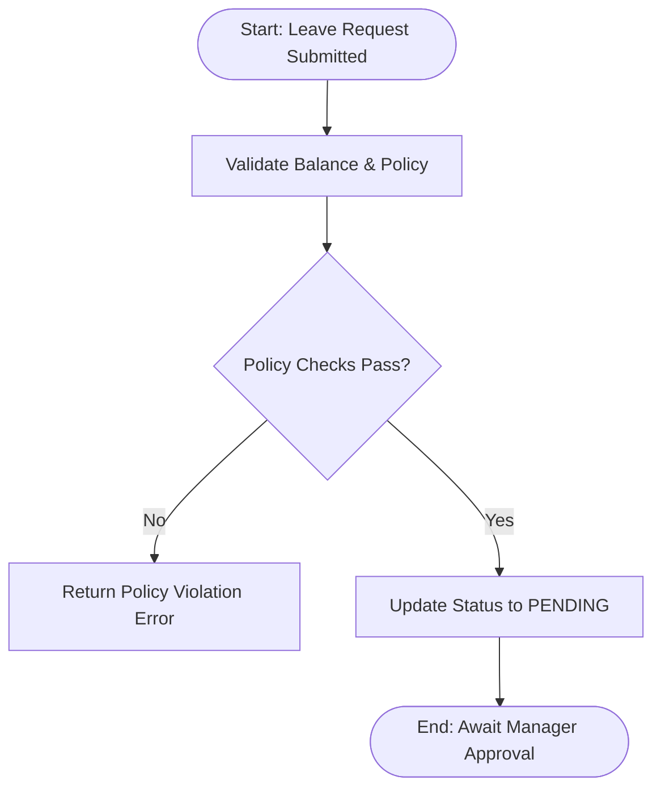

# AuraOS Enterprise Workflow Documentation Standards

## Governance Manual & Technical Specification Guidelines

> **Document Code:** `DOC-STD-001`  
> **System:** AuraOS Enterprise ERP / HCM Platform  
> **Version:** 1.0.0  
> **Date:** 2026-07-29  
> **Status:** Official Platform Documentation Standard  
> **Scope:** All Business Workflows (01 to 29) & Architecture Specifications

---

## 1. Documentation Philosophy

Workflow documentation within **AuraOS** is an active technical artifact—not passive commentary. It provides the definitive functional contract between business requirements, enterprise compliance rules, frontend interfaces, backend services, database schema models, and automated queues.

Every workflow document in the `docs/workflows/` library serves four key enterprise roles:

1. **For Product & Business Leadership:** An authoritative specification detailing functional boundaries, approval matrices, SLA thresholds, and operational capabilities.
2. **For Software & System Architects:** A verifiable trace mapping high-level business events to state machine logic, BullMQ workers, Zod schemas, and Prisma entities.
3. **For Quality Assurance (QA) & Security Teams:** A complete testable specification outlining acceptance criteria, RBAC permissions, audit trail requirements, and edge cases.
4. **For Implementation Partners & Customers:** A transparent system guide detailing operational workflows, delegation rules, country compliance variations (e.g., GCC/UAE EOSB, US FMLA), and system integration contracts.

---

## 2. Core Documentation Principles

Every workflow specification generated for AuraOS MUST strictly comply with the following eleven core principles:

```
┌────────────────────────────────────────────────────────────────────────────────────────┐
│                              Core Documentation Principles                             │
└────────────────────────────────────────────────────────────────────────────────────────┘
  1. EVIDENCE-FIRST           --> Every current implementation statement must link to code.
  2. ZERO ASSUMPTIONS         --> If code is missing, document as a gap or proposed item.
  3. SINGLE SOURCE OF TRUTH   --> Codebase is truth for current state; standard governs format.
  4. STRICT BIFURCATION       --> CURRENT IMPLEMENTATION vs PROPOSED ENTERPRISE IMPLEMENTATION.
  5. FULL REPOSITORY PATHS    --> Never use basenames; full relative paths required.
  6. BUSINESS BEFORE TECH     --> Functional process context precedes technical API & DB specs.
  7. BIDIRECTIONAL TRACEABILITY-> 8-tier trace from business rule down to database & logs.
  8. AUDITABILITY & LOGGING   --> Document RBAC permissions, audit entries, and status changes.
  9. ZERO GENERIC FILLER      --> Specific to AuraOS; no generic ERP placeholders allowed.
 10. UNIFORM STRUCTURE        --> Must adhere strictly to the 40-section template blueprint.
 11. ENFORCEABLE GATES        --> Cannot mark complete without 100% QA checklist pass.
```

---

## 3. Documentation Governance & Versioning

### 3.1 Ownership & Roles

| Governance Role        | Enterprise Responsibility                    | Authorized Personnel                      |
| ---------------------- | -------------------------------------------- | ----------------------------------------- |
| **Document Owner**     | Product Manager / BPM Consultant             | Functional Scope & RACI Matrix            |
| **Technical Author**   | Senior Business Analyst / Tech Writer        | Workflow Specification Generation         |
| **Technical Reviewer** | Software Architect / Solution Designer       | Code Path & Schema Verification           |
| **QA Verifier**        | QA Lead                                      | Acceptance Criteria & Standard Compliance |
| **Final Approver**     | Chief Product Officer / Enterprise Architect | Sign-off & Generation Plan Matrix Update  |

### 3.2 Document Lifecycle States

```
┌───────┐     ┌────────┐     ┌──────┐     ┌──────────┐     ┌───────────┐     ┌──────────┐
│ DRAFT │ ──> │ REVIEW │ ──> │  QA  │ ──> │ APPROVED │ ──> │ PUBLISHED │ ──> │ ARCHIVED │
└───────┘     └────────┘     └──────┘     └──────────┘     └───────────┘     └──────────┘
```

1. **DRAFT:** File generated following `TEMPLATE.md`; undergoing technical drafting.
2. **REVIEW:** Draft submitted for architectural code path verification against `apps/web/` and `services/`.
3. **QA:** Reviewed document undergoing quality checklist verification (`WORKFLOW_REVIEW_CHECKLIST.md`).
4. **APPROVED:** Document satisfies 100% quality gates and is signed off in `WORKFLOW_GENERATION_PLAN.md`.
5. **PUBLISHED:** Active baseline specification in the repository main branch.
6. **ARCHIVED:** Superceded specification version stored for compliance history.

---

## 4. Repository Evidence Standards

### 4.1 Relative Path Mandate

All references to codebase artifacts MUST use full repository-relative paths starting from the repository root.

- **VALID:** `apps/web/src/lib/services/leave.service.ts`
- **VALID:** `packages/@aura/database/prisma/schema.prisma#L450-L512`
- **INVALID:** `leave.service.ts` (Missing path)
- **INVALID:** `src/lib/services/leave.service.ts` (Missing app root prefix)
- **INVALID:** `d:\KreupAI\KreupAI.AuraOS\apps\web\...` (System-absolute path prohibited)

### 4.2 Evidence Hierarchy

When documenting system behavior, evidence MUST be evaluated according to this strict hierarchy:

```
[1. Executable Code]  --> API routes, service methods, Zod schemas, BullMQ workers
       ▼
[2. Schema Engine]    --> Prisma data models, enums, relational foreign keys
       ▼
[3. System Config]    --> Environment variables, feature flags, constants files
       ▼
[4. Existing Docs]    --> Legacy specs, issue trackers, discovery audit notes
```

---

## 5. Standards for Current vs. Proposed Implementations

To eliminate ambiguity for developers and customers, every workflow specification MUST maintain absolute segregation between what is currently built and what is planned for future enterprise releases.

### 5.1 Rules for `Fully Implemented` Workflows

Workflows verified as `Fully Implemented` in code MUST be documented as **CURRENT PRODUCTION IMPLEMENTATION**.

- The `Gap Analysis` section for fully implemented workflows MUST focus solely on optional future enhancements or minor optimizations.

### 5.2 Rules for `Partially Implemented` Workflows

Workflows verified as `Partially Implemented` MUST contain two distinct, non-overlapping major sections:

#### Section A: CURRENT IMPLEMENTATION

- Describes **only** functionality verified by existing codebase evidence.
- Must document existing schema drift, `@ts-nocheck` annotations, stubbed services, or missing notification dispatches with explicit warning callouts.

```markdown
> [!WARNING]
> **Current Technical Limitation (@ts-nocheck):**
> `apps/web/src/lib/services/overtime.service.ts` is currently marked with `@ts-nocheck` due to schema drift against `AttendanceRecord`. Runtime behavior may fail if schema fields are referenced directly.
```

#### Section B: PROPOSED ENTERPRISE IMPLEMENTATION

- Outlines the complete, target enterprise state required to bring the workflow to 100% production readiness.
- Must explicitly prefix all future/proposed features with **`[PROPOSED]`**.

```markdown
### Proposed Stage 3: Executive Escalation [PROPOSED]

If the manager does not review the request within 48 hours, the system will automatically reassign the task to the HR Director.
```

---

## 6. Mandatory Workflow Documentation Structure (40 Sections)

Every workflow specification file (`docs/workflows/XX-name/README.md`) MUST include all 40 required sections in exact numerical order:

```
 1. Executive Summary               15. Decision Matrix             29. Reports
 2. Business Purpose                16. State Diagram (Mermaid)     30. Dashboards
 3. Business Scope                  17. Exception Handling          31. Analytics
 4. Business Process Overview       18. Notifications               32. KPIs
 5. Mermaid Workflow Diagram        19. Escalation Rules            33. Edge Cases
 6. Business Actors                 20. SLA Rules                   34. Current Implementation
 7. Roles & Responsibilities (RACI) 21. RBAC Matrix               35. Gap Analysis
 8. Workflow Trigger Events         22. Audit Trail & Logging       36. Proposed Enterprise Workflow
 9. Entry Points                    23. UI Screens                  37. Testing Scenarios
10. Detailed Workflow Stages        24. Frontend Components         38. Acceptance Criteria
11. Stage Responsibilities          25. API Endpoints               39. Implementation Checklist
12. Stage Validation Rules          26. Backend Services            40. Repository References
13. Business Rules                  27. Database Models
14. Approval Matrix                 28. Integration Points
```

---

## 7. Business Process Documentation Standards

1. **Clear Scope Boundaries:** Define explicit In-Scope and Out-of-Scope lists for every workflow.
2. **Actor Specification:** Clearly distinguish human actors (e.g., `Employee`, `Line Manager`, `HR Admin`, `Payroll Officer`) from system actors (e.g., `BullMQ Execution Worker`, `SLA Escalation Cron`, `Notification Service`).
3. **Domain Vocabulary:** Use precise ERP terms (e.g., `Pro-Rata Encashment`, `UAE EOSB Federal Law 33/2021`, `Maker-Checker Governance`).

---

## 8. Mermaid Diagram Standards

All workflow diagrams MUST use standard Mermaid rendering syntax.

### 8.1 Process Flow Diagram Syntax Guidelines

- Use top-to-bottom (`TD` / `TB`) or left-to-right (`LR`) directionality.
- Quote node labels containing special characters or line breaks to prevent rendering errors.
- Use explicit shape nodes: `([Start/End])`, `[Process Step]`, `{\`Decision Condition?\`}`.



---

## 9. Workflow State Machine Standards

1. **State Naming:** Upper-case string identifiers using underscores (`DRAFT`, `SUBMITTED`, `PENDING`, `APPROVED`, `REJECTED`, `PROCESSING`, `COMPLETED`, `CANCELLED`, `EXPIRED`, `BLOCKED`, `ESCALATED`).
2. **State Transition Tables:** Every workflow document MUST provide a state transition matrix detailing `From State`, `To State`, `Trigger / Action`, `Guards / Prerequisites`, and `Side Effects`.

| From State  | To State    | Trigger / Action  | Guards / Prerequisites                   | Side Effects                             |
| ----------- | ----------- | ----------------- | ---------------------------------------- | ---------------------------------------- |
| `DRAFT`     | `SUBMITTED` | User submits form | Form passes Zod schema & category policy | Sets `submittedAt`; fires notification   |
| `SUBMITTED` | `APPROVED`  | Manager approves  | Actor has `leave:approve` permission     | Deducts leave balance; sets `approvedAt` |
| `SUBMITTED` | `REJECTED`  | Manager rejects   | Rejection reason $\ge 5$ chars provided  | Sets `rejectedAt`; notifies employee     |

---

## 10. Approval Workflow Standards

Every approval process MUST specify its explicit pattern:

1. **Maker-Checker:** Distinct submitter (Maker) and approver (Checker) roles with strict segregation of duties. Submitter cannot approve their own submission.
2. **Sequential Multi-Level Approval:** Approval moves step-by-step through an ordered chain (e.g., Peer $\to$ Manager $\to$ HR Director).
3. **Parallel / Majority Approval:** Multiple approvers evaluate simultaneously; outcome dictated by unanimous or majority rule.
4. **Conditional Threshold Approval:** Routing changes dynamically based on financial or operational limits (e.g., Expense Claims $\le \$500$ auto-approved; $>\$500$ requires Manager; $>\$5,000$ requires Finance VP).

---

## 11. Business Rules Documentation Standards

Business rules MUST be formatted with unique, structured identifiers:

- **Rule Identifier Pattern:** `BR-[MODULE]-[WORKFLOW_ID]-[NNN]` (e.g., `BR-HR-LEAVE-001`, `BR-PAY-EOSB-004`).
- **Required Metadata:** Identifier, Rule Name, Description, Rule Category (`Validation`, `Calculation`, `Eligibility`, `Compliance`), Severity (`BLOCKED`, `WARNING`), and Target Repository Reference.

```markdown
#### BR-HR-LEAVE-001: Minimum Leave Notice Window

- **Category:** Validation / Eligibility
- **Severity:** BLOCKED (Submission rejected)
- **Description:** Annual leave applications must be submitted at least 48 hours prior to the requested `startDate`.
- **Repository Reference:** `apps/web/src/lib/services/leave.service.ts#L88-L102`
```

---

## 12. Validation Standards

Every specification must detail five distinct validation tiers:

1. **Input Validation:** Client-side & API gateway Zod schema rules (string lengths, date formats, regex patterns).
2. **Business Rule Validation:** State transition guards, policy limits, balance availability.
3. **Security Validation:** Authentication token verification, tenant isolation (`tenantId` scoping).
4. **Permission Validation:** RBAC permission checks via `hasAny()` or middleware.
5. **Workflow State Validation:** Pre-condition status checks enforcing allowed transitions.

---

## 13. Notification Standards

Notification specifications MUST identify channel, recipient, and fallback behavior:

| Event Name           | Channel            | Target Recipient    | Trigger Point                     | Failure / Fallback Handling    |
| -------------------- | ------------------ | ------------------- | --------------------------------- | ------------------------------ |
| `LEAVE_SUBMITTED`    | In-App (WebSocket) | Direct Manager      | `LeaveService.createRequest()`    | Logged to `AuditLog`; no retry |
| `PAYROLL_RUN_FAILED` | In-App + Email     | HR & Payroll Admins | `PayrollService.processPayroll()` | Retried 3x via BullMQ queue    |

---

## 14. RBAC Documentation Standards

Permissions MUST be documented using exact permission strings used in authorization middleware:

- **Format:** `[domain]:[action]` (e.g., `leave:read`, `leave:approve`, `payroll:manage`, `workforce_planning:approve`).
- **Role Assignment Matrix:** Explicit grid mapping system roles (`EMPLOYEE`, `LINE_MANAGER`, `HR_ADMIN`, `PAYROLL_OFFICER`, `TENANT_ADMIN`) to permission actions.

---

## 15. API Documentation Standards

API endpoints MUST be documented with complete REST contracts:

````markdown
### Endpoint: Approve Leave Request

- **HTTP Method:** `POST`
- **Route Path:** `/api/v1/leave-requests/[id]/approve`
- **Auth Required:** `Bearer JWT` (Session context)
- **Permissions:** `leave:approve` or `leave:manage`
- **Request Body (JSON):**
  ```json
  {
    "notes": "Approved for annual vacation"
  }
  ```
````

- **Success Response (200 OK):**
  ```json
  {
    "success": true,
    "data": {
      "id": "clx123456",
      "status": "APPROVED",
      "approvedAt": "2026-07-29T10:00:00.000Z"
    }
  }
  ```
- **Error Responses:** `400 Bad Request` (Invalid ID), `401 Unauthorized`, `403 Forbidden`, `409 Conflict` (Invalid State Transition).
- **Repository Implementation:** `apps/web/src/app/api/v1/leave-requests/[id]/approve/route.ts`

```

---

## 16. Backend Service Standards

Document backend service classes, method signatures, dependency injections, and async background workers:

- **Service Class Path:** `apps/web/src/lib/services/leave.service.ts`
- **Primary Methods:** `createRequest()`, `approveRequest()`, `rejectRequest()`, `cancelRequest()`.
- **Async Processing:** BullMQ background workers (`services/workflow-service/src/workers/workflowExecutionWorker.ts`).

---

## 17. Database Documentation Standards

Document all primary Prisma entities, relations, indices, and constraints:

- **Prisma Entity Name:** `LeaveRequest`
- **Schema Reference:** `packages/@aura/database/prisma/schema.prisma`
- **Key Fields:** `id`, `tenantId`, `employeeId`, `startDate`, `endDate`, `status`, `balanceDeducted`.
- **Foreign Keys:** `employeeId -> Employee.id`, `tenantId -> Tenant.id`.
- **Indices:** `@@index([tenantId, employeeId])`, `@@index([status])`.

---

## 18. Frontend Documentation Standards

Document all UI dashboard screens, component hierarchies, state hooks, and client service integrations:

- **Page Route:** `apps/web/src/app/dashboard/leave/page.tsx`
- **Component File:** `apps/web/src/components/leave/LeaveRequestTable.tsx`
- **State Hydration:** React Query / Server Components fetching `/api/v1/leave-requests`.

---

## 19–20. Reporting & Dashboard Standards

- **Operational Reports:** Daily/weekly execution listings, pending approval counts.
- **Management Dashboards:** SLA breach heatmaps, department leave trends, payroll cost breakdowns.
- **Metrics & KPIs:** Average Approval Time (hours), SLA Breach Rate (%), First-Pass Approval Rate (%).

---

## 21. Gap Analysis Standards

For `Partially Implemented` workflows, the **Gap Analysis** section MUST provide a clear comparison matrix:

| Functional Feature Area | Current Implementation Status | Expected Enterprise Target | Priority / Impact |
|---|---|---|---|
| **Approval Routing** | 1-Level Direct Manager approval | Multi-level approval chain based on leave duration | High / Operational |
| **Notification Engine** | WebSocket in-app notification only | Multi-channel (In-App, Email, Push) with retry | Medium / User Experience |
| **Type Safety** | `@ts-nocheck` schema drift annotation | Full TypeScript typing against Prisma schema | Critical / Stability |

---

## 22–24. Testing, Acceptance Criteria & Checklists

1. **Testing Scenarios:** Must include Positive Path, Negative Path, Edge Cases, and Security/Permission Boundary tests.
2. **Acceptance Criteria:** Written in structured `GIVEN - WHEN - THEN` format for QA verification.
3. **Implementation Checklist:** Actionable checklist for engineering teams covering Frontend, Backend, Database, Notifications, and QA deployment gates.

---

## 25–26. References & Cross-Linking

- **Repository References:** Grouped logically by layer (Frontend, API, Services, Models) at the end of each workflow document.
- **Cross-References:** Explicit links to related workflow specifications (e.g., `08-employee-exit` linking to `10-full-final-settlement`).

---

## 27–30. Common Documentation Mistakes to Avoid

> [!CAUTION]
> **Prohibited Practices in AuraOS Workflow Documentation:**
> 1. **DO NOT** claim proposed features as existing functionality.
> 2. **DO NOT** use generic file basenames without directory context.
> 3. **DO NOT** omit code snippet line numbers or repository references.
> 4. **DO NOT** create broken or non-rendering Mermaid diagram syntax.
> 5. **DO NOT** skip any of the 40 required template sections.
> 6. **DO NOT** approve a document without passing 100% of `WORKFLOW_REVIEW_CHECKLIST.md`.

---
*End of Workflow Documentation Standards (`DOC-STD-001`).*
```
