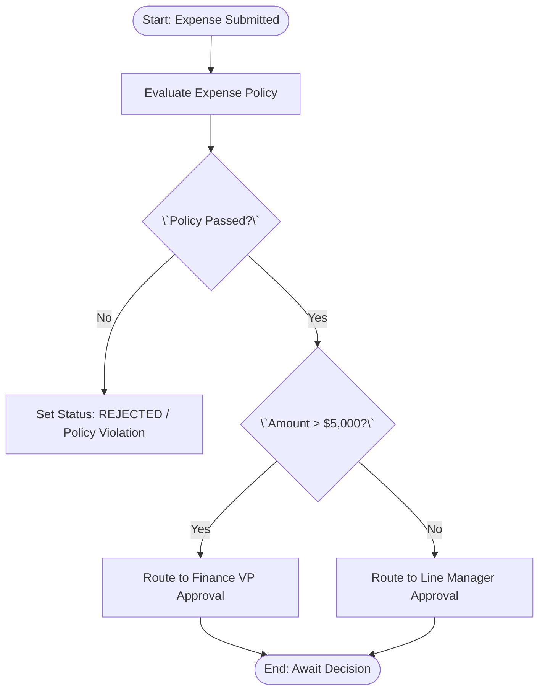

# AuraOS Enterprise Workflow Documentation Style Guide

## Writing Style, Technical Formatting & Visual Conventions

> **Document Code:** `DOC-STYLE-001`  
> **System:** AuraOS Enterprise ERP / HCM Platform  
> **Version:** 1.0.0  
> **Date:** 2026-07-29  
> **Status:** Official Platform Style Manual  
> **Target Audience:** Technical Writers, Software Architects, Business Analysts, QA Leads

---

## 1. Writing Philosophy

Every workflow document in the AuraOS specification library MUST reflect enterprise engineering rigor comparable to SAP, Oracle Fusion, and Workday documentation.

- **Business First, Technology Second:** Begin with the business purpose and operational context before detailing technical implementation code paths.
- **Evidence-Based:** State only what can be proven by codebase evidence (`apps/web/`, `services/`, `packages/@aura/database/prisma/schema.prisma`).
- **Implementation Focused:** Eliminate fluff, marketing language, sales pitch terminology, and speculative AI-style conversational filler.
- **Concise & Direct:** Use active, unambiguous language. Avoid passive hedging (e.g., replace _"It might be considered that..."_ with _"The system enforces..."_).

---

## 2. Writing Tone & Voice

- **Tone:** Professional, objective, technical, and neutral.
- **Voice:** Active voice (`"The system validates Zod input parameters"`, NOT `"Zod parameters are validated by the system"`).
- **Tense:** Present tense for system operation (`"The API returns 400 Bad Request"`, NOT `"The API will return..."`).
- **Perspective:** Third-person objective (`"The Line Manager approves"`, NOT `"You approve as a manager"`).

---

## 3. Grammar, Capitalization & Formatting Rules

### 3.1 Capitalization Rules

- **Platform Name:** Always `AuraOS` (capital **A**, capital **OS**). Never `AuraOs` or `auraOS`.
- **Status Identifiers:** Always UPPERCASE string literals matching code constants (`DRAFT`, `SUBMITTED`, `PENDING`, `APPROVED`, `REJECTED`, `PROCESSING`, `COMPLETED`, `CANCELLED`, `EXPIRED`, `BLOCKED`, `ESCALATED`).
- **Roles:** Capitalized singular nouns (`Line Manager`, `HR Admin`, `Payroll Officer`, `Tenant Admin`).
- **Permissions:** Exact string format formatted as code (`leave:approve`, `payroll:manage`).

### 3.2 Numbers, Dates, Times & Currency

- **Dates:** ISO 8601 extended format (`YYYY-MM-DD`, e.g., `2026-07-29`).
- **SLA Duration:** Explicit hours or days with numeric unit (`72 hours`, `90 calendar days`).
- **Currency:** ISO currency code followed by formatted number (`USD 500.00`, `AED 10,000.00`).
- **Numbers:** Spell out one to nine in text; use digits for 10 and above or technical quantities (`3 approvers`, `10 workers`, `50 requests`).

---

## 4. Canonical Terminology Rules

To prevent domain ambiguity, authors MUST use the approved enterprise terms in the left column and strictly avoid banned alternatives:

| Approved AuraOS Term              | Prohibited Alternative            | Definition / Operational Meaning                          |
| --------------------------------- | --------------------------------- | --------------------------------------------------------- |
| **Employee**                      | Staff, Staff Member, User, Worker | Individual employed by tenant organization                |
| **Workflow Stage**                | Step, Phase, Level                | Sequential governance checkpoint in a multi-stage case    |
| **Workflow State / Status**       | Flag, Condition, Situation        | Discrete state machine position of a request or instance  |
| **Approval**                      | Acceptance, Sign-off, Permission  | Formal affirmative decision by authorized actor           |
| **Rejection**                     | Denial, Decline, Refusal          | Formal negative decision terminating or returning request |
| **Line Manager**                  | Supervisor, Boss, Team Lead       | Direct hierarchical reporting manager                     |
| **Tenant**                        | Company, Client, Organization     | Multi-tenant isolated customer account entity             |
| **Maker-Checker**                 | Four-Eyes Principle, Dual Control | Segregation of duties pattern (Creator $\neq$ Approver)   |
| **End-of-Service Benefit (EOSB)** | Gratuity, Severance               | GCC statutory end-of-employment payout                    |
| **Prisma Model**                  | Database Table, SQL Table         | Data persistence schema model in AuraOS                   |

---

## 5. Heading Standards & Structure

All documentation MUST use clean GitHub-flavored markdown heading hierarchy without skipping levels:

- `# H1` — Reserved exclusively for Document Title (Line 1).
- `## H2` — Major Sections (e.g., `## 1. Executive Summary`, `## 10. Detailed Workflow Stages`).
- `### H3` — Sub-sections (e.g., `### 10.1 Stage 1: Pre-Joining`).
- `#### H4` — Sub-point details (e.g., `#### Stage Exit Validation Rules`).
- `##### H5 / ###### H6` — Strictly prohibited; use bullet points or tables instead.

---

## 6. Paragraph & List Standards

- **Paragraph Length:** Keep paragraphs concise (maximum 3 to 5 sentences per block).
- **Bullet Lists:** Use standard hyphens (`-`) for unordered lists; use numbers (`1.`, `2.`) for strict sequential steps.
- **Code Terms:** Wrap all inline code terms, file paths, permissions, and parameters in backticks (`` `apps/web/src/...` ``, `` `status` ``, `` `leave:approve` ``).

---

## 7. Table Standards

Every table in AuraOS documentation MUST be formatted cleanly with explicit headers and alignment:

- Left-align text columns (`| Header |`).
- Center-align status, icons, and status flags (`| :---: |`).
- Right-align numbers and amounts (`| Amount |` right-aligned).

```markdown
| Stage Name  | Owner Role      | SLA Window | Validation Guard            | Status Flag |
| ----------- | --------------- | :--------: | --------------------------- | :---------: |
| PRE_JOINING | HR Admin        |  72 Hours  | Mandatory tasks complete    |   `OPEN`    |
| ENROLMENT   | Payroll Officer |  72 Hours  | Benefits & Social Insurance |  `BLOCKED`  |
```

---

## 8. Business Rule Formatting Standard

All business rules MUST be formatted using the standard `BR-[MODULE]-[WORKFLOW_ID]-[NNN]` callout pattern:

```markdown
#### BR-HR-LEAVE-001: Minimum Leave Notice Window

- **Category:** Validation / Policy Eligibility
- **Severity:** BLOCKED (Form submission rejected)
- **Description:** Annual leave applications must be submitted at least 48 hours prior to the requested `startDate`.
- **Error Message:** `"Annual leave requests require at least 48 hours advance notice."`
- **Repository Reference:** `apps/web/src/lib/services/leave.service.ts#L88-L102`
```

---

## 9. Mermaid Diagram Standards

All diagrams MUST use standard valid Mermaid block syntax with clear shape conventions:

- `([Oval])` — Start and End nodes.
- `[Rectangle]` — Action steps or service invocations.
- `{\`Diamond?\`}` — Conditional decisions.
- `[[Subroutine]]` — Secondary workflow triggers (e.g., EOSB calculation).



---

## 10. Code Block & Syntax Highlighting Standards

Always specify the language syntax identifier on fenced code blocks:

- `typescript` or `ts` — Service methods, frontend components, Zod schemas.
- `json` — API payload examples.
- `prisma` — Schema definitions.
- `mermaid` — Process flow and state diagrams.
- `bash` / `powershell` — Build & execution commands.

---

## 11. Repository Reference Standards

Repository path references MUST follow these strict syntax rules:

- **ALWAYS** use full relative paths: `apps/web/src/lib/services/leave.service.ts`
- **NEVER** use basenames: `leave.service.ts`
- **NEVER** use local absolute Windows paths: `C:\Users\...`

```markdown
- **Controller Route:** `apps/web/src/app/api/v1/leave-requests/[id]/approve/route.ts`
- **Service Implementation:** `apps/web/src/lib/services/leave.service.ts#L120-L145`
- **Prisma Entity:** `packages/@aura/database/prisma/schema.prisma#L305-L340`
```

---

## 12. Standardized Callout Standards (Admonitions)

Use GitHub-style admonitions strategically to emphasize critical engineering context:

```markdown
> [!NOTE]
> System context, underlying architecture notes, or helper logic.

> [!TIP]
> Performance optimization, caching suggestions, or implementation best practices.

> [!IMPORTANT]
> Essential governance requirements, mandatory Zod validations, or SLA thresholds.

> [!WARNING]
> Identified technical debt, `@ts-nocheck` schema drift warnings, or duplicate API routes.

> [!CAUTION]
> High-risk operations (e.g., direct DB mutation warnings, unhandled error cascade risks).
```

---

## 13. Standards for Current vs. Proposed Implementation Sections

### 13.1 Current Implementation Section Rules

- Title MUST be `## 34. Current Implementation`.
- Must contain an explicit implementation status banner callout.

```markdown
> [!NOTE]
> **CURRENT PRODUCTION IMPLEMENTATION STATUS:**
> The following section describes ONLY functionality verified by existing codebase artifacts in `apps/web/src/lib/services/expense.service.ts`.
```

### 13.2 Proposed Enterprise Implementation Section Rules

- Title MUST be `## 36. Proposed Enterprise Workflow`.
- Must contain an explicit disclaimer banner.
- All proposed features MUST be prefixed with `[PROPOSED]`.

```markdown
> [!IMPORTANT]
> **PROPOSED ENTERPRISE IMPLEMENTATION DISCLAIMER:**
> The features outlined below represent target enterprise architecture specifications and are NOT currently present in the production codebase.

### 36.1 Automated Multi-Level Manager Escalation [PROPOSED]

If a manager fails to respond within 48 hours, BullMQ will reassign the approval task to the Department Head.
```

---

## 14. Gap Analysis Comparison Formatting

Gap analysis MUST use a standardized 4-column comparison table:

| Functional Area            | Current Codebase State                  | Target Enterprise Target                               | Priority / Impact    |
| -------------------------- | --------------------------------------- | ------------------------------------------------------ | -------------------- |
| **Approval Routing**       | Single-level Line Manager approval only | Dynamic multi-level approval chain by amount threshold | High / Operational   |
| **Notification Transport** | In-app WebSocket dispatch only          | Multi-channel (In-App, Email, SMS) with BullMQ retry   | Medium / UX          |
| **Type Safety**            | `@ts-nocheck` present in service file   | Strict TypeScript validation against Prisma schema     | Critical / Stability |

---

## 15. Workflow Stage Formatting Standard

Every workflow stage in Section 10 (`Detailed Workflow Stages`) MUST be formatted uniformly:

```markdown
### 10.1 Stage 1: Pre-Joining (PRE_JOINING)

- **Stage Identifier:** `PRE_JOINING`
- **Stage Owner Role:** `HR_ADMIN`
- **SLA Window:** 72 Hours
- **Escalation Target:** `HR_MANAGER`
- **Entry Criteria:** Candidate accepts job offer; `OnboardingCase` created in `OPEN` status.
- **Exit Criteria:** Mandatory background check, document upload, and contract sign-off complete.
- **Stage Validation Rules:** All `OnboardingTask` items where `isMandatory=true` must have `status='COMPLETED'`.
- **Status Value:** `OPEN` (or `BLOCKED` if tasks delayed)
- **Repository Implementation:** `apps/web/src/lib/services/onboarding-case.service.ts#L110-L165`
```

---

## 16. API Endpoint Documentation Standard

API Endpoint specifications MUST use this exact block format:

````markdown
### POST /api/v1/leave-requests/[id]/approve

- **HTTP Method:** `POST`
- **URL Endpoint Path:** `/api/v1/leave-requests/[id]/approve`
- **Authentication:** `Bearer JWT` (Session Context)
- **Required Permission:** `leave:approve` or `leave:manage`
- **URL Parameters:** `id` (String, Required) — LeaveRequest Record ID
- **Request Body (JSON):**
  ```json
  {
    "notes": "Approved for annual leave"
  }
  ```
````

- **Success Response (200 OK):**
  ```json
  {
    "success": true,
    "data": {
      "id": "clx123456",
      "status": "APPROVED",
      "approvedAt": "2026-07-29T10:00:00.000Z"
    }
  }
  ```
- **Error Status Codes:** `400 Bad Request`, `401 Unauthorized`, `403 Forbidden`, `404 Not Found`, `409 Conflict`.
- **Repository Reference:** `apps/web/src/app/api/v1/leave-requests/[id]/approve/route.ts`

```

---

## 17. Good vs. Poor Documentation Examples

### ❌ POOR EXAMPLE (Generic, Vague, Missing References)
> "When an employee submits a leave request, it goes to their manager. If the manager accepts it, the leave is approved and balance is updated. Otherwise it is rejected."

### ✅ EXCELLENT EXAMPLE (Enterprise Standard Compliant)
> "Upon submission via `POST /api/v1/leave-requests`, `LeaveService.createRequest()` validates input parameters against `createLeaveSchema` (`apps/web/src/lib/services/leave.service.ts#L45`). The record is persisted in `LeaveRequest` with status `PENDING`. An in-app WebSocket notification (`LEAVE_SUBMITTED`) is dispatched to the Line Manager. Upon manager invocation of `POST /api/v1/leave-requests/[id]/approve`, the service asserts status `PENDING`, updates status to `APPROVED`, increments `taken` days in `LeaveBalance`, and sets `balanceDeducted=true`."

---
*End of Workflow Documentation Style Guide (`DOC-STYLE-001`).*
```
